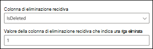

<!---Previous ms.author: vivg --->

# Connettori Graph di Azure SQL e Microsoft SQL server MicrosoftAzure SQL and Microsoft SQL server Graph connectors

Il server Microsoft SQL o il connettore Azure SQL Graph consente all'organizzazione di individuare e indicizzare i dati da un database SQL Server locale o da un database ospitato nell'istanza di Azure SQL nel cloud.The Microsoft SQL server or Azure SQL Graph connector allows your organization to discover and index data from an on-premises SQL Server database, or a database hosted in your Azure SQL instance in the cloud.
Il connettore Graph indicizza il contenuto specificato in Microsoft Search.The Graph connector indexes specified content into Microsoft Search. Per mantenere aggiornato l'indice con i dati di origine, supporta ricerche per indicizzazione periodiche complete e incrementali.To keep the index up to date with source data, it supports periodic full and incremental crawls. Con questi connettori SQL, è anche possibile limitare l'accesso ai risultati della ricerca per determinati utenti.With these SQL connectors, you can also restrict access to search results for certain users.

> [!NOTE]
> Leggere [**l'articolo configurare il connettore Graph**](configure-connector.md) per comprendere le istruzioni generali per la configurazione dei connettori di Graph.Read the [**Setup your Graph connector**](configure-connector.md) article to understand the general Graph connectors setup instructions.

Questo articolo è per tutti gli utenti che configurano, eseere e monitorano un connettore Azure SQL e Microsoft SQL Server Graph.This article is for anyone who configures, runs, and monitors a Azure SQL and Microsoft SQL server Graph connector. Integra il processo di configurazione generale e mostra le istruzioni che si applicano solo per il connettore Graph di Azure SQL e Microsoft SQL server.It supplements the general setup process, and shows instructions that apply only for the Azure SQL and Microsoft SQL server Graph connector. In questo articolo sono inoltre incluse informazioni [sulle](#limitations) limitazioni per il server Microsoft SQL e i connettori SQL Azure.This article also includes information about [Limitations](#limitations) for the Microsoft SQL server and Azure SQL connectors.

## Prima di iniziareBefore you get started

### Installare l'agente del connettore Graph (necessario solo per microsoft SQL server locale)Install the Graph connector agent (required for on-premises Microsoft SQL server connector only)

Per accedere ai dati di terze parti locali, è necessario installare e configurare l'agente connettore Graph.In order to access your on-premises third-party data, you must install and configure the Graph connector agent. Per [ulteriori informazioni, vedere Install the Graph connector agent.](on-prem-agent.md)See [Install the Graph connector agent](on-prem-agent.md) to learn more.  

## Passaggio 1: Aggiungere un connettore Graph nell'interfaccia di amministrazione di Microsoft 365Step 1: Add a Graph connector in the Microsoft 365 admin center

Seguire le istruzioni [generali per l'installazione.](https://docs.microsoft.com/microsoftsearch/configure-connector)Follow the general [setup instructions](https://docs.microsoft.com/microsoftsearch/configure-connector).
<!---If the above phrase does not apply, delete it and insert specific details for your data source that are different from general setup 
instructions.-->

## Passaggio 2: assegnare un nome alla connessioneStep 2: Name the connection

Seguire le istruzioni [generali per l'installazione.](https://docs.microsoft.com/microsoftsearch/configure-connector)Follow the general [setup instructions](https://docs.microsoft.com/microsoftsearch/configure-connector).
<!---If the above phrase does not apply, delete it and insert specific details for your data source that are different from general setup 
instructions.-->

## Passaggio 3: Configurare le impostazioni di connessioneStep 3: Configure the connection settings

### Registrare un'app (solo per il connettore SQL Azure)Register an app (for Azure SQL connector only)

Per il connettore SQL Azure, è necessario registrare un'app in Azure Active Directory per consentire all'app Microsoft Search di accedere ai dati per l'indicizzazione.For Azure SQL connector, you must register an app in Azure Active Directory to allow Microsoft Search app to access data for indexing. Per altre informazioni sulla registrazione di un'app, fai riferimento alla documentazione di Microsoft Graph su come [registrare un'app.](https://docs.microsoft.com/graph/auth-register-app-v2)To learn more about registering an app, refer Microsoft Graph documentation on how to [register an app](https://docs.microsoft.com/graph/auth-register-app-v2).

Dopo aver completato la registrazione dell'app e aver preso nota del nome dell'app, dell'ID applicazione (client) e dell'ID tenant, devi [generare un nuovo segreto client.](https://docs.microsoft.com/azure/healthcare-apis/register-confidential-azure-ad-client-app#application-secret)After completing the app registration and taking note of the app name, application (client) ID and tenant ID, you need to [generate a new client secret](https://docs.microsoft.com/azure/healthcare-apis/register-confidential-azure-ad-client-app#application-secret). Il segreto client verrà visualizzato una sola volta.The client secret will only be displayed once. Ricordarsi di & il segreto client in modo sicuro.Remember to note & store the client secret securely. Usare l'ID client e il segreto client durante la configurazione di una nuova connessione in Microsoft Search.Use the client ID and client secret while configuring a new connection in Microsoft Search.

Per aggiungere l'app registrata al database SQL Azure, è necessario:To add the registered app to your Azure SQL Database, you need to:

- Accedere al database di Azure SQL databaseLog in to your Azure SQL DB
- Aprire una nuova finestra di queryOpen a new query window
- Creare un nuovo utente eseguendo il comando 'CREATE USER [nome app] FROM EXTERNAL PROVIDER'Create a new user by running the command 'CREATE USER [app name] FROM EXTERNAL PROVIDER'
- Aggiungere un utente al ruolo eseguendo il comando 'exec sp_addrolemember 'db_datareader', [nome app]' o 'ALTER ROLE db_datareader ADD MEMBER [nome app]'Add user to role by running command 'exec sp_addrolemember 'db_datareader', [app name]'  Or  'ALTER ROLE db_datareader ADD MEMBER [app name]'

>[!NOTE]
>Per revocare l'accesso a qualsiasi app registrata in Azure Active Directory, consultare la documentazione di Azure sulla [rimozione di un'app registrata.](https://docs.microsoft.com/azure/active-directory/develop/quickstart-remove-app)To revoke access to any app registered in Azure Active Directory, refer the Azure documentation on [removing a registered app](https://docs.microsoft.com/azure/active-directory/develop/quickstart-remove-app).

### Impostazioni di connessioneConnection settings

Per connettere il connettore di server Microsoft SQL a un'origine dati, è necessario configurare il server di database che si desidera sottosegando alla ricerca per indicizzazione e l'agente locale.To connect your Microsoft SQL server connector to a data source, you must configure the database server you want crawled and the on-prem agent. È quindi possibile connettersi al database con il metodo di autenticazione richiesto.You can then connect to the database with the required authentication method.

> [!NOTE] 
> Il database deve eseguire SQL server versione 2008 o successiva per la connessione del connettore del server microsoft SQL microsoft SQL.Your database must run SQL server version 2008 or later for the Microsoft SQL server connector to be able to connect.

Per il connettore SQL Azure, è necessario specificare solo il nome del server o l'indirizzo IP a cui si desidera connettersi.For the Azure SQL connector, you only need to specify the server name or IP address you want to connect to. Il connettore SQL Azure supporta solo l'autenticazione OIDC (Open ID Connect) di Azure Active Directory per la connessione al database.Azure SQL connector only supports Azure Active Directory Open ID connect (OIDC) authentication to connect to the database.

Per una sicurezza più avanzata, è possibile configurare le regole del firewall IP per il server o il database SQL Azure.For added security, you may configure IP firewall rules for your Azure SQL server or database. Per ulteriori informazioni sulla configurazione delle regole del firewall IP, vedere la documentazione relativa [alle regole del firewall IP.](https://docs.microsoft.com/azure/azure-sql/database/firewall-configure)To learn more about setting up IP firewall rules, refer documentation on [IP firewall rules](https://docs.microsoft.com/azure/azure-sql/database/firewall-configure). Aggiungere i seguenti intervalli IP client nelle impostazioni del firewall.Add the following client IP ranges in the firewall settings.

| Area geograficaRegion | Intervallo IPIP Range |
| ------------ | ------------ |
| NAMNAM | 52.250.92.252/30, 52.224.250.216/3052.250.92.252/30, 52.224.250.216/30 |
| EUREUR | 20.54.41.208/30, 51.105.159.88/3020.54.41.208/30, 51.105.159.88/30 |
| APCAPC | 52.139.188.212/30, 20.43.146.44/3052.139.188.212/30, 20.43.146.44/30 |

Per eseguire ricerche nel contenuto del database, è necessario specificare SQL query al momento della configurazione del connettore.To search your database content, you must specify SQL queries when you configure the connector. Queste SQL query devono assegnare un nome a tutte le colonne di database che si desidera indicizzare, ovvero le proprietà di origine, inclusi eventuali join SQL che devono essere eseguiti per ottenere tutte le colonne.These SQL queries need to name all the database columns that you want to index (that is, source properties), including any SQL joins that need to be performed to get all the columns. Per limitare l'accesso ai risultati della ricerca, è necessario specificare elenchi di controllo di accesso (ACL) all'interno SQL query quando si configura il connettore.To restrict access to search results, you must specify Access Control Lists (ACLs) within SQL queries when you configure the connector.

## Passaggio 3a: Ricerca per indicizzazione completa (obbligatorio)Step 3a: Full crawl (Required)

In questo passaggio viene configurata la query SQL che esegue una ricerca per indicizzazione completa del database.In this step, you configure the SQL query that runs a full crawl of the database. La ricerca per indicizzazione completa seleziona tutte le colonne o le proprietà in cui si desidera selezionare le opzioni **Query,** **Ricerca** o **Recupera.**The full crawl selects all the columns or properties where you want to select the options **Query**, **Search**, or **Retrieve**. È inoltre possibile specificare colonne ACL per limitare l'accesso dei risultati della ricerca a utenti o gruppi specifici.You can also specify ACL columns to restrict access of search results to specific users or groups.

> [!Tip]
> Per ottenere tutte le colonne necessarie, è possibile unire più tabelle.To get all the columns that you need, you can join multiple tables.

### Selezionare colonne di dati (obbligatorio) e colonne ACL (facoltativo)Select data columns (Required) and ACL columns (Optional)

Nell'esempio viene illustrata una selezione di cinque colonne di dati che contengono i dati per la ricerca: OrderId, OrderTitle, OrderDesc, CreatedDateTime e IsDeleted.The example demonstrates a selection of five data columns that hold the data for the search: OrderId, OrderTitle, OrderDesc, CreatedDateTime, and IsDeleted. Per impostare le autorizzazioni di visualizzazione per ogni riga di dati, è possibile selezionare facoltativamente queste colonne ACL: AllowedUsers, AllowedGroups, DeniedUsers e DeniedGroups.To set view permissions for each row of data, you can optionally select these ACL columns: AllowedUsers, AllowedGroups, DeniedUsers, and DeniedGroups. Tutte queste colonne di dati dispongono inoltre delle opzioni **Query,** **Ricerca** o **Recupera.**All these data columns also have the options to **Query**, **Search**, or **Retrieve**.

Selezionare le colonne di dati come illustrato in questa query di esempio: `SELECT OrderId, OrderTitle, OrderDesc, AllowedUsers, AllowedGroups, DeniedUsers, DeniedGroups, CreatedDateTime, IsDeleted`Select data columns as shown in this example query: `SELECT OrderId, OrderTitle, OrderDesc, AllowedUsers, AllowedGroups, DeniedUsers, DeniedGroups, CreatedDateTime, IsDeleted`

Per gestire l'accesso ai risultati della ricerca, è possibile specificare una o più colonne ACL nella query.To manage access to the search results, you can specify one or more ACL columns in the query. Il SQL consente di controllare l'accesso a livello di record.The SQL connector allows you to control access at per record level. È possibile scegliere di disporre dello stesso controllo di accesso per tutti i record di una tabella.You can choose to have the same access control for all records in a table. Se le informazioni ACL sono archiviate in una tabella separata, potrebbe essere necessario eseguire un join con tali tabelle nella query.If the ACL information is stored in a separate table, you might have to do a join with those tables in your query.

L'utilizzo di ogni colonna ACL nella query precedente è descritto di seguito.The use of each of the ACL columns in the above query is described below. Nell'elenco seguente vengono illustrati i quattro **meccanismi di controllo di accesso.**The following list explains the four **access control mechanisms**.

- **AllowedUsers:** questa colonna specifica l'elenco degli ID utente che possono accedere ai risultati della ricerca.**AllowedUsers**: This column specifies the list of user IDs who can access the search results. Nell'esempio seguente, l'elenco degli utenti: john@contoso.com, keith@contoso.com e lisa@contoso.com avrebbe accesso solo a un record con OrderId = 12.In the following example, list of users: john@contoso.com, keith@contoso.com, and lisa@contoso.com would only have access to a record with OrderId = 12.
- **AllowedGroups**: questa colonna specifica il gruppo di utenti che potranno accedere ai risultati della ricerca.**AllowedGroups**: This column specifies the group of users who will be able to access the search results. Nell'esempio seguente il gruppo sales-team@contoso.com avrebbe accesso solo al record con OrderId = 12.In the following example, group sales-team@contoso.com would only have access to record with OrderId = 12.
- **DeniedUsers:** questa colonna specifica l'elenco di utenti che **non** hanno accesso ai risultati della ricerca.**DeniedUsers**: This column specifies the list of users who do **not** have access to the search results. Nell'esempio seguente gli utenti john@contoso.com e keith@contoso.com non hanno accesso al record con OrderId = 13, mentre tutti gli altri utenti hanno accesso a questo record.In the following example, users john@contoso.com and keith@contoso.com do not have access to record with OrderId = 13, whereas everyone else has access to this record.
- **DeniedGroups:** questa colonna specifica il gruppo di utenti che **non** hanno accesso ai risultati della ricerca.**DeniedGroups**: This column specifies the group of users who do **not** have access to the search results. Nell'esempio seguente i gruppi engg-team@contoso.com e pm-team@contoso.com non hanno accesso al record con OrderId = 15, mentre tutti gli altri utenti hanno accesso a questo record.In the following example, groups engg-team@contoso.com and pm-team@contoso.com do not have access to record with OrderId = 15, whereas everyone else has access to this record.  

### Tipi di dati supportatiSupported data types

Nella tabella seguente sono riepilogati SQL tipi di dati supportati nei connettori SQL ms e Azure SQL.The below table summarizes the SQL data types that are supported in the MS SQL and Azure SQL connectors. Nella tabella viene inoltre riepilogato il tipo di dati di indicizzazione per il tipo di SQL supportato.The table also summarizes the indexing data type for the supported SQL data type. Per ulteriori informazioni sui tipi di dati supportati dai connettori di Microsoft Graph per l'indicizzazione, vedere la documentazione relativa ai [tipi di risorse delle proprietà.](https://docs.microsoft.com/graph/api/resources/property?view=graph-rest-beta#properties&preserve-view=true)To learn more about Microsoft Graph connectors supported data types for indexing, refer documentation on [property resource types](https://docs.microsoft.com/graph/api/resources/property?view=graph-rest-beta#properties&preserve-view=true).

| CategoriaCategory | Tipo di dati di origineSource data type | Tipo di dati di indicizzazioneIndexing data type |
| ------------ | ------------ | ------------ |
| Data e oraDate and time | datadate   datetimedatetime   datetime2datetime2   smalldatetimesmalldatetime | datetimedatetime |
| Numeri esattiExact numeric | bigintbigint   intint   smallintsmallint   tinyinttinyint | int64int64 |
| Numeri esattiExact numeric | bitbit | booleanboolean |
| Numero approssimativoApproximate numeric | floatfloat   realreal | doubledouble |
| Stringa di caratteriCharacter string | charchar   varcharvarchar   texttext | stringastring |
| Stringhe di caratteri UnicodeUnicode character strings | ncharnchar   nvarcharnvarchar   ntextntext | stringastring |
| Altri tipi di datiOther data types | uniqueidentifieruniqueidentifier | stringastring |

Per qualsiasi altro tipo di dati attualmente non direttamente supportato, è necessario eseguire in modo esplicito il cast della colonna a un tipo di dati supportato.For any other data type currently not directly supported, the column needs to be explicitly cast to a supported data type.

### Filigrana (obbligatorio)Watermark (Required)

Per evitare l'sovraccarico del database, il connettore esegue in batch e riprende le query di ricerca per indicizzazione completa con una colonna di filigrane per la ricerca per indicizzazione completa.To prevent overloading the database, the connector batches and resumes full-crawl queries with a full-crawl watermark column. Utilizzando il valore della colonna filigrana, ogni batch successivo viene recuperato e l'esecuzione di query viene ripresa dall'ultimo checkpoint.By using the value of the watermark column, each subsequent batch is fetched, and querying is resumed from the last checkpoint. In sostanza, questo meccanismo controlla l'aggiornamento dei dati per le ricerche per indicizzazione complete.Essentially this mechanisms controls data refresh for full crawls.

Creare frammenti di codice di query per filigrane, come illustrato negli esempi seguenti:Create query snippets for watermarks as shown in these examples:

- `WHERE (CreatedDateTime > @watermark)`.`WHERE (CreatedDateTime > @watermark)`. Cita il nome della colonna della filigrana con la parola chiave `@watermark` riservata.Cite the watermark column name with the reserved keyword `@watermark`. Se l'ordinamento della colonna della filigrana è crescente, utilizzare `>` ; in caso contrario, utilizzare `<` .If the sort order of the watermark column is ascending, use `>`; otherwise, use `<`.
- `ORDER BY CreatedDateTime ASC`.`ORDER BY CreatedDateTime ASC`. Ordinare in base alla colonna della filigrana in ordine crescente o decrescente.Sort on the watermark column in ascending or descending order.

Nella configurazione mostrata nell'immagine seguente, `CreatedDateTime` è la colonna della filigrana selezionata.In the configuration shown in the following image, `CreatedDateTime` is the selected watermark column. Per recuperare il primo batch di righe, specificare il tipo di dati della colonna della filigrana.To fetch the first batch of rows, specify the data type of the watermark column. In questo caso, il tipo di dati è `DateTime` .In this case, the data type is `DateTime`.

La prima query recupera il primo **numero N** di righe utilizzando: "CreatedDateTime > January 1, 1753 00:00:00" (valore minimo del tipo di dati DateTime).The first query fetches the first **N** number of rows by using: "CreatedDateTime > January 1, 1753 00:00:00" (min value of DateTime data type). Dopo il recupero del primo batch, il valore più alto restituito nel batch viene salvato come checkpoint se le righe sono ordinate `CreatedDateTime` in ordine crescente.After the first batch is fetched, the highest value of `CreatedDateTime` returned in the batch is saved as the checkpoint if the rows are sorted in ascending order. Un esempio è il 1° marzo 2019 03:00:00.An example is March 1, 2019 03:00:00. Il batch successivo di **N** righe viene quindi recuperato utilizzando "CreatedDateTime > March 1, 2019 03:00:00" nella query.Then the next batch of **N** rows is fetched by using "CreatedDateTime > March 1, 2019 03:00:00" in the query.

### Ignorare le righe eliminate in modo reciso (facoltativo)Skipping soft-deleted rows (Optional)

Per escludere le righe eliminate in modo resciso nel database dall'indicizzazione, specificare il nome e il valore della colonna con eliminazione rescisa che indica che la riga è stata eliminata.To exclude soft-deleted rows in your database from being indexed, specify the soft-delete column name and value that indicates the row is deleted.

### Ricerca per indicizzazione completa: gestire le autorizzazioni di ricercaFull crawl: Manage search permissions

Selezionare **Gestisci autorizzazioni** per scegliere le varie colonne di controllo di accesso (ACL) che specificano il meccanismo di controllo di accesso.Select **Manage permissions** to choose the various access control (ACL) columns that specify the access control mechanism. Selezionare il nome di colonna specificato nella query di ricerca per indicizzazione SQL completa.Select the column name you specified in the full crawl SQL query.

Ogni colonna ACL deve essere una colonna multivalore.Each of the ACL columns is expected to be a multi-valued column. Questi valori ID multipli possono essere separati da separatori, ad esempio punto e virgola (;), virgola (,) e così via.These multiple ID values can be separated by separators such as semicolon (;), comma (,), and so on. È necessario specificare questo separatore nel campo **separatore di** valore.You need to specify this separator in the **value separator** field.

I tipi di ID seguenti sono supportati per l'utilizzo come ACL:The following ID types are supported for using as ACLs:

- **Nome entità utente (UPN):** un nome dell'entità utente (UPN) è il nome di un utente di sistema in un formato di indirizzo di posta elettronica.**User Principal Name (UPN)**: A User Principal Name (UPN) is the name of a system user in an email address format. Un UPN (ad esempio: john.doe@domain.com) è costituito dal nome utente (nome di accesso), dal separatore (simbolo @) e dal nome di dominio (suffisso UPN).A UPN (for example: john.doe@domain.com) consists of the username (logon name), separator (the @ symbol), and domain name (UPN suffix).
- **ID di Azure Active Directory (AAD):** in Azure AD, ogni utente o gruppo ha un ID oggetto simile a "e0d3ad3d-0000-1111-2222-3c5f5c52ab9b".**Azure Active Directory (AAD) ID**: In Azure AD, every user or group has an object ID that looks something like 'e0d3ad3d-0000-1111-2222-3c5f5c52ab9b'.
- ID di sicurezza di **Active Directory (AD):** in una configurazione di Active Directory locale, ogni utente e gruppo dispone di un identificatore di sicurezza univoco non modificabile simile a "S-1-5-21-3878594291-2115959936-132693609-65242".**Active Directory (AD) Security ID**: In an on-premises AD setup, every user and group have an immutable, unique security identifier that looks something like 'S-1-5-21-3878594291-2115959936-132693609-65242.'

## Passaggio 3b: Ricerca per indicizzazione incrementale (facoltativo)Step 3b: Incremental crawl (Optional)

In questo passaggio facoltativo specificare una query SQL eseguire una ricerca per indicizzazione incrementale del database.In this optional step, provide a SQL query to run an incremental crawl of the database. Con questa query, il connettore SQL determina eventuali modifiche apportate ai dati dopo l'ultima ricerca per indicizzazione incrementale.With this query, the SQL connector determines any changes to the data since the last incremental crawl. Come nella ricerca per indicizzazione completa, selezionare tutte le colonne in cui si desidera selezionare le opzioni **Query,** **Ricerca** o **Recupera.**As in the full crawl, select all columns where you want to select the options **Query**, **Search**, or **Retrieve**. Specificare lo stesso set di colonne ACL specificato nella query di ricerca per indicizzazione completa.Specify the same set of ACL columns that you specified in the full crawl query.

I componenti nell'immagine seguente sono simili ai componenti di ricerca per indicizzazione completa con un'eccezione.The components in the following image resemble the full crawl components with one exception. In questo caso, "ModifiedDateTime" è la colonna della filigrana selezionata.In this case, "ModifiedDateTime" is the selected watermark column. Esaminare i [passaggi completi della ricerca per](#step-3a-full-crawl-required) indicizzazione per informazioni su come scrivere la query di ricerca per indicizzazione incrementale e vedere l'immagine seguente come esempio.Review the [full crawl steps](#step-3a-full-crawl-required) to learn how to write your incremental crawl query and see the following image as an example.

## Passaggio 4: Assegnare etichette di proprietàStep 4: Assign property labels

Seguire le istruzioni [generali per l'installazione.](https://docs.microsoft.com/microsoftsearch/configure-connector)Follow the general [setup instructions](https://docs.microsoft.com/microsoftsearch/configure-connector).

<!---If the above phrase does not apply, delete it and insert specific details for your data source that are different from general setup 
instructions.-->

## Passaggio 5: Gestire lo schemaStep 5: Manage schema

Seguire le istruzioni [generali per l'installazione.](https://docs.microsoft.com/microsoftsearch/configure-connector)Follow the general [setup instructions](https://docs.microsoft.com/microsoftsearch/configure-connector).
<!---If the above phrase does not apply, delete it and insert specific details for your data source that are different from general setup 
instructions.-->

## Passaggio 6: Gestire le autorizzazioni di ricercaStep 6: Manage search permissions

È possibile scegliere di utilizzare gli [elenchi di](#full-crawl-manage-search-permissions) controllo di accesso specificati nella schermata di ricerca per indicizzazione completa oppure di eseguirne l'override per rendere il contenuto visibile a tutti.You can choose to use the [ACLs specified in the full crawl screen](#full-crawl-manage-search-permissions) or you can override them to make your content visible to everyone.

## Passaggio 7: Scegliere le impostazioni di aggiornamentoStep 7: Choose refresh settings

Seguire le istruzioni [generali per l'installazione.](https://docs.microsoft.com/microsoftsearch/configure-connector)Follow the general [setup instructions](https://docs.microsoft.com/microsoftsearch/configure-connector).
<!---If the above phrase does not apply, delete it and insert specific details for your data source that are different from general setup 
instructions.-->

## Passaggio 8: esaminare la connessioneStep 8: Review connection

Seguire le istruzioni [generali per l'installazione.](https://docs.microsoft.com/microsoftsearch/configure-connector)Follow the general [setup instructions](https://docs.microsoft.com/microsoftsearch/configure-connector).
<!---If the above phrase does not apply, delete it and insert specific details for your data source that are different from general setup 
instructions.-->

<!---## Next steps: Customize the search results page

Create your own verticals and result types, so end users can view search results from new connections. Without this step, data from your connection won't show up on the search results page.

To learn more about how to create your verticals and MRTs, see [Search results page customization](customize-search-page.md).-->

<!---## Troubleshooting-->

<!---Insert troubleshooting recommendations for this data source-->

## LimitazioniLimitations

I SQL connettori hanno queste limitazioni nella versione di anteprima:The SQL connectors have these limitations in the preview release:

- Connettore SQL server Microsoft: il database locale deve essere SQL server 2008 o versione successiva.Microsoft SQL server connector: The on-premises database must run SQL server version 2008 or later.
- La sottoscrizione di M365 e la sottoscrizione di Azure (che ospita il database di Azure SQL) devono trovarsi nello stesso Azure Active Directory.The M365 subscription and Azure subscription (hosting Azure SQL database) must lie within the same Azure Active Directory.
- Gli elenchi di controllo di accesso sono supportati solo tramite un nome dell'entità utente (UPN), Azure Active Directory (Azure AD) o la sicurezza di Active Directory.ACLs are only supported by using a User Principal Name (UPN), Azure Active Directory (Azure AD), or Active Directory Security.
- L'indicizzazione di contenuto rtf all'interno di colonne di database non è supportata.Indexing rich content inside database columns is not supported. Esempi di contenuto di questo tipo sono HTML, JSON, XML, BLOB e analisi dei documenti presenti come collegamenti all'interno delle colonne del database.Examples of such content are HTML, JSON, XML, blobs, and document parsings that exist as links inside the database columns.
