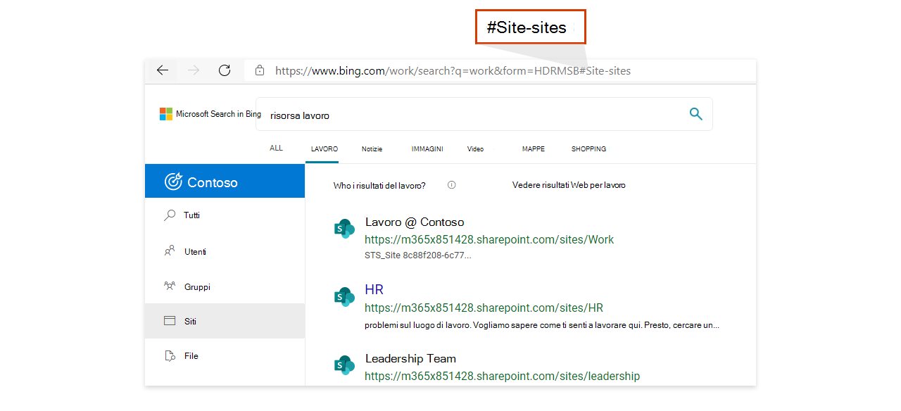
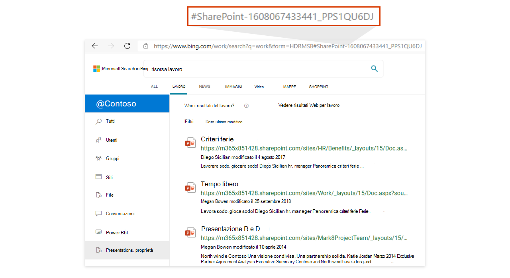

# <a name="add-a-search-box-to-your-intranet-site"></a><span data-ttu-id="b838a-103">Aggiungere una casella di ricerca al sito Intranet</span><span class="sxs-lookup"><span data-stu-id="b838a-103">Add a search box to your intranet site</span></span>

<span data-ttu-id="b838a-104">Per consentire agli utenti di accedere facilmente ai risultati dell'organizzazione, aggiungere una casella di ricerca di Microsoft Search Bing a qualsiasi sito o pagina Intranet.</span><span class="sxs-lookup"><span data-stu-id="b838a-104">To provide your users with easy access to results from your organization, add a Microsoft Search in Bing search box to any intranet site or page.</span></span> <span data-ttu-id="b838a-105">Ecco alcuni dei vantaggi:</span><span class="sxs-lookup"><span data-stu-id="b838a-105">These are some of the benefits:</span></span>

- <span data-ttu-id="b838a-106">Una casella di ricerca nel portale SharePoint intranet offre un punto di ingresso attendibile e familiare per iniziare la ricerca</span><span class="sxs-lookup"><span data-stu-id="b838a-106">A search box on your SharePoint or intranet portal provides a familiar, trusted entry point to start searching</span></span>
- <span data-ttu-id="b838a-107">Supporta tutti i principali Web browser, tra cui Google Chrome e Microsoft Edge</span><span class="sxs-lookup"><span data-stu-id="b838a-107">Supports all major web browsers, including Google Chrome and Microsoft Edge</span></span>
- <span data-ttu-id="b838a-108">Vengono visualizzati solo i suggerimenti di ricerca dell'organizzazione, i suggerimenti Web non vengono mai inclusi</span><span class="sxs-lookup"><span data-stu-id="b838a-108">Only search suggestions from your organization appear, web suggestions are never included</span></span>
- <span data-ttu-id="b838a-109">Consente agli utenti di accedere a una pagina dei Bing di lavoro, che esclude gli annunci e i risultati Web</span><span class="sxs-lookup"><span data-stu-id="b838a-109">Takes users to a Microsoft Search in Bing work results page, which excludes ads and web results</span></span>
- <span data-ttu-id="b838a-110">Puoi controllare l'aspetto e il comportamento della casella di ricerca, inclusa la possibilità di impostare gli utenti su un verticale predefinito o personalizzato che hai creato</span><span class="sxs-lookup"><span data-stu-id="b838a-110">You control the appearance and behavior of the search box, including the ability to land users on a default vertical or a custom vertical you've created</span></span>
  
## <a name="add-a-search-box-to-an-intranet-page"></a><span data-ttu-id="b838a-111">Aggiungere una casella di ricerca a una pagina Intranet</span><span class="sxs-lookup"><span data-stu-id="b838a-111">Add a search box to an intranet page</span></span>

<span data-ttu-id="b838a-112">È necessario aggiungere due elementi alla pagina: un contenitore per la casella di ricerca e lo script che la fa funzionare.</span><span class="sxs-lookup"><span data-stu-id="b838a-112">You need to add two elements to the page: a container for the search box and the script that powers it.</span></span>
  
```html
<div id="bfb_searchbox"></div>
<script>
    var bfbSearchBoxConfig = {
        containerSelector: "bfb_searchbox"
    };
</script>
<script async src="https://www.bing.com/business/s?k=sb"></script>
```

<span data-ttu-id="b838a-113">In un sito di SharePoint classico, aggiungere una Web part Editor di script e inserire lo script al suo interno.</span><span class="sxs-lookup"><span data-stu-id="b838a-113">On a SharePoint classic site, add a Script Editor Web Part and drop the script in it.</span></span>
  
## <a name="enable-the-search-box-for-mobile"></a><span data-ttu-id="b838a-114">Abilitare la casella di ricerca per i dispositivi mobili</span><span class="sxs-lookup"><span data-stu-id="b838a-114">Enable the search box for mobile</span></span>

<span data-ttu-id="b838a-115">Per i siti Intranet o le pagine disponibili per gli utenti mobili, aggiungere isMobile:true all'oggetto impostazioni:</span><span class="sxs-lookup"><span data-stu-id="b838a-115">For intranet sites or pages available to mobile users, add isMobile: true to the settings object:</span></span>
  
```html
<div id="bfb_searchbox"></div>
<script>
    var bfbSearchBoxConfig = {
        containerSelector: "bfb_searchbox", 
        isMobile: true
    };
</script>
<script async src="https://www.bing.com/business/s?k=sb"></script>
```

## <a name="put-focus-on-the-search-box-by-default"></a><span data-ttu-id="b838a-116">Configurare lo stato attivo sulla casella di ricerca per impostazione predefinita</span><span class="sxs-lookup"><span data-stu-id="b838a-116">Put focus on the search box by default</span></span>

<span data-ttu-id="b838a-117">Per consentire agli utenti di eseguire ricerche più velocemente, durante il caricamento della pagina o del sito posizionare il cursore nella casella di ricerca aggiungendo focus:true all'oggetto impostazioni:</span><span class="sxs-lookup"><span data-stu-id="b838a-117">To help users search faster, when the page or site loads place the cursor in the search box by adding focus: true to the settings object:</span></span>
  
```html
<div id="bfb_searchbox"></div>
<script>
    var bfbSearchBoxConfig = {
        containerSelector: "bfb_searchbox",
        focus: true
    };
</script>
<script async src="https://www.bing.com/business/s?k=sb"></script>
```

## <a name="customize-the-appearance-of-the-search-box"></a><span data-ttu-id="b838a-118">Personalizzare l'aspetto della casella di ricerca</span><span class="sxs-lookup"><span data-stu-id="b838a-118">Customize the appearance of the search box</span></span> 

<span data-ttu-id="b838a-119">Sono disponibili numerose opzioni di configurazione per adattare meglio la casella di ricerca allo stile della Intranet.</span><span class="sxs-lookup"><span data-stu-id="b838a-119">To help the search box better fit with the style of your intranet, there are a variety of configuration options you can use.</span></span> <span data-ttu-id="b838a-120">Combinare le opzioni in base alle esigenze.</span><span class="sxs-lookup"><span data-stu-id="b838a-120">Mix and match options to suit your needs.</span></span>

```html
<div id="bfb_searchbox"></div>
<script>
    var bfbSearchBoxConfig = {
        containerSelector: "bfb_searchbox",
        width: 560,                             // default: 560, min: 360, max: 650
        height: 40,                             // default: 40, min: 40, max: 72
        cornerRadius: 6,                        // default: 6, min: 0, max: 25                                   
        strokeOutline: true,                    // default: true
        dropShadow: true,                       // default: false
        iconColor: "#067FA6",                   // default: #067FA6
        title: "Search box",                    // default: "Search box"
        vertical: "Person-people",              // default: not specified, search box directs to the All vertical on the WORK results page
        companyNameInGhostText: "Contoso"       // default: not specified
                                                // when absent, ghost text will be "Search work"
                                                // when specified, text will be "Search <companyNameInGhostText>"
    };
</script>
<script async src="https://www.bing.com/business/s?k=sb"></script>
```

## <a name="direct-users-to-a-default-or-custom-vertical"></a><span data-ttu-id="b838a-121">Indirizzare gli utenti a un verticale predefinito o personalizzato</span><span class="sxs-lookup"><span data-stu-id="b838a-121">Direct users to a default or custom vertical</span></span>

<span data-ttu-id="b838a-122">Per garantire una facile integrazione tra le app line-of-business o i siti Intranet e i risultati di lavoro, è anche possibile personalizzare la casella di ricerca specificando un verticale predefinito o personalizzato su cui gli utenti devono accedere quando fanno clic su un suggerimento di ricerca.</span><span class="sxs-lookup"><span data-stu-id="b838a-122">To provide easy integration between your line-of-business apps or intranet sites and your work results, you can also customize the search box by specifying a default or custom vertical that users should land on when they click a search suggestion.</span></span>

<span data-ttu-id="b838a-123">Utilizzare l'opzione verticale in bfbSearchBoxConfig per definire il verticale desiderato.</span><span class="sxs-lookup"><span data-stu-id="b838a-123">Use the vertical option in bfbSearchBoxConfig to define the vertical you want.</span></span> <span data-ttu-id="b838a-124">Ad esempio, se si desidera che gli utenti atterrino sempre sul verticale Siti, uno dei verticali predefiniti, utilizzare il valore "Site-sites".</span><span class="sxs-lookup"><span data-stu-id="b838a-124">For example, if you want users to always land on the Sites vertical, one of the default verticals, use the value "Site-sites".</span></span>



<span data-ttu-id="b838a-126">Per i verticali personalizzati, usa l'hash alla fine dell'URL.</span><span class="sxs-lookup"><span data-stu-id="b838a-126">For custom verticals, use the hash at the end of the URL.</span></span> <span data-ttu-id="b838a-127">È possibile trovare questi valori eseguendo una ricerca dalla pagina di lavoro in Bing, facendo clic su un'etichetta verticale e copiando il valore dopo il simbolo del numero (#).</span><span class="sxs-lookup"><span data-stu-id="b838a-127">You can find these values by searching from the work page on Bing, clicking a vertical label, and copying the value after the number sign (#).</span></span>



## <a name="use-an-iframe-to-embed-a-search-box"></a><span data-ttu-id="b838a-129">Usare un iFrame per incorporare una casella di ricerca</span><span class="sxs-lookup"><span data-stu-id="b838a-129">Use an iFrame to embed a search box</span></span>

<span data-ttu-id="b838a-130">Se non è possibile incorporare uno script nel sito, usare un iFrame per aggiungere la casella di ricerca.</span><span class="sxs-lookup"><span data-stu-id="b838a-130">If embedding a script isn't an option for the site, use an iFrame to add the search box.</span></span> <span data-ttu-id="b838a-131">Non sarà possibile personalizzare la casella di ricerca.</span><span class="sxs-lookup"><span data-stu-id="b838a-131">You won't be able to customize the search box.</span></span>
  
```html
<iframe width="564" height="400" src="https://www.bing.com/business/searchbox"></iframe>
```

## <a name="inprivate-mode-and-conditional-access"></a><span data-ttu-id="b838a-132">Modalità InPrivate e Accesso condizionale</span><span class="sxs-lookup"><span data-stu-id="b838a-132">InPrivate mode and Conditional Access</span></span>

<span data-ttu-id="b838a-133">Una casella di ricerca incorporata verrà disabilitata se la pagina o il sito viene aperto in una finestra InPrivate.</span><span class="sxs-lookup"><span data-stu-id="b838a-133">An embedded search box will be disabled if the page or site is opened in an InPrivate window.</span></span> <span data-ttu-id="b838a-134">Inoltre, con il supporto dell'accesso condizionale di Azure AD in Microsoft Edge, Bing.com non supporta l'accesso AAD quando si usa la modalità InPrivate.</span><span class="sxs-lookup"><span data-stu-id="b838a-134">Also, with Azure AD Conditional Access support in Microsoft Edge, Bing.com doesn't support AAD sign in when using InPrivate mode.</span></span> <span data-ttu-id="b838a-135">Per ulteriori informazioni sull'accesso condizionale in Edge, vedere [Microsoft Edge e Accesso condizionale](https://docs.microsoft.com/deployedge/ms-edge-security-conditional-access#accessing-conditional-access-protected-resources-in-microsoft-edge).</span><span class="sxs-lookup"><span data-stu-id="b838a-135">For more information about Conditional Access in Edge, see [Microsoft Edge and Conditional Access](https://docs.microsoft.com/deployedge/ms-edge-security-conditional-access#accessing-conditional-access-protected-resources-in-microsoft-edge).</span></span> 