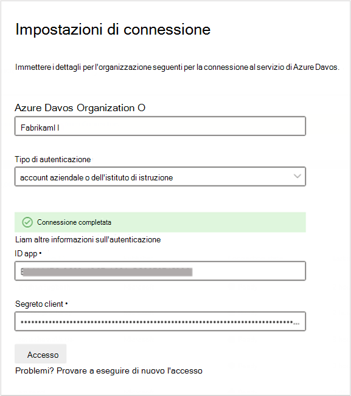

<!---Previous ms.author: shgrover --->

# Azure DevOps Graph connettore (anteprima)

Il connettore Azure DevOps Graph consente all'organizzazione di indicizzare gli elementi di lavoro nell'istanza del servizio Azure DevOps locale. Dopo aver configurato il connettore e il contenuto di indicizzazione Azure DevOps, gli utenti finali possono cercare tali elementi in Microsoft Search.

> [!NOTE]
> Leggere [**l'articolo Setup for your Graph connector**](configure-connector.md) to understand the general Graph connectors setup instructions.

Questo articolo è per tutti gli utenti che configurano, esere e monitorano un Azure DevOps Graph connettore. Integra il processo di configurazione generale e mostra le istruzioni che si applicano solo al connettore Azure DevOps Graph connettore.

>[!IMPORTANT]
>Il connettore Azure DevOps supporta solo il Azure DevOps cloud. Azure DevOps Server 2019, TFS 2018, TFS 2017, TFS 2015 e TFS 2013 non sono supportati da questo connettore.

<!---## Before you get started-->

<!---Insert "Before you get started" recommendations for this data source-->

## Passaggio 1: Aggiungere un connettore Graph nella interfaccia di amministrazione di Microsoft 365

Seguire le istruzioni generali [per l'installazione](./configure-connector.md).
<!---If the above phrase does not apply, delete it and insert specific details for your data source that are different from general setup 
instructions.-->

## Passaggio 2: assegnare un nome alla connessione

Seguire le istruzioni generali [per l'installazione](./configure-connector.md).
<!---If the above phrase does not apply, delete it and insert specific details for your data source that are different from general setup 
instructions.-->

## Passaggio 3: Configurare le impostazioni di connessione

Per connettersi all'istanza Azure DevOps, è necessario il  nome dell'Azure DevOps, l'ID app e il segreto client per l'autenticazione OAuth.

### Registrare un'app

Registra un'app in Azure DevOps in modo che l'app Microsoft Search possa accedere all'istanza. Per altre informazioni, vedi la Azure DevOps su come [registrare un'app.](/azure/devops/integrate/get-started/authentication/oauth?preserve-view=true&view=azure-devops#register-your-app)

La tabella seguente fornisce indicazioni su come compilare il modulo di registrazione dell'app:

Campi obbligatori | Descrizione | Valore consigliato
--- | --- | ---
| Nome società         | Nome della società. | Utilizzare un valore appropriato   |
| Nome applicazione     | Valore univoco che identifica l'applicazione che si sta autorizzando.    | Microsoft Search     |
| Sito Web dell'applicazione  | URL dell'applicazione che richiederà l'accesso all'istanza Azure DevOps durante l'installazione del connettore. (Obbligatorio).  | https://gcs.office. com/
| URL richiamata autorizzazione        | URL di richiamata obbligatorio a cui il server di autorizzazione reindirizza. | https://gcs.office. com/v1.0/admin/oauth/callback|
| Ambiti autorizzati | Ambito di accesso per l'applicazione | Selezionare gli ambiti seguenti: Identità (lettura), Elementi di lavoro (lettura), Gruppi di variabili (lettura), Project e team (lettura), Graph (lettura), Analisi (lettura)|

>[!IMPORTANT]
>Gli ambiti autorizzati selezionati per l'app devono corrispondere agli ambiti esattamente come indicato in precedenza. Se si omette uno degli ambiti autorizzati nell'elenco o si aggiunge un altro ambito, l'autorizzazione avrà esito negativo.

Durante la registrazione dell'app con i dettagli sopra riportati, ottieni **l'ID app** e il **segreto client** che verranno usati per configurare il connettore.

>[!NOTE]
>Per revocare l'accesso a qualsiasi app registrata in Azure DevOps, vai a Impostazioni utente nella parte superiore destra dell'Azure DevOps istanza. Selezionare Profilo e quindi Autorizzazioni nella sezione Sicurezza del riquadro laterale. Passa il mouse su un'app OAuth autorizzata per visualizzare il pulsante Revoca nell'angolo dei dettagli dell'app.

### Impostazioni di connessione

Dopo aver registrato l'app Microsoft Search con Azure DevOps, puoi completare il passaggio delle impostazioni di connessione. Immetti il nome dell'organizzazione, l'ID app e il segreto client.

### Configurare i dati: selezionare progetti e campi

È possibile scegliere per la connessione di indicizzare l'intera organizzazione o progetti specifici.

Se si sceglie di indicizzare l'intera organizzazione, gli elementi in tutti i progetti dell'organizzazione verranno indicizzati. I nuovi progetti e gli elementi verranno indicizzati durante la successiva ricerca per indicizzazione dopo la creazione.

Se si scelgono singoli progetti, verranno indicizzati solo gli elementi di lavoro in tali progetti.

Selezionare quindi i campi che si desidera indicizzare e visualizzare in anteprima i dati in questi campi prima di procedere.

## Passaggio 4: Gestire le autorizzazioni di ricerca

Il connettore Azure DevOps supporta le autorizzazioni di ricerca visibili solo agli utenti con  **accesso a questa origine dati** o a **Tutti**. Se si sceglie Solo gli utenti con accesso a questa origine **dati,** i dati indicizzati verranno visualizzati nei risultati della ricerca per gli utenti che hanno accesso a tali utenti in base alle autorizzazioni per utenti o gruppi a livello di organizzazione, Project o percorso area in Azure DevOps. Se si sceglie **Tutti**, i dati indicizzati verranno visualizzati nei risultati della ricerca per tutti gli utenti.

## Passaggio 5: Assegnare etichette di proprietà

Seguire le istruzioni generali [per l'installazione](./configure-connector.md).

## Passaggio 6: Gestire lo schema

Seguire le istruzioni generali [per l'installazione](./configure-connector.md).

## Passaggio 7: Scegliere le impostazioni di aggiornamento

Il connettore Azure DevOps supporta le pianificazioni di aggiornamento sia per le ricerche per indicizzazione complete che per le ricerche per indicizzazione incrementali.
La pianificazione consigliata è un'ora per una ricerca per indicizzazione incrementale e un giorno per una ricerca per indicizzazione completa.

## Passaggio 8: verificare la connessione

Seguire le istruzioni generali [per l'installazione](./configure-connector.md).

>[!TIP]
>**Tipo di risultato predefinito**
>* Il Azure DevOps registra automaticamente un [tipo di risultato](./customize-search-page.md#step-2-create-result-types) dopo la pubblicazione del connettore. Il tipo di risultato utilizza un layout dei [risultati](./customize-results-layout.md) generato dinamicamente in base ai campi selezionati nel passaggio 3. 
>* È possibile gestire il tipo di risultati passando a [**Tipi di risultati**](https://admin.microsoft.com/Adminportal/Home#/MicrosoftSearch/resulttypes) nella interfaccia di amministrazione di Microsoft 365 .  Il tipo di risultato predefinito verrà denominato `ConnectionId` "Default". Ad esempio, se l'ID di connessione è , il layout dei risultati `AzureDevOps` sarà denominato: "AzureDevOpsDefault"
>* È inoltre possibile scegliere di creare un tipo di risultato personalizzato, se necessario.

<!---If the above phrase does not apply, delete it and insert specific details for your data source that are different from general setup 
instructions.-->

## Risoluzione dei problemi
Di seguito è riportato un errore comune rilevato durante la configurazione del connettore e il relativo possibile motivo.

| Passaggio di configurazione | Messaggio di errore | Possibili motivi |
| ------------ | ------------ | ------------ |
|  | `The account associated with the connector doesn't have permission to access the item.` | L'app registrata non dispone di uno degli ambiti OAuth necessari. (Nota: un nuovo requisito di ambito OAuth 'Analytics:read' è stato introdotto il 31/08/2021)  |

<!---## Limitations-->
<!---Insert limitations for this data source-->