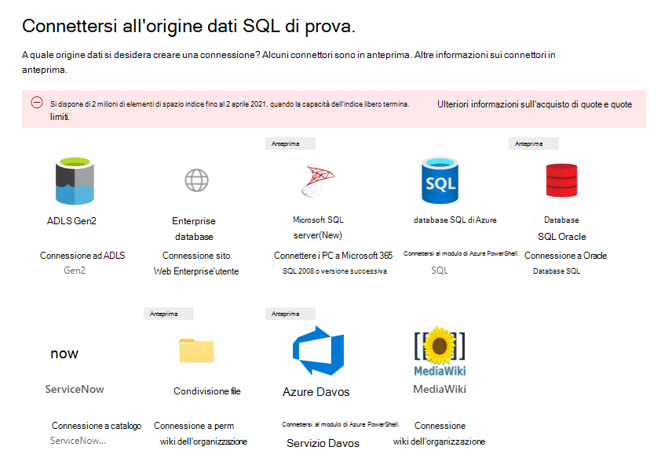
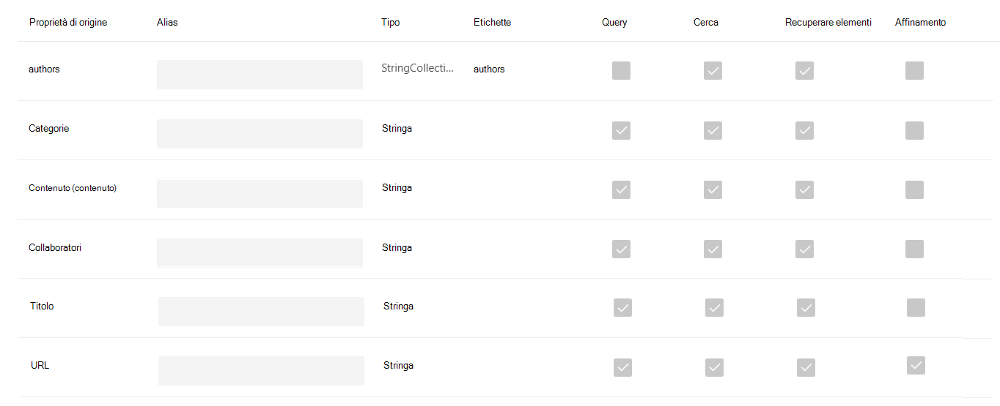
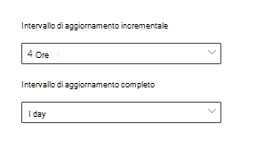

<!-- markdownlint-disable no-trailing-punctuation -->

# Panoramica dell'installazione dei connettori del grafico da parte di MicrosoftSetup overview for Graph connectors by Microsoft 

In questo articolo viene riepilogato il processo di base necessario per utilizzare l'interfaccia di [amministrazione di microsoft 365](https://admin.microsoft.com) per configurare i connettori del grafico da Microsoft.This article summarizes the basic process required to use the [Microsoft 365 admin center](https://admin.microsoft.com) to setup any of the Graph connectors by Microsoft. Il processo di base include i passaggi seguenti:The basic process includes the following steps:  
<!---Add links to each section in the doc--->

1. Aggiungere un connettore grafico nell'interfaccia di amministrazione di Microsoft 365.Add a Graph connector in the Microsoft 365 admin center.
2. Denominare la connessione.Name the connection.
3. Configurare le impostazioni di connessione.Configure the connection settings.
4. Gestire le autorizzazioni di ricerca.Manage search permissions.
5. Assegnare le etichette delle proprietà.Assign property labels.
6. Gestione schema.Manage schema.
7. Scegliere Aggiorna impostazioni.Choose refresh settings.
8. Esaminare la connessione.Review the connection.

È importante tenere presente che il processo di installazione è molto simile per tutti i connettori del grafico da parte di Microsoft, ma non è esattamente lo stesso.It is important to note that the setup process is very similar for all the Graph connectors by Microsoft but is not exactly the same. **Oltre a leggere questo articolo, leggere il connettore specifico per l'origine dati.****In addition to reading this article, be sure to read the connector-specific for your data source.**  

## Passaggio 1: aggiungere un connettore grafico nell'interfaccia di amministrazione di Microsoft 365Step 1: Add a Graph connector in the Microsoft 365 admin center

Completare la procedura seguente per configurare uno qualsiasi dei connettori Microsoft-built.Complete the following steps to configure any of the Microsoft-built connectors.

1. Accedere all'account di amministratore nell'interfaccia di [amministrazione di Microsoft 365](https://admin.microsoft.com)Sign into your admin account in the [Microsoft 365 admin center](https://admin.microsoft.com)
2. Nel riquadro di spostamento, selezionare **Impostazioni**, quindi selezionare **Cerca & Intelligence**.In the navigation pane, select **Settings**, and then select **Search & intelligence**. Selezionare la [scheda Connettori](https://admin.microsoft.com/Adminportal/Home#/MicrosoftSearch/Connectors).Select the [Connectors tab](https://admin.microsoft.com/Adminportal/Home#/MicrosoftSearch/Connectors).
3.  Selezionare **+ Aggiungi**, quindi selezionare l'origine dati desiderata nel menu delle opzioni disponibili.Select **+Add**, and then select the data source of your choice from the menu of available options.

>[! Nota:] è possibile aggiungere un massimo di dieci connessioni grafico a ogni tenant.[!Note:] You can add a maximum of ten Graph connections to each tenant.

## Passaggio 2: denominare la connessioneStep 2: Name the connection
Sarà necessario specificare gli attributi seguenti:You will need to specify these attributes: 

* NomeName  
* ID connessioneConnection ID 
* Descrizione (facoltativa)Description (optional) 

L'ID di connessione crea proprietà implicite per il connettore.The connection ID creates implicit properties for your connector. Deve contenere solo caratteri alfanumerici e avere un massimo di 32 caratteri.It must contain only alphanumeric characters and be a maximum of 32 characters. 

## Passaggio 3: configurare le impostazioni di connessioneStep 3: Configure the connection settings

Il processo di configurazione delle impostazioni di connessione varia in base al tipo di origine dati.The process to configure the Connection settings varies based on the type of data source. Vedere le informazioni specifiche del connettore per il tipo di origine dati che si desidera aggiungere al tenant per completare questo passaggio nel processo di installazione.See the Connector-specific information for the type of data source you want to add to your tenant to complete this step in the setup process.  

Per ulteriori informazioni sulla connessione a un'origine dati locale, vedere [Install an on-premises Data Gateway](https://aka.ms/configuregateway).To learn more about connecting to an on-premises data source, see [Install an on-premises data gateway](https://aka.ms/configuregateway).

## Passaggio 4: gestire le autorizzazioni di ricercaStep 4: Manage search permissions

Gli elenchi di controllo di accesso (ACL, Access Control List) determinano gli utenti dell'organizzazione che possono accedere a ogni elemento di dati.Access Control Lists (ACLs) determine which users in your organization can access each item of data.  

Alcuni connettori come [Microsoft SQL](MSSQL-connector.md) e [Azure Data Lake storage Gen2](azure-data-lake-connector.md) supportano nativamente gli ACL di [Azure Active Directory (Azure ad)](https://docs.microsoft.com/azure/active-directory/) .Some connectors like [Microsoft SQL](MSSQL-connector.md) and [Azure Data Lake Storage Gen2](azure-data-lake-connector.md) natively support [Azure Active Directory (Azure AD)](https://docs.microsoft.com/azure/active-directory/) ACLs.

Altri connettori come [ServiceNow](servicenow-connector.md), [Azure DevOps](azure-devops-connector.md)e [Salesforce](salesforce-connector.md) supportano la sincronizzazione di utenti e gruppi non di Azure ad.Other connectors like [ServiceNow](servicenow-connector.md), [Azure DevOps](azure-devops-connector.md), and [Salesforce](salesforce-connector.md) support syncing of non-Azure AD users and groups.  

## Passaggio 5: assegnare etichette delle proprietàStep 5: Assign property labels
È possibile assegnare etichette semantiche alle proprietà di origine nella pagina "assegnare etichette delle proprietà".You can assign semantic labels to your source properties on the "Assign property labels" page. Le etichette sono tag ben noti forniti da Microsoft che forniscono significato semantico.Labels are well known tags provided by Microsoft that provide semantic meaning. Consentono a Microsoft di integrare i dati del connettore in esperienze di Microsoft 365, ad esempio ricerca avanzata, schede persone, individuazione intelligente e altro ancora.They allow Microsoft to integrate your connector data into Microsoft 365 experiences such as enhanced search, people cards, intelligent discovery, and more.  

Nella tabella seguente sono elencate le etichette attualmente supportate e le relative descrizioni.The following table lists the currently supported labels and their descriptions.  

LabelLabel | DescrizioneDescription
--- | ---  
**titolo****title** | Il titolo dell'elemento che si desidera visualizzare in Search and other experiencesThe title for the item that you want shown in search and other experiences 
**url****url** | L'URL di destinazione dell'elemento nel sistema di origineThe target url of the item in the source system 
**createdBy****createdBy** | Nome della persona che ha creato l'elementoName of the person who created the item 
**lastModifiedBy****lastModifiedBy** | Nome della persona che ha modificato più di recente l'elementoName of the person who most recently edited the item 
**authors****authors** | Nome delle persone che hanno partecipato/collaborato all'articoloName of the people who participated/collaborated on the item 
**createdDateTime****createdDateTime** | Quando è stato creato l'elementoWhen was the item created 
**lastModifiedDateTime****lastModifiedDateTime** | Quando l'elemento è stato modificato più di recenteWhen was the item most recently edited 
**fileName****fileName** | Nome dell'elemento del fileName of the file item 
**fileExtension****fileExtension** | Tipo di elemento del file, ad esempio. pdf o. WordType of file item such as .pdf or .word 

Le proprietà di questa pagina sono preselezionate in base all'origine dati, ma è possibile modificare questa opzione se esiste una proprietà diversa che è più adatta per una determinata etichetta.The properties on this page are pre-selected based on your data source, but you can change this selection if there is a different property that is better suited for a particular label.  

Il **titolo** dell'etichetta è l'etichetta più importante.The label **title** is the most important label. È **consigliabile** disporre di una proprietà assegnata a questa etichetta affinché la connessione partecipi all' [esperienza del cluster di risultati](result-cluster.md).It is **strongly recommended** that you have a property assigned to this label in order for your connection to participate in the [result cluster experience](result-cluster.md).

La mappatura erronea delle etichette provocherà un'esperienza di ricerca deteriorata.Incorrectly mapping labels will cause a deteriorated search experience. Per alcune etichette non è possibile assegnare una proprietà.It is okay for some labels to not have a property assigned to it.  

## Passaggio 6: gestire lo schemaStep 6: Manage schema

### Content, proprietàContent property

È consigliabile selezionare una \* \* proprietà di contenuto dal menu a discesa delle opzioni oppure mantenere l'impostazione predefinita, se presente.It is strongly recommended that you select a \*\*Content Property" from the drop-down menu of options, or keep the default if one is present. Questa proprietà viene utilizzata per l'indicizzazione full-text del contenuto, la generazione di frammenti di pagina dei risultati della ricerca, la partecipazione del [cluster](result-cluster.md) di risultati, il rilevamento della lingua, il supporto HTML/testo, la classificazione e la pertinenza e la formulazione delleThis property is used for full-text indexing of content, search results page snippet generation, [result cluster](result-cluster.md) participation, language detection, HTML/text support, ranking and relevance, and query formulation.

Se si seleziona una proprietà di contenuto, si avrà la possibilità di utilizzare la proprietà generata dal sistema **ResultSnippet** quando si [Crea il tipo di risultato](customize-results-layout.md).If you select a content property, you will have the option of using the system-generated property **ResultSnippet** when you [create your result type](customize-results-layout.md). Questa proprietà funge da segnaposto per i frammenti dinamici generati dalla proprietà Content in fase di query.This property serves as a placeholder for the dynamic snippets that are generated from the content property at query time. Se si utilizza questa proprietà nel tipo di risultati, i frammenti verranno generati nei risultati della ricerca.If you use this property in your result type, snippets will be generated in your search results.

### Creazione di alias per le proprietà di origineCreating aliases for source properties

È possibile aggiungere alias alle proprietà sotto la colonna "alias" nella pagina "Gestisci schema".You can add aliases to your properties under the "Alias" column on the "Manage schema" page. Gli alias sono nomi descrittivi per le proprietà.Aliases are friendly names for your properties. Vengono utilizzati nelle query e nella creazione di filtri.They are used in queries and in the creation of filters. Vengono inoltre utilizzati per normalizzare le proprietà di origine da più connessioni, in modo da avere lo stesso nome.They are also used to normalize source properties from multiple connections such that they have the same name. In questo modo è possibile creare un singolo filtro per un verticale con più connessioni.That way you can create a single filter for a vertical with multiple connections. Per ulteriori informazioni, vedere [personalizzare la pagina dei risultati di ricerca](customize-search-page.md) .See [Customize the search results page](customize-search-page.md) for more information.  

### Attributi dello schema di ricercaSearch schema attributes

È possibile impostare gli attributi dello schema di ricerca per controllare la funzionalità di ricerca di ogni proprietà di origine.You can set the search schema attributes to control search functionality of each source property. Uno schema di ricerca consente di determinare quali risultati vengono visualizzati nella pagina dei risultati di ricerca e quali informazioni possono essere visualizzate e accessibili dagli utenti finali.A search schema helps determine what results display on the search results page and what information end users can view and access.

Gli attributi dello schema di ricerca sono disponibili per la **ricerca**, per **query**, per il **recupero** e **per affinamento ricerca**.Search schema attributes include **searchable**, **queryable**, **retrievable**, and **refinable**. Nella tabella seguente sono elencati tutti gli attributi supportati da Microsoft Graph e vengono illustrate le loro funzioni.The following table lists each of the attributes that Microsoft Graph connectors support and explains their functions.

Attributo dello schema di ricercaSearch schema attribute | FunzioneFunction | EsempioExample
--- | --- | ---
RICERCHESEARCHABLE | Consente di eseguire ricerche nel contenuto del testo di una proprietà.Makes the text content of a property searchable. Il contenuto della proprietà è incluso nell'indice full-text.Property contents are included in the full-text index. | Se la proprietà è **title**, una query per **Enterprise** restituirà le risposte che contengono la parola **Enterprise** in qualsiasi testo o titolo.If the property is **title**, a query for **Enterprise** returns answers that contain the word **Enterprise** in any text or title.
QUERYQUERYABLE | Esegue una ricerca in base alla query per una corrispondenza per una proprietà specifica.Searches by query for a match for a particular property. Il nome della proprietà può quindi essere specificato nella query a livello di programmazione o Verbatim.The property name can then be specified in the query either programmatically or verbatim. |  Se la proprietà **title** è Queryable, il titolo della query **: Enterprise** è supportato.If the **Title** property is queryable, then the query **Title: Enterprise** is supported. 
RECUPERATERETRIEVABLE | È possibile utilizzare solo le proprietà recuperabili nel tipo di risultati e visualizzarle nei risultati della ricerca.Only retrievable properties can be used in the result type and display in the search result. |
PER affinamento ricercaREFINABLE | È possibile utilizzare le proprietà di per affinamento ricerca come nella pagina dei risultati di ricerca di Microsoft.Refinable properties can be used as in the Microsoft Search results page. | Gli utenti dell'organizzazione possono [filtrare](custom-filters.md) in base a **lastModifiedDateTime** nella pagina dei risultati di ricerca se la proprietà è contrassegnata come per affinamento ricerca durante l'installazione della connessioneUsers in your organization can [filter](custom-filters.md) by **lastModifiedDateTime** in the search results page if the property is marked refinable during connection setup

Per tutti i connettori, ad eccezione del connettore di condivisione file, è necessario impostare manualmente i tipi personalizzati.For all connectors except the File share connector, custom types must be set manually. Per attivare le funzionalità di ricerca per ogni campo, è necessario uno schema di ricerca mappato a un elenco di proprietà.To activate search capabilities for each field, you need a search schema mapped to a list of properties. La procedura guidata consente di selezionare automaticamente uno schema di ricerca basato sul set di proprietà di origine che si desidera scegliere.The connection wizard automatically selects a search schema based on the set of source properties you choose. È possibile modificare questo schema selezionando le caselle di controllo per ogni proprietà e attributo nella pagina schema di ricerca.You can modify this schema by selecting the check boxes for each property and attribute in the search schema page.

 
### Restrizioni e suggerimenti per le impostazioni dello schema di ricercaRestrictions and recommendations for search schema settings

* La proprietà **Content** è solo per le ricerche.The **content** property is searchable only. Una volta selezionata nell'elenco a discesa, questa proprietà non può essere contrassegnata come **recuperabile** o **Queryable**.Once selected in the dropdown, this property cannot be marked **retrievable** or **queryable**.

* I problemi di prestazioni significativi si verificano quando i risultati della ricerca eseguono il rendering con la proprietà **Content** .Significant performance issues occur when search results render with the **content** property. Un esempio è il campo di contenuto di **testo** per un articolo della Knowledge base di [ServiceNow](https://www.servicenow.com) .An example is the **Text** content field for a [ServiceNow](https://www.servicenow.com) knowledge-base article.

* Solo le proprietà contrassegnate come rendering recuperabili nei risultati della ricerca possono essere utilizzate per creare i tipi di risultati moderni (MRTs).Only properties marked as retrievable render in the search results and can be used to create modern result types (MRTs).

* Solo le proprietà della stringa possono essere contrassegnate come ricercabili.Only string properties can be marked searchable.

> [!NOTE]
> Dopo aver creato una connessione, **non è possibile** modificare lo schema.After you create a connection, you **can't** modify the schema. A tale scopo, è necessario eliminare la connessione e crearne uno nuovo.To do that, you need to delete your connection and create a new one.

## Passaggio 7: aggiornare le impostazioniStep 7: Refresh settings

L'intervallo di aggiornamento determina la frequenza con cui i dati vengono sincronizzati tra l'origine dati e Microsoft Search.The refresh interval determines how often your data is synced between the data source and Microsoft Search. Ogni tipo di origine dati presenta una serie diversa di pianificazioni di aggiornamento ottimali, in base alla frequenza con cui i dati vengono modificati e al tipo di modifica.Each type of data source has a different set of optimal refresh schedules based on how often data is modified and the type of modifications.

Esistono due tipi di intervalli di aggiornamento, ovvero l'aggiornamento **completo** e l' **aggiornamento incrementale**, ma gli aggiornamenti incrementali non sono disponibili per alcune origini dati.There are two types of refresh intervals, which are **Full refresh** and **Incremental refresh**, but incremental refreshes are not available for some data sources.

Con un aggiornamento completo, il motore di ricerca elabora e indicizza tutti gli elementi nell'origine di contenuto, indipendentemente dalle ricerche per indicizzazione precedenti.With a full refresh, the search engine processes and indexes every item in the content source, regardless of previous crawls. Un aggiornamento completo funziona in modo ottimale per queste situazioni:A full refresh works best for these situations:

* Rilevamento di eliminazioni di dati.Detecting deletions of data.
* L'aggiornamento incrementale non è stato in grado di aggiornare il contenuto a causa di errori.The incremental refresh failed to update content due to errors.
* Gli elenchi ACL sono stati modificati.ACLs were modified.
* Sono state modificate regole di ricerca per indicizzazione.Crawl rules were modified.
* Quando lo schema per la connessione è stato aggiornato (gli aggiornamenti dello schema non sono ancora supportati)When schema for the connection has been updated (schema updates are not yet supported)

Con un **aggiornamento incrementale**, il motore di ricerca è in grado di elaborare e indicizzare solo gli elementi creati o modificati dopo l'ultima ricerca per indicizzazione riuscita.With an **Incremental refresh**, the search engine can process and index only the items that were created or modified since the last successful crawl. Pertanto, non tutti i dati nell'origine di contenuto vengono reindicizzati.Therefore, not all the data in the content source is re-indexed. Gli aggiornamenti incrementali funzionano al meglio per rilevare contenuti, metadati, autorizzazioni e altre modifiche.Incremental refreshes work best to detect content, metadata, permission, and other updates.

Gli aggiornamenti incrementali sono molto più veloci degli aggiornamenti completi, in quanto gli elementi non modificati non vengono elaborati.Incremental refreshes are much faster than full refreshes because unchanged items aren’t processed. Tuttavia, se si sceglie di eseguire aggiornamenti incrementali, sarà comunque necessario eseguire periodicamente aggiornamenti completi per mantenere una sincronizzazione dei dati accurata tra l'origine di contenuto e l'indice di ricerca.However, if you choose to run incremental refreshes, you will still need to run full refreshes periodically to maintain an accurate data sync between the content source and the search index.

<!---Change screenshot for one that shows both options in new UI (try ServiceNow)--->

## Passaggio 8: verifica della connessioneStep 8: Review connection

Prima di completare la connessione, è possibile esaminare l'intera configurazione e modificare le impostazioni in base alle esigenze.You can review your entire configuration and edit settings as needed before completing the connection. **Se non è stato ancora fatto, leggere le informazioni specifiche del connettore per l'origine dati.****Be sure to read the connector-specific information for your data source if you have not already done so.** Selezionare **Finish Updating** quando si è pronti per completare la connessione.Select **Finish updating** when you are ready to complete the connection.

## Come si può verificare che l'installazione della connessione abbia avuto esito positivo?How do I know the connection setup worked?

Passare all'elenco delle connessioni pubblicate sotto la scheda **connettori** nell'interfaccia di [Amministrazione](https://admin.microsoft.com).Go to the list of your published connections under the **Connectors** tab in the [admin center](https://admin.microsoft.com). Per informazioni su come effettuare aggiornamenti ed eliminazioni, vedere [gestire il connettore](manage-connector.md).To learn how to make updates and deletions, see [Manage your connector](manage-connector.md).
