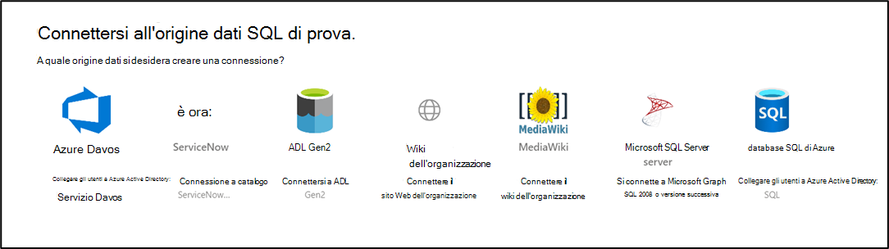

<!-- markdownlint-disable no-trailing-punctuation -->

# Configurare il connettore Microsoft-built per Microsoft SearchSet up your Microsoft-built connector for Microsoft Search

In questo articolo vengono illustrati i passaggi per la configurazione di un connettore basato su Microsoft.This article guides you through the steps of configuring a Microsoft-built connector. Descrive il flusso di configurazione di una connessione nell'interfaccia di [Amministrazione](https://admin.microsoft.com)di Microsoft 365.It outlines the flow of setting up a connection in the Microsoft 365 [admin center](https://admin.microsoft.com). Per ulteriori informazioni su come configurare connettori basati su Microsoft specifici, vedere gli articoli seguenti:For more information on how to set up specific Microsoft-built connectors, see these articles:

* [Azure Data Lake Storage Gen2Azure Data Lake Storage Gen2](azure-data-lake-connector.md)
* [Azure DevOpsAzure DevOps](azure-devops-connector.md)
* [SQL di AzureAzure SQL](MSSQL-connector.md)
* [Siti Web aziendaliEnterprise websites](enterprise-web-connector.md)
* [MediaWikiMediaWiki](mediawiki-connector.md)
* [Microsoft SQL ServerMicrosoft SQL server](MSSQL-connector.md)
* [ServiceNowServiceNow](servicenow-connector.md)

## ConfigurazioneSet up

Completare la procedura seguente per configurare uno qualsiasi dei connettori Microsoft-built.Complete the following steps to configure any of the Microsoft-built connectors.

1. Passare alla [scheda Connettori](https://admin.microsoft.com/Adminportal/Home#/MicrosoftSearch/Connectors) nell'interfaccia di [amministrazione di Microsoft 365](https://admin.microsoft.com).Go to the [Connectors tab](https://admin.microsoft.com/Adminportal/Home#/MicrosoftSearch/Connectors) in the [Microsoft 365 admin center](https://admin.microsoft.com).
2. Accedere al proprio account con le credenziali per il tenant [Microsoft 365](https://www.microsoft.com/microsoft-365) .Sign in to your account with the credentials for your [Microsoft 365](https://www.microsoft.com/microsoft-365) tenant.
3. Selezionare **Aggiungi un connettore**.Select **Add a connector**.
4. Nell'elenco dei connettori disponibili, selezionare il connettore desiderato.From the list of available connectors, select the connector of your choice.

### Assegnare un nome al connettoreName the connector

Per creare una connessione, specificare innanzitutto gli attributi seguenti:To create a connection, first specify these attributes:

1. Nome della connessioneName of the connection
2. ID connessioneConnection ID
3. Descrizione (facoltativa)Description (optional)

L'ID di connessione crea proprietà implicite per il connettore.The connection ID creates implicit properties for your connector. Deve contenere solo caratteri alfanumerici e avere un massimo di 32 caratteri.It must contain only alphanumeric characters and be a maximum of 32 characters.

### Connettersi a un'origine datiConnect to a data source

Il processo di connessione dati varia in base al tipo di connettore.The data connection process varies based on the type of connector. Per ulteriori informazioni sulla connessione all'origine dati locale, vedere [Install an on-premises Data Gateway](https://aka.ms/configuregateway).To learn more about connecting to your on-premises data source, see [Install an on-premises data gateway](https://aka.ms/configuregateway).

### Selezionare le proprietà di origineSelect source properties

I campi dati impostati dall'origine dati di terze parti come proprietà di origine vengono indicizzati in Microsoft Search.The data fields set by your third-party data source as source properties are indexed into Microsoft Search. Per modificare queste proprietà, selezionare **modifica proprietà** nella barra laterale a destra della pagina **connettori** .To modify these properties, select **Edit properties** in the side bar on the right of the **Connectors** page. È possibile selezionare **fino a 64 proprietà di origine**.You can select **up to 64 source properties**.

### Gestire lo schema di ricercaManage the search schema

Gli amministratori possono impostare gli attributi dello schema di ricerca per controllare la funzionalità di ricerca di ogni proprietà di origine.Admins can set the search schema attributes to control search functionality of each source property. Uno schema di ricerca consente di determinare quali risultati vengono visualizzati nella pagina dei risultati di ricerca e quali informazioni possono essere visualizzate e accessibili dagli utenti finali.A search schema helps determine what results display on the search results page and what information end users can view and access.

Gli attributi dello schema di ricerca includono **ricercabili**, **Queryable**e **recuperabili**.Search schema attributes include **searchable**, **queryable**, and **retrievable**. Nella tabella seguente sono elencati tutti gli attributi supportati da Microsoft Graph e vengono illustrate le loro funzioni.The following table lists each of the attributes that Microsoft Graph connectors support and explains their functions.

Attributo dello schema di ricercaSearch schema attribute | FunzioneFunction | EsempioExample
--- | --- | ---
RICERCHESEARCHABLE | Consente di eseguire ricerche nel contenuto del testo di una proprietà.Makes the text content of a property searchable. Il contenuto della proprietà è incluso nell'indice full-text.Property contents are included in the full-text index. | Se la proprietà è **title**, una query per **Enterprise** restituirà le risposte che contengono la parola **Enterprise** in qualsiasi testo o titolo.If the property is **title**, a query for **Enterprise** returns answers that contain the word **Enterprise** in any text or title.
QUERYQUERYABLE | Esegue una ricerca in base alla query per una corrispondenza per una proprietà specifica.Searches by query for a match for a particular property. Il nome della proprietà può quindi essere specificato nella query a livello di programmazione o Verbatim.The property name can then be specified in the query either programmatically or verbatim. |  Se la proprietà **title** è Queryable, il titolo della query **: Enterprise** è supportato.If the **Title** property is queryable, then the query **Title: Enterprise** is supported.
RECUPERATERETRIEVABLE | È possibile utilizzare solo le proprietà recuperabili nel tipo di risultati e visualizzarle nei risultati della ricerca.Only retrievable properties can be used in the result type and display in the search result. |

Per tutti i connettori, è necessario impostare manualmente i tipi personalizzati.For all connectors, custom types must be set manually. Per attivare le funzionalità di ricerca per ogni campo, è necessario uno schema di ricerca mappato a un elenco di proprietà.To activate search capabilities for each field, you need a search schema mapped to a list of properties. La procedura guidata consente di selezionare automaticamente uno schema di ricerca basato sul set di proprietà di origine che si desidera scegliere.The connection wizard automatically selects a search schema based on the set of source properties you choose. È possibile modificare questo schema selezionando le caselle di controllo per ogni proprietà e attributo nella pagina schema di ricerca.You can modify this schema by selecting the check boxes for each property and attribute in the search schema page.

Queste restrizioni e suggerimenti si applicano alle impostazioni dello schema di ricerca:These restrictions and recommendations apply to search schema settings:

* Per i connettori che indicino tipi personalizzati, è consigliabile **non** contrassegnare il campo che contiene il contenuto principale **recuperabile**.For connectors that index custom types, we recommend that you **do not** mark the field that contains the main content **retrievable**. Quando i risultati della ricerca eseguono il rendering con quell'attributo di ricerca, si verificano problemi significativi.Significant performance issues occur when search results render with that search attribute. Un esempio è il campo di contenuto di **testo** per un articolo della Knowledge base di [ServiceNow](https://www.servicenow.com) .An example is the **Text** content field for a [ServiceNow](https://www.servicenow.com) knowledge-base article.
* Solo le proprietà contrassegnate come rendering recuperabili nei risultati della ricerca possono essere utilizzate per creare i tipi di risultati moderni (MRTs).Only properties marked as retrievable render in the search results and can be used to create modern result types (MRTs).
* Solo le proprietà della stringa possono essere contrassegnate come ricercabili.Only string properties can be marked searchable.

> [!Note]
> Dopo aver creato una connessione, **non è possibile** modificare lo schema.After you create a connection, you **can't** modify the schema. A tale scopo, è necessario eliminare la connessione e crearne uno nuovo.To do that, you need to delete your connection and create a new one.

### Gestire le autorizzazioni di ricercaManage search permissions

Gli elenchi di controllo di accesso (ACL, Access Control List) determinano gli utenti dell'organizzazione che possono accedere a ogni elemento di dati.Access Control Lists (ACLs) determine which users in your organization can access each item of data. Tutti i connettori supportano le autorizzazioni di ricerca che sono visibili a tutti gli utenti.All the connectors support search permissions that are visible to all users.

### Impostare la pianificazione di aggiornamentoSet the refresh schedule

La pianificazione di aggiornamento determina la frequenza con cui i dati vengono sincronizzati con l'indice in Microsoft Graph e Microsoft Search.The refresh schedule determines how often your data is synced with the index in Microsoft Graph and Microsoft Search. È possibile pianificare l'aggiornamento in due modi: ricerca per indicizzazione completa o ricerca per indicizzazione incrementale.You can schedule the refresh in two ways: full crawl or incremental crawl.

Con una ricerca per indicizzazione **completa**, il motore di ricerca elabora e indicizza tutti gli elementi nell'origine di contenuto, indipendentemente dalle ricerche per indicizzazione precedenti.With a **full crawl**, the search engine processes and indexes every item in the content source, regardless of previous crawls. La ricerca per indicizzazione completa funziona meglio in queste situazioni:Full crawl works best in these situations:

* Rilevamento di eliminazioni di dati.Detecting deletions of data.
* La ricerca per indicizzazione incrementale non è riuscita a eseguire la ricerca per errori.The incremental crawl failed to crawl content for errors.
* Gli elenchi ACL sono stati modificati.ACLs were modified.
* Sono state modificate regole di ricerca per indicizzazione.Crawl rules were modified.
* È necessario un aggiornamento software per Microsoft Search.A software update for Microsoft Search is required. Gli aggiornamenti modificano lo schema di ricerca.Updates modify the search schema.

Con una ricerca per **indicizzazione incrementale**, è possibile elaborare e indicizzare solo gli elementi che sono stati creati o modificati dopo l'ultima ricerca per indicizzazione riuscita.With an **incremental crawl**, the search engine can process and index only the items that were created or modified since the last successful crawl. Pertanto, non tutti i dati nell'origine di contenuto vengono reindicizzati.Therefore, not all the data in the content source is re-indexed. Le ricerche per indicizzazione incrementali funzionano meglio per rilevare contenuti, metadati, autorizzazioni e altri aggiornamenti.Incremental crawls work best to detect content, metadata, permission, and other updates.

Le ricerche per indicizzazione incrementali sono molto più veloci delle ricerche per indicizzazione complete perché non vengono elaborati elementi non modificati.Incremental crawls are much faster than full crawls because unchanged items aren’t processed. Per mantenere una sincronizzazione accurata dei dati tra l'origine di contenuto e l'indice di ricerca, è necessario eseguire periodicamente entrambe le ricerche per indicizzazione.To maintain an accurate data sync between the content source and the search index, you need to run both crawls periodically.

Ogni connettore avrà un insieme ottimale di pianificazioni di aggiornamento in base alla frequenza con cui i dati vengono modificati e al tipo di modifica.Each connector will have a different optimal set of refresh schedules based on how often data is modified and the type of modifications.

### Esaminare le impostazioni del connettoreReview connector settings

Dopo aver configurato il connettore, l'interfaccia di [Amministrazione](https://admin.microsoft.com) porta a una pagina in cui è possibile rivedere le impostazioni.After you configure your connector, the [admin center](https://admin.microsoft.com) takes you to a page where you can review your settings. È possibile tornare indietro nel processo di configurazione per modificare le impostazioni prima di confermare la connessione.You can go back through the configuration process to edit any setting before you confirm the connection. Per ulteriori informazioni, vedere [gestire il connettore](manage-connector.md).To learn more, see [Manage your connector](manage-connector.md).

## Passaggi successivi: personalizzare la pagina dei risultati di ricercaNext steps: Customize the search results page

Con l'interfaccia utente di Microsoft Search (UI), gli utenti finali possono ricercare contenuto dalle app di produttività [microsoft 365](https://www.microsoft.com/microsoft-365) e dall'ecosistema Microsoft più ampio.With the Microsoft Search user interface (UI), your end users can search content from your [Microsoft 365](https://www.microsoft.com/microsoft-365) productivity apps and the broader Microsoft ecosystem. Un verticale di ricerca si riferisce alle schede visualizzate quando un utente Visualizza i risultati della ricerca in [SharePoint](https://sharepoint.com/), [Microsoft Office](https://Office.com)e Microsoft Search in [Bing](https://Bing.com).A search vertical refers to the tabs that are shown when a user views their search results in [SharePoint](https://sharepoint.com/), [Microsoft Office](https://Office.com), and Microsoft Search in [Bing](https://Bing.com). È possibile personalizzare i verticali di ricerca per limitare i risultati, in modo che venga visualizzato solo un determinato tipo di risultati della ricerca.You can customize search verticals to narrow down results, so that only a certain type of search results is displayed. Tali verticali vengono visualizzate come una tabulazione nella parte superiore della pagina dei risultati di ricerca.These verticals appear as a tab on the top of the search results page. Un tipo di risultato moderno (MRT) è l'interfaccia utente che designa il modo in cui vengono presentati i risultati.A modern result type (MRT) is the UI that designates how results are presented.

Creare i propri tipi di verticali e di risultati, in modo che gli utenti finali possano visualizzare i risultati della ricerca dalle nuove connessioni.Create your own verticals and result types, so end users can view search results from new connections. Senza questo passaggio, i dati della connessione non verranno visualizzati nella pagina dei risultati della ricerca.Without this step, data from your connection won’t show up on the search results page.

Per ulteriori informazioni su come creare i verticali e MRTs, vedere Personalizzazione della [pagina dei risultati di ricerca](customize-search-page.md).To learn more about how to create your verticals and MRTs, see [Search results page customization](customize-search-page.md).

## Come si può verificare che l'installazione della connessione abbia avuto esito positivo?How do I know the connection setup worked?

Passare all'elenco delle connessioni pubblicate sotto la scheda **connettori** nell'interfaccia di [Amministrazione](https://admin.microsoft.com).Go to the list of your published connections under the **Connectors** tab in the [admin center](https://admin.microsoft.com). Per informazioni su come effettuare aggiornamenti ed eliminazioni, vedere [gestire il connettore](manage-connector.md).To learn how to make updates and deletions, see [Manage your connector](manage-connector.md).
