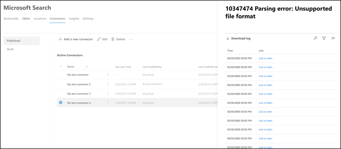

<!-- markdownlint-disable no-inline-html -->

# Visualizzare i dettagli della connessione e gli errori per Microsoft Search

Per accedere e gestire i connettori, è necessario essere designati come amministratori della ricerca per il tenant. Contattare l'amministratore tenant per eseguire il provisioning dell'utente per il ruolo di amministratore della ricerca.

Passare alla [scheda Connettori](https://admin.microsoft.com/Adminportal/Home#/MicrosoftSearch/Connectors) nell'interfaccia di [amministrazione di Microsoft 365](https://admin.microsoft.com).

È possibile visualizzare i dettagli della connessione e gli errori quando si fa clic sulla connessione nella [scheda Connettori](https://admin.microsoft.com/Adminportal/Home#/MicrosoftSearch/Connectors).  

## Visualizzare le ultime informazioni di ricerca per indicizzazione

Dopo aver completato la prima ricerca per indicizzazione completa o incrementale iniziale, gli ultimi valori di dati di ricerca per indicizzazione vengono visualizzati nell'ultima intestazione di ricerca per indicizzazione nel riquadro dei dettagli. Se non è stata eseguita l'ultima ricerca per indicizzazione, non verranno visualizzate informazioni nell'ultima intestazione di ricerca per indicizzazione. Queste informazioni sull'ultima ricerca per indicizzazione consentiranno di approfondire la modalità di esecuzione della ricerca per indicizzazione e di eseguire le operazioni necessarie laddove necessario.

Per ogni connessione saranno disponibili i seguenti valori di ricerca per indicizzazione:

Valore | Descrizione
--- | ---
**Completata in** | Data e ora in cui è stata completata la ricerca per indicizzazione
**Type** | Ricerca per indicizzazione incrementale o completa
**Durata** | quanto tempo è necessario per completare l'ultima ricerca per indicizzazione
**Operazioni riuscite** | Numero di elementi che sono stati correttamente ingeriti nell'ultima ricerca per indicizzazione
**Errori** | Numero di elementi che hanno avuto un errore nell'ultima ricerca per indicizzazione

## Errori di monitoraggio

Per ogni **connettore attivo** nella scheda **connettori** , tutti gli errori di ricerca per indicizzazione esistenti vengono visualizzati sotto la scheda **errore** . La scheda elenca i codici di errore, il numero di ogni e le opzioni di download dei log degli errori. Vedere l'esempio nell'immagine seguente. Selezionare un **codice di errore** per visualizzare i dettagli dell'errore.

Per visualizzare i dettagli specifici di un errore, selezionarne il codice di errore. Viene visualizzata una schermata con informazioni dettagliate sull'errore e un collegamento. Gli errori più recenti vengono visualizzati nella parte superiore. Vedere l'esempio nella tabella seguente.

Di seguito è riportato l'elenco dei diversi errori che possono essere visualizzati su qualsiasi connessione.

Codice di errore | Messaggio di errore | Soluzione
--- | --- | ---
1000 | L'origine dati non è disponibile. Controllare la connessione a Internet o verificare che l'origine dati sia ancora accessibile dal connettore. | Questo errore si verifica quando l'origine dati non è raggiungibile a causa di un problema di rete o quando l'origine dati viene eliminata, spostata o rinominata. Controllare se i dettagli dell'origine dati forniti sono ancora validi.
1001 | Non è possibile aggiornare i dati, in quanto l'origine dati sta strozzando il connettore. | Per delimitare l'origine dati, controllare se i limiti di scalabilità possono essere aumentati o attendere fino a un periodo di tempo meno elevato per il traffico del giorno.
1002 | Non è possibile eseguire l'autenticazione con l'origine dati. Verificare che le credenziali associate a questa origine dati siano corrette. | Fare clic su **modifica** per aggiornare le credenziali di autenticazione.
1003 | L'account associato al connettore non dispone dell'autorizzazione necessaria per accedere all'elemento. |  Verificare che l'account appropriato abbia accesso all'elemento che si desidera indicizzare.
1004 | Impossibile raggiungere il gateway di dati locale. Verificare che il servizio gateway sia in esecuzione e che i dettagli del gateway vengano aggiornati nella configurazione della connessione. | Controllare il computer con il gateway, aprire l'applicazione Power BI gateway e verificare che il gateway sia in esecuzione. Verificare che il gateway utilizzi lo stesso account di amministratore di Microsoft Search, quindi accertarsi che tutti i dettagli del gateway siano tutti aggiornati nella configurazione della connessione.
1005 | Le credenziali associate a questa origine dati sono scadute. Rinnovare le credenziali e aggiornare la connessione. | Fare clic su **modifica** per aggiornare le credenziali di autenticazione.
1006 | La versione del gateway è obsoleta e non supporta più questo connettore. Sarà necessario aggiornare il gateway. | Visitare [installare un gateway di dati locale](https://docs.microsoft.com/data-integration/gateway/service-gateway-install) per scaricare e installare la versione più recente del gateway di Power bi sul computer contenente il gateway.
1007 | Non è stata rilevata alcuna licenza valida Power BI. Per eseguire questa ricerca per indicizzazione, è necessaria una licenza di Power BI valida. | Per eseguire questa ricerca per indicizzazione, è necessaria una licenza di Power BI valida. Verificare che l'organizzazione disponga di una licenza valida. In caso affermativo, riprova. In caso contrario, ottenere una licenza e quindi riprovare.
1008 | L'utilizzo totale della quota del tenant ha raggiunto il limite. | Provare a eliminare una connessione per liberare parte della quota o regolare i filtri di ingestione per ottenere meno dati. Se non si risolve il problema, contattare il supporto tecnico Microsoft.
1009 | L'utilizzo totale delle quote per la connessione ha raggiunto il limite. | Provare a modificare i filtri di ingestione per ottenere meno dati. Se il problema non viene risolto, contattare il supporto tecnico Microsoft.
1010 | L'utilizzo totale delle quote per l'indicizzazione di gruppi di non Azure AD ha raggiunto il limite di 100K. | Provare a eliminare una connessione per liberare parte della quota o regolare i filtri di ingestione per ottenere meno dati. Se non si risolve il problema, contattare il supporto tecnico Microsoft.
1011 | L' [agente](on-prem-agent.md) del connettore grafico non è raggiungibile o non è in linea. | 
1012 | L'autenticazione per la connessione non è riuscita a causa di una modalità di autenticazione non supportata. | Modificare la connessione per aggiornare le impostazioni di autenticazione per la connessione.
2001 | L'indicizzazione viene limitata a causa di un numero elevato di aggiornamenti nella coda. A seconda della coda, il completamento degli aggiornamenti può richiedere del tempo. | Attendere che la coda venga deselezionata.
2002 | Indicizzazione non riuscita a causa della formattazione degli elementi non supportata. | Per ulteriori informazioni, vedere documentazione specifica del connettore.
2003 | Indicizzazione non riuscita a causa del contenuto di elementi non supportati. | Per ulteriori informazioni, vedere documentazione specifica del connettore.
2004 | Indicizzazione non riuscita a causa della dimensione di un elemento o di un file non supportato. | Per ulteriori informazioni, vedere documentazione specifica del connettore.
2005 | Indicizzazione non riuscita perché l'URI è troppo lungo. | Per ulteriori informazioni, vedere documentazione specifica del connettore.
2006 | Il mapping degli utenti non è riuscito a causa di una formula di mapping non valida o di un utente di Azure AD con questa proprietà. | Provare a eliminare e ricreare la connessione con una formula di mapping diversa. 
2007 | Questo elemento non verrà visualizzato in Microsoft Search perché non è stato possibile indicizzare alcuni utenti o gruppi senza l'autorizzazione per visualizzare questo elemento. | 
2008 | Le connessioni non possono avere gruppi di Active Directory non Azure con più di 50.000 membri. | Provare a rimuovere gli utenti da un gruppo oppure provare a rimuovere gli elementi ACLed con tale gruppo dall'ingestione e ricreare la connessione.
2009 | L'indicizzazione di un gruppo di Active Directory non Azure è temporaneamente sospesa a causa di un numero elevato di richieste. L'indicizzazione riprenderà al termine dell'elaborazione delle richieste da parte del sistema. Controllare di nuovo in un secondo momento. | 
2010 | Questa connessione non è più valida a causa di un aggiornamento eseguito da Microsoft. Eliminare la connessione e crearne uno nuovo. | Eliminare la connessione e crearne uno nuovo.
5000 | Qualcosa è andato storto. Se questo continua, contattare il supporto. |
