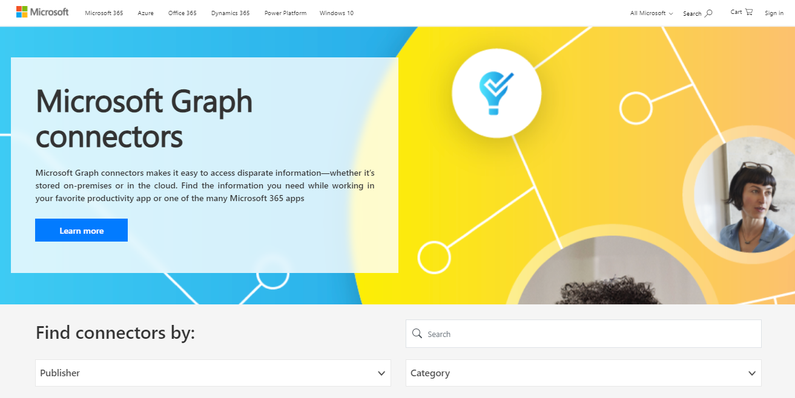

# Raccolta Graph connettori microsoft

La [raccolta di Graph](http://www.microsoft.com/microsoft-search/connectors) microsoft include una breve descrizione di ognuno dei connettori creati da Microsoft e dai partner e un collegamento al sito Web di ogni partner.

Con più di 100 connettori attualmente disponibili, è possibile connettersi a Microsoft e non servizi Microsoft popolari come i servizi di Azure, Box, MediaWiki, ServiceNow, SalesForce, Servizi Google, MediaWiki e molti altri.

Visita la [raccolta di Graph microsoft](http://www.microsoft.com/microsoft-search/connectors) e trova tutte le informazioni necessarie.

 

