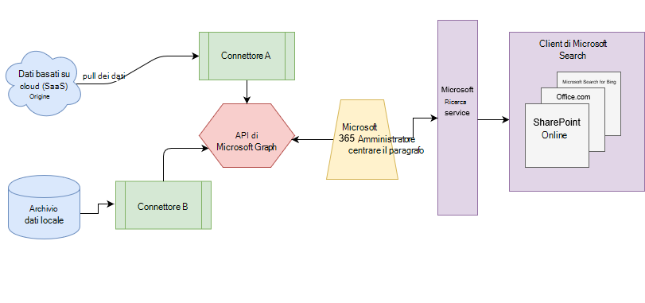

# Panoramica dei connettori di Microsoft Graph

Microsoft Search indicizza tutti i dati di [microsoft 365](https://www.microsoft.com/microsoft-365) per renderlo ricercabile per gli utenti. Con i connettori di Microsoft Graph, l'organizzazione può indicizzare i dati di terze parti in modo che vengano visualizzati nei risultati di Microsoft Search. I dati di terze parti possono essere ospitati in locale o in un cloud pubblico o privato. I connettori espandono i tipi di origini di contenuto che sono disponibili per la ricerca nelle app di produttività Microsoft 365 e nel più vasto ecosistema di Microsoft.

> [!IMPORTANT]
> **Dichiarazione** di non responsabilità: i connettori Microsoft Graph e le API di Microsoft Search (query e indice) sono attualmente in stato di anteprima disponibili per i tenant in Release mirate. Per utilizzare i connettori con Microsoft Search o per creare connettori, scegliere [rilasci mirati](https://docs.microsoft.com/office365/admin/manage/release-options-in-office-365?view=o365-worldwide). Per ulteriori informazioni sull'anteprima, vedere [programma di anteprima dei connettori](connectors-preview.md).

## Architettura

Nel diagramma architetturale seguente della piattaforma Microsoft Graph viene mostrato come il contenuto del connettore scorre nell'indicizzazione del contenuto ai risultati degli utenti nei client di [ricerca di Microsoft](https://docs.microsoft.com/microsoftsearch/overview-microsoft-search) . In questo articolo vengono illustrati i principali blocchi predefiniti del processo di flusso di dati dei connettori di Microsoft Graph.

L'API crea un'istanza di una connessione per origine dati. Quindi l'API indicizza e archivia i dati. Le connessioni stabilite interagiscono con Microsoft Search, quindi gli utenti possono ottenere i risultati della ricerca.

È possibile configurare tutti i connettori Microsoft incorporati nell'interfaccia di [Amministrazione](https://admin.microsoft.com)di Microsoft 365. L'interfaccia di amministrazione semplifica la configurazione del connettore con un semplice utente.

Per creare una **connessione** a un'origine dati, gli amministratori devono disporre dell'accesso autenticato ai dati e all'intero archivio di contenuto. I dati vengono inviati al servizio del connettore grafico per l'indicizzazione.

## Connettori disponibili

Attualmente sono presenti 6 connettori Microsoft-built e più di 100 connettori sono disponibili dai partner ecosistemici.

Per visualizzare in anteprima i connettori provenienti da uno dei partner ecosistemici, contattarli direttamente. Per ulteriori informazioni, vedere la [raccolta di connettori di Microsoft Graph](connectors-gallery.md).

È inoltre possibile [creare un connettore personalizzato](https://docs.microsoft.com/graph/search-concept-overview).

### Connettori Microsoft

La versione di anteprima dei connettori Microsoft Graph include 6 connettori basati su Microsoft. È possibile configurarli nell'interfaccia di [Amministrazione](https://admin.microsoft.com) e informazioni su come [configurare il connettore basato su Microsoft](configure-connector.md).

Nelle sezioni seguenti vengono fornite descrizioni brevi per questi connettori Microsoft-built. È possibile ottenere ulteriori informazioni negli articoli collegati per ogni connettore.

- **[Gen2 di archiviazione di Azure Data Lake](https://docs.microsoft.com/azure/storage/blobs/data-lake-storage-introduction)**. Con questo connettore di Microsoft Graph, gli utenti dell'organizzazione possono cercare file e contenuti archiviati nei contenitori BLOB di Azure. Il connettore di archiviazione di Gen2 di Azure Data Lake indicizza inoltre le cartelle abilitate alla gerarchia in Azure Data Lake storage Gen2 accounts specificati.
Per ulteriori informazioni, vedere il [connettore Gen2 di Azure Data Lake storage](azure-data-lake-connector.md).

- **[DevOps di Azure](https://azure.microsoft.com/services/devops)**. Con questo connettore di Microsoft Graph, gli utenti dell'organizzazione possono cercare elementi di lavoro dall'istanza di DevOps di Azure.
Per ulteriori informazioni, vedere il [connettore di DevOps di Azure](azure-devops-connector.md).

- **[SQL di Azure](https://azure.microsoft.com/services/sql-database)**. Con questo connettore di Microsoft Graph, gli utenti dell'organizzazione possono cercare i dati dal database SQL di Azure.
Per ulteriori informazioni, vedere il [connettore SQL di Azure](MSSQL-connector.md).

- **Siti Web aziendali**. Con questo connettore di Microsoft Graph, gli utenti dell'organizzazione possono eseguire ricerche nelle pagine di qualsiasi sito Web aziendale non di SharePoint.
Per ulteriori informazioni, vedere [connettore dei siti Web dell'organizzazione](enterprise-web-connector.md).

- **[MediaWiki](https://www.mediawiki.org/wiki/MediaWiki)**. Con questo connettore Microsoft Graph, gli utenti possono cercare articoli della Knowledge base sui siti wiki creati dall'organizzazione con MediaWiki.
Per ulteriori informazioni, vedere il [connettore MediaWiki](mediawiki-connector.md).

- **[Microsoft SQL Server](https://www.microsoft.com/sql-server/sql-server-2017)**. Con questo connettore di Microsoft Graph, gli utenti dell'organizzazione possono cercare i dati nei database di SQL Server locali.
Per ulteriori informazioni, vedere [connettore Microsoft SQL Server](MSSQL-connector.md).

- **[ServiceNow](https://www.servicenow.com)**. Con questo connettore di Microsoft Graph, gli utenti dell'organizzazione possono cercare articoli della Knowledge base dall'istanza di ServiceNow.
Per ulteriori informazioni, vedere il [connettore ServiceNow](servicenow-connector.md).

### Connettori dei partner

Sono disponibili più di 100 connettori per l'anteprima dei partner ecosistemici. Per visualizzare in anteprima i connettori provenienti da uno dei partner ecosistemici, contattarli direttamente.
Per ulteriori informazioni sui connettori dei partner della [raccolta Microsoft Graph Connectors](connectors-gallery.md).

### Creare il proprio connettore

Per indicizzare i tipi di dati personalizzati o i file, gli sviluppatori possono creare connettori in [Microsoft Graph](https://developer.microsoft.com/graph/). Un connettore è un'applicazione che [Crea una connessione](https://docs.microsoft.com/graph/search-index-manage-connections) e inserisce gli elementi nell'indice di ricerca di Microsoft. Per ulteriori informazioni, vedere l'articolo [introduttivo per estendere l'esperienza di ricerca di Microsoft per le app in Microsoft Graph](https://docs.microsoft.com/graph/search-concept-overview).

### Risultati della ricerca con il connettore personalizzato

Dopo l'indicizzazione dei dati personalizzati, gli sviluppatori possono [eseguire query su tali dati](https://docs.microsoft.com/graph/search-concept-custom-types). È possibile visualizzare i dati in qualsiasi applicazione. Per ulteriori informazioni, vedere l'articolo [introduttivo per estendere l'esperienza di ricerca di Microsoft per le app in Microsoft Graph](https://docs.microsoft.com/graph/search-concept-overview).

## Requisiti di licenza

Per gli utenti dell'organizzazione è necessaria una licenza valida di Microsoft 365 o Office 365 e una quota sufficiente dei connettori del grafico per visualizzare i dati dei connettori nei risultati della ricerca.

Per ulteriori informazioni, vedere [requisiti di licenza e prezzi](licensing.md).