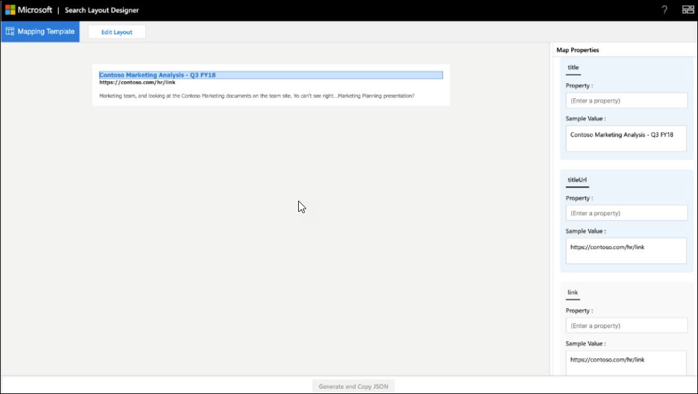

<!-- markdownlint-disable no-hard-tabs -->
# <a name="create-a-layout-to-customize-search-results"></a>Creare un layout per personalizzare i risultati della ricerca

Puoi progettare il layout dei risultati per un verticale personalizzato usando lo strumento di progettazione del layout di ricerca. Puoi iniziare a progettare il layout scegliendo i modelli disponibili nello strumento di progettazione del layout e usandoli se si adattano alle tue esigenze. Oppure puoi scegliere di modificare questi modelli in vari modi per soddisfare le tue esigenze. Ad esempio, aggiungere/rimuovere immagini, aggiungere/rimuovere testo e modificare il testo. Se nessuno dei modelli soddisfa i requisiti, puoi scegliere di iniziare a progettare il layout usando un modello vuoto.  

Una volta pronto il layout, usa il linguaggio [Adaptive Cards Template](/adaptive-cards/templating/language) per creare un JSON per il layout dei risultati usato per definire un tipo di risultato. Puoi mappare le proprietà dei risultati al layout usando il passaggio Mapping nella finestra di progettazione del layout.  

## <a name="create-a-layout-on-your-own"></a>Creare un layout personalizzato

La creazione di un layout personalizzato richiede la conoscenza delle schede [adattive](/adaptive-cards/authoring-cards/getting-started) e del relativo [schema.](https://adaptivecards.io/explorer/) Il layout dei risultati della ricerca usa un sottoinsieme degli elementi offerti dalle schede adattive ed è possibile usare lo strumento di progettazione del layout per informazioni sul set di elementi supportato.  

Durante la creazione di un layout personalizzato, crea il layout della scheda adattiva usando i dati del connettore e quindi finalizza il layout.
Esistono due passaggi principali per creare un layout personalizzato:

- Progettare il layout.
- Separare i dati dal modello.

### <a name="design-the-layout"></a>Progettare il layout

In questo esempio viene visualizzato un layout con un'intestazione, un collegamento e un testo descrittivo.


Ed ecco il file JSON associato al layout:

```json
{
    "type": "AdaptiveCard",
    "version": "1.0",
     "body": [
{

            "type": "ColumnSet",
             "columns": [
                 {
                     "type": "Column",
                     "width": 8,
                     "items": [
                         {
                             "type": "TextBlock",
                             "text": "Contoso Marketing Analysis - Q3 FY18",
                             "color": "Accent",
                             "size": "Medium",
                             "spacing": "None",
                             "$when": "{title != \"\"}",
                             "weight": "Bolder"
                        },
                        {
                        "type": "TextBlock",  
                        "text": "https://contoso.com/hr/link",
                        "spacing": "None",  
                        "color": "Dark",
                        "weight": "Bolder"

                        },

                        {  
                        "type": "TextBlock",
                        "text": "Marketing team at Contoso.., and looking at the Contoso Marketing documents on the team site. This contains the data from FY20 and will taken over to FY21...Marketing Planning is ongoing for FY20..",  
                        "wrap": true,
                        "maxLines": 2,
                        "spacing": "Medium"
                        }
                        ],

                    "horizontalAlignment": "Center",
                    "spacing": "None"

                }

            ]

        }
        ],

    "$schema": "http://adaptivecards.io/schemas/adaptive-card.json"
}
```

### <a name="separate-the-data-from-the-layout"></a>Separare i dati dal layout

Puoi separare i dati dal layout e associare i dati.

Ecco LAYOUT JSON dopo il binding dei dati:

```json
{

    "type": "AdaptiveCard",
    "version": "1.0",
    "body": [
    {
    "type": "ColumnSet",
"columns": [

                {
                "type": "Column",
                "width": 8,
                "items": [
                {
                "type": "TextBlock",
                "text": "[{title}]({titleUrl})",
                "color": "Accent",
                "size": "Medium",
                "spacing": "None",
                "weight": "Bolder"

                 },
                 {
                 "type": "TextBlock",
                 "text": "{link}",
                 "spacing": "None",
                 "color": "Dark",
                 "weight": "Bolder"
                 },
                 {
                 "type": "TextBlock",
                 "text": "{description}",
                 "wrap": true,
                 "maxLines": 2,
                 "spacing": "Medium"
                 }
                 ],
                 "horizontalAlignment": "Center",
                 "spacing": "None"
                 }
                 ]

        }

    ],

    "$schema": "http://adaptivecards.io/schemas/adaptive-card.json"
}
```

Dati di esempio: specificare dati di esempio **nell'Editor** dati di esempio per visualizzare la scheda associata a dati in **modalità anteprima.**

```json
{

    "title": "Contoso Marketing Analysis - Q3 FY18",
    "titleUrl": "https://contoso.com/hr/link",
    "link": "https://contoso.com/hr/link",
    "description": "Marketing team, and looking at the Contoso Marketing documents on the team site. Yo can't see right...Marketing Planning presentation?"

}
```

## <a name="map-the-layout-to-the-result-properties"></a>Mappare il layout alle proprietà dei risultati

È necessario eseguire il mapping di ogni campo del layout a una proprietà dei risultati o a una proprietà del connettore per generare il formato JSON del layout dei risultati.



Selezionare un campo nel layout per evidenziare le variabili da mappare. È possibile utilizzare più variabili per un singolo campo e tutti i campi devono essere mappati alle proprietà dei risultati.

### <a name="show-snippet-on-search-result"></a>Mostra frammento di codice nel risultato della ricerca  

I frammenti di codice dinamici generati **sulla proprietà del** contenuto del risultato del connettore possono essere visualizzati nel risultato della ricerca. **ResultSnippet** è la proprietà di sistema che funge da proprietà segnaposto per i frammenti di codice generati per ogni risultato del connettore. Per visualizzare i frammenti di codice nel layout dei risultati, la proprietà di sistema **ResultSnippet** deve essere mappata a un campo appropriato, ad esempio Description, nel layout dei risultati della ricerca. I frammenti di codice generati su ogni risultato evidenziano anche le corrispondenze nel frammento di codice con il termine di query immesso dall'utente.

## <a name="things-to-consider"></a>Osservazioni

Prima di iniziare, è consigliabile eseguire alcune operazioni e alcune operazioni da evitare per garantire la corretta esecuzione dei layout.

### <a name="do"></a>Operazione da eseguire

- Modificare un modello per fornire il collegamento al logo nel layout se si usano collegamenti statici per i logo e non le proprietà dei risultati.
- Convalidare il layout dei risultati per gli scenari in cui non vengono restituiti dati per una proprietà dei risultati usata nel risultato JSON. Utilizzare la `$when` condizione per nascondere un elemento se la proprietà non contiene dati.  
- Verificare che i tipi di dati della `$when` condizione e della proprietà del risultato corrispondano. Ad esempio, non confrontare `Number` con `Text` nella `$when` condizione.  
- Quando progetti un layout dei risultati, pensa ai requisiti del tema.  
- Assicurati che `Textblock`   l'elemento sia in grado di gestire il contenuto dinamico. A tale scopo, `wrap` è possibile utilizzare le proprietà `maxLines` dell'elemento e .
- Formattare correttamente la data quando viene utilizzato `{DATE()}` in Markdown.  

### <a name="dont"></a>Non

- Non definire tipi di dati non validi quando si associano valori. Per ulteriori informazioni sui tipi di dati, vedere [Manage the Search schema](/sharepoint/search/manage-the-search-schema).
- Evitare di ritagliare il risultato nella pagina dei risultati seguendo l'altezza massima del formato JSON del layout dei risultati. Se si supera l'altezza massima del layout dei risultati, il risultato verrà ritagliato nella pagina dei risultati.
- Non usare valori `px` nelle proprietà degli elementi.
- Non utilizzare markdown con la **proprietà ResultSnippet** nel layout dei risultati per evidenziare la corrispondenza della query nel risultato della ricerca.

## <a name="resources"></a>Risorse

[Personalizzare la pagina dei risultati della ricerca](customize-search-page.md)

[Schede adattive](/adaptive-cards/authoring-cards/getting-started)

[Linguaggio del modello di schede adattive](/adaptive-cards/templating/language)

[Schema scheda adattiva](https://adaptivecards.io/explorer/)