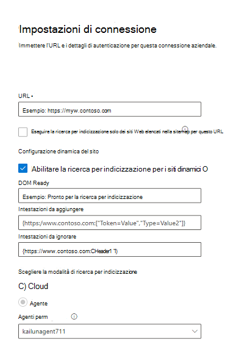

<!---Previous ms.author: monaray --->

<!-- markdownlint-disable no-inline-html -->

# Enterprise siti Web Graph connettoreEnterprise websites Graph connector

Il Enterprise web Graph consente all'organizzazione di indicizzare articoli e contenuti dai relativi siti Web **interni.**The Enterprise websites Graph connector allows your organization to index articles and **content from its internal-facing websites**. Dopo aver configurato il connettore e sincronizzato il contenuto dal sito Web, gli utenti finali possono cercare tale contenuto da qualsiasi client Microsoft Search client.After you configure the connector and sync content from the website, end users can search for that content from any Microsoft Search client.

> [!NOTE]
> Leggere [**l'articolo Setup your Graph connector**](configure-connector.md) to understand the general Graph connectors setup instructions.Read the [**Setup your Graph connector**](configure-connector.md) article to understand the general Graph connectors setup instructions.

Questo articolo è per chiunque configura, esegue e monitora un connettore Enterprise siti Web.This article is for anyone who configures, runs, and monitors an Enterprise websites connector. Integra il processo di installazione generale e mostra le istruzioni che si applicano solo al connettore Enterprise siti Web.It supplements the general setup process, and shows instructions that apply only for the Enterprise websites connector. In questo articolo sono inoltre incluse informazioni sulla risoluzione [dei problemi](#troubleshooting).This article also includes information about [Troubleshooting](#troubleshooting).

<!---## Before you get started-->

<!---Insert "Before you get started" recommendations for this data source-->

## Passaggio 1: Aggiungere un connettore Graph nella interfaccia di amministrazione di Microsoft 365Step 1: Add a Graph connector in the Microsoft 365 admin center

Seguire le istruzioni generali [per l'installazione](./configure-connector.md).Follow the general [setup instructions](./configure-connector.md).
<!---If the above phrase does not apply, delete it and insert specific details for your data source that are different from general setup instructions.-->

## Passaggio 2: assegnare un nome alla connessioneStep 2: Name the connection

Seguire le istruzioni generali [per l'installazione](./configure-connector.md).Follow the general [setup instructions](./configure-connector.md).
<!---If the above phrase does not apply, delete it and insert specific details for your data source that are different from general setup instructions.-->

## Passaggio 3: Configurare le impostazioni di connessioneStep 3: Configure the connection settings

Per connettersi all'origine dati, compilare l'URL radice del sito Web, selezionare un'origine di ricerca per indicizzazione e il tipo di autenticazione che si desidera utilizzare: Nessuna, Autenticazione di base o OAuth 2.0 con [Azure Active Directory (Azure AD)](/azure/active-directory/).To connect to your data source, fill in the root URL of the website, select a crawl source, and the type of authentication you'd like to use: None, Basic Authentication, or OAuth 2.0 with [Azure Active Directory (Azure AD)](/azure/active-directory/). Dopo aver completato queste informazioni, selezionare Test Connection per verificare le impostazioni.After you complete this information, select Test Connection to verify your settings.

### URLURL

Utilizzare il campo URL per specificare la radice del sito Web di cui si desidera eseguire la ricerca per indicizzazione.Use the URL field to specify the root of the website that you'd like to crawl. Il connettore di siti Web aziendali utilizzerà questo URL come punto di partenza e seguirà tutti i collegamenti di questo URL per la ricerca per indicizzazione.The enterprise websites connector will use this URL as the starting point and follow all the links from this URL for its crawl.

### Eseguire la ricerca per indicizzazione dei siti Web elencati nella sitemapCrawl websites listed in the sitemap

Se selezionato, il connettore eseguirà la ricerca per indicizzazione solo degli URL elencati nella sitemap.When selected the connector will only crawl the URLs listed in the sitemap. Se non è selezionata o non viene trovata alcuna mappa del sito, il connettore eseguirà una ricerca per indicizzazione completa di tutti i collegamenti trovati nell'URL radice del sito.If not selected or no site map is found, the connector will do a deep crawl of all the links found on the root URL of the site.

### Configurazione dinamica del sitoDynamic site configuration

Se il sito Web contiene contenuto dinamico, ad esempio pagine Web presenti in sistemi di gestione del contenuto come Confluence o Unily, è possibile abilitare un crawler dinamico.If your website contains dynamic content, for example, webpages that live in content management systems like Confluence or Unily, you can enable a dynamic crawler. Per attivarla, selezionare Abilita ricerca **per indicizzazione per siti dinamici.**To turn it on, select **Enable crawl for dynamic sites**. Il crawler attenderà il rendering del contenuto dinamico prima di iniziare la ricerca per indicizzazione.The crawler will wait for dynamic content to render before it begins crawling.

> [!div class="mx-imgBorder"]
> 

Oltre alla casella di controllo, sono disponibili tre campi facoltativi:In addition to the check box, there are three optional fields available:

1. **DOM Ready**: immettere l'elemento DOM che il crawler deve usare come segnale che il contenuto è completamente sottoposto a rendering e che la ricerca per indicizzazione deve iniziare.**DOM Ready**: Enter the DOM element the crawler should use as the signal that the content is fully rendered and the crawl should begin.
1. **Intestazioni da aggiungere**: specificare le intestazioni HTTP che il crawler deve includere quando si invia l'URL Web specifico.**Headers to Add**: Specify which HTTP headers the crawler should include when sending that specific web URL. È possibile impostare più intestazioni per siti Web diversi.You can set multiple headers for different websites. Ti consigliamo di includere i valori del token di autenticazione.We suggest including auth token values.
1. **Intestazioni da ignorare:** specificare eventuali intestazioni non necessarie che devono essere escluse dalle richieste di ricerca per indicizzazione dinamiche.**Headers to Skip**: Specify any unnecessary headers that should be excluded from dynamic crawling requests.

> [!NOTE]
> La ricerca per indicizzazione dinamica è supportata solo per la modalità di ricerca per indicizzazione agente.Dynamic crawling is only supported for Agent crawl mode.

### Modalità ricerca per indicizzazione: cloud o localeCrawl mode: Cloud or On-premises

La modalità di ricerca per indicizzazione determina il tipo di siti Web che si desidera indicizzare, sia cloud che locale.The crawl mode determines the type of websites you want to index, either cloud or on-premises. Per i siti Web cloud, selezionare **Cloud** come modalità di ricerca per indicizzazione.For your cloud websites, select **Cloud** as the crawl mode.

Inoltre, il connettore ora supporta la ricerca per indicizzazione di siti Web locali.Also, the connector now supports crawling of on-premises websites. Per accedere ai dati locali, è innanzitutto necessario installare e configurare l'agente Graph connettore.To access your on-premises data, you must first install and configure the Graph connector agent. Per ulteriori informazioni, vedere [Graph connector agent](./on-prem-agent.md).To learn more, see [Graph connector agent](./on-prem-agent.md).

Per i siti Web locali, selezionare Agente come  modalità di ricerca per indicizzazione e nel campo Agente locale scegliere l'agente connettore di Graph installato e configurato in precedenza. For your on-premises websites, select **Agent** as the crawl mode and in the **On-prem Agent** field, choose the Graph connector agent that you installed and configured earlier.  

### AutenticazioneAuthentication

L'autenticazione di base richiede un nome utente e una password.Basic Authentication requires a username and password. Crea questo account bot usando il interfaccia di amministrazione di Microsoft 365 [.](https://admin.microsoft.com)Create this bot account by using the [Microsoft 365 admin center](https://admin.microsoft.com).

OAuth 2.0 con [Azure AD](/azure/active-directory/) richiede un ID risorsa, un ID client e un segreto client.OAuth 2.0 with [Azure AD](/azure/active-directory/) requires a resource ID, Client ID, and Client Secret. OAuth 2.0 funziona solo con la modalità Cloud.OAuth 2.0 only works with Cloud mode.

Per ulteriori informazioni, vedere [Authorize access to Azure Active Directory web applications using OAuth 2.0 code grant flow](/azure/active-directory/develop/v1-protocols-oauth-code).For more information, see [Authorize access to Azure Active Directory web applications using OAuth 2.0 code grant flow](/azure/active-directory/develop/v1-protocols-oauth-code). Eseguire la registrazione con i valori seguenti:Register with the following values:

**Nome:** Microsoft Search**Name:** Microsoft Search  
**Redirect_URI:**`https://gcs.office.com/v1.0/admin/oauth/callback`**Redirect_URI:** `https://gcs.office.com/v1.0/admin/oauth/callback`

Per ottenere i valori per la risorsa, client_id e client_secret, passare a Usare il codice di autorizzazione per richiedere un **token** di accesso nella pagina Web dell'URL di reindirizzamento.To get the values for the resource, client_id, and client_secret, go to **Use the authorization code to request an access token** on the redirect URL webpage.

Per ulteriori informazioni, vedere [Guida introduttiva: Registrare un'applicazione con il Microsoft Identity Platform](/azure/active-directory/develop/quickstart-register-app).For even more information, see [Quickstart: Register an application with the Microsoft identity platform](/azure/active-directory/develop/quickstart-register-app).

## Passaggio 3a: Aggiungere URL da escludere (Restrizioni facoltative per la ricerca per indicizzazione)Step 3a: Add URLs to exclude (Optional crawl restrictions)

Esistono due modi per impedire la ricerca per indicizzazione delle pagine: non consentire le pagine nel file robots.txt o aggiungerle all'elenco di esclusione.There are two ways to prevent pages from being crawled: disallow them in your robots.txt file or add them to the Exclusion list.

### Supporto per robots.txtSupport for robots.txt

Il connettore verifica se esiste un file robots.txt per il sito radice e, se ne esiste uno, seguirà e rispetterà le indicazioni stradali trovate all'interno di tale file.The connector checks to see if there is a robots.txt file for your root site and, if one exists, it will follow and respect the directions found within that file. Se non si desidera che il connettore esegua la ricerca per indicizzazione di determinate pagine o directory nel sito, è possibile chiamare tali pagine o directory nelle dichiarazioni "Non consentire" nel file robots.txt.If you do not want the connector to crawl certain pages or directories on your site, you can call out those pages or directories in the "Disallow" declarations in your robots.txt file.

### Aggiungere URL da escludereAdd URLs to exclude

Facoltativamente, è possibile creare **un** elenco di esclusione per escludere alcuni URL dalla ricerca per indicizzazione se tale contenuto è sensibile o non vale la pena eseguire la ricerca per indicizzazione.You can optionally create an **Exclusion list** to exclude some URLs from getting crawled if that content is sensitive or not worth crawling. Per creare un elenco di esclusione, sfogliare l'URL radice.To create an exclusion list, browse through the root URL. Puoi aggiungere gli URL esclusi all'elenco durante il processo di configurazione.You can add the excluded URLs to the list during the configuration process.

## Passaggio 4: Assegnare etichette di proprietàStep 4: Assign property labels

È possibile assegnare una proprietà di origine a ogni etichetta scegliendo da un menu di opzioni.You can assign a source property to each label by choosing from a menu of options. Anche se questo passaggio non è obbligatorio, la presenza di alcune etichette di proprietà migliorerà la pertinenza della ricerca e garantirà risultati di ricerca più accurati per gli utenti finali.While this step isn't mandatory, having some property labels will improve the search relevance and ensure more accurate search results for end users.

## Passaggio 5: Gestire lo schemaStep 5: Manage schema

Nella schermata **Gestisci schema** è possibile modificare gli attributi dello schema (le opzioni sono **Query,** **Cerca,** **Recupera** e Affina **)** associati alle proprietà, aggiungere alias facoltativi e scegliere la **proprietà Content.**On the **Manage Schema** screen, you can change the schema attributes (the options are **Query**, **Search**, **Retrieve**, and **Refine**) associated with the properties, add optional aliases, and choose the **Content** property.

## Passaggio 6: Gestire le autorizzazioni di ricercaStep 6: Manage search permissions

Il connettore Enterprise web web supporta solo le autorizzazioni di ricerca visibili a **Tutti**.The Enterprise websites connector only supports search permissions visible to **Everyone**. I dati indicizzati vengono visualizzati nei risultati della ricerca ed è visibile a tutti gli utenti dell'organizzazione.Indexed data appears in the search results and is visible to all users in the organization.

## Passaggio 7: Impostare la pianificazione dell'aggiornamentoStep 7: Set the refresh schedule

Il connettore Enterprise web web supporta solo un aggiornamento completo.The Enterprise websites connector only supports a full refresh. Ciò significa che il connettore esererà una ricerca per indicizzazione di tutto il contenuto del sito Web durante ogni aggiornamento.This means that the connector will recrawl all the website's content during every refresh. Per assicurarsi che il connettore sia in grado di eseguire la ricerca per indicizzazione del contenuto, è consigliabile impostare un intervallo di pianificazione dell'aggiornamento di grandi dimensioni.To make sure the connector gets enough time to crawl the content, we recommend that you set a large refresh schedule interval. È consigliabile un aggiornamento pianificato tra una e due settimane.We recommend a scheduled refresh between one and two weeks.

## Passaggio 8: verificare la connessioneStep 8: Review connection

Seguire le istruzioni generali [per l'installazione](./configure-connector.md).Follow the general [setup instructions](./configure-connector.md).
<!---If the above phrase does not apply, delete it and insert specific details for your data source that are different from general setup instructions.-->

## Risoluzione dei problemiTroubleshooting

Durante la lettura del contenuto del sito Web, la ricerca per indicizzazione potrebbe riscontrare alcuni errori di origine, rappresentati dai codici di errore dettagliati riportati di seguito.When reading the website's content, the crawl may encounter some source errors, which are represented by the detailed error codes below. Per ulteriori informazioni sui tipi di errori, passare alla pagina **dei dettagli dell'errore** dopo aver selezionato la connessione.To get more information on the types of errors, go to the **error details** page after selecting the connection. Selezionare il **codice di errore** per visualizzare errori più dettagliati.Select the **error code** to see more detailed errors. Per ulteriori [informazioni, vedere Gestire](./manage-connector.md) il connettore.Also refer to [Manage your connector](./manage-connector.md) to learn more.

 Codice di errore dettagliatoDetailed Error code | Messaggio di erroreError message
 --- | ---
 60016001 | Il sito che si sta provando a indicizzare non è raggiungibileThe site that is being tried to index is not reachable
 60056005 | La pagina di origine che si sta provando a indicizzare è stata bloccata in base robots.txt configurazione.The source page that is being tried to index has been blocked by as per robots.txt configuration.
 60086008 | Impossibile risolvere il DNSUnable to resolve the DNS
 60096009 | Per tutti gli errori sul lato client (ad eccezione di HTTP 404, 408), fare riferimento ai codici di errore HTTP 4xx per informazioni dettagliate.For all client-side errors (Except HTTP 404, 408), refer to HTTP 4xx error codes for details.
 60136013 | Impossibile trovare la pagina di origine che si sta provando a indicizzare.The source page that is being tried to index could not be found. (Errore HTTP 404)(HTTP 404 error)
 60186018 | La pagina di origine non risponde e la richiesta è scaduta. (Errore HTTP 408)The source page is not responding, and the request has timed out. (HTTP 408 error)
 60216021 | La pagina di origine che si sta provando a indicizzare non include contenuto testuale nella pagina.The source page that is being tried to index has no textual content on the page.
 60236023 | La pagina di origine che si sta provando a indicizzare non è supportata (non una pagina HTML)The source page that is being tried to index is unsupported (not an HTML page)
 60246024 | La pagina di origine che si sta provando a indicizzare contiene contenuto non supportato.The source page that is being tried to index has unsupported content.

* Gli errori 6001-6013 si verificano quando l'origine dati non è raggiungibile a causa di un problema di rete o quando l'origine dati stessa viene eliminata, spostata o rinominata.Errors 6001-6013 occur when the data source is not reachable due to a network issue or when the data source itself is deleted, moved, or renamed. Verificare se i dettagli dell'origine dati forniti sono ancora validi.Check if the data source details provided are still valid.
* Gli errori 6021-6024 si verificano quando l'origine dati contiene contenuto non testuale nella pagina o quando la pagina non è html.Errors 6021-6024 occur when the data source contains non-textual content on the page or when the page is not an HTML. Controllare l'origine dati e aggiungere questa pagina nell'elenco di esclusione o ignorare l'errore.Check the data source and add this page in exclusion list or ignore the error.
