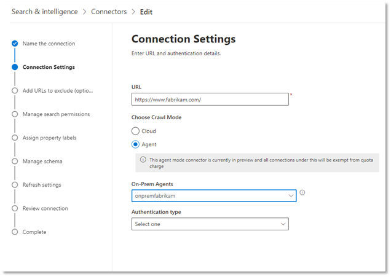

<!---Previous ms.author: monaray --->

<!-- markdownlint-disable no-inline-html -->

# Connettore Grafico siti Web aziendaliEnterprise websites Graph connector

Il connettore Grafico dei siti Web aziendali consente all'organizzazione di indicizzare articoli e contenuti dei siti Web **interni.**The Enterprise websites Graph connector allows your organization to index articles and **content from its internal-facing websites**. Dopo aver configurato il connettore e sincronizzato il contenuto dal sito Web, gli utenti finali possono cercare tale contenuto da qualsiasi client Microsoft Search.After you configure the connector and sync content from the website, end users can search for that content from any Microsoft Search client.

> [!NOTE]
> Leggere [**l'articolo configurazione del connettore Graph**](configure-connector.md) per comprendere il processo generale di configurazione dei connettori di Graph.Read the [**Setup your Graph connector**](configure-connector.md) article to understand the general Graph connectors setup process.

Questo articolo è per tutti gli utenti che configurano, eseere e monitorano un connettore di siti Web aziendali.This article is for anyone who configures, runs, and monitors an Enterprise websites connector. Integra il processo di configurazione generale e mostra le istruzioni che si applicano solo al connettore di siti Web Enterprise.It supplements the general setup process, and shows instructions that apply only for the Enterprise websites connector. In questo articolo sono inoltre incluse informazioni sulla [risoluzione dei](#troubleshooting) problemi e [sulle limitazioni.](#limitations)This article also includes information about [Troubleshooting](#troubleshooting) and [Limitations](#limitations).

<!---## Before you get started-->

<!---Insert "Before you get started" recommendations for this data source-->

## Passaggio 1: Aggiungere un connettore Graph nell'interfaccia di amministrazione di Microsoft 365Step 1: Add a Graph connector in the Microsoft 365 admin center

Seguire le istruzioni [generali per l'installazione.](https://docs.microsoft.com/microsoftsearch/configure-connector)Follow the general [setup instructions](https://docs.microsoft.com/microsoftsearch/configure-connector).
<!---If the above phrase does not apply, delete it and insert specific details for your data source that are different from general setup instructions.-->

## Passaggio 2: assegnare un nome alla connessioneStep 2: Name the connection

Seguire le istruzioni [generali per l'installazione.](https://docs.microsoft.com/microsoftsearch/configure-connector)Follow the general [setup instructions](https://docs.microsoft.com/microsoftsearch/configure-connector).
<!---If the above phrase does not apply, delete it and insert specific details for your data source that are different from general setup instructions.-->

## Passaggio 3: Configurare le impostazioni di connessioneStep 3: Configure the connection settings

Per connettersi all'origine dati, è necessario immettere l'URL radice del sito Web, selezionare un'origine di ricerca per indicizzazione e il tipo di autenticazione che si desidera utilizzare: Nessuna, Autenticazione di base o OAuth 2.0 con [Azure Active Directory (Azure AD).](https://docs.microsoft.com/azure/active-directory/)To connect to your data source, you need to fill in the root URL of the website, select a crawl source, and the type of authentication you'd like to use: None, Basic Authentication, or OAuth 2.0 with [Azure Active Directory (Azure AD)](https://docs.microsoft.com/azure/active-directory/). Dopo aver completato queste informazioni, selezionare Test connessione per verificare le impostazioni.After you complete this information, select Test Connection to verify your settings.

> [!NOTE]
> Se nel sito di cui si desidera eseguire la ricerca per indicizzazione è definita una mappa del sito, il connettore eseguirà la ricerca per indicizzazione solo degli URL elencati nella sitemap.If the site you want to crawl has a sitemap defined, the connector will only crawl the URLs listed in the sitemap. Se non è definita alcuna mappa del sito, il connettore eseguirà una ricerca per indicizzazione approfondita di tutti i collegamenti trovati nell'URL radice del sito.If no sitemap is defined, the connector will do a deep crawl of all the links found on the root URL of the site.

### URLURL

Utilizzare il campo URL per specificare la radice del sito Web di cui si desidera eseguire la ricerca per indicizzazione.Use the URL field to specify the root of the website that you'd like to crawl. Il connettore di siti Web aziendali utilizzerà questo URL come punto di partenza e seguirà tutti i collegamenti da questo URL per la ricerca per indicizzazione.The enterprise websites connector will use this URL as the starting point and follow all the links from this URL for its crawl.

### Modalità ricerca per indicizzazione: cloud o locale (anteprima)Crawl mode: Cloud or On-premises (Preview)

La modalità di ricerca per indicizzazione determina il tipo di siti Web che si desidera indicizzare, nel cloud o in locale.The crawl mode determines the type of websites you want to index, either cloud or on-premises. Per i siti Web cloud, selezionare **Cloud** come modalità di ricerca per indicizzazione.For your cloud websites, select **Cloud** as the crawl mode.

Inoltre, il connettore ora supporta la ricerca per indicizzazione dei siti Web locali.Also, the connector now supports crawling of on-premises websites. Questa modalità è in anteprima.This mode is in preview. Per accedere ai dati locali, è necessario innanzitutto installare e configurare l'agente connettore Graph.To access your on-premises data, you must first install and configure the Graph connector agent. Per ulteriori informazioni, vedere Agente [connettore Graph.](https://docs.microsoft.com/microsoftsearch/on-prem-agent)To learn more, see [Graph connector agent](https://docs.microsoft.com/microsoftsearch/on-prem-agent).

Per i siti Web locali, selezionare Agente come  modalità di ricerca per indicizzazione e nel campo Agente locale scegliere l'agente connettore Graph installato e configurato in precedenza. For your on-premises websites, select **Agent** as the crawl mode and in the **On-Prem Agent** field, choose the Graph connector agent that you installed and configured earlier.  

> [!div class="mx-imgBorder"]
> 

### AutenticazioneAuthentication

L'autenticazione di base richiede un nome utente e una password.Basic Authentication requires a username and password. Creare questo account bot tramite l'interfaccia di amministrazione di [Microsoft 365.](https://admin.microsoft.com)Create this bot account by using the [Microsoft 365 admin center](https://admin.microsoft.com).

OAuth 2.0 con [Azure AD](https://docs.microsoft.com/azure/active-directory/) richiede un ID risorsa, un ID client e un segreto client.OAuth 2.0 with [Azure AD](https://docs.microsoft.com/azure/active-directory/) requires a resource ID, Client ID, and Client Secret. OAuth 2.0 funziona solo con la modalità cloud.OAuth 2.0 only works with Cloud mode.

Per ulteriori informazioni, vedere Autorizzare l'accesso alle applicazioni Web di Azure Active Directory tramite il flusso di concessione del [codice OAuth 2.0.](https://docs.microsoft.com/azure/active-directory/develop/v1-protocols-oauth-code)For more information, see [Authorize access to Azure Active Directory web applications using OAuth 2.0 code grant flow](https://docs.microsoft.com/azure/active-directory/develop/v1-protocols-oauth-code). Eseguire la registrazione con i valori seguenti:Register with the following values:

**Nome:** Microsoft Search**Name:** Microsoft Search  
**Redirect_URI:**`https://gcs.office.com/v1.0/admin/oauth/callback`**Redirect_URI:** `https://gcs.office.com/v1.0/admin/oauth/callback`

Per ottenere i valori per la risorsa, client_id e client_secret, passare a Usare il codice di autorizzazione per richiedere un **token** di accesso nella pagina Web dell'URL di reindirizzamento.To get the values for the resource, client_id, and client_secret, go to **Use the authorization code to request an access token** on the redirect URL webpage.

Per altre informazioni, vedere Guida [introduttiva: Registrare un'applicazione con la piattaforma di identità Microsoft.](https://docs.microsoft.com/azure/active-directory/develop/quickstart-register-app)For even more information, see [Quickstart: Register an application with the Microsoft identity platform](https://docs.microsoft.com/azure/active-directory/develop/quickstart-register-app).

## Passaggio 3a: Aggiungere URL da escludere (restrizioni facoltative per la ricerca per indicizzazione)Step 3a: Add URLs to exclude (Optional crawl restrictions)

Esistono due modi per impedire che le pagine vengano sottoposte a ricerca per indicizzazione: non consentire la ricerca per indicizzazione nel file robots.txt o aggiungerle all'elenco di esclusione.There are two ways to prevent pages from being crawled: disallow them in your robots.txt file or add them to the Exclusion list.

### Supporto per robots.txtSupport for robots.txt

Il connettore verifica se esiste un file robots.txt per il sito radice e, se ne esiste uno, seguirà e rispetterà le indicazioni stradali trovate all'interno di tale file.The connector checks to see if there is a robots.txt file for your root site and, if one exists, it will follow and respect the directions found within that file. Se non si desidera che il connettore esegua la ricerca per indicizzazione di determinate pagine o directory nel sito, è possibile chiamare tali pagine o directory nelle dichiarazioni "Non consentire" nel file robots.txt.If you do not want the connector to crawl certain pages or directories on your site, you can call out those pages or directories in the "Disallow" declarations in your robots.txt file.

### Aggiungere URL da escludereAdd URLs to exclude

Facoltativamente, è  possibile creare un elenco di esclusione per escludere alcuni URL dalla ricerca per indicizzazione se tale contenuto è sensibile o non vale la pena eseguire la ricerca per indicizzazione.You can optionally create an **Exclusion list** to exclude some URLs from getting crawled if that content is sensitive or not worth crawling. Per creare un elenco di esclusione, sfogliare l'URL radice.To create an exclusion list, browse through the root URL. È possibile aggiungere gli URL esclusi all'elenco durante il processo di configurazione.You can add the excluded URLs to the list during the configuration process.

## Passaggio 4: Assegnare etichette di proprietàStep 4: Assign property labels

Puoi assegnare una proprietà di origine a ogni etichetta scegliendo da un menu di opzioni.You can assign a source property to each label by choosing from a menu of options. Anche se questo passaggio non è obbligatorio, la presenza di alcune etichette di proprietà migliorerà la pertinenza della ricerca e garantirà risultati di ricerca più accurati per gli utenti finali.While this step is not mandatory, having some property labels will improve the search relevance and ensure more accurate search results for end users.

## Passaggio 5: Gestire lo schemaStep 5: Manage schema

Nella schermata Gestisci **schema** è possibile modificare gli attributi dello schema (le opzioni sono **Query,** **Ricerca,** Recupera e Affina) associati alle proprietà, aggiungere alias facoltativi e scegliere la proprietà **Content.**On the **Manage Schema** screen, you can change the schema attributes (the options are **Query**, **Search**, **Retrieve**, and **Refine**) associated with the properties, add optional aliases, and choose the **Content** property.

## Passaggio 6: Gestire le autorizzazioni di ricercaStep 6: Manage search permissions

Il connettore per i siti Web aziendali supporta solo le autorizzazioni di ricerca visibili a **Tutti.**The Enterprise websites connector only supports search permissions visible to **Everyone**. I dati indicizzati vengono visualizzati nei risultati della ricerca ed è visibile a tutti gli utenti dell'organizzazione.Indexed data appears in the search results and is visible to all users in the organization.

## Passaggio 7: Impostare la pianificazione dell'aggiornamentoStep 7: Set the refresh schedule

Il connettore di siti Web aziendali supporta solo un aggiornamento completo.The Enterprise websites connector only supports a full refresh. Ciò significa che il connettore riese mezzo la ricerca per indicizzazione di tutto il contenuto del sito Web durante ogni aggiornamento.This means that the connector will recrawl all the website's content during every refresh. Per assicurarsi che il connettore sia in grado di eseguire la ricerca per indicizzazione del contenuto, è consigliabile impostare un intervallo di pianificazione dell'aggiornamento di grandi dimensioni.To make sure the connector gets enough time to crawl the content, we recommend that you set a large refresh schedule interval. È consigliabile un aggiornamento pianificato tra una e due settimane.We recommend a scheduled refresh between one and two weeks.

## Passaggio 8: esaminare la connessioneStep 8: Review connection

Seguire le istruzioni [generali per l'installazione.](https://docs.microsoft.com/microsoftsearch/configure-connector)Follow the general [setup instructions](https://docs.microsoft.com/microsoftsearch/configure-connector).
<!---If the above phrase does not apply, delete it and insert specific details for your data source that are different from general setup instructions.-->

## Risoluzione dei problemiTroubleshooting

Durante la lettura del contenuto del sito Web, la ricerca per indicizzazione potrebbe riscontrare alcuni errori di origine, rappresentati dai codici di errore dettagliati riportati di seguito.When reading the website's content, the crawl may encounter some source errors, which are represented by the detailed error codes below. Per ulteriori informazioni sui tipi di errore, passare alla pagina **dei dettagli dell'errore** dopo aver selezionato la connessione.To get more information on the types of errors, go to the **error details** page after selecting the connection. Selezionare il **codice di errore** per visualizzare errori più dettagliati.Select the **error code** to see more detailed errors. Per ulteriori informazioni, [vedere anche Gestire](https://docs.microsoft.com/microsoftsearch/manage-connector) il connettore.Also refer to [Manage your connector](https://docs.microsoft.com/microsoftsearch/manage-connector) to learn more.

 Codice di errore dettagliatoDetailed Error code | Messaggio di erroreError message
 --- | ---
 60016001 | Il sito che si sta provando a indicizzare non è raggiungibileThe site that is being tried to index is not reachable
 60056005 | La pagina di origine che si sta provando a indicizzare è stata bloccata in base robots.txt configurazione.The source page that is being tried to index has been blocked by as per robots.txt configuration.
 60086008 | Impossibile risolvere il DNSUnable to resolve the DNS
 60096009 | Per tutti gli errori sul lato client (ad eccezione di HTTP 404, 408), fare riferimento ai codici di errore HTTP 4xx per informazioni dettagliate.For all client-side errors (Except HTTP 404, 408), refer to HTTP 4xx error codes for details.
 60136013 | Impossibile trovare la pagina di origine che si sta provando a indicizzare.The source page that is being tried to index could not be found. (Errore HTTP 404)(HTTP 404 error)
 60186018 | La pagina di origine non risponde e si è scaduto il timeout della richiesta. (Errore HTTP 408)The source page is not responding, and the request has timed out. (HTTP 408 error)
 60216021 | La pagina di origine che si sta provando a indicizzare non include contenuto testuale nella pagina.The source page that is being tried to index has no textual content on the page.
 60236023 | La pagina di origine che si sta provando a indicizzare non è supportata (non una pagina HTML)The source page that is being tried to index is unsupported (not an HTML page)
 60246024 | La pagina di origine che si sta provando a indicizzare contiene contenuto non supportato.The source page that is being tried to index has unsupported content.

* Gli errori 6001-6013 si verificano quando l'origine dati non è raggiungibile a causa di un problema di rete o quando l'origine dati stessa viene eliminata, spostata o rinominata.Errors 6001-6013 occur when the data source is not reachable due to a network issue or when the data source itself is deleted, moved, or renamed. Verificare se i dettagli dell'origine dati forniti sono ancora validi.Check if the data source details provided are still valid.
* Gli errori 6021-6024 si verificano quando l'origine dati contiene contenuto non testuale nella pagina o quando la pagina non è un codice HTML.Errors 6021-6024 occur when the data source contains non-textual content on the page or when the page is not an HTML. Controllare l'origine dati e aggiungere questa pagina nell'elenco di esclusione o ignorare l'errore.Check the data source and add this page in exclusion list or ignore the error.

## LimitazioniLimitations

Il connettore per i siti Web aziendali non supporta la ricerca di dati nelle **pagine Web dinamiche.**The Enterprise websites connector doesn't support searching data on **dynamic webpages**. Esempi di queste pagine Web sono disponibili in sistemi di gestione dei contenuti, ad esempio [Confluence](https://www.atlassian.com/software/confluence) e [Unily](https://www.unily.com/) o database in cui è presente il contenuto del sito Web.Examples of those webpages live in content management systems like [Confluence](https://www.atlassian.com/software/confluence) and [Unily](https://www.unily.com/) or databases that store website content.