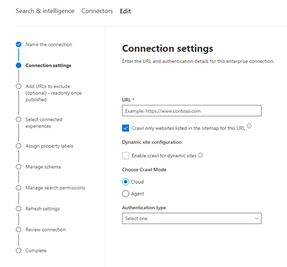

<!---Previous ms.author: monaray --->

<!-- markdownlint-disable no-inline-html -->

# Enterprise siti Web Graph connettore

Il Enterprise web Graph consente all'organizzazione di indicizzare articoli e contenuti dai relativi siti Web **interni.** Dopo aver configurato il connettore e sincronizzato il contenuto dal sito Web, gli utenti finali possono cercare tale contenuto da qualsiasi client Microsoft Search client.

> [!NOTE]
> Leggere [**l'articolo Setup your Graph connector**](configure-connector.md) to understand the general Graph connectors setup instructions.

Questo articolo è per chiunque configura, esegue e monitora un connettore Enterprise siti Web. Integra il processo di installazione generale e mostra le istruzioni che si applicano solo al connettore Enterprise siti Web. In questo articolo sono inoltre incluse informazioni sulla [risoluzione dei](#troubleshooting) problemi e [sulle limitazioni.](#limitations)

<!---## Before you get started-->

<!---Insert "Before you get started" recommendations for this data source-->

## Passaggio 1: Aggiungere un connettore Graph nella interfaccia di amministrazione di Microsoft 365

Seguire le istruzioni generali [per l'installazione](./configure-connector.md).
<!---If the above phrase does not apply, delete it and insert specific details for your data source that are different from general setup instructions.-->

## Passaggio 2: assegnare un nome alla connessione

Seguire le istruzioni generali [per l'installazione](./configure-connector.md).
<!---If the above phrase does not apply, delete it and insert specific details for your data source that are different from general setup instructions.-->

## Passaggio 3: Configurare le impostazioni di connessione

Per connettersi all'origine dati, compilare l'URL radice del sito Web, selezionare un'origine di ricerca per indicizzazione e il tipo di autenticazione che si desidera utilizzare: Nessuna, Autenticazione di base o OAuth 2.0 con [Azure Active Directory (Azure AD)](/azure/active-directory/). Dopo aver completato queste informazioni, selezionare Test Connection per verificare le impostazioni.

### URL

Utilizzare il campo URL per specificare la radice del sito Web di cui si desidera eseguire la ricerca per indicizzazione. Il connettore di siti Web aziendali utilizzerà questo URL come punto di partenza e seguirà tutti i collegamenti di questo URL per la ricerca per indicizzazione.

### Eseguire la ricerca per indicizzazione dei siti Web elencati nella sitemap

Se selezionato, il connettore eseguirà la ricerca per indicizzazione solo degli URL elencati nella sitemap. Se non è selezionata o non viene trovata alcuna mappa del sito, il connettore eseguirà una ricerca per indicizzazione completa di tutti i collegamenti trovati nell'URL radice del sito.

> [!div class="mx-imgBorder"]
> 

### Modalità ricerca per indicizzazione: cloud o locale

La modalità di ricerca per indicizzazione determina il tipo di siti Web che si desidera indicizzare, sia cloud che locale. Per i siti Web cloud, selezionare **Cloud** come modalità di ricerca per indicizzazione.

Inoltre, il connettore ora supporta la ricerca per indicizzazione di siti Web locali. Per accedere ai dati locali, è innanzitutto necessario installare e configurare l'agente Graph connettore. Per ulteriori informazioni, vedere [Graph connector agent](./on-prem-agent.md).

Per i siti Web locali, selezionare Agente come  modalità di ricerca per indicizzazione e nel campo Agente locale scegliere l'agente connettore di Graph installato e configurato in precedenza.   

### Autenticazione

L'autenticazione di base richiede un nome utente e una password. Crea questo account bot usando il interfaccia di amministrazione di Microsoft 365 [.](https://admin.microsoft.com)

OAuth 2.0 con [Azure AD](/azure/active-directory/) richiede un ID risorsa, un ID client e un segreto client. OAuth 2.0 funziona solo con la modalità Cloud.

Per ulteriori informazioni, vedere [Authorize access to Azure Active Directory web applications using OAuth 2.0 code grant flow](/azure/active-directory/develop/v1-protocols-oauth-code). Eseguire la registrazione con i valori seguenti:

**Nome:** Microsoft Search  
**Redirect_URI:**`https://gcs.office.com/v1.0/admin/oauth/callback`

Per ottenere i valori per la risorsa, client_id e client_secret, passare a Usare il codice di autorizzazione per richiedere un **token** di accesso nella pagina Web dell'URL di reindirizzamento.

Per ulteriori informazioni, vedere [Guida introduttiva: Registrare un'applicazione con il Microsoft Identity Platform](/azure/active-directory/develop/quickstart-register-app).

## Passaggio 3a: Aggiungere URL da escludere (Restrizioni facoltative per la ricerca per indicizzazione)

Esistono due modi per impedire la ricerca per indicizzazione delle pagine: non consentire le pagine nel file robots.txt o aggiungerle all'elenco di esclusione.

### Supporto per robots.txt

Il connettore verifica se esiste un file robots.txt per il sito radice e, se ne esiste uno, seguirà e rispetterà le indicazioni stradali trovate all'interno di tale file. Se non si desidera che il connettore esegua la ricerca per indicizzazione di determinate pagine o directory nel sito, è possibile chiamare tali pagine o directory nelle dichiarazioni "Non consentire" nel file robots.txt.

### Aggiungere URL da escludere

Facoltativamente, è possibile creare **un** elenco di esclusione per escludere alcuni URL dalla ricerca per indicizzazione se tale contenuto è sensibile o non vale la pena eseguire la ricerca per indicizzazione. Per creare un elenco di esclusione, sfogliare l'URL radice. Puoi aggiungere gli URL esclusi all'elenco durante il processo di configurazione.

## Passaggio 4: Assegnare etichette di proprietà

È possibile assegnare una proprietà di origine a ogni etichetta scegliendo da un menu di opzioni. Anche se questo passaggio non è obbligatorio, la presenza di alcune etichette di proprietà migliorerà la pertinenza della ricerca e garantirà risultati di ricerca più accurati per gli utenti finali.

## Passaggio 5: Gestire lo schema

Nella schermata **Gestisci schema** è possibile modificare gli attributi dello schema (le opzioni sono **Query,** **Cerca,** **Recupera** e Affina **)** associati alle proprietà, aggiungere alias facoltativi e scegliere la **proprietà Content.**

## Passaggio 6: Gestire le autorizzazioni di ricerca

Il connettore Enterprise web web supporta solo le autorizzazioni di ricerca visibili a **Tutti**. I dati indicizzati vengono visualizzati nei risultati della ricerca ed è visibile a tutti gli utenti dell'organizzazione.

## Passaggio 7: Impostare la pianificazione dell'aggiornamento

Il connettore Enterprise web web supporta solo un aggiornamento completo. Ciò significa che il connettore esererà una ricerca per indicizzazione di tutto il contenuto del sito Web durante ogni aggiornamento. Per assicurarsi che il connettore sia in grado di eseguire la ricerca per indicizzazione del contenuto, è consigliabile impostare un intervallo di pianificazione dell'aggiornamento di grandi dimensioni. È consigliabile un aggiornamento pianificato tra una e due settimane.

## Passaggio 8: verificare la connessione

Seguire le istruzioni generali [per l'installazione](./configure-connector.md).
<!---If the above phrase does not apply, delete it and insert specific details for your data source that are different from general setup instructions.-->

## Risoluzione dei problemi

Durante la lettura del contenuto del sito Web, la ricerca per indicizzazione potrebbe riscontrare alcuni errori di origine, rappresentati dai codici di errore dettagliati riportati di seguito. Per ulteriori informazioni sui tipi di errori, passare alla pagina **dei dettagli dell'errore** dopo aver selezionato la connessione. Selezionare il **codice di errore** per visualizzare errori più dettagliati. Per ulteriori [informazioni, vedere Gestire](./manage-connector.md) il connettore.

 Codice di errore dettagliato | Messaggio di errore
 --- | ---
 6001 | Il sito che si sta provando a indicizzare non è raggiungibile
 6005 | La pagina di origine che si sta provando a indicizzare è stata bloccata in base robots.txt configurazione.
 6008 | Impossibile risolvere il DNS
 6009 | Per tutti gli errori sul lato client (ad eccezione di HTTP 404, 408), fare riferimento ai codici di errore HTTP 4xx per informazioni dettagliate.
 6013 | Impossibile trovare la pagina di origine che si sta provando a indicizzare. (Errore HTTP 404)
 6018 | La pagina di origine non risponde e la richiesta è scaduta. (Errore HTTP 408)
 6021 | La pagina di origine che si sta provando a indicizzare non include contenuto testuale nella pagina.
 6023 | La pagina di origine che si sta provando a indicizzare non è supportata (non una pagina HTML)
 6024 | La pagina di origine che si sta provando a indicizzare contiene contenuto non supportato.

* Gli errori 6001-6013 si verificano quando l'origine dati non è raggiungibile a causa di un problema di rete o quando l'origine dati stessa viene eliminata, spostata o rinominata. Verificare se i dettagli dell'origine dati forniti sono ancora validi.
* Gli errori 6021-6024 si verificano quando l'origine dati contiene contenuto non testuale nella pagina o quando la pagina non è html. Controllare l'origine dati e aggiungere questa pagina nell'elenco di esclusione o ignorare l'errore.

## Limitazioni

Il connettore Enterprise siti Web non supporta la ricerca di dati nelle **pagine Web dinamiche.** Esempi di queste pagine Web sono presenti in sistemi di gestione del contenuto come [Confluence](https://www.atlassian.com/software/confluence) e [Unily](https://www.unily.com/) o in database che archiviano il contenuto del sito Web.