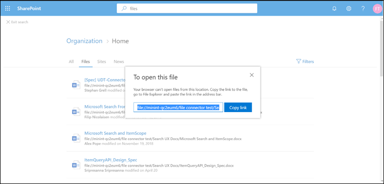

# <a name="file-share-connector"></a><span data-ttu-id="979d7-103">Connettore condivisione file</span><span class="sxs-lookup"><span data-stu-id="979d7-103">File share connector</span></span>

<span data-ttu-id="979d7-104">Con il connettore di condivisione file, gli utenti dell'organizzazione possono eseguire ricerche in condivisioni di file locali.</span><span class="sxs-lookup"><span data-stu-id="979d7-104">With the File share connector, users in your organization can search on-premises file shares.</span></span> <span data-ttu-id="979d7-105">I risultati della ricerca provenienti da queste condivisioni si fondono con i risultati di SharePoint e Microsoft OneDrive for business.</span><span class="sxs-lookup"><span data-stu-id="979d7-105">The search results from these shares merge with the results from SharePoint and Microsoft OneDrive for Business.</span></span>

<span data-ttu-id="979d7-106">Questo articolo è per gli amministratori di Microsoft 365 o per tutti gli utenti che configurano, eseguono e monitora un connettore di condivisione file.</span><span class="sxs-lookup"><span data-stu-id="979d7-106">This article is for Microsoft 365 administrators or anyone who configures, runs, and monitors a File share connector.</span></span> <span data-ttu-id="979d7-107">In questo articolo viene illustrato come configurare le funzionalità di connettore e connettore, le limitazioni e le tecniche di risoluzione dei problemi.</span><span class="sxs-lookup"><span data-stu-id="979d7-107">It explains how to configure your connector and connector capabilities, limitations, and troubleshooting techniques.</span></span>

## <a name="install-a-data-gateway"></a><span data-ttu-id="979d7-108">Installare un gateway di dati</span><span class="sxs-lookup"><span data-stu-id="979d7-108">Install a data gateway</span></span>
<span data-ttu-id="979d7-109">Per accedere ai dati di terze parti, è necessario installare e configurare un gateway Microsoft Power BI.</span><span class="sxs-lookup"><span data-stu-id="979d7-109">In order to access your third-party data, you must install and configure a Microsoft Power BI gateway.</span></span> <span data-ttu-id="979d7-110">Per ulteriori informazioni, vedere [installare un gateway locale](https://docs.microsoft.com/data-integration/gateway/service-gateway-install) .</span><span class="sxs-lookup"><span data-stu-id="979d7-110">See [Install an on-premises gateway](https://docs.microsoft.com/data-integration/gateway/service-gateway-install) to learn more.</span></span>  

## <a name="content-requirements"></a><span data-ttu-id="979d7-111">Requisiti per il contenuto</span><span class="sxs-lookup"><span data-stu-id="979d7-111">Content requirements</span></span>
<span data-ttu-id="979d7-112">**Tipi di file**.</span><span class="sxs-lookup"><span data-stu-id="979d7-112">**File types**.</span></span> <span data-ttu-id="979d7-113">Solo i file in questi formati possono essere indicizzati e cercati: DOC, DOCM, DOCX, DOT, DOTX, EML, GIF, HTML, JPEG, MHT, MHTML, MSG, NWS, OBD, OBT, ODP, ODS, ODT, ONE, PDF, POT, PPS, PPT, PPTM, PPTX, TXT, xlb, xlc, XLSB, XLS, XLSX, XLT, XLXM, XML, XPS e ZIP.</span><span class="sxs-lookup"><span data-stu-id="979d7-113">Only files in these formats can be indexed and searched: DOC, DOCM, DOCX, DOT, DOTX, EML, GIF, HTML, JPEG, MHT, MHTML, MSG, NWS, OBD, OBT, ODP, ODS, ODT, ONE, PDF, POT, PPS, PPT, PPTM, PPTX, TXT, XLB, XLC, XLSB, XLS, XLSX, XLT, XLXM, XML, XPS, and ZIP.</span></span> <span data-ttu-id="979d7-114">Solo il contenuto testuale di questi formati è indicizzato.</span><span class="sxs-lookup"><span data-stu-id="979d7-114">Only the textual content of these formats is indexed.</span></span> <span data-ttu-id="979d7-115">Tutto il contenuto multimediale viene ignorato.</span><span class="sxs-lookup"><span data-stu-id="979d7-115">All multimedia content is ignored.</span></span>
 
<span data-ttu-id="979d7-116">**Limiti**relativi alle dimensioni dei file.</span><span class="sxs-lookup"><span data-stu-id="979d7-116">**File size limits**.</span></span> <span data-ttu-id="979d7-117">La dimensione massima del file supportato è 100 MB.</span><span class="sxs-lookup"><span data-stu-id="979d7-117">The maximum supported file size is 100 MB.</span></span> <span data-ttu-id="979d7-118">I file che superano i 100 MB vengono ignorati dall'indicizzazione.</span><span class="sxs-lookup"><span data-stu-id="979d7-118">Files that exceed 100 MB are skipped from indexing.</span></span> <span data-ttu-id="979d7-119">Il limite massimo di dimensioni successive all'elaborazione è pari a 4 MB.</span><span class="sxs-lookup"><span data-stu-id="979d7-119">The maximum post-processed size limit is 4 MB.</span></span> <span data-ttu-id="979d7-120">L'elaborazione si interrompe quando la dimensione di un file raggiunge i 4 MB.</span><span class="sxs-lookup"><span data-stu-id="979d7-120">Processing stops when a file's size reaches 4 MB.</span></span> <span data-ttu-id="979d7-121">Di conseguenza, alcune frasi presenti nel file potrebbero non funzionare per la ricerca.</span><span class="sxs-lookup"><span data-stu-id="979d7-121">As a result, some phrases present in the file might not work for search.</span></span>

## <a name="connect-to-a-data-source"></a><span data-ttu-id="979d7-122">Connettersi a un'origine dati</span><span class="sxs-lookup"><span data-stu-id="979d7-122">Connect to a data source</span></span>
<span data-ttu-id="979d7-123">Nella pagina **Connetti a origine dati** selezionare **condivisione file** e specificare il nome, l'ID di connessione e la descrizione.</span><span class="sxs-lookup"><span data-stu-id="979d7-123">On the **Connect to data source** page, select **File share** and provide the name, connection ID, and description.</span></span> <span data-ttu-id="979d7-124">Nella pagina successiva, specificare il percorso della condivisione file e selezionare il gateway precedentemente installato.</span><span class="sxs-lookup"><span data-stu-id="979d7-124">In the next page, provide the path to the file share and select your previously installed gateway.</span></span> <span data-ttu-id="979d7-125">Immettere le credenziali per un account utente di Windows con accesso in lettura a tutti i file della condivisione.</span><span class="sxs-lookup"><span data-stu-id="979d7-125">Enter the credentials for a Windows user account with read access to all the files in the share.</span></span> <span data-ttu-id="979d7-126">Passare attraverso le altre impostazioni e pubblicare la connessione.</span><span class="sxs-lookup"><span data-stu-id="979d7-126">Go through the rest of the settings and publish the connection.</span></span>

## <a name="set-the-refresh-schedule"></a><span data-ttu-id="979d7-127">Impostare la pianificazione di aggiornamento</span><span class="sxs-lookup"><span data-stu-id="979d7-127">Set the refresh schedule</span></span>
<span data-ttu-id="979d7-128">L'intervallo di pianificazione di aggiornamento predefinito consigliato è 15 minuti, ma è possibile modificarlo in un altro intervallo preferito.</span><span class="sxs-lookup"><span data-stu-id="979d7-128">The recommended default refresh schedule interval is 15 minutes, but you can change it to another interval that you prefer.</span></span>

## <a name="set-up-your-search-results-page"></a><span data-ttu-id="979d7-129">Configurare la pagina dei risultati di ricerca</span><span class="sxs-lookup"><span data-stu-id="979d7-129">Set up your search results page</span></span>
<span data-ttu-id="979d7-130">Per visualizzare risultati di connessione file diversi nelle schede **tutti** e **file** , è necessario configurare una pagina dei risultati del motore di ricerca di SharePoint:</span><span class="sxs-lookup"><span data-stu-id="979d7-130">To display different file connection results in the **All** and **Files** tabs, you need to set up a SharePoint search engine results page:</span></span>
- <span data-ttu-id="979d7-131">La tabella **All** contiene i risultati combinati delle connessioni di file, file di SharePoint, file di OneDrive e siti di SharePoint.</span><span class="sxs-lookup"><span data-stu-id="979d7-131">The **All** table shows combined results from your file connections, SharePoint files, OneDrive files, and SharePoint sites.</span></span> 
- <span data-ttu-id="979d7-132">La verticale dei **file** Visualizza tutti i risultati dei file delle connessioni, SharePoint e OneDrive.</span><span class="sxs-lookup"><span data-stu-id="979d7-132">The **Files** vertical shows all file results from your connections, SharePoint, and OneDrive.</span></span>
<span data-ttu-id="979d7-133">I risultati delle connessioni ai file vengono aggiunti ai risultati già esistenti sia nei verticali **tutti** che in quelli dei **file** .</span><span class="sxs-lookup"><span data-stu-id="979d7-133">Results from file connections are added to already existing results in both the **All** and **Files** verticals.</span></span>

<span data-ttu-id="979d7-134">Per impostare la pagina dei risultati di ricerca, eseguire la procedura seguente:</span><span class="sxs-lookup"><span data-stu-id="979d7-134">To set up your search results page, take these steps:</span></span>
1. <span data-ttu-id="979d7-135">Creare una raccolta siti di SharePoint con una pagina di ricerca moderna.</span><span class="sxs-lookup"><span data-stu-id="979d7-135">Create a SharePoint site collection with a modern search page.</span></span>

2. <span data-ttu-id="979d7-136">Installare una [Shell di gestione di SharePoint Online](https://www.microsoft.com/download/details.aspx?id=35588).</span><span class="sxs-lookup"><span data-stu-id="979d7-136">Install a [SharePoint Online Management Shell](https://www.microsoft.com/download/details.aspx?id=35588).</span></span>

3. <span data-ttu-id="979d7-137">Aprire SharePoint Online Management Shell come amministratore e importare il modulo **Microsoft. SharePoint. client. dll** presente in `C:\Windows\Microsoft.NET\assembly\GAC_MSIL\Microsoft.SharePoint.Client\v4.0_16.0.0.0__71e9bce111e9429c\Microsoft.SharePoint.Client.dll`.</span><span class="sxs-lookup"><span data-stu-id="979d7-137">Open SharePoint Online Management Shell as an administrator and import the **Microsoft.SharePoint.Client.dll** module present at `C:\Windows\Microsoft.NET\assembly\GAC_MSIL\Microsoft.SharePoint.Client\v4.0_16.0.0.0__71e9bce111e9429c\Microsoft.SharePoint.Client.dll`.</span></span>

> [!NOTE]
> <span data-ttu-id="979d7-138">Questo percorso potrebbe non essere lo stesso per tutti gli utenti.</span><span class="sxs-lookup"><span data-stu-id="979d7-138">This path might not be the same for all users.</span></span>

<span data-ttu-id="979d7-139">Per importare il modulo, eseguire il comando seguente in SharePoint Online Management Shell:</span><span class="sxs-lookup"><span data-stu-id="979d7-139">To import the module, run this command in SharePoint Online Management Shell:</span></span>
```bash
Import-Module "C:\Windows\Microsoft.NET\assembly\GAC_MSIL\Microsoft.SharePoint.Client\v4.0_16.0.0.0__71e9bce111e9429c\Microsoft.SharePoint.Client.dll" 
```

4. <span data-ttu-id="979d7-140">Eseguire lo script seguente:</span><span class="sxs-lookup"><span data-stu-id="979d7-140">Now run this script:</span></span>
```bash
$orgName = Read-Host -prompt 'Please enter your org name'
$userName = Read-Host -prompt 'Enter user name'
$userCreds = Get-Credential -UserName $userName -Message "Type the password"
Connect-SPOService -Url https://$orgName-admin.sharepoint.com -Credential $userCreds

$url = Read-Host -Prompt 'Please enter the site url'
$site = Get-SPOSite -Identity $url
Set-SPOSite $url -DenyAddAndCustomizePages 0

$pwd = Read-Host -AsSecureString 'type the password'
$context = New-Object Microsoft.SharePoint.Client.ClientContext($url)
$credential = New-Object Microsoft.SharePoint.Client.SharePointOnlineCredentials($userName, $pwd)
$context.Credentials = $credential
$web = $context.Web
$context.Load($web)
$web.AllProperties["AllVerticalContent"] = "Combined"
$web.Update()
$context.ExecuteQuery()
$web.AllProperties["FilesVerticalContent"] = "ConnectorsOnly"
$web.Update()
$context.ExecuteQuery()
Set-SPOSite $url -DenyAddAndCustomizePages 1

Write-Host "Success" -ForegroundColor Cyan
Read-Host -Prompt 'Press enter to exit'
```

5. <span data-ttu-id="979d7-141">Immettere i valori richiesti in PowerShell, ad esempio il nome dell'organizzazione, l'utente, la password e l'URL del sito.</span><span class="sxs-lookup"><span data-stu-id="979d7-141">Enter the required values in PowerShell, such as organization name, username, password, and site URL.</span></span> <span data-ttu-id="979d7-142">**Ad esempio**, se le credenziali di amministratore sono `admin@a830edad9050849823J19081300.onmicrosoft.com`, il nome dell'organizzazione è **a830edad9050849823J19081300**e l'URL del sito è `https:// a830edad9050849823J19081300.sharepoint.com`.</span><span class="sxs-lookup"><span data-stu-id="979d7-142">As an **example**, if your admin credentials are `admin@a830edad9050849823J19081300.onmicrosoft.com`, then your organization name is **a830edad9050849823J19081300**, and your site URL is `https:// a830edad9050849823J19081300.sharepoint.com`.</span></span>

> [!NOTE]
> <span data-ttu-id="979d7-143">L'impostazione **allProperties** può essere completata solo a livello di raccolta siti (teams/Comms).</span><span class="sxs-lookup"><span data-stu-id="979d7-143">The **AllProperties** setting can only be done at a site collection level (Teams/Comms site).</span></span>

6. <span data-ttu-id="979d7-144">A questo punto è possibile cercare i file indicizzati e visualizzare i risultati nelle schede **tutti** e **file** .</span><span class="sxs-lookup"><span data-stu-id="979d7-144">Now you can search for indexed files and see results in both the **All** and **Files** tabs.</span></span>

## <a name="search-for-file-share-content-in-the-search-results-page"></a><span data-ttu-id="979d7-145">Cercare il contenuto della condivisione file nella pagina dei risultati di ricerca</span><span class="sxs-lookup"><span data-stu-id="979d7-145">Search for file share content in the search results page</span></span>
<span data-ttu-id="979d7-146">Per cercare il contenuto indicizzato, passare alla Home page di SharePoint del tenant di test.</span><span class="sxs-lookup"><span data-stu-id="979d7-146">To search for indexed content, go to the SharePoint home page of your test tenant.</span></span> <span data-ttu-id="979d7-147">I risultati verranno visualizzati nelle schede **tutti** e **file** .</span><span class="sxs-lookup"><span data-stu-id="979d7-147">Results will be displayed in the **All** and **Files** tabs.</span></span>

<span data-ttu-id="979d7-148">A causa di restrizioni del browser, non è possibile selezionare un risultato di file per visualizzare o aprire file dalle ricerche di condivisione file locali.</span><span class="sxs-lookup"><span data-stu-id="979d7-148">Because of browser restrictions, you can't select a file result to view or open files from local file share searches.</span></span> <span data-ttu-id="979d7-149">Per aprire questi file, copiare il collegamento del risultato del file e incollarlo nella barra degli indirizzi del browser del sistema.</span><span class="sxs-lookup"><span data-stu-id="979d7-149">To open these files, copy the file result's link and paste it into the address bar of your system's browser.</span></span> <span data-ttu-id="979d7-150">Per Windows, utilizzare Esplora risorse.</span><span class="sxs-lookup"><span data-stu-id="979d7-150">For Windows, use Windows Explorer.</span></span> <span data-ttu-id="979d7-151">Successivamente, è possibile aprire il file nel sistema.</span><span class="sxs-lookup"><span data-stu-id="979d7-151">Then you can open the file on your system.</span></span>



## <a name="troubleshooting"></a><span data-ttu-id="979d7-153">Risoluzione dei problemi</span><span class="sxs-lookup"><span data-stu-id="979d7-153">Troubleshooting</span></span>
<span data-ttu-id="979d7-154">Se si verifica un errore critico in una connessione, il relativo stato viene visualizzato come **non riuscito**.</span><span class="sxs-lookup"><span data-stu-id="979d7-154">If something is critically wrong with a connection, its status shows as **failed**.</span></span> <span data-ttu-id="979d7-155">Per ottenere ulteriori informazioni sui tre tipi di errori, passare alla pagina dei **Dettagli dell'errore** e selezionare la connessione non riuscita.</span><span class="sxs-lookup"><span data-stu-id="979d7-155">To get more information on the three types of errors, go to the **error details** page and select the failing connection.</span></span> <span data-ttu-id="979d7-156">Per ulteriori informazioni, vedere [gestire il connettore](manage-connector.md) .</span><span class="sxs-lookup"><span data-stu-id="979d7-156">See [Manage your connector](manage-connector.md) to learn more.</span></span>
1. <span data-ttu-id="979d7-157">**Gateway non raggiungibile (codice di errore: 11)**.</span><span class="sxs-lookup"><span data-stu-id="979d7-157">**Gateway not reachable (error code: 11)**.</span></span> <span data-ttu-id="979d7-158">Il computer del gateway per la connessione è inverso.</span><span class="sxs-lookup"><span data-stu-id="979d7-158">The gateway machine for the connection is down.</span></span> <span data-ttu-id="979d7-159">Verificare che il processo Microsoft Power BI venga eseguito nel computer gateway.</span><span class="sxs-lookup"><span data-stu-id="979d7-159">Verify if the Microsoft Power BI process runs on the gateway machine.</span></span>
2. <span data-ttu-id="979d7-160">**Errore di autenticazione (codice di errore: 12)**.</span><span class="sxs-lookup"><span data-stu-id="979d7-160">**Authentication error (error code: 12)**.</span></span> <span data-ttu-id="979d7-161">Le credenziali utilizzate per creare la connessione sono scadute o non sono più valide.</span><span class="sxs-lookup"><span data-stu-id="979d7-161">The credentials that were used for creating the connection expired or are no longer valid.</span></span> <span data-ttu-id="979d7-162">Per risolvere questo errore, immettere le credenziali valide.</span><span class="sxs-lookup"><span data-stu-id="979d7-162">To resolve this error, enter valid credentials.</span></span>
3. <span data-ttu-id="979d7-163">**Errore interno (codice di errore: qualsiasi valore diverso da 11 o 12)**.</span><span class="sxs-lookup"><span data-stu-id="979d7-163">**Internal error (error code: anything other than 11 or 12)**.</span></span> <span data-ttu-id="979d7-164">Si è verificato un errore nell'infrastruttura del connettore.</span><span class="sxs-lookup"><span data-stu-id="979d7-164">There's an error in the connector infrastructure.</span></span> <span data-ttu-id="979d7-165">Per informazioni su come segnalare tali errori, vedere l'articolo sui [commenti e suggerimenti](connectors-feedback.md) .</span><span class="sxs-lookup"><span data-stu-id="979d7-165">See the [Feedback](connectors-feedback.md) article to find out how to report these errors.</span></span>

## <a name="limitations"></a><span data-ttu-id="979d7-166">Limitazioni</span><span class="sxs-lookup"><span data-stu-id="979d7-166">Limitations</span></span>
<span data-ttu-id="979d7-167">Il connettore di condivisione file ha queste limitazioni nella versione di anteprima:</span><span class="sxs-lookup"><span data-stu-id="979d7-167">The File share connector has these limitations in the preview release:</span></span>
* <span data-ttu-id="979d7-168">È possibile indicizzare solo i file con proprietà fisse, non i file con proprietà personalizzate.</span><span class="sxs-lookup"><span data-stu-id="979d7-168">You can only index files with fixed properties, not files with custom properties.</span></span>
* <span data-ttu-id="979d7-169">Gli elenchi di controllo di accesso alla condivisione file (ACL) non sono attualmente supportati.</span><span class="sxs-lookup"><span data-stu-id="979d7-169">File share Access Control Lists (ACLs) aren't currently supported.</span></span> <span data-ttu-id="979d7-170">Sono supportati solo gli ACL NTFS dei file.</span><span class="sxs-lookup"><span data-stu-id="979d7-170">Only file NTFS ACLs are supported.</span></span>
* <span data-ttu-id="979d7-171">Le identità esterne non sono supportate.</span><span class="sxs-lookup"><span data-stu-id="979d7-171">External identities aren't supported.</span></span> <span data-ttu-id="979d7-172">È necessario eseguire il mapping delle identità di Azure Active Directory.</span><span class="sxs-lookup"><span data-stu-id="979d7-172">They must be mapped to Azure Active Directory identities.</span></span>
