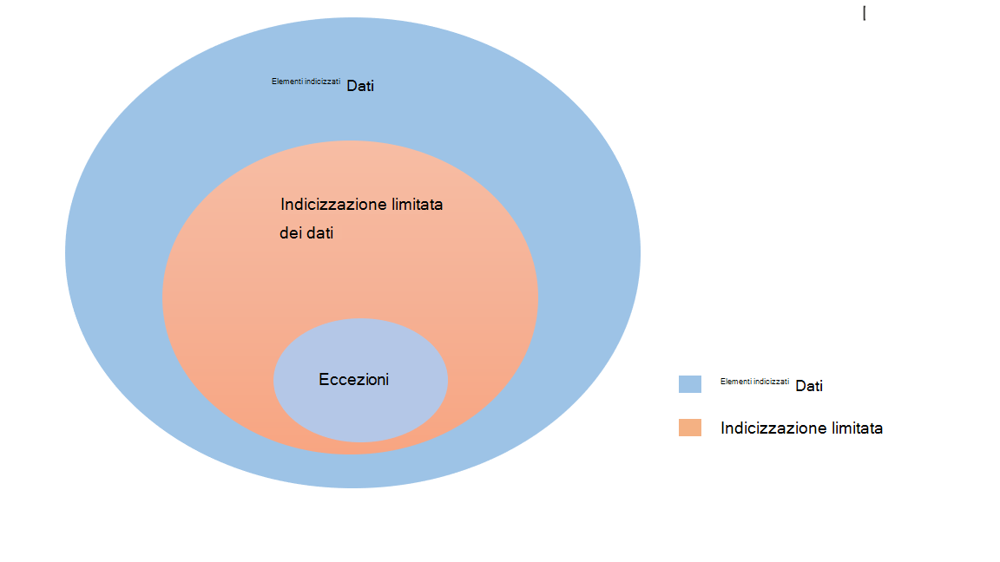

<!---Previous ms.author: rusamai --->

# Connettore di Graph file

Il connettore Graph condivisione file consente agli utenti dell'organizzazione di cercare condivisioni Windows file locali.

> [!NOTE]
> Leggere [**l'articolo Setup for your Graph connector**](configure-connector.md) to understand the general Graph connectors setup process.

## Prima di iniziare

### Installare l'agente Graph connettore

Per indicizzare le Windows file condivisioni file, è necessario installare e registrare l'agente Graph connettore. Per [ulteriori informazioni, vedere Install the Graph connector agent.](graph-connector-agent.md)  

### Requisiti del contenuto

### Tipi di file

È possibile indicizzare e cercare il contenuto dei formati seguenti: DOC, DOCM, DOCX, DOT, DOTX, EML, GIF, HTML, JPEG, MHT, MHTML, MSG, NWS, OBD, OBT, ODP, ODS, ODT, ONE, PDF, POT, PPS, PPT, PPTM, PPTX, TXT, XLB, XLC, XLSB, XLS, XLSX, XLT, XLXM, XML, XPS e ZIP. Viene indicizzato solo il contenuto testuale di questi formati. Tutto il contenuto multimediale viene ignorato. Per qualsiasi file che non appartiene a questo formato, i metadati vengono indicizzati.

### Limiti di dimensione dei file

La dimensione massima supportata per il file è 100 MB. I file che superano i 100 MB non vengono indicizzati. Il limite massimo di dimensioni post-elaborazione è 4 MB. L'elaborazione si interrompe quando le dimensioni di un file raggiungono i 4 MB. Di conseguenza, alcune frasi presenti nel file potrebbero non funzionare per la ricerca.

## Passaggio 1: Aggiungere un connettore Graph nella interfaccia di amministrazione di Microsoft 365

Seguire le istruzioni generali [per l'installazione](./configure-connector.md).
<!---If the above phrase does not apply, delete it and insert specific details for your data source that are different from general setup instructions.-->

## Passaggio 2: assegnare un nome alla connessione

Seguire le istruzioni generali [per l'installazione](./configure-connector.md).
<!---If the above phrase does not apply, delete it and insert specific details for your data source that are different from general setup instructions.-->

## Passaggio 3: Configurare le impostazioni di connessione

Nella pagina **Connessione'origine** dati selezionare **Condivisione file** e specificare il nome, l'ID di connessione e la descrizione. Nella pagina successiva specificare il percorso della condivisione file e selezionare l'agente connettore Graph installato in precedenza. Immettere le credenziali per un account [utente di Microsoft Windows](https://microsoft.com/windows) con accesso in lettura a tutti i file nella condivisione file.

### Mantenere l'ora dell'ultimo accesso

Quando il connettore tenta di eseguire la ricerca per indicizzazione di un file, il campo "Ora ultimo accesso" nei relativi metadati viene aggiornato. Se si dipende da tale campo per qualsiasi soluzione di archiviazione e backup e non si desidera aggiornarlo quando il connettore vi accede, è possibile configurare questa opzione nella **pagina Impostazioni** avanzate.

## Passaggio 4: Limiti per l'indicizzazione dei file

Durante la configurazione di una connessione condivisione file, l'amministratore potrebbe limitare l'indicizzazione di file e cartelle. Esistono diversi modi per farlo:

#### In base ai tipi di file

Solo il contenuto testuale di questi formati è indicizzato: DOC, DOCM, DOCX, DOT, DOTX, EML, HTML, MHT, MHTML, MSG, NWS, OBD, OBT, ODP, ODS, ODT, ONE, PDF, POT, PPS, PPT, PPTM, PPTX, TXT, XLB, XLC, XLSB, XLSX, XLT, XLXM, XML, XPS. Per i file multimediali e i file che non appartengono a questo formato, gli unici metadati vengono indicizzati.

#### In base alla data dell'ultima modifica o al numero di giorni dall'ultima modifica

#### Percorso di rete completo di file/cartella o espressione regolare per limitare l'indicizzazione 

Nel percorso di rete utilizzare il carattere di escape ( \\ ) prima di caratteri speciali come \\ . Esempio: per il percorso \\ \\ CONTOSO FILE \\ \\ SHAREDFOLDER, il modo corretto per l'input è \\ \\ \\ \\ CONTOSO \\ \\ FILE \\ \\ SHAREDFOLDER

Le regole per la scrittura di espressioni regolari sono disponibili [qui](https://docs.microsoft.com/dotnet/standard/base-types/regular-expression-language-quick-reference)

L'amministratore potrebbe anche avere la possibilità di concedere un'eccezione alla regola limite. La priorità della regola di eccezione sostituisce le regole limite. In modo analogo, l'eccezione può essere definita fornendo il percorso cartella/file per gli elementi che si desidera includere nell'indicizzazione.

## Passaggio 5: Gestire le autorizzazioni di ricerca

È possibile limitare l'autorizzazione alla ricerca di qualsiasi file basato sugli elenchi di controllo di accesso condivisi o sugli elenchi di controllo di accesso NTFS (New Technology File System), selezionando l'opzione desiderata nella pagina Gestisci autorizzazioni **di** ricerca. Gli account utente e i gruppi forniti in questi elenchi di controllo di accesso devono essere gestiti da Active Directory (AD). Se si utilizza qualsiasi altro sistema per la gestione degli account utente, è possibile selezionare l'opzione "tutti", che consente agli utenti di cercare tutti i file senza restrizioni di accesso. Tuttavia, quando gli utenti tentano di aprire il file, vengono applicati i controlli di accesso impostati nell'origine.

Tieni presente che le finestre per impostazione predefinita forniscono l'autorizzazione "Lettura" a "Tutti" in Condividi ACL quando una cartella viene condivisa in rete. Per estensione, se si sceglie Condividi ACL in **Gestisci** autorizzazioni di ricerca, gli utenti saranno in grado di cercare tutti i file. Se si desidera limitare l'accesso, rimuovere l'accesso "Lettura" per "Tutti" nelle condivisioni file e fornire l'accesso solo agli utenti e ai gruppi desiderati. Il connettore legge quindi queste restrizioni di accesso e le applica alla ricerca.

È possibile scegliere Condividi ACL solo se il percorso di condivisione specificato segue il formato di percorso UNC. Puoi creare un percorso in formato UNC andando a "Condivisione avanzata" in "Condivisione".

## Passaggio 6: Assegnare etichette di proprietà

Seguire le istruzioni generali [per l'installazione](./configure-connector.md).
<!---If the above phrase does not apply, delete it and insert specific details for your data source that are different from general setup instructions.-->

## Passaggio 7: Gestire lo schema

Seguire le istruzioni generali [per l'installazione](./configure-connector.md).
<!---If the above phrase does not apply, delete it and insert specific details for your data source that are different from general setup instructions.-->

## Passaggio 8: Scegliere le impostazioni di aggiornamento

Seguire le istruzioni generali [per l'installazione](./configure-connector.md).
<!---If the above phrase does not apply, delete it and insert specific details for your data source that are different from general setup instructions.-->

## Passaggio 9: esaminare la connessione

Seguire le istruzioni generali [per l'installazione](./configure-connector.md).
<!---If the above phrase does not apply, delete it and insert specific details for your data source that are different from general setup 
instructions.-->

<!---## Troubleshooting-->
<!---Insert troubleshooting recommendations for this data source-->

<!---## Limitations-->
<!---Insert limitations for this data source-->
