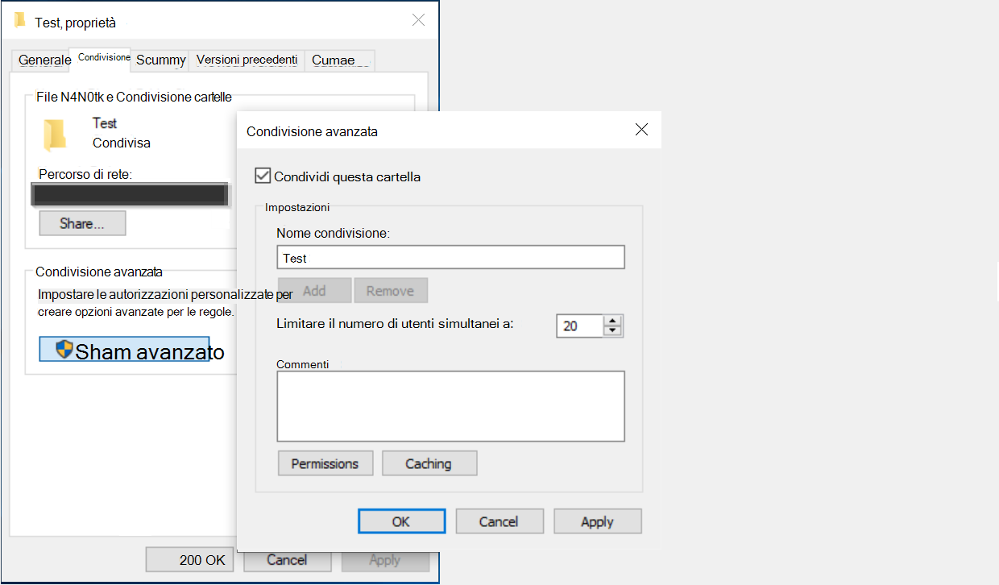

<!---Previous ms.author: rusamai --->

# Connettore Grafico condivisione file

Il connettore Grafico condivisione file consente agli utenti dell'organizzazione di cercare condivisioni file di Windows locali.

> [!NOTE]
> Leggere [**l'articolo setup for your Graph connector**](configure-connector.md) to understand the general Graph connectors setup process.

## Prima di iniziare

### Installare l'agente connettore Graph

Per indicizzare le condivisioni file di Windows, è necessario installare e registrare l'agente connettore Graph. Per [ulteriori informazioni, vedere Install the Graph connector agent.](on-prem-agent.md)  

### Requisiti per il contenuto

### Tipi di file

È possibile indicizzare e cercare il contenuto dei formati seguenti: DOC, DOCM, DOCX, DOT, DOTX, EML, GIF, HTML, JPEG, MHT, MHTML, MSG, NWS, OBD, OBT, ODP, ODS, ODT, ONE, PDF, POT, PPS, PPT, PPTM, PPTX, TXT, XLB, XLC, XLSB, XLS, XLSX, XLT, XLXM, XML, XPS e ZIP. Viene indicizzato solo il contenuto testuale di questi formati. Tutto il contenuto multimediale viene ignorato. Per qualsiasi file che non appartiene a questo formato, solo i metadati vengono indicizzati.

### Limiti di dimensione dei file

La dimensione massima supportata per i file è 100 MB. I file che superano i 100 MB non vengono indicizzati. Il limite massimo per le dimensioni post-elaborazione è 4 MB. L'elaborazione viene interrotta quando le dimensioni di un file raggiungono i 4 MB. È pertanto possibile che alcune frasi presenti nel file non funzionino per la ricerca.

## Passaggio 1: Aggiungere un connettore Graph nell'interfaccia di amministrazione di Microsoft 365

Seguire le istruzioni [generali per l'installazione.](https://docs.microsoft.com/microsoftsearch/configure-connector)
<!---If the above phrase does not apply, delete it and insert specific details for your data source that are different from general setup instructions.-->

## Passaggio 2: assegnare un nome alla connessione

Seguire le istruzioni [generali per l'installazione.](https://docs.microsoft.com/microsoftsearch/configure-connector)
<!---If the above phrase does not apply, delete it and insert specific details for your data source that are different from general setup instructions.-->

## Passaggio 3: Configurare le impostazioni di connessione

Nella pagina **Connetti all'origine** dati selezionare **Condivisione file** e specificare il nome, l'ID di connessione e la descrizione. Nella pagina successiva, specificare il percorso della condivisione file e selezionare l'agente connettore Graph installato in precedenza. Immettere le credenziali per un account utente [di Microsoft Windows](https://microsoft.com/windows) con accesso in lettura a tutti i file nella condivisione file.

### Mantieni ora ultimo accesso

Quando il connettore tenta di eseguire la ricerca per indicizzazione di un file, il campo "Ora ultimo accesso" nei metadati viene aggiornato. Se si dipende da tale campo per qualsiasi soluzione di archiviazione e backup e non si desidera aggiornarlo quando il connettore vi accede, è possibile configurare questa opzione nella pagina **Impostazioni** avanzate.

## Passaggio 4: Gestire le autorizzazioni di ricerca

È possibile limitare l'autorizzazione per la ricerca di qualsiasi file basato sugli elenchi di controllo di accesso condivisi o sugli elenchi di controllo di accesso NTFS (New Technology File System) selezionando l'opzione desiderata nella pagina Gestisci autorizzazioni **di** ricerca. Gli account utente e i gruppi forniti in questi elenchi di controllo di accesso devono essere gestiti da Active Directory (AD). Se si utilizza qualsiasi altro sistema per la gestione degli account utente, è possibile selezionare l'opzione "tutti", che consente agli utenti di cercare tutti i file senza restrizioni di accesso. Tuttavia, quando gli utenti tentano di aprire il file, vengono applicati i controlli di accesso impostati nell'origine.

Tieni presente che le finestre per impostazione predefinita forniscono l'autorizzazione "Lettura" a "Tutti" negli elenchi ACL di condivisione quando una cartella viene condivisa in rete. Per estensione, se si sceglie Condividi ACL in **Gestisci** autorizzazioni di ricerca, gli utenti saranno in grado di cercare tutti i file. Se si desidera limitare l'accesso, rimuovere l'accesso "Lettura" per "Tutti" nelle condivisioni file e fornire l'accesso solo agli utenti e ai gruppi desiderati. Il connettore legge quindi queste restrizioni di accesso e le applica alla ricerca.

È possibile scegliere Gli ACL di condivisione solo se il percorso di condivisione specificato segue il formato di percorso UNC. È possibile creare un percorso in formato UNC selezionando "Condivisione avanzata" nell'opzione "Condivisione".

## Passaggio 5: Assegnare etichette di proprietà

Seguire le istruzioni [generali per l'installazione.](https://docs.microsoft.com/microsoftsearch/configure-connector)
<!---If the above phrase does not apply, delete it and insert specific details for your data source that are different from general setup instructions.-->

## Passaggio 6: Gestire lo schema

Seguire le istruzioni [generali per l'installazione.](https://docs.microsoft.com/microsoftsearch/configure-connector)
<!---If the above phrase does not apply, delete it and insert specific details for your data source that are different from general setup instructions.-->

## Passaggio 7: Scegliere le impostazioni di aggiornamento

Seguire le istruzioni [generali per l'installazione.](https://docs.microsoft.com/microsoftsearch/configure-connector)
<!---If the above phrase does not apply, delete it and insert specific details for your data source that are different from general setup instructions.-->

## Passaggio 8: esaminare la connessione

Seguire le istruzioni [generali per l'installazione.](https://docs.microsoft.com/microsoftsearch/configure-connector)
<!---If the above phrase does not apply, delete it and insert specific details for your data source that are different from general setup 
instructions.-->

<!---## Troubleshooting-->
<!---Insert troubleshooting recommendations for this data source-->

<!---## Limitations-->
<!---Insert limitations for this data source-->
