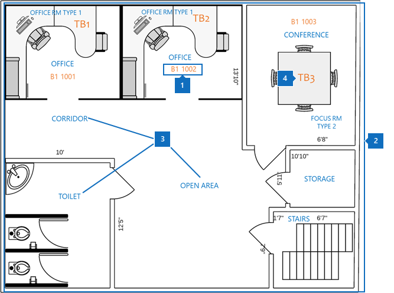
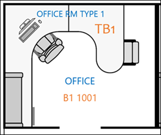
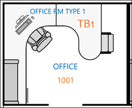
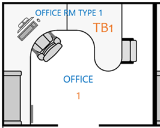

# Procedure consigliate

Per implementare correttamente i piani di Microsoft Search, è necessario coordinare tre tipi di dati:

- **Creazione dei dati della posizione**: che formato e come aggiungere?
- **Mappa planimetria in formato DWG**: informazioni su come visualizzare e quali dati dovrebbero contenere per ottenere il massimo successo.
- **Posizione dell'ufficio dei dipendenti in [Azure Active Directory (Azure ad)](https://azure.microsoft.com/services/active-directory/)**: che formato usare e come aggiungere?  

Nelle sezioni seguenti sono descritte le procedure consigliate per la distribuzione dei piani di ricerca di Microsoft Search.

## Creazione dei dati della posizione
Prima di aggiungere planimetrie, è necessario aggiungere i propri edifici a percorsi di ricerca di Microsoft. Fornire i dati di compilazione necessari seguenti:

|Dati di compilazione necessari  |Esempio  |
|---------|---------|
|Name     |    Building 1, New York City     |
|Indirizzo     |     123 any Avenue, New York, NY 10118  |
|Latitudine-Longitudine (facoltativa)   |    40,760539,-73,975341      |
|Parole chiave     |    Ufficio di New York, Building 1, sede principale, quartier generale     |

È possibile aggiungere molti edifici alla volta utilizzando la caratteristica **Importa** nella scheda **percorsi** invece di aggiungere posizioni una alla volta. Con la caratteristica di **importazione** è possibile specificare la latitudine e la longitudine. Per ulteriori informazioni, vedere [Manage locations](manage-locations.md).

## Mappa planimetria in formato DWG
Per creare mappe in Microsoft Search, è necessario caricare planimetrie in formato DWG con informazioni specifiche. Per informazioni su come creare e visualizzare i file in formato DWG, vedere [DWG Viewer](https://www.autodesk.in/products/dwg). 

Le mappe planimetrie visualizzano quattro elementi:

1. **Numeri di stanza**: nell'esempio seguente, i numeri di stanza sono definiti come **B1 1001** e **B1 1002**. **B1** è il codice dell'edificio e 1001 contiene il numero di piano **1** e il numero di ufficio **001**.
1. **Layout di sala.**: per chiarire i dettagli quando più utenti condividono un ufficio, è possibile definire layout come sedie e scrivanie.
1. **Tipi di stanza**: alcuni esempi includono Office, Corridor, area aperta e servizi igienici.
1. **Informazioni sulle risorse**: se gli utenti si trovano in uno spazio aperto, è possibile indicare la scrivania a cui siedono. In questo esempio, le scrivanie sono denotate da **TB1** e **TB2**.

In questo diagramma, i numeri di stanza sono l'elemento più importante. Vengono mappati alla posizione di Office di una persona nell'account utente, come illustrato nell'immagine seguente.

Queste informazioni sono archiviate in Azure Active Directory nella proprietà **PhysicalDeliveryOfficeName** . Nell'interfaccia di [Amministrazione](https://admin.microsoft.com)di Microsoft 365, viene chiamata la proprietà **Office** e può essere aggiunta negli **utenti attivi**.

### File DWG
Microsoft Search richiede file planimetrici in DWG, che è formato un formato di disegno AutoCAD. I file devono contenere dati relativi a **layout** e **etichette** . I **numeri di camera** sono le etichette più importanti per i piani di pavimento.

Si consiglia di creare il sistema di numerazione di Office con il metodo di corrispondenza esatto illustrato nella tabella seguente. Tuttavia, l'etichettatura non è limitata. Ad esempio, se la posizione dell'utente in Azure AD è **B1 1001**, è possibile contrassegnare il numero della sala nel file DWG con una delle opzioni seguenti.

|Match  |Layout  |
|---------|---------|
|Corrispondenza esatta alla posizione di Office (scelta consigliata)   **B1 1001**   Codice edificio: B1 Piano: 1  Numero di stanza: 001    |         |
|Corrispondenza tra il piano e il numero di stanza   **1001** Piano: 1  Numero di stanza: 001    |      |
|Solo numero della sala di confronto   **1** Numero di stanza: 1        |         |

## Posizione dell'ufficio dell'account utente
Per mappare la posizione di un dipendente, i numeri di sala nei file DWG vengono mappati a posizioni di Office nell'account dell'utente in Azure AD. La proprietà **location di Office** deve corrispondere alle informazioni sulla posizione di Office nel file DWG.

Nella tabella seguente vengono illustrate le procedure consigliate per il mapping dei dati delle posizioni:

|Procedura consigliata  |Spiegazione |
|---------|---------|
|Includere codice di costruzione, piano e numero di sala.     |   Questi dati offrono le migliori possibilità di effettuare corrispondenze esatte.     |
|Includere un separatore dopo la creazione di codici e piani.     |  Separare i codici di costruzione dai numeri del piano e della sala con un separatore o uno spazio, come negli esempi seguenti:  B1 1001  B1/1001   B1-1001   |
|Il numero della sala segue sempre le informazioni relative a codice edilizio, ala e pavimento.     |  Se il numero della sala è **1001**, impostare la posizione di Office su **B1 1001**, **B1/1001**o **B1-1001**.   Se il numero della sala è **F1-001**, impostare il percorso di Office su **B1 F1-001** o **B1/F1-001**.   Se il numero della sala è **1**, impostare il percorso di Azure ad su **B1 1001**, **B1/1001**o **B1-F1-001**.       |
|

## Passaggi successivi
[Gestire le posizioni](manage-locations.md) 
[Gestire i piani di piano](manage-floorplans.md)