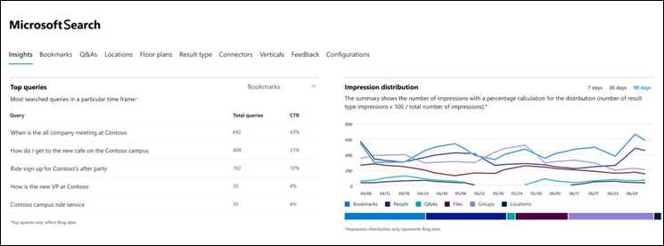
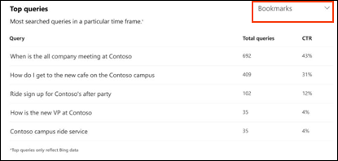
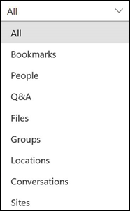
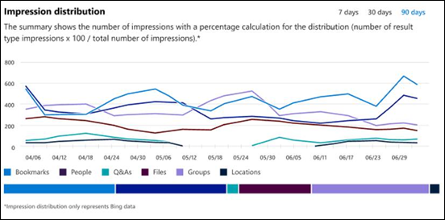

# Report sul dashboard di Microsoft Search Insights

È possibile utilizzare il Dashboard Microsoft Search Insights per gestire i dati di Bing per le risposte pubblicate. Questo è solo uno dei passaggi necessari per [facilitare la ricerca di contenuti](make-content-easy-to-find.md) per gli utenti.

Quando si accede per la prima volta a Microsoft Search nell'interfaccia di amministrazione di Microsoft 365, è necessario immettere il dashboard Insights.

Di seguito sono riportati i report disponibili nel dashboard Insights.

> [!NOTE]
> I dati nei report rappresentano solo dati Bing.

## Query principali

Questo rapporto fornisce informazioni dettagliate sulle query di ricerca Bing Top 2000 eseguite dagli utenti. Affinché una query venga visualizzata nelle **query principali**, è necessario che la query ottenga almeno tre clic.

Una bassa percentuale di clic (CTR) indica che gli utenti non trovano quello che stanno cercando.

È possibile scegliere diverse visualizzazioni del report filtrando il tipo di risposta. Ad esempio, se si desidera visualizzare solo le query principali per i segnalibri, selezionare l'elenco a discesa nell'angolo in alto a destra del report e quindi selezionare **segnalibri**. Per impostazione predefinita, vengono visualizzati **tutti i** tipi di risposta.

## Distribuzione dell'impressione

Questo rapporto Visualizza la distribuzione degli impressioni in Bing nel tempo per diverse risposte. Alcuni esempi sono segnalibri, utenti, Q&A, file, posizioni, siti di file, gruppi e conversazioni. 

La distribuzione dell'impressione può aiutare gli amministratori a capire cosa cerca gli utenti durante un determinato periodo di tempo.
