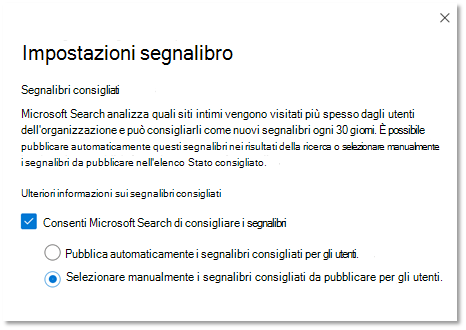

# Gestire i segnalibri

I segnalibri consentono agli utenti di trovare rapidamente siti e strumenti importanti con una semplice ricerca. Ogni segnalibro include un titolo, un URL, un set di parole chiave di facile utilizzo per attivare il segnalibro e una categoria.

## Cosa rende un segnalibro perfetto

Un segnalibro ideale include quattro elementi chiave:

1. Un titolo forte e **informativo.** Mira a non più di otto parole o a un massimo di circa 60 caratteri. Vuoi che gli utenti clicno sul titolo e visualizzano il contenuto, ma evitano clicbait ovvi:
    - Buona: prova i preferiti di questa settimana dal menu della mensa. Title is clear, concise, and interesting, but could be overpromising.
    - Meglio: il menu della mensa di questa settimana. Non è troppopromise o sembra un annuncio.
    - Evita: non credere a cosa verrà visualizzato il menu della mensa questa settimana. Usa cliché clickbait che suonano come un annuncio.
2. Descrizione **sintetica,** di circa 300 caratteri, che riepiloga lo scopo o la funzionalità della risorsa collegata.
3. Raccolta di parole **chiave che** consentono alle persone di trovare il segnalibro durante la ricerca. Consigliamo almeno cinque parole chiave. Includere anche le varianti che gli utenti dell'organizzazione potrebbero usare, ad esempio, menu da pranzo, menu per il pranzo e menu di caffè potrebbero essere tutte varianti per il menu della mensa.
4. Un set utile di **categorie che** semplificano l'ordinamento e il filtro dei segnalibri nell'interfaccia di amministrazione. Gli utenti non vedono mai le categorie assegnate.

## Creare risposte ai segnalibri

Nel [interfaccia di amministrazione di Microsoft 365](https://admin.microsoft.com/), passare a [Segnalibri](https://admin.microsoft.com/Adminportal/Home#/MicrosoftSearch/bookmarks) e scegliere come si desidera creare nuovi segnalibri:

- Aggiungere segnalibri
- Importare SharePoint risultati
- Aggiungere segnalibri predefiniti e segnalibri suggeriti
- Importare segnalibri
- Pubblicare o rivedere i segnalibri consigliati

### Aggiungere segnalibri

Gli amministratori e gli editor di ricerca possono aggiungere segnalibri nel interfaccia di amministrazione di Microsoft 365 pubblicarli o salvarli nella bozza. La pubblicazione di un segnalibro aggiorna immediatamente l'indice di ricerca, rendendolo immediatamente individuabile per gli utenti. È inoltre possibile pianificare un segnalibro specificando la data e l'ora di pubblicazione.

- **Published**: i segnalibri sono disponibili per gli utenti dell'organizzazione tramite Microsoft Search.
- **Bozza:** i segnalibri salvati come bozze non sono disponibili per gli utenti. Utilizzare questo stato se si desidera rivedere o aggiornare i segnalibri prima di pubblicarli.
- **Pianificato**: segnalibri che verranno pubblicati alla data e all'ora specificate.

Puoi usare l'estensione del browser Microsoft Search creator di contenuto per aggiungere facilmente segnalibri. Basta passare al sito che si desidera aggiungere come segnalibro e fare clic su Aggiungi nell'estensione. Per installare l'estensione per Microsoft Edge o Google Chrome, vai all'archivio [Web Chrome](https://chrome.google.com/webstore/detail/microsoft-search-content/nocnablpaoeecfmfnjoheefkogmleipm) e aggiungilo al browser.

### Importare SharePoint risultati

Se l'organizzazione ha configurato i risultati alzati di livello in SharePoint, è possibile importare titoli, URL e descrizioni dai risultati alzati di livello per il tenant in Microsoft Search e rendere disponibile il contenuto importato agli utenti. Nella maggior parte dei casi, l'importazione SharePoint risultati richiede solo pochi minuti. Se si importa un numero elevato di risultati, potrebbero essere necessario fino a 48 ore. Si tratta di un modo semplice per popolare rapidamente i risultati della ricerca e renderlo più efficace per gli utenti. È consigliabile usare i risultati alzati di SharePoint come riferimento per comprendere come assegnare un nome e creare risultati di ricerca pertinenti.

### Aggiungere segnalibri predefiniti e suggeriti

Abbiamo incluso alcuni segnalibri suggeriti predefiniti che gli utenti potrebbero trovare utili, tra cui segnalibri per le risorse umane, vantaggi, supporto IT, gestione delle password e altro ancora. Rivedi, aggiorna e pubblica questi segnalibri suggeriti per fornire subito risultati di alta qualità agli utenti.

Gli utenti possono anche suggerire segnalibri che desiderano essere aggiunti usando i collegamenti di feedback in Microsoft Search. I relativi suggerimenti verranno visualizzati come segnalibri suggeriti.

### Importare segnalibri

Utilizzare la funzionalità Importa per semplificare e velocizzare l'aggiunta o la modifica di un numero elevato di segnalibri. Usalo per:

- Aggiunta in blocco di segnalibri: aggiungere dettagli nel file modello di segnalibro e quindi importarlo.
- Modifica in blocco dei segnalibri: esporta i segnalibri in un file .csv, modifica i dettagli del segnalibro nel file esportato e quindi importa il file modificato.

Alcuni punti importanti relativi al file modello:

- Non modificare mai i dati in questi campi: *ID,* Ultima *modifica* e *Ultima modifica da*
- Se si include *l'ID* di un segnalibro esistente, questo verrà sostituito con le informazioni nel file di importazione.
- Per i segnalibri esistenti con lo stesso titolo o URL, il segnalibro verrà aggiornato con le informazioni nel file di importazione.
- Non tutti i campi sono obbligatori nel file modello e i campi obbligatori variano in base allo stato del segnalibro.
- In base al *campo Stato,* i segnalibri verranno salvati come bozza, suggeriti, pianificati, esclusi oppure verranno pubblicati automaticamente.
- Per i partner che gestiscono più organizzazioni, è possibile esportare i segnalibri da un'organizzazione e importarli in un'altra. È tuttavia necessario rimuovere i dati nella colonna *ID* prima di eseguire l'importazione.

### Evitare gli errori di importazione

Se i dati necessari sono mancanti o non validi, si riceverà un messaggio di errore e viene generato un file di log con altre informazioni sulle righe e sulle colonne da correggere. Apportare le modifiche necessarie e riprovare l'importazione del file. Non è possibile importare o salvare segnalibri finché non vengono risolti tutti gli errori.

Per evitare errori, verificare che il file di importazione sia formattato correttamente e che:

- Includa la riga di intestazione e tutte le colonne presenti nel modello di importazione
- L'ordine delle colonne equivalga a quello del modello di importazione
- Tutte le colonne hanno valori, ad eccezione delle tre che possono essere vuote: *ID,* Ultima *modifica* e *Ultima modifica da*
- La *colonna State* non è vuota, sono necessarie informazioni
- Quando si importano segnalibri Published, Suggested, Scheduled o Draft, le colonne *Title,* *URL* e *Keywords* sono necessarie
- Quando si importano segnalibri esclusi, la *colonna URL* è obbligatoria

Per evitare errori di duplicazione da segnalibro a segnalibro:

- Non usare URL duplicati per segnalibri diversi. Se un URL viene assegnato a un altro segnalibro e si tenta di aggiungerlo di nuovo da un file di importazione, verrà visualizzato un errore. Questo vale anche per gli URL duplicati per altri tipi di risposte.
- Quando si aggiornano segnalibri esistenti, utilizzare la colonna *ID segnalibro.* È possibile aggiornare qualsiasi altra proprietà di un segnalibro esistente, ad esempio parola chiave o descrizione, ma è consigliabile verificare che *l'ID* segnalibro si trova nella colonna appropriata del file di importazione. Se *l'ID segnalibro* è presente, non verrà considerato come nuova aggiunta e non verrà elaborato come errore.

### Pubblicare o rivedere i segnalibri consigliati

Per ridurre lo sforzo manuale necessario per aggiungere segnalibri, Microsoft Search valutare i collegamenti SharePoint'organizzazione e consigliare i segnalibri. È possibile esaminarli prima di pubblicarli o impostarli per la pubblicazione automatica. Non è necessaria alcuna configurazione per i segnalibri consigliati, sono abilitati e impostati per la pubblicazione automatica per impostazione predefinita. Per modificare queste impostazioni in qualsiasi momento, seleziona **Gestisci segnalibri** per aprire il pannello Impostazioni segnalibro.

Se i segnalibri consigliati sono abilitati, il motore di raccomandazione valuterà SharePoint siti dell'organizzazione per identificare i collegamenti a traffico elevato. Dopo un periodo di valutazione iniziale, i segnalibri consigliati verranno pubblicati automaticamente o aggiunti all'elenco dei segnalibri suggeriti. Il ciclo successivo, ovvero un periodo di valutazione di 30 giorni seguito dalla pubblicazione automatica o dall'aggiunta di segnalibri suggeriti, inizierà.

Consigliamo agli amministratori o agli editori di ricerca di esaminare regolarmente questi segnalibri pubblicati automaticamente o suggeriti. Inoltre, i segnalibri consigliati non includeranno mai gli URL trovati nei segnalibri pubblicati, suggeriti, pianificati o esclusi esistenti.

Per garantire che solo gli utenti con accesso vedano un segnalibro consigliato nei risultati di lavoro, è inclusa una funzionalità di controllo di accesso per tutti i segnalibri consigliati. Gli utenti non potranno mai visualizzare un segnalibro consigliato per SharePoint sito a cui non possono accedere. Questo controllo di accesso è controllato dall'opzione Solo le persone con accesso a **questo collegamento** nell'impostazione Gruppi per ogni segnalibro consigliato.

Il controllo di accesso verrà interrotta se l'URL nel segnalibro consigliato o nell'impostazione Gruppi viene modificato.

Per impedire al motore di suggerimenti di pubblicare o suggerire un segnalibro a un sito specifico, è possibile aggiungere l'URL a un elenco escluso. Il motore dei suggerimenti non pubblicherà mai o suggerirà mai un segnalibro per un sito escluso o una pagina all'interno di un sito escluso.

## Informazioni sulle parole chiave e sulle parole chiave riservate

Un segnalibro può avere più parole chiave e condividere la stessa parola chiave, ma non è possibile condividere la parola chiave riservata. Una parola chiave riservata è un termine o una frase univoca che attiva un segnalibro specifico. Una parola chiave riservata può essere associata a una sola risposta. Usa parole chiave riservate con parsimonio.

## Domande frequenti

**D: Quanto tempo è necessario per la visibilità di un segnalibro Microsoft Search dopo la pubblicazione?**

**A:**  Un segnalibro è disponibile in Microsoft Search immediatamente dopo la pubblicazione.

**D: Quanto tempo è necessario per la visualizzazione di un segnalibro consigliato?**

**A:**  I segnalibri consigliati verranno visualizzati Microsoft Search se sono abilitati sia i segnalibri consigliati che la pubblicazione automatica. Durante il periodo di valutazione iniziale, il motore di raccomandazione valuterà il traffico SharePoint per identificare i segnalibri adatti e quindi li ripubblica automaticamente. Una volta pubblicati, diventano immediatamente disponibili in Microsoft Search.

**D: Quanto tempo è necessario per rimuovere un segnalibro eliminato Microsoft Search risultati?**

**A**: I segnalibri eliminati vengono immediatamente rimossi dai risultati del lavoro.

**D: Si consiglia Microsoft Search segnalibri da siti in tutte le lingue?**

**A:** Sì, Microsoft Search è possibile consigliare segnalibri da qualsiasi sito SharePoint interno, indipendentemente dalla lingua.

**D: È possibile interrompere la visualizzazione dei segnalibri consigliati nei risultati della ricerca?**

**A:** Per interrompere la visualizzazione dei segnalibri consigliati, disattivare l'impostazione di pubblicazione automatica nell'interfaccia di amministrazione. I segnalibri consigliati verranno aggiunti all'elenco dei segnalibri suggeriti.

**D: Come è possibile identificare un segnalibro consigliato nei risultati della ricerca o nell'interfaccia di amministrazione?**

**A:** Nei risultati della ricerca, i segnalibri consigliati includono la frase "Consigliato per te" prima dell'URL. Nell'interfaccia di amministrazione, i segnalibri consigliati avranno il valore Owner "SYSTEM".

**D: Come viene gestito l'accesso a un segnalibro consigliato?**

**A**: Un motore di accesso progettato da Microsoft determina se l'URL del segnalibro è accessibile a un determinato utente e mostrerà solo il segnalibro consigliato al gruppo di destinatari corretto. Tuttavia, se l'URL viene modificato o viene modificata l'impostazione Gruppi, il motore di accesso progettato verrà disabilitato.

**D: Cosa succede se non viene eseguita alcuna azione sui segnalibri consigliati aggiunti all'elenco Consigliato?**

**A**: Per evitare un volume elevato di segnalibri nell'elenco consigliato, un segnalibro consigliato (proprietario = SISTEMA) verrà eliminato dopo 180 giorni.

**D: Dove si trova l'ID app per un'app Power?**

**A**: passare al sito Power Apps e visualizzare il riquadro Dettagli per l'app. Altre informazioni su [come ottenere un ID app](/powerapps/maker/canvas-apps/get-sessionid#get-an-app-id).