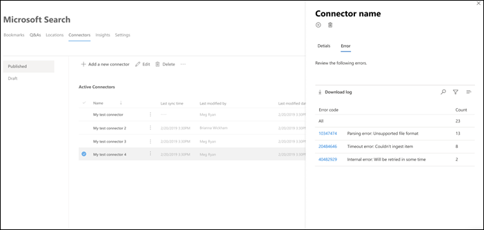
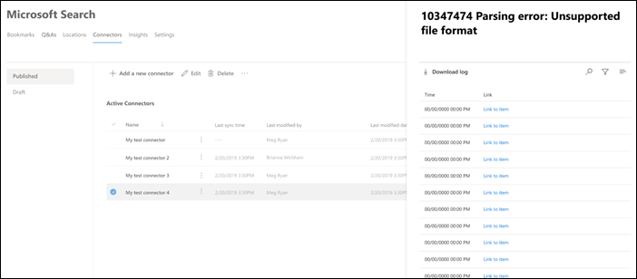

<!-- markdownlint-disable no-inline-html -->

# Gestire le connessioni per Microsoft Search

Per accedere e gestire i connettori, è necessario essere designati come amministratori della ricerca per il tenant. Contattare l'amministratore tenant per eseguire il provisioning dell'utente per il ruolo di amministratore della ricerca.

## Per iniziare

Passare alla [scheda Connettori](https://admin.microsoft.com/Adminportal/Home#/MicrosoftSearch/Connectors) nell'interfaccia di [amministrazione di Microsoft 365](https://admin.microsoft.com).

Per ogni tipo di connettore, l'interfaccia di [amministrazione di Microsoft 365](https://admin.microsoft.com) supporta le operazioni illustrate nella tabella seguente:

Operazione | Connettore basato su Microsoft | Partner o connettore personalizzato
--- | --- | ---
Aggiungere una connessione | : heavy_check_mark: (vedere [Configure your Microsoft-built Connector](configure-connector.md)) | : x: (fare riferimento al partner o all'amministratore del connettore basato su personalizzato)
Eliminazione di una connessione | : heavy_check_mark: | : heavy_check_mark:
Modificare una connessione pubblicata | : heavy_check_mark: nome   : heavy_check_mark: Descrizione   : heavy_check_mark: credenziali di autenticazione per l'origine dati esterna   : heavy_check_mark: credenziali del gateway per l'origine dati locale   : heavy_check_mark: pianificazione dell'aggiornamento   | : heavy_check_mark: nome   : heavy_check_mark: Descrizione
Modificare una connessione di sformo | : heavy_check_mark: | x

## Monitorare lo stato della connessione

Dopo aver creato una connessione, il numero di elementi elaborati viene visualizzato nella scheda **connettori** della pagina di **ricerca di Microsoft** . Una volta completata la ricerca per indicizzazione completa iniziale, viene visualizzato lo stato di avanzamento delle ricerche per indicizzazione incrementali periodiche. In questa pagina vengono fornite informazioni sulle operazioni quotidiane del connettore e una panoramica dei registri e della cronologia degli errori.

Quattro Stati vengono visualizzati nella colonna **stato** su ogni connessione:

* **Sincronizzazione**. Il connettore esegue la ricerca per indicizzazione dei dati dall'origine per indicizzare gli elementi esistenti e apportare eventuali aggiornamenti.

* **Enabled**: la connessione è abilitata e non è in esecuzione una ricerca per indicizzazione attiva. **Data ultima sincronizzazione** indica quando è stata eseguita l'ultima ricerca per indicizzazione riuscita. La connessione è fresca come l'ultima ora di sincronizzazione.

* **Sospesa**. Le ricerche per indicizzazione vengono sospese dagli amministratori tramite l'opzione pause. La ricerca per indicizzazione successiva viene eseguita solo quando riprende manualmente. Tuttavia, i dati provenienti da questa connessione continuano a essere disponibili per la ricerca.

* **Operazione non riuscita**. La connessione ha avuto un errore critico. Questo errore richiede un intervento manuale. L'amministratore deve intraprendere un'azione appropriata in base al messaggio di errore visualizzato. I dati indicizzati fino a quando non si è verificato l'errore sono disponibili per la ricerca.

### Visualizzare le ultime informazioni di ricerca per indicizzazione

Dopo aver completato la prima ricerca per indicizzazione completa o incrementale iniziale, gli ultimi valori di dati di ricerca per indicizzazione vengono visualizzati nell'ultima intestazione di ricerca per indicizzazione nel riquadro dei dettagli. Se non è stata eseguita l'ultima ricerca per indicizzazione, non verranno visualizzate informazioni nell'ultima intestazione di ricerca per indicizzazione. Queste informazioni sull'ultima ricerca per indicizzazione consentiranno di approfondire la modalità di esecuzione della ricerca per indicizzazione e di eseguire le operazioni necessarie laddove necessario.

Per ogni connessione saranno disponibili i seguenti valori di ricerca per indicizzazione:

Valore | Descrizione
--- | ---
Completata in | Data e ora in cui è stata completata la ricerca per indicizzazione
Tipo | Ricerca per indicizzazione incrementale o completa
Durata | quanto tempo è necessario per completare l'ultima ricerca per indicizzazione
Operazioni riuscite | Numero di elementi che sono stati correttamente ingeriti nell'ultima ricerca per indicizzazione
Errori | Numero di elementi che hanno avuto un errore nell'ultima ricerca per indicizzazione

### Errori di monitoraggio

Per ogni **connettore attivo** nella scheda **connettori** , tutti gli errori di ricerca per indicizzazione esistenti vengono visualizzati sotto la scheda **errore** . La scheda elenca i codici di errore, il numero di ogni e le opzioni di download dei log degli errori. Vedere l'esempio nell'immagine seguente. Selezionare un **codice di errore** per visualizzare i dettagli dell'errore.

Per visualizzare i dettagli specifici di un errore, selezionarne il codice di errore. Viene visualizzata una schermata con informazioni dettagliate sull'errore e un collegamento. Gli errori più recenti vengono visualizzati nella parte superiore. Vedere l'esempio nella tabella seguente.

Di seguito è riportato l'elenco dei diversi errori che possono essere visualizzati su qualsiasi connessione.

Codice di errore | Messaggio di errore | Soluzione
--- | --- | ---
1000 | L'origine dati non è disponibile. Controllare la connessione a Internet o verificare che l'origine dati sia ancora accessibile dal connettore. | Questo errore si verifica quando l'origine dati non è raggiungibile a causa di un problema di rete o quando l'origine dati viene eliminata, spostata o rinominata. Controllare se i dettagli dell'origine dati forniti sono ancora validi.
1001 | Non è possibile aggiornare i dati, in quanto l'origine dati sta strozzando il connettore. | Per delimitare l'origine dati, controllare se i limiti di scalabilità possono essere aumentati o attendere fino a un periodo di tempo meno elevato per il traffico del giorno.
1002 | Non è possibile eseguire l'autenticazione con l'origine dati. Verificare che le credenziali associate a questa origine dati siano corrette. | Fare clic su **modifica** per aggiornare le credenziali di autenticazione.
1003 | L'account associato al connettore non dispone dell'autorizzazione necessaria per accedere all'elemento. |  Verificare che l'account appropriato abbia accesso all'elemento che si desidera indicizzare.
1004 | Impossibile raggiungere il gateway di dati locale. Verificare che il servizio gateway sia in esecuzione e che i dettagli del gateway vengano aggiornati nella configurazione della connessione. | Controllare il computer con il gateway, aprire l'applicazione Power BI gateway e verificare che il gateway sia in esecuzione. Verificare che il gateway utilizzi lo stesso account di amministratore di Microsoft Search, quindi accertarsi che tutti i dettagli del gateway siano tutti aggiornati nella configurazione della connessione.
1005 | Le credenziali associate a questa origine dati sono scadute. Rinnovare le credenziali e aggiornare la connessione. | Fare clic su **modifica** per aggiornare le credenziali di autenticazione.
1006 | La versione del gateway è obsoleta e non supporta più questo connettore. Sarà necessario aggiornare il gateway. | Visitare [installare un gateway di dati locale](https://docs.microsoft.com/data-integration/gateway/service-gateway-install) per scaricare e installare la versione più recente del gateway di Power bi sul computer contenente il gateway.
1007 | Non è stata rilevata alcuna licenza valida Power BI. Per eseguire questa ricerca per indicizzazione, è necessaria una licenza di Power BI valida. | Per eseguire questa ricerca per indicizzazione, è necessaria una licenza di Power BI valida. Verificare che l'organizzazione disponga di una licenza valida. In caso affermativo, riprova. In caso contrario, ottenere una licenza e quindi riprovare.
1008 | L'utilizzo totale della quota del tenant ha raggiunto il limite. Provare a eliminare una connessione per liberare parte della quota o regolare i filtri di ingestione per ottenere meno dati. | Provare a eliminare una connessione per liberare parte della quota o regolare i filtri di ingestione per ottenere meno dati. Se non si risolve il problema, contattare il supporto tecnico Microsoft.
2001 | L'indicizzazione viene limitata a causa di un numero elevato di aggiornamenti nella coda. A seconda della coda, il completamento degli aggiornamenti può richiedere del tempo. | Attendere che la coda venga deselezionata.
2002 | Indicizzazione non riuscita a causa della formattazione degli elementi non supportata. | Per ulteriori informazioni, vedere documentazione specifica del connettore.
2003 | Indicizzazione non riuscita a causa del contenuto di elementi non supportati. | Per ulteriori informazioni, vedere documentazione specifica del connettore.
2010 | Questa connessione non è più valida a causa di un aggiornamento eseguito da Microsoft. Eliminare la connessione e crearne uno nuovo. | Eliminare la connessione e crearne uno nuovo.
5000 | Qualcosa è andato storto. Se questo continua, contattare il supporto. |

## Monitorare l'utilizzo della quota di indice

La quota e il consumo di indice disponibili sono visualizzati nella pagina di destinazione dei connettori.

>[!NOTE]
>Durante il periodo di anteprima, ogni organizzazione che prova i connettori del grafico è stata fornita una quota fissa libera di fino a 2 milioni elementi in tutte le connessioni. Con i connettori grafico generalmente disponibili, la quota libera scadrà il 1 ° febbraio 2021 per le organizzazioni che utilizzano i connettori grafico in anteprima.
>I connettori del grafico Microsoft-built etichettati come ["Preview"](connectors-preview.md) non verranno inclusi nella quota totale di indice addebitata per l'organizzazione. Tuttavia, conterà verso il numero massimo di 10 connessioni che è possibile configurare per l'organizzazione e il numero massimo di 7 milioni elementi che l'organizzazione può indicizzare tra le connessioni; ogni connessione è limitata a 700.000 elementi. 

La barra di utilizzo delle quote indicherà vari stati basati sull'utilizzo della quota da parte dell'organizzazione:

Stato | Consumi delle quote
--- | ---
Normale | 1-69%
Alta | 70-89%
Critico | 90%-99%
Full | 100%

Il numero di elementi indicizzati verrà visualizzato anche con ogni connessione. Il numero di elementi indicizzati da ciascuna connessione contribuisce alla quota totale disponibile per l'organizzazione.

Quando si supera la quota di indice per l'organizzazione, tutte le connessioni attive verranno influenzate e tali connessioni funzioneranno nello stato **limite superato** . In questo stato, le connessioni attive  

* Non sarà in grado di aggiungere nuovi elementi.

* Sarà in grado di aggiornare o eliminare gli elementi esistenti.

Per risolvere il problemi, è possibile eseguire una delle operazioni seguenti:

* Informazioni su come acquistare la quota di indice per l'organizzazione in base ai [requisiti di licenza e ai prezzi](licensing.md).

* Identificare le connessioni che dispongono di un numero eccessivo di contenuti che vengono ingeriti e aggiornarli in modo che gli elementi vengano indicizzati in meno per ottenere quote. Per aggiornare la connessione, è necessario eliminare e creare una nuova connessione con un nuovo filtro di ingestione che comporta un numero minore di elementi.

* Eliminare definitivamente una o più connessioni

## Limitazioni

* Quando si **pubblica** un connettore basato su Microsoft, potrebbero essere necessari alcuni minuti per la creazione della connessione. Durante tale periodo, la connessione mostrerà lo stato in sospeso.

* L'interfaccia di [amministrazione di Microsoft 365](https://admin.microsoft.com) non supporta la modifica dello **schema di ricerca** dopo la pubblicazione di una connessione. Per modificare lo schema di ricerca, eliminare la connessione e crearne uno nuovo.

* La velocità effettiva di ingestione viene limitata a circa quattro elementi al secondo.

* Non è disponibile alcun supporto per gli aggiornamenti dello schema. Dopo aver creato una configurazione di connessione, non è possibile aggiornare lo schema. È possibile eliminare e ricreare la connessione solo.

* Esiste un limite per le connessioni. Ogni tenant è in grado di creare fino a 10 connessioni.

* La modifica del supporto per la connessione non è disponibile. Dopo aver creato la connessione, non è possibile modificarla o modificarla. Se è necessario modificare i dettagli, è necessario eliminare e ricreare la connessione.
