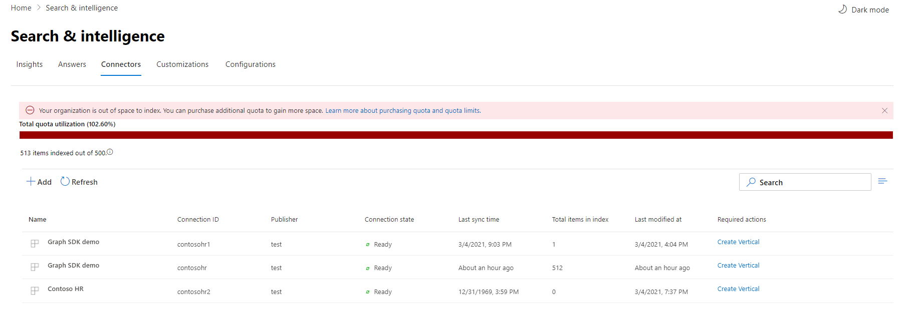

<!-- markdownlint-disable no-inline-html -->

# Monitorare le connessioni

Per accedere e gestire i connettori, è necessario essere designati come amministratore della ricerca per il tenant. Contattare l'amministratore tenant per eseguire il provisioning del ruolo di amministratore della ricerca.

## Operazioni di connessione

Passare alla scheda [Connettori nell'interfaccia](https://admin.microsoft.com/Adminportal/Home#/MicrosoftSearch/Connectors) di amministrazione di [Microsoft 365.](https://admin.microsoft.com)

Per ogni tipo di connettore, l'interfaccia di amministrazione di [Microsoft 365](https://admin.microsoft.com) supporta le operazioni illustrate nella tabella seguente:

Operazione | Connettori di Graph Microsoft | Connettori partner o grafico
--- | --- | ---
Aggiungere una connessione | :heavy_check_mark: (Vedere Panoramica [dell'installazione](configure-connector.md)) | :x: (Fare riferimento all'esperienza utente dell'amministratore del partner o del connettore personalizzato)
Eliminazione di una connessione | :heavy_check_mark: | :heavy_check_mark:
Modificare una connessione pubblicata | :heavy_check_mark: Nome e descrizione   :heavy_check_mark: Impostazioni di connessione   :heavy_check_mark: etichette di proprietà   :heavy_check_mark: Schema   :heavy_check_mark: Pianificazione aggiornamento   | :heavy_check_mark: Name   :heavy_check_mark: Descrizione
Modificare una bozza di connessione | :heavy_check_mark: | :x:

## Monitorare lo stato della connessione

Dopo aver creato una connessione, il numero di elementi elaborati viene visualizzato nella scheda **Connettori** della pagina **Microsoft Search.** Al termine della ricerca per indicizzazione completa iniziale, viene visualizzato l'avanzamento delle ricerche per indicizzazione incrementali periodiche. In questa pagina vengono fornite informazioni sulle operazioni quotidiane del connettore e una panoramica dei registri e della cronologia degli errori.

Nella colonna Stato vengono visualizzati quattro **stati** per ogni connessione:

* **Sincronizzazione di**. Il connettore esegue la ricerca per indicizzazione dei dati dall'origine per indicizzare gli elementi esistenti e apportare eventuali aggiornamenti.

* **Pronto**: la connessione è pronta e non è in esecuzione alcuna ricerca per indicizzazione attiva. **L'ora dell'ultima** sincronizzazione indica quando si è verificata l'ultima ricerca per indicizzazione completata. La connessione è appena stata stabilita come l'ora dell'ultima sincronizzazione.

* **Paused**. Le ricerche per indicizzazione vengono sospese dagli amministratori tramite l'opzione di sospensione. La ricerca per indicizzazione successiva viene eseguita solo quando viene ripresa manualmente. Tuttavia, i dati di questa connessione continuano a essere ricercabili.

* **Operazione non riuscita.** Si è verificato un errore critico nella connessione. Questo errore richiede un intervento manuale. L'amministratore deve eseguire l'azione appropriata in base al messaggio di errore visualizzato. I dati indicizzati fino a quando non si è verificato l'errore sono ricercabili.

## Monitorare l'utilizzo della quota di indice

La quota di indice e l'utilizzo disponibili vengono visualizzati nella pagina di destinazione dei connettori.

 
>[!NOTE]
>Durante il periodo di anteprima, a ogni organizzazione che provava i connettori Graph è stata fornita una quota fissa gratuita di un massimo di 2 milioni di elementi in tutte le connessioni. Con la disponibilità generale dei connettori Graph, la quota gratuita scadrà il 1° aprile 2021 per le organizzazioni che hanno utilizzato i connettori Graph in anteprima.
>I connettori Microsoft Graph etichettati come ["Anteprima"](./connectors-overview.md) non verranno inclusi nella quota di indice totale addebitata per l'organizzazione. Tuttavia, verrà conteggiato per il numero massimo di 10 connessioni che è possibile configurare per l'organizzazione e il numero massimo di 7 milioni di elementi che l'organizzazione può indicizzare tra le connessioni. ogni connessione è limitata a 700.000 elementi. 

La barra di utilizzo delle quote indicherà diversi stati in base all'utilizzo della quota da parte dell'organizzazione:

Stato | Livelli di utilizzo delle quote
--- | --- 
Normale | 0-79%
Alto | 80-89%
Critico | 90%-99%
Full | 100%

<!-- 

-->

Con ogni connessione verrà visualizzato anche il numero di elementi indicizzati. Il numero di elementi indicizzati da ogni connessione contribuisce alla quota totale disponibile per l'organizzazione.

Quando viene superata la quota di indice per l'organizzazione, verranno influenzate tutte le connessioni attive e tali connessioni funzioneranno nello **stato limite superato.** In questo stato, le connessioni attive  

* Non sarà possibile aggiungere nuovi elementi.

* Sarà possibile aggiornare o eliminare elementi esistenti.

Per risolvere il problema, è possibile eseguire una delle operazioni seguenti:

* Per informazioni su come acquistare la quota di indice per l'organizzazione, vedere [Requisiti di licenza e prezzi.](licensing.md)

* Identificare le connessioni con troppo contenuto ingerito e aggiornarle in modo da indicizzare un numero minore di elementi per creare spazio per la quota. Per aggiornare la connessione, è necessario eliminare e creare una nuova connessione con un nuovo filtro di inserimento che comporta un numero minore di elementi.

* Eliminare definitivamente una o più connessioni