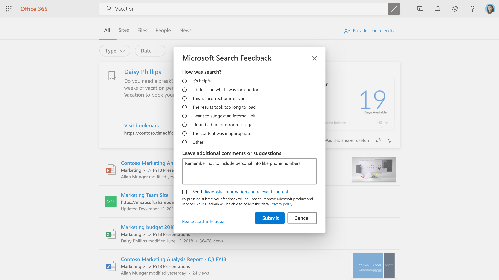

# Gestione dei commenti e suggerimenti degli utenti

La creazione di una grande esperienza di ricerca per gli utenti è una partnership tra Microsoft e l'amministratore della ricerca. Il feedback degli utenti consente di valutare continuamente il prodotto e di sintonizzarlo per la migliore esperienza. Alcuni commenti e suggerimenti, tuttavia, sono indirizzati al meglio dall'utente.

Ora vengono offerti strumenti che consentono di controllare e gestire i commenti e suggerimenti che gli utenti stanno fornendo nell'esperienza di ricerca.

## Come gli utenti inviano commenti e suggerimenti

Poiché gli utenti dell'organizzazione utilizzano la ricerca Microsoft, possono avere un feedback sull'esperienza. Quando si fa clic su un collegamento di commenti e suggerimenti nella pagina dei risultati, è possibile categorizzare i commenti e includere commenti aggiuntivi.

Gli utenti hanno anche la possibilità di inviare la propria query e altre informazioni di diagnostica, insieme alla categoria e ai commenti, a Microsoft. Per [ulteriori](https://privacy.microsoft.com/en-US/privacystatement) informazioni, vedere privacy e modalità di protezione dei dati. I dati di diagnostica contengono le informazioni più importanti che Microsoft deve utilizzare per il miglioramento del prodotto.

La maggior parte dei commenti e suggerimenti viene visualizzata nella sezione [commenti e suggerimenti](https://admin.microsoft.com/Adminportal/Home#/MicrosoftSearch/feedback) dell'interfaccia di amministrazione di Microsoft Search. I commenti e suggerimenti inviati con il suggerimento di una categoria di **collegamento interno** vengono visualizzati come segnalibro consigliato nella sezione [Bookmarks](https://admin-ignite.microsoft.com/Adminportal/Home#/MicrosoftSearch/bookmarks) e possono essere visualizzati filtrando lo stato **suggerito** .

## Esaminare i commenti e suggerimenti

Nella pagina [Commenti](https://admin.microsoft.com/Adminportal/Home#/MicrosoftSearch/feedback) e suggerimenti è possibile esaminare ed esportare i commenti e suggerimenti inviati dagli utenti dell'organizzazione negli ultimi 30 giorni. Dopo che un utente ha inviato commenti e suggerimenti, verrà visualizzato nell'elenco entro 20 minuti. È possibile utilizzare il pulsante Aggiorna per assicurarsi di esaminare i dati più recenti

Utilizzando un filtro, è possibile visualizzare commenti e suggerimenti per i tipi di risposta specifici. È inoltre possibile filtrare in base all'origine e all'intervallo di date.

È possibile utilizzare la casella di ricerca sopra l'elenco dei commenti e suggerimenti per cercare commenti e suggerimenti su una query specifica.

Nell'elenco dei commenti e suggerimenti, la colonna Verbatim indica i commenti e suggerimenti dell'utente. Per leggerlo, fare clic sulla query per aprire il riquadro **Dettagli** .

## Aggiornare lo stato di commenti e suggerimenti

Quando il feedback arriva, sarà in un *nuovo* stato e rimarrà lì fino a quando non verrà modificato in *risolto* o *duplicato*.

Per modificare questo stato:

1. Accanto alla query, selezionare **altre opzioni** (tre punti verticali).
1. Scegliere **Contrassegna come risolvito** o **Segna come Duplica** dal menu.
1. L'elenco verrà aggiornato e mostrerà lo stato di aggiornamento.

È inoltre possibile aggiornare lo stato per più elementi, basta selezionarli e quindi selezionare altre opzioni dopo uno qualsiasi di questi elementi.

## Commenti e suggerimenti per l'esportazione

Se si desidera condividere i commenti di ricerca con altri utenti o conservarli per più di 30 giorni, fare clic su **Esporta.** Un file. csv denominato commenti e suggerimenti con la data, ad esempio "Feedbacks_10_31_2020.csv", verrà scaricato automaticamente.

## Inviare commenti e suggerimenti per gli utenti a Microsoft

Per impostazione predefinita, tutti i commenti e suggerimenti degli utenti vengono inviati a Microsoft e oltre all'utente. Per interrompere l'invio di commenti e suggerimenti a Microsoft, fare clic su **Gestisci impostazioni** e deselezionare la casella **di controllo Invia automaticamente Commenti utente a Microsoft** . Per rendere effettive le modifiche, è possibile richiedere fino a 24 ore.

Se si è deciso di non inviare automaticamente commenti e suggerimenti a Microsoft, è comunque possibile inviare singoli commenti a Microsoft.

1. Selezionare il feedback che si desidera condividere.
1. Nella barra delle azioni, selezionare altro (tre punti) e fare clic su **Invia commenti e suggerimenti a Microsoft**.

1. Lo stato della colonna inviato a Microsoft verrà modificato in sospeso. Quando il feedback viene inviato, verrà modificato in Sì.

Se si condividono commenti e suggerimenti automaticamente o manualmente, non vengono mai incluse query e altre informazioni di diagnostica per gli utenti che hanno scelto di non includere queste informazioni.

## Suggerimenti su come utilizzare il feedback

Come amministratore della ricerca, è necessario comprendere le principali persone dell'organizzazione e i tipi di contenuto in cui le persone in genere interagiscono e cercano. Con questa comprensione, è possibile utilizzare i commenti e suggerimenti per apportare miglioramenti mirati all'esperienza di ricerca degli utenti.

1. "Non ho trovato quello che cercavo" e il feedback simile può essere utilizzato per identificare gli utenti di contenuto desidera, ma non è attualmente incluso nell'indice di ricerca. La determinazione di questo richiede spesso indagini e inferenze in base alla comprensione degli utenti. Una volta trovato, decidere quali metodi di inclusione del contenuto sarebbero più adatti:
    1. I segnalibri sono utili per le origini di contenuto con una pagina di destinazione di alta qualità e una varietà limitata di termini di ricerca, in modo che la community degli utenti ottenga un risultato di alta qualità dal segnalibro e possa quindi trovare in modo efficiente quello che stanno cercando.
    1. Q&A sono utili per le risposte individuali che sono piuttosto frequenti, ma non cambiano.
    1. I connettori sono utili per le origini di contenuto con una vasta gamma di contenuti e una vasta gamma di termini di ricerca.
1. "I risultati sono stati troppo lunghi per caricare" & "ho trovato un problema" possono essere indicatori di un problema più ampio. La ricerca di questo feedback giornaliero può essere di aiuto e, se sono presenti più casi, è possibile verificare l'esperienza di ricerca per se stessi e aprire un caso di supporto con Microsoft, se necessario. Questo tipo di commenti e suggerimenti è importante anche per Microsoft ed è un ottimo motivo per riportare tutti i commenti e suggerimenti.
1. "Si desidera suggerire un collegamento interno" può essere valutato per essere aggiunto come segnalibri o contenuto connesso. Il primo pensiero dovrebbe essere un segnalibro. Se il segnalibro ottiene un utilizzo elevato, è possibile prendere in considerazione la possibilità di portare contenuto tramite un connettore per consentire un'esperienza di ricerca ancora più ricca.
