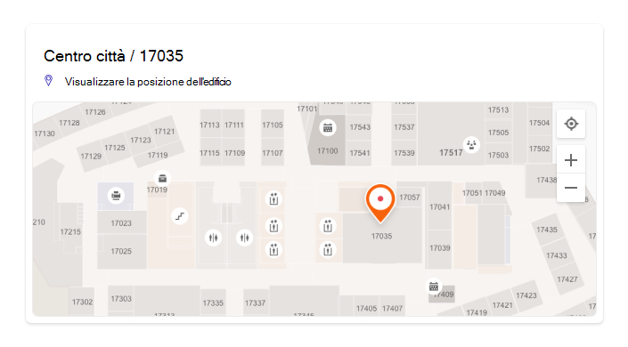
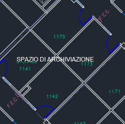
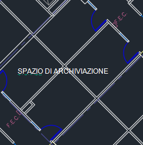
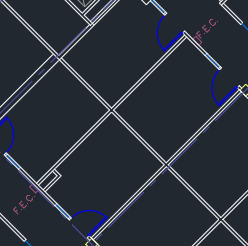
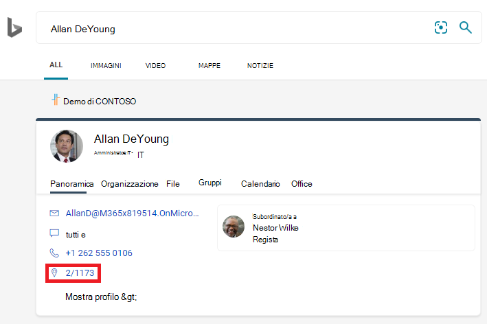
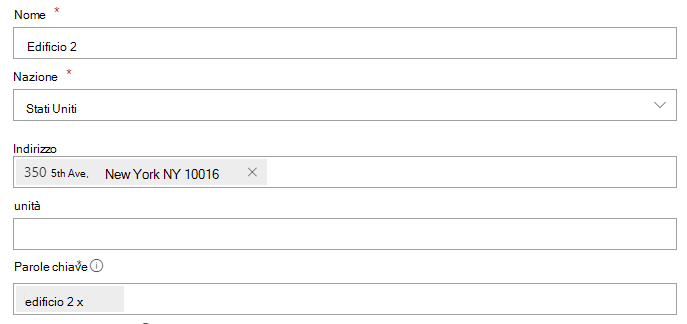
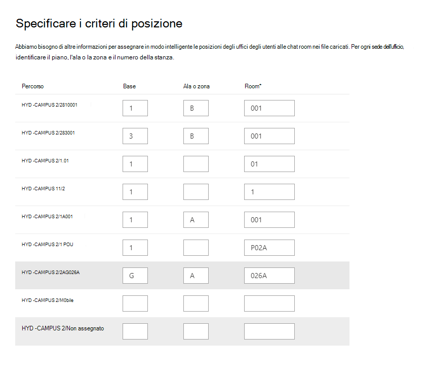

# Gestire le planimetrie

Le planimetrie in Microsoft Search aiutare gli utenti a trovare persone, sale e spazi all'interno di un edificio. I modelli di query che includono il nome completo, il nome, il nome della sala o la posizione della sala di una persona, come questi esempi, restituiranno una planimetria:

- Dov'è l'ufficio di Allan Deyoung?
- Dov'è l'ufficio di Daisy?
- Edificio 2 piano 3
- Area di lavoro-1
- B1/1.20

## Esperienza degli utenti

Gli utenti possono visualizzare le risposte alle planimetrie [Bing,](https://bing.com) [SharePoint](http://sharepoint.com/)e [Office 365](https://office.com). Sono supportati anche altri punti Bing risultati, tra cui Windows ricerca e Microsoft Edge indirizzo. Quando gli utenti ricercano il nome o la posizione di una sala, vedono il punto di interesse contrassegnato nella risposta della planimetria.

> [!div class="mx-imgBorder"]
> 

Quando cerca l'ufficio di una persona, vedrai una risposta simile, con l'immagine del profilo della persona sull'indicatore.

> [!div class="mx-imgBorder"]
> 

## Aggiungere planimetrie

Seguire questa procedura per configurare le risposte alle planimetrie in Microsoft Search.

### Passaggio 1: Determinare i codici predefiniti

I codici predefiniti vengono utilizzati come parte della sede dell'utente. Questi codici verranno utilizzati per l'aggiornamento dei profili utente. Supponiamo che l'organizzazione abbia un edificio a questo indirizzo: *Building 2, 350 5th Avenue, New York City, NY 10016*

Ecco alcuni esempi per il codice dell'edificio: 2, B2, Building2, Building 2 o NYCB2. Ogni edificio deve avere un codice univoco.

### Passaggio 2: rivedere le planimetrie

I file delle planimetrie devono essere in formato DWG, che supporta le etichette di testo. Quando un'etichetta di testo contrassegna una sala, viene definita etichetta di sala. Ecco alcuni esempi di file DWG con diversi tipi di etichette:

| Etichette di testo che includono etichette sala | Etichette di testo ma nessuna etichetta sala | Nessuna etichetta di testo |
|:-----:|:-----:|:-----:|
||||

Come procedura consigliata, le etichette di testo DWG devono contenere numeri di piano, numeri di ala (se pertinenti) e numeri di sala, in questo ordine. Vedi le [domande frequenti per](#frequently-asked-questions) altri esempi di formati di etichette di testo e informazioni sulla visualizzazione e l'aggiornamento dei file DWG.

### Passaggio 3: Aggiornare le posizioni degli uffici nei profili utente

La sede di un utente è una combinazione di un codice di edificio e di un'etichetta di sala. Ad esempio, se il codice dell'edificio è *2* e l'etichetta della sala è *1173,* la posizione dell'ufficio sarà *2/1173*.

Aggiungere o aggiornare le posizioni dell'ufficio per gli utenti con una sede di lavoro assegnata. È possibile eseguire questa operazione  dal proprio profilo utente nelle Microsoft 365 o [nelle](https://portal.azure.com/) Azure Active Directory admin center o nell'Active Directory locale (verrà sincronizzato con Azure Active Directory). *PhysicalDeliveryOfficeName è* il campo utilizzato per la posizione dell'ufficio. Se le etichette delle chat room non includono numeri di piano, vedere le [domande frequenti per](#frequently-asked-questions) suggerimenti.

In questo esempio, l'ufficio di Allan si trova nella sala 1173 al piano 1 dell'edificio 2.

> [!div class="mx-imgBorder"]
> 

Per configurare le planimetrie per le sale  riunioni, aggiungere le posizioni degli uffici nella sezione & attrezzature della interfaccia di amministrazione di Microsoft 365. Per ulteriori informazioni, vedere [Set up room and equipment mailboxes](/microsoft-365/admin/manage/room-and-equipment-mailboxes#set-up-room-and-equipment-mailboxes). Se gli utenti dell'organizzazione possono pianificare la sala o la risorsa per una riunione o un evento, vedere [Change how a room mailbox handles meeting requests](/Exchange/recipients/room-mailboxes#change-how-a-room-mailbox-handles-meeting-requests). Per informazioni sulla configurazione delle aree di lavoro, inclusa la configurazione delle cassette postali sala, vedere il post su Prenotare un'area di lavoro [in Outlook](https://techcommunity.microsoft.com/t5/exchange-team-blog/book-a-workspace-in-outlook/ba-p/1524560).

### Passaggio 4: Verificare la posizione dell'ufficio

Utilizzare Microsoft Search per trovare un utente e verificare che la posizione dell'ufficio sia visualizzata correttamente. Potrebbe essere necessario attendere fino a **72 ore** prima che gli aggiornamenti vengano visualizzati nei risultati della ricerca.

> [!div class="mx-imgBorder"]
> 

### Passaggio 5: Aggiungere posizioni di edificio

Le planimetrie [usano Posizioni](manage-locations.md) per definire gli edifici. [Nell'interfaccia di amministrazione di Microsoft 365](https://admin.microsoft.com), andare a [**Posizioni**](https://admin.microsoft.com/Adminportal/Home#/MicrosoftSearch/locations)e quindi selezionare **Aggiungi**. Immetti il nome, l'indirizzo e le parole chiave per l'edificio. Aggiungere il numero di edifici necessario.

> [!div class="mx-imgBorder"]
> 

Per ulteriori informazioni sulle posizioni, vedere [Manage Locations](manage-locations.md)

### Passaggio 6: Raccogliere e organizzare le posizioni degli uffici

Prima di poter caricare le planimetrie, è necessario indicizzare le posizioni degli uffici. Operazione che può richiedere fino a 48 ore. Il tempo totale dipende dalle dimensioni dell'organizzazione.

[Nell'interfaccia di](https://admin.microsoft.com)amministrazione passare [**a Piani di piano**](https://admin.microsoft.com/Adminportal/Home#/MicrosoftSearch/floorplans)e quindi selezionare Avvia **indicizzazione.** Se non viene visualizzato questo avviso, questo passaggio è già stato completato per l'organizzazione

### Passaggio 7: Upload piani

1. [Nell'interfaccia di amministrazione](https://admin.microsoft.com)passare a Piani di [**piano.**](https://admin.microsoft.com/Adminportal/Home#/MicrosoftSearch/floorplans)

2. Selezionare un edificio nell'elenco a discesa e selezionare **Avanti.** Se l'edificio non è elencato, tornare indietro e [aggiungere posizioni dell'edificio.](#step-5-add-building-locations)

3. Selezionare **Upload file** e quindi scegliere la planimetria che si desidera caricare.

4. Al termine del caricamento, è necessario immettere il numero di piano rappresentato nel file della planimetria. Quindi, scegliere **Avanti**.

5. (Facoltativo) Se il pavimento ha ali o zone, immettere tale dettaglio.

6. Verrà visualizzata una schermata di revisione che elenca il numero di sedi degli uffici mappate alle planimetrie. Selezionare **Dettagli** per verificare che il mapping sia corretto.
    - Se nessun utente è mappato o non si è soddisfatti del mapping, selezionare **Continua mapping**.
    - Per pubblicare, selezionare **Ignora e pubblica**.

1. Immettere il codice dell'edificio per questa planimetria. Il codice dell'edificio è disponibile nella proprietà della sede dell'utente. Ad esempio, se la sede di un utente è **2/1173,** il codice di edificio è **2**.

1. Nella schermata di revisione ripetere il passaggio 6 per verificare che il mapping sia corretto. Se si è soddisfatti del mapping, selezionare **Continua mapping** e Ignora **e pubblica**. In caso contrario, selezionare **Continua mapping** e passare alla schermata Specifica modelli di posizione.

1. (Facoltativo) Esaminare e identificare la logica di denominazione per tutti i modelli di posizione univoci per questo edificio all'interno della directory di Azure, quindi selezionare **Avanti.**

1. Nella schermata di revisione ripetere il passaggio 6 per verificare che il mapping sia corretto.

1. Quando si è pronti, selezionare **Pubblica** per rendere disponibile la planimetria in Microsoft Search.

> [!NOTE]
> **La pubblicazione delle planimetrie di piano richiede 48 ore.** Dopo di che gli utenti potranno vedere i risultati di una planimetria del piano simile a quello riportato di seguito quando ricercano l'ufficio di un collega.

> [!div class="mx-imgBorder"]
> 

### Passaggio 8: (facoltativo) Specificare i modelli di posizione

Dopo aver caricato una planimetria, le etichette di testo della sala vengono confrontate con le posizioni dell'ufficio nei profili degli utenti. Se le posizioni o le etichette di testo dell'ufficio non seguono in modo  coerente i modelli di denominazione consigliati nei passaggi [2](#step-2-review-your-floor-plans) e [3,](#step-3-update-office-locations-on-user-profiles)utilizzare la schermata Specifica modelli di posizione per aggiungere ulteriori informazioni per completare il mapping. I modelli di posizione vengono utilizzati per estrarre informazioni su pavimento, ala e sala dalle posizioni degli uffici di AAD.

> [!div class="mx-imgBorder"]
> 

Il pavimento e l'ala sono facoltativi, è necessaria solo la sala ed è possibile ignorare le posizioni in base alle esigenze.

## Aggiornare le planimetrie

Prima di aggiornare una planimetria esistente, verificare che le posizioni degli uffici di AAD siano aggiornate e che siano state attese 48 ore per l'elaborazione di eventuali aggiornamenti di AAD. Per aggiornare una planimetria, passare a Planimetrie, selezionare l'edificio per la planimetria e selezionare **Modifica**. Se la planimetria è cambiata strutturalmente, ad esempio a causa di rimodellamenti, rimuovere il vecchio file, quindi caricare e pubblicare il nuovo file DWG.

> [!NOTE]
> Non è necessario aggiornare le planimetrie quando gli utenti passano a un piano già mappato. È sufficiente aggiornare il profilo utente in modo che rifletta la nuova posizione dell'ufficio:
>
> - Nella finestra interfaccia di amministrazione di Microsoft 365 (Utenti attivi > Account > Gestire le informazioni di contatto)
> - Nell'interfaccia di amministrazione di Azure Active Director (Utenti > profilo > Modificare le informazioni di contatto)
> - In Active Directory locale (verrà sincronizzato con Azure Active Directory)

## Eliminare le planimetrie

Per eliminare una singola planimetria, passare a [Planimetrie del piano](https://admin.microsoft.com/Adminportal/Home#/MicrosoftSearch/floorplans) e selezionare l'edificio. Successivamente, selezionare la planimetria e selezionare **Rimuovi**. Per eliminare tutte le planimetrie di un edificio, passare a [Posizioni,](https://admin.microsoft.com/Adminportal/Home#/MicrosoftSearch/locations)selezionare l'edificio e selezionare **Elimina.**  

## Risoluzione dei problemi

| Passaggio | Messaggio di errore | Tipo | Azione |
|:-----|:-----|:-----|:-----|
|Upload piani|Impossibile leggere CC_1.dwg. Ricaricare o eliminare la planimetria.|Error|Provare a caricare di nuovo il file. Se non funziona, eliminare il file e riprovare.|
|Upload piani|Esistono due file denominati CC_1.dwg. Eliminarne uno o caricarlo di nuovo con un altro nome.|Error|Se il nome del file non è corretto, aggiungere il numero del piano o dell'ala per creare un nome file univoco e caricarlo di nuovo. Se hai aggiunto accidentalmente lo stesso file due volte, elimina solo uno di essi.|
|Upload piani|Nessun dato trovato.|Error|Controlla il file per assicurarti che sia quello corretto e quindi caricalo di nuovo o eliminalo.|
|Upload piani|Riferimenti esterni mancanti in questo file. Caricare CC_1_furniture.dwg o eliminare questo file.|Avviso|Upload file di riferimento esterni o eliminare.|
|Upload piani|Impossibile leggere i numeri di sala o i tag nel file DWG. Eliminare questo file.|Avviso|Controllare il file DWG per verificare che i dati siano inclusi, quindi eliminare il file e riprovare.|
|Collegare le posizioni dell'ufficio|Nessuna posizione dell'ufficio trovata in Azure Active Directory. Aggiungere i dati sulla posizione Azure Active Directory prima di configurare le planimetrie.|Error|[Aggiornare le posizioni degli uffici nei profili utente](#step-3-update-office-locations-on-user-profiles) |

## Domande frequenti

**D:** Come si visualizzano e modificano i file DWG?

**A:** Utilizzare una delle opzioni seguenti per visualizzare i file DWG:

- Upload il file da SharePoint e aprirlo.
- Aprire il file in [Microsoft Visio](https://support.office.com/article/Open-insert-convert-and-save-DWG-and-DXF-AutoCAD-drawings-60cab691-0f4c-4fc9-b775-583273c8dac5) o [Autodesk DWG TrueView](https://www.autodesk.com/products/dwg).
- Upload il file in [Visualizzatore online di Autodesk.](https://viewer.autodesk.com/)

È possibile creare o modificare un file DWG in qualsiasi editor DWG, inclusi Visio o Autodesk AutoCAD. Per utilizzare Visio, vedere [Create a floor plan](https://support.microsoft.com/office/create-a-floor-plan-ec17da08-64aa-4ead-9b9b-35e821645791). La dimensione massima del file per un singolo file DWG è di 16 MB.

**D:** Come si aggiungono etichette di testo alle sale non contrassegnate?

**A:** Aprire il file DWG in un editor e [aggiungere etichette di sala](https://knowledge.autodesk.com/support/autocad-map-3d/learn-explore/caas/CloudHelp/cloudhelp/2019/ENU/MAP3D-Learn/files/GUID-4854F184-6279-4E0C-9487-34A4759017F6-htm.html).

**D:** Qual è il formato migliore per le etichette di testo nei file DWG?

**A:** Per ottenere risultati ottimali, le etichette di testo DWG devono essere una singola riga contenente numeri di piano, numeri di ala (se pertinenti) e numeri di sala, in questo ordine. Negli esempi seguenti viene utilizzato 2 o CITY CENTER per il codice di compilazione.
<!-- markdownlint-disable no-inline-html -->
|Tipi di etichette sala|Floor|Wing/Zone|Room|Etichetta di testo di esempio|Office percorso (codice di compilazione/etichetta di testo)|
|:-----|:-----|:-----|:-----|:-----|:-----|
|Ha piano e numero di sala|1| |173|1173|2/1173|
|| 21| |45|21045|2/21045|
||23| |100K|23-100K|23/02/100.00|
||1| |G06-07|1G06-07|CENTRO CITTÀ/1G06-07|
||2| |1024A|02.1024A|CITY CENTER/02.1024A|
|Ha numero di piano, ala e sala|1|A|173|1A173|2/1A173
||2|Z1|128b|2Z1128b|2/2Z1128b

Inoltre, nel file DWG non sono incluse etichette di testo aggiuntive, come le dimensioni della sala o il nome dell'architetto.

**D:** Esistono limiti di caratteri per le etichette di testo?

**A:** Le etichette di testo devono essere una riga singola. I caratteri speciali possono essere utilizzati per i codici di costruzione o le etichette delle chat room, ma non per i valori del piano o dell'ala.

**D:** Posso usare un file DWG che non include i numeri di piano?

**A:** È consigliabile che le etichette di testo DWG includano i numeri di piano, ma non sono obbligatorie, vedere modelli di denominazione [nel passaggio 2.](#step-2-review-your-floor-plans) È inoltre consigliabile includere il numero di piano come parte della sede dell'ufficio nelle informazioni di contatto dell'utente. Dopo aver caricato il file DWG, dovrai usare la schermata facoltativa **Specifica** modelli di posizione per completare il processo di mapping per queste etichette non standard.

Ad esempio, un file DWG che include numeri di sala, ma nessun numero di piano, può essere simile al seguente:

> [!div class="mx-imgBorder"]
> 

La posizione dell'ufficio nel profilo dell'utente sarà 2/1175 dove "2" è il codice dell'edificio, "1" è il numero di piano e "175" è il numero della sala.

**D:** È stata aggiunta una posizione dell'edificio, perché non viene visualizzata l'opzione per aggiungere una planimetria?

**A:** Le posizioni degli edifici aggiunte o aggiornate di recente potrebbero non essere ancora presenti nell'indice di ricerca. La visualizzazione di posizioni nuove o modificate nei risultati di ricerca può richiedere diverse ore. Inoltre, se l'edificio ha una bozza o una planimetria pubblicata, selezionare il nome dell'edificio e quindi aggiungere altri piani.

**D:** Perché l'elenco Selezionare un edificio non mostra l'elenco completo delle posizioni?

**A:** Nell'elenco Selezionare un edificio vengono visualizzati solo gli edifici senza planimetrie. Per gli edifici con almeno una bozza o una planimetria pubblicata, aggiungere altre planimetrie selezionando l'edificio nell'elenco e quindi caricando.

**D:** Esistono limiti al numero di piani piano che è possibile caricare?

**A:** No. Non esiste un massimo, per ogni edificio o per organizzazione.

**D:** Posso usare un file DWG che contiene piani per più ali/zone all'interno di un singolo piano?

**A:** Finché tutti i piani sono per lo stesso piano, è possibile caricare un file DWG contenente le planimetrie per più ali/zone. Verificare che le etichette di testo e le posizioni dell'ufficio seguano le procedure consigliate per la denominazione [nei passaggi 2](#step-2-review-your-floor-plans) [e 3.](#step-3-update-office-locations-on-user-profiles)

Se il file DWG contiene dati per più ali, lasciare vuoto il campo wing durante il caricamento.

**D:** Posso caricare due file DWG per lo stesso piano, uno con solo il piano definito e l'altro con piano e ala definiti?

**A:** Puoi caricare più di un file DWG per lo stesso piano, ma dovrai indicare un'ala o una zona per ogni file. Nell'esempio seguente devi immettere un valore Wing o zone per il file FloorPlan1.dwg prima di passare alla schermata successiva. Se il file della planimetria non ha un'ala o ha più ali, immetti un valore come 0 o X nel campo Ala o zona per continuare.

> [!div class="mx-imgBorder"]
> 

**D:** È possibile caricare e aggiornare più piani piano contemporaneamente?

**A:** È possibile caricare più piani per un singolo edificio contemporaneamente. Le operazioni in blocco, come l'importazione di piani per più edifici, non sono disponibili.

**D:** L'organizzazione ha centinaia di utenti. È necessario specificare i modelli di posizione per ognuno di essi?

**A:** No. Se sono stati seguiti i suggerimenti di formattazione per le etichette e le posizioni degli uffici nel [passaggio 2](#step-2-review-your-floor-plans) e nel passaggio [3](#step-3-update-office-locations-on-user-profiles)e sono stati completati gli elementi da 1 a 8 nel [passaggio 7,](#step-7-upload-floor-plans)non è necessario specificare modelli di posizione.

Tuttavia, se gli utenti non sono ancora mappati o non si è soddisfatti del mapping, completare il [passaggio facoltativo 8.](#step-8-optional-specify-location-patterns) Nel passaggio 8 devi definire  ogni modello di posizione univoco trovato in Azure AD per il codice di compilazione. Ad esempio, si sta caricando una planimetria per l'edificio A, con 1.000 uffici. Per gli uffici dell'edificio A vengono utilizzati cinque diversi modelli di posizione. Quando si specificano i modelli di posizione, è necessario definire i cinque modelli visualizzati in Azure AD per l'edificio.

**D:** È possibile creare risposte alla planimetria per sale riunioni, sale riunioni o spazi a cui non è assegnata una persona?

**A:** Sì, è possibile. Basta aggiungere la sala riunioni all'elenco di sale e attrezzature. Per ulteriori informazioni, vedere [Set up room and equipment mailboxes](/microsoft-365/admin/manage/room-and-equipment-mailboxes#set-up-room-and-equipment-mailboxes). Se gli utenti dell'organizzazione possono pianificare la sala o la risorsa per una riunione o un evento, vedere [Change how a room mailbox handles meeting requests](/Exchange/recipients/room-mailboxes#change-how-a-room-mailbox-handles-meeting-requests). Per configurare le aree di lavoro, inclusa la configurazione delle cassette postali sala, vedere il post su Prenotare un'area [di lavoro in Outlook](https://techcommunity.microsoft.com/t5/exchange-team-blog/book-a-workspace-in-outlook/ba-p/1524560). Per le planimetrie, seguire i consigli per le etichette delle chat room DWG nel [passaggio 2](#step-2-review-your-floor-plans) e la posizione del profilo [nel passaggio 3.](#step-3-update-office-locations-on-user-profiles) Dopo aver aggiunto una sala o un'area di lavoro, è necessario attendere 72 ore prima di aggiornare l'indice prima di caricare la planimetria.

**D:** Ho completato tutti i passaggi per aggiungere una planimetria. Perché non vengono visualizzati nei Microsoft Search risultati?

**A:** Nella parte centrale della pagina dei risultati di ricerca potrebbe essere visualizzato un collegamento alla risposta della planimetria. Questo tipo di classificazione può verificarsi quando è più bassa la probabilità che la risposta corrisponda all'intento di ricerca. Se nella pagina dei risultati non viene visualizzata alcuna informazione, verificare che le ricerche seguano un modello di query supportato: un nome dell'ufficio, un nome utente o una posizione dell'ufficio come viene visualizzato in AAD. Le corrispondenze parziali o fuzzy non sono supportate per le ricerche nella planimetria.

**D:** Sono state aggiunte planimetrie per le aree di lavoro dell'organizzazione. Perché non vengono visualizzati durante la prenotazione di un'area di lavoro in Outlook?

**A:** Attualmente, solo Outlook Mobile supporta le planimetrie delle aree di lavoro. Non sono disponibili nel desktop o nell'app Web. Per ulteriori informazioni, vedere il post su [Prenotare un'area di lavoro in Outlook](https://techcommunity.microsoft.com/t5/exchange-team-blog/book-a-workspace-in-outlook/ba-p/1524560).

**D:** Gli utenti possono prenotare una sala riunioni da una risposta piano piano?

**A:** Le risposte alla planimetria non includono la possibilità di prenotare o prenotare una sala. Utilizzare [l'Assistente pianificazione o ricerca sala Outlook](https://support.microsoft.com/office/use-the-scheduling-assistant-and-room-finder-for-meetings-in-outlook-2e00ac07-cef1-47c8-9b99-77372434d3fa) per prenotare una sala riunioni.

**D:** È possibile descrivere uno scenario in cui è necessario specificare i modelli di posizione?

**A:** Supponiamo che tu abbia un edificio con il codice "Design B" e che stai cercando di aggiungere un piano per il primo piano, "F1". Le posizioni degli uffici nei profili degli utenti hanno questi valori che indicano i loro numeri di cubicolo sul pavimento:

- Utente 1: DesignB/F121
- Utente 2: DesignB/F122
- Utente 3: DesignB/F123
- Utente 4: DesignB/F124
- Utente 5: DesignB/F1-25
- Utente 6: DesignB/F1-26

Il file DWG per il piano ha queste etichette di testo per gli stessi cubicoli:

-  21
- 22
- 23
- 24
- 25
- 26

A causa delle differenze tra le posizioni dell'ufficio visualizzate nei profili degli utenti e le etichette di testo corrispondenti (DesignB/F121 e 21, DesignB/F1-25 e 25), Microsoft Search non può associarle. Dopo aver caricato il file, la revisione iniziale mostra che sono stati mappati zero percorsi. Continuare il mapping e nella fase Collega posizioni ufficio immettere il codice di edificio DesignB.

Nella seconda fase di revisione, Microsoft Search ignora il valore del codice di edificio nelle posizioni degli uffici degli utenti e prova di nuovo a corrispondere alle posizioni degli uffici e alle etichette di testo (F121 e 21, F1-25 e 25). La seconda recensione mostra che sono state mappate zero posizioni. Sarà necessario continuare a eseguire di nuovo il mapping. A questo punto, verrà richiesto di specificare i modelli di posizione.

Quando si specificano modelli di posizione, non è necessario aggiungere  informazioni per ogni ufficio, solo per i modelli univoci visualizzati in Azure AD. In questa fase, Microsoft Search tutti i modelli di posizione univoci per l'edificio, non è limitato alla planimetria che hai caricato. Per gli utenti in questo scenario, esistono due modelli di posizione univoci. Vedrai una posizione selezionata casualmente per ogni modello. Immettere i valori del piano e della sala corrispondenti:

|Posizione|&nbsp;|Floor|Ala o zona|Room|
|:-----|:-----|:-----|:-----|:-----|
|DesignB/F123| |F1 | |23|
|DesignB/F1-26| |F1| |-26|

Successivamente, Microsoft Search la logica di corrispondenza a tutte le posizioni dell'edificio che usano questi modelli ed esegue due controlli:

1. Per Rooms, i valori corrispondono a una qualsiasi delle etichette di testo nel file DWG?
1. Se concatenati, i valori floor, wing e room corrispondono a una qualsiasi delle etichette di testo nel file DWG?

Se uno dei due controlli restituisce una corrispondenza, il mapping della posizione per tale modello ha esito positivo e si passa alla fase finale. Nella fase Pronto per l'utilizzo verrà visualizzato il numero di utenti mappati alle posizioni della planimetria. Per verificare, passare al riquadro Dettagli. In questo scenario, verranno mappati solo gli utenti da 1 a 4. Il metodo preferito per mappare gli utenti 5 e 6 è aggiornare il proprio profilo utente in modo che segua il modello specificato, DesignB/F125. Puoi anche modificare le etichette di testo nel file DWG in modo che corrispondano al modello univoco, -25 invece di 25.
