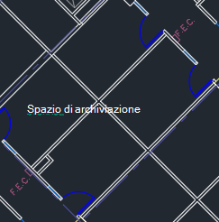
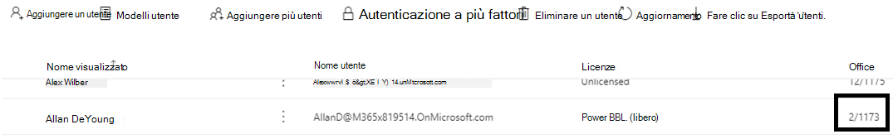
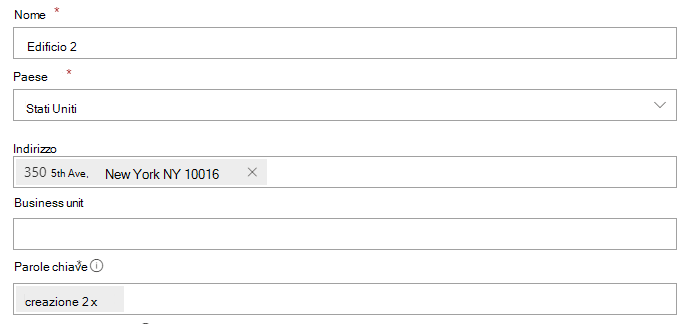
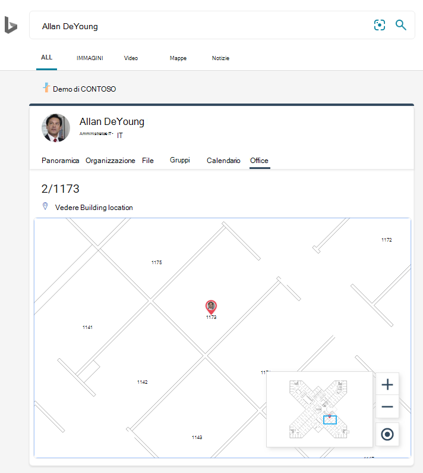
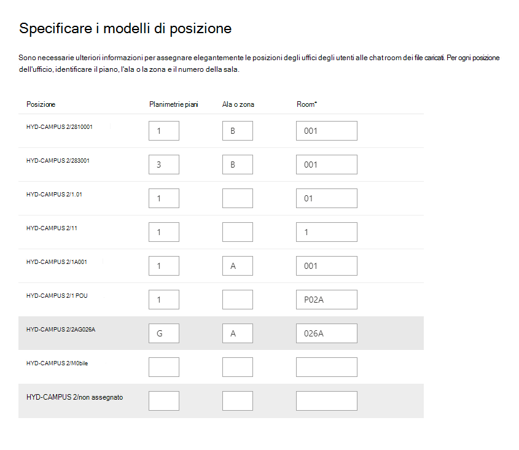

# Gestire le planimetrie

Le planimetrie in **Microsoft Search** aiutare gli utenti a trovare persone e sale riunioni all'interno di un edificio. Le planimetrie rispondano alle domande seguenti:

- Dov'è l'ufficio di Allan Deyoung?
- Edificio 2 piano 3
- Trova 11173/02/2

## Aggiungere planimetrie

Seguire questa procedura per configurare le risposte alle planimetrie in **Microsoft Search**.

### Passaggio 1: Determinare i codici predefiniti

I codici predefiniti vengono utilizzati come parte della sede dell'utente. Questi codici verranno utilizzati per l'aggiornamento dei profili utente. Supponiamo che l'organizzazione abbia un edificio in questa posizione: *Building 2, 350 5th Avenue, New York City, NY 10016*

Ecco alcuni esempi per il codice di questo edificio: 2, B2, Building2, Building 2 o NYCB2. Ogni edificio deve avere un codice univoco.

### Passaggio 2: rivedere le planimetrie

I file delle planimetrie devono essere in formato DWG; I file DWG possono contenere etichette di testo. Quando un'etichetta di testo contrassegna una sala, viene definita etichetta di sala. Il file DWG deve avere **almeno 10 sale** contrassegnate con etichette. Ecco alcuni esempi di file DWG con diversi tipi di etichetta:

|**Etichette di testo che includono etichette sala**|**Etichette di testo ma nessuna etichetta sala**|**Nessuna etichetta di testo**|
|:-----:|:-----:|:-----:|
||||

Per informazioni [sulla visualizzazione](#frequently-asked-questions) e sull'aggiornamento dei file DWG, vedere la sezione Domande frequenti.

### Passaggio 3: Aggiornare le posizioni degli uffici nei profili utente

La sede di un utente è una combinazione di un codice di edificio e di un'etichetta di sala. Ad esempio, se il codice dell'edificio è *2* e l'etichetta della sala è *1173,* la posizione dell'ufficio sarà *2/1173*.

Aggiungere o aggiornare le posizioni di office per ogni utente dell'organizzazione. È possibile modificare la posizione dell'ufficio nel profilo utente nel [interfaccia di amministrazione di Microsoft 365](https://admin.microsoft.com) oppure modificare Active Directory locale per la sincronizzazione con Azure Active Directory. *PhysicalDeliveryOfficeName è* il campo utilizzato per la posizione dell'ufficio. Se le etichette delle chat room non includono numeri di piano, vedere le domande frequenti per suggerimenti.

In questo esempio, l'ufficio di Allan si trova nella sala 1173 al piano 1 dell'edificio 2.

> [!NOTE]
> Per visualizzare le posizioni degli uffici aggiornate durante la ricerca delle planimetrie, è necessario aggiornare le posizioni degli uffici per almeno **10** persone su ogni piano.

### Passaggio 4: Verificare la posizione dell'ufficio

Utilizzare **Microsoft Search** per trovare un utente e verificare che la posizione dell'ufficio sia visualizzata correttamente. Se le posizioni sono state appena aggiornate, potrebbe essere necessario attendere fino a **72 ore** prima che gli aggiornamenti vengano visualizzati nei risultati della ricerca.

### Passaggio 5: Aggiungere posizioni di edificio

Le planimetrie [del piano utilizzano Posizioni](manage-locations.md) per definire gli edifici. [Nell'interfaccia di amministrazione di Microsoft 365](https://admin.microsoft.com), andare a [**Posizioni**](https://admin.microsoft.com/Adminportal/Home#/MicrosoftSearch/locations)e quindi selezionare **Aggiungi**. Immetti il nome, l'indirizzo e le parole chiave per l'edificio. Aggiungere il numero di edifici necessario.

Per ulteriori dettagli sulle posizioni, vedere [Manage Locations](manage-locations.md)

### Passaggio 6: Raccogliere e organizzare le posizioni degli uffici

Prima di poter utilizzare le planimetrie, è necessario indicizzare le posizioni degli uffici. Si tratta di un'operazione una sola volta che può richiedere fino a 48 ore per il completamento. Il tempo totale dipende dalle dimensioni dell'organizzazione.

[Nell'interfaccia di](https://admin.microsoft.com)amministrazione passare [**a Piani di**](https://admin.microsoft.com/Adminportal/Home#/MicrosoftSearch/floorplans)piano e quindi selezionare **Introduzione.** Se non viene visualizzato questo avviso, questo passaggio è già stato completato per l'organizzazione

### Passaggio 7: Upload piani

1. [Nell'interfaccia di amministrazione](https://admin.microsoft.com)passare a Piani di [**piano.**](https://admin.microsoft.com/Adminportal/Home#/MicrosoftSearch/floorplans)
2. Selezionare un edificio nell'elenco a discesa e selezionare **Avanti.** Se l'edificio non è elencato, tornare indietro e [aggiungere posizioni dell'edificio.](#step-5-add-building-locations)
3. Selezionare **Upload file** e quindi scegliere la planimetria da caricare.
4. Al termine del caricamento, è necessario immettere il numero di piano rappresentato nel file della planimetria. Quindi, scegliere **Avanti**.
5. (Facoltativo) Se il pavimento ha ali o zone, immettere tale dettaglio.
6. Verrà visualizzata una schermata di revisione che elenca il numero di sedi di uffici mappate alle planimetrie. Selezionare **Dettagli** per verificare che il mapping sia corretto.
    - Se nessun utente è mappato o non si è soddisfatti del mapping, selezionare **Continua mapping**. Per pubblicare, selezionare **Ignora e pubblica**.
7. Immettere il codice dell'edificio per questa planimetria. Il codice dell'edificio è disponibile nella proprietà della sede dell'utente. Ad esempio, se la sede di un utente è **2/1173,** il codice di edificio è **2**.
8. Nella schermata di revisione ripetere il passaggio 6 per verificare che il mapping sia corretto.
9. (Facoltativo) Esaminare e identificare i modelli di posizione per tutte le planimetrie caricate e quindi selezionare **Avanti.**
10. Nella schermata di revisione ripetere il passaggio 6 per verificare che il mapping sia corretto.
11. Quando si è pronti, selezionare **Pubblica** per rendere disponibile la planimetria in **Microsoft Search**.

> [!NOTE]
> **La pubblicazione delle planimetrie di piano richiede 48 ore.** Dopo di che gli utenti potranno vedere i risultati di una planimetria del piano simile a quello riportato di seguito quando ricercano l'ufficio di un collega.

### Passaggio 8: (facoltativo) Specificare i modelli di posizione

Dopo aver caricato una planimetria, le etichette di testo verranno confrontate con le posizioni dell'ufficio nei profili degli utenti. Se sono presenti meno di 10 corrispondenze, viene visualizzata la **schermata Specifica modelli** di posizione. I modelli di posizione vengono utilizzati per estrarre informazioni su pavimento, ala e sala dalle posizioni degli uffici.

Solo la sala è necessaria, il pavimento e l'ala sono facoltativi ed è possibile saltare le posizioni in base alle esigenze.

## Modificare le planimetrie

Per aggiornare una planimetria esistente, selezionare la planimetria che si desidera modificare e quindi scegliere **Modifica**. Apportare le modifiche e salvarle.

## Risoluzione dei problemi

|**Passaggio**|**Messaggio di errore**|**Tipo**|**Azione**|
|:-----|:-----|:-----|:-----|
|Upload piani|Impossibile leggere CC_1.dwg. Ricaricare o eliminare la planimetria.|Errore|Provare a caricare di nuovo il file. Se non funziona, eliminare il file e riprovare.|
|Upload piani|Esistono due file denominati CC_1.dwg. Eliminarne uno o caricarlo di nuovo con un altro nome.|Errore|Se il nome del file non è corretto, rendi univoco il nome del file aggiungendo informazioni sul piano o sull'ala e quindi carica di nuovo il file. Se lo stesso file è stato aggiunto accidentalmente due volte, è sufficiente eliminarlo.|
|Upload piani|Nessun dato trovato.|Errore|Controlla il file per assicurarti che sia quello corretto e quindi caricalo di nuovo o eliminalo.|
|Upload piani|Riferimenti esterni mancanti in questo file. Caricare CC_1_furniture.dwg o eliminare questo file.|Avviso|Upload file di riferimento esterni o eliminare.|
|Upload piani|Impossibile leggere i numeri di sala o i tag nel file DWG. Eliminare questo file.|Avviso|Controllare il file DWG per verificare che i dati siano inclusi, quindi eliminare il file e riprovare.|
|Collegare le posizioni dell'ufficio|Nessuna posizione dell'ufficio trovata in Azure Active Directory. Aggiungere i dati sulla posizione Azure Active Directory prima di configurare le planimetrie.|Errore|[Aggiornare le posizioni degli uffici nei profili utente](#step-3-update-office-locations-on-user-profiles) |

## Domande frequenti

**D:** Come si visualizzano e modificano i file DWG?

**A:** Utilizzare una delle opzioni seguenti per visualizzare i file DWG:

- Upload il file da SharePoint e aprirlo.
- Aprire il file in [Microsoft Visio](https://support.office.com/article/Open-insert-convert-and-save-DWG-and-DXF-AutoCAD-drawings-60cab691-0f4c-4fc9-b775-583273c8dac5) o [Autodesk DWG TrueView](https://www.autodesk.com/products/dwg).
- Upload il file in [Visualizzatore online di Autodesk.](https://viewer.autodesk.com/)

**D:** Come si aggiungono etichette di testo alle sale non contrassegnate?

**A:** Aprire il file DWG in un editor e [aggiungere etichette di sala](https://knowledge.autodesk.com/support/autocad-map-3d/learn-explore/caas/CloudHelp/cloudhelp/2019/ENU/MAP3D-Learn/files/GUID-4854F184-6279-4E0C-9487-34A4759017F6-htm.html).

**D:** Come si creano o si modificano i file DWG a scopo di test?

**A:** Creare un file DWG in Microsoft Visio, Autodesk AutoCAD o in qualsiasi altro editor DWG. Assicurati che nel file siano etichettate 10 o più sale.

**D:** Qual è il formato migliore per le etichette di testo nei file DWG?

**A:** Per ottenere risultati ottimali, le etichette di testo devono contenere numeri di piano e numeri di sala. Negli esempi seguenti viene utilizzato 2 o SC per il codice di compilazione.
<!-- markdownlint-disable no-inline-html -->
|Tipi di etichette sala|Floor|Room|Etichetta di testo di esempio|Office percorso (codice di compilazione/etichetta di testo)|
|:-----|:-----|:-----|:-----|:-----|
|Ha piano e numero di sala|1|173|1173|2/1173|
|| 21|45|21045|2/21045|
||23|100K|23-100K|23/02/100.00|
||1|G06-07|1G06-07|2/1G06-07|
||2|1024A|02.1024A|2/02.1024A|
||2|1024A|02.1024A|2/02.1024A|
||2|105.01|2105.01|2/2105.01|
|Ha codice di edificio, piano e numero di sala|0|X-11-M-12|2-0-X-11-M-12|2/2-0-X-11-M-12 2-0-X-11-M-12|
||2|128A|22128A|2/22128A 22128A|
||1|B2-11|21-B2-11|21/2/2-B2-11 21-B2-11|
||2|45|SC2045|SC/SC2045 SC2045|

**D:** Posso usare un file DWG che non include i numeri di piano?

**A:** Sì, è possibile. Quando si aggiornano le posizioni degli uffici nel profilo Azure Active Directory dell'utente, includere il numero di piano come parte del numero di sala, anche se non è presente nel file DWG. Dopo aver caricato il file, verrà visualizzata la schermata Specifica modelli di posizione e potrai indicare entrambi i valori.

Ad esempio, un file DWG che include numeri di sala, ma nessun numero di piano, può essere simile al seguente:

La posizione dell'ufficio nel profilo dell'utente deve essere 2/1175, dove "2" è il codice dell'edificio, "1" è il numero del piano e "175" è il numero della sala.
