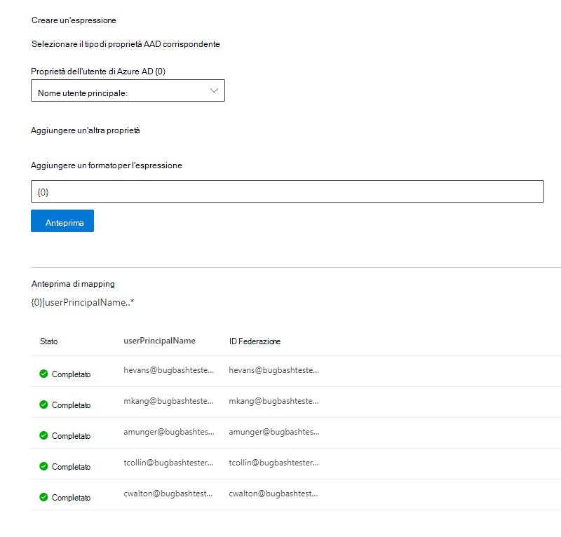

# Eseguire il mapping della propria identità Azure AD   

Questo articolo illustra i passaggi per eseguire il mapping delle identità di Azure AD a un identificatore univoco per l'origine dati (identità non di Azure AD) in modo che gli utenti dell'elenco di controllo di accesso (ACL) con identità non Azure AD possano visualizzare i risultati della ricerca del connettore nell'ambito.

Questi passaggi sono rilevanti solo per gli amministratori della ricerca che configurano un connettore [Salesforce](salesforce-connector.md) da Parte di Microsoft con autorizzazioni di ricerca per "Solo le persone con accesso a questa origine dati" e il tipo di identità "AAD". I passaggi seguenti illustrano come mappare le proprietà utente di Azure AD agli ID federativi **degli utenti.**

>[!NOTE]
>Se si sta configurando un  connettore [Salesforce](salesforce-connector.md) e si seleziona Solo gli utenti con accesso a questa origine dati e tipo di identità **non AAD** nella schermata delle autorizzazioni di ricerca, fare riferimento all'articolo Mappare le identità [non di Azure AD](map-non-aad.md) per la procedura di mapping delle identità non di Azure AD.  

## Passaggi per il mapping delle proprietà di Azure AD

### 1. Selezionare le proprietà utente di Azure AD da mappare

È possibile selezionare le proprietà di Azure AD da mappare all'ID federativo.

È possibile selezionare una proprietà utente di Azure AD nell'elenco a discesa. Puoi anche aggiungere tutte le proprietà utente di Azure AD che vuoi se queste proprietà sono necessarie per creare il mapping dell'ID federativo per l'organizzazione.

### 2. Creare la formula per completare il mapping

È possibile combinare i valori delle proprietà utente di Azure AD per formare l'ID federativo univoco.

Nella casella della formula " " corrisponde alla prima proprietà {0} di Azure AD selezionata.  " {1} " corrisponde alla seconda *proprietà* di Azure AD selezionata. " {2} " corrisponde alla terza *proprietà* di Azure AD e così via.  

Di seguito sono riportati alcuni esempi di formule con output di espressioni regolari di esempio e output di formule:

| Formula di esempio                  | Valore della proprietà {0} per un utente di esempio                 | Valore della proprietà {1} per un utente di esempio           | Output della formula                  |
| :------------------- | :------------------- |:---------------|:---------------|
| {0}.{1} @contoso.com  | firstname | lastname |firstname.lastname@contoso.com
| {0}@domain.com                 | userid                 |             |userid@domain.com

Dopo aver fornito la formula,  è possibile fare clic su Anteprima per visualizzare un'anteprima di 5 utenti casuali dall'origine dati con i rispettivi mapping utente applicati. L'output dell'anteprima include il valore delle proprietà utente di Azure AD selezionate nel passaggio 1 per tali utenti e l'output della formula finale fornita nel passaggio 2 per tale utente. Indica inoltre se l'output della formula può essere risolto in un utente di Azure AD nel tenant tramite un'icona "Operazione riuscita" o "Operazione non riuscita".  

>[!NOTE]
>È comunque possibile procedere con la creazione della connessione se uno o più mapping utente hanno lo stato "Non riuscito" dopo aver fatto clic su **Anteprima.** L'anteprima mostra 5 utenti casuali e i relativi mapping dall'origine dati. Se il mapping specificato non esegue il mapping di tutti gli utenti, è possibile che si verifichi questo caso.

## Mapping di Azure AD di esempio

Vedi lo snapshot seguente per un esempio di mapping di Azure AD.

## Limitazioni  

- È supportato un solo mapping per tutti gli utenti. I mapping condizionali non sono supportati.  

- Non è possibile modificare il mapping dopo la pubblicazione della connessione.  

- Le espressioni basate su regex per le proprietà utente di Azure AD non sono supportate per la trasformazione da Azure AD a Federation ID.