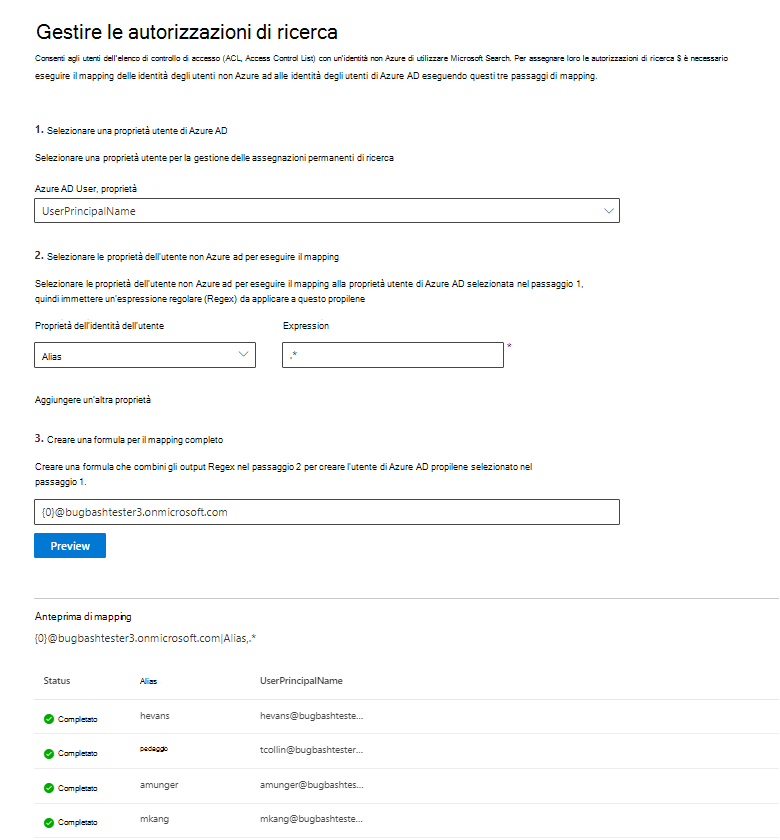

# Mappare le identità di Active Directory non Azure AD  

In questo articolo vengono illustrati i passaggi per la mappatura delle identità di Active Directory non Azure ad per le identità di Azure AD, in modo che gli utenti nell'elenco di controllo di accesso (ACL) con identità non di Azure AD possano visualizzare i risultati della ricerca del connettore a essi associati.

Questi passaggi sono rilevanti solo per gli amministratori della ricerca che stanno configurando un connettore [ServiceNow](servicenow-connector.md) o [Salesforce](salesforce-connector.md) da Microsoft con le autorizzazioni di ricerca per "solo le persone con accesso a questa origine dati" e il tipo di identità "non AAD".

>[!NOTE]
>Se si sta configurando un connettore Salesforce e si selezionano **solo gli utenti con accesso a questa origine dati** e il tipo di identità **AAD** nella schermata autorizzazioni di ricerca, fare riferimento all'articolo [Map Your Azure ad Identities](map-aad.md) per i passaggi su come eseguire il mapping delle identità di Azure ad.  

## Passaggi per il mapping delle proprietà di Active Directory non Azure

### 1. Selezionare una proprietà utente di Azure AD  

È possibile selezionare la proprietà utente di Azure AD per la quale si sta creando il mapping. Si tratta della proprietà di destinazione a cui si desidera eseguire il mapping delle identità di Active Directory non Azure ad.  

È possibile selezionare una delle seguenti proprietà di Azure AD:

| Azure AD, proprietà    | Definizione           | Esempio         |
| :------------------- | :------------------- |:--------------- |
| Nome dell'entità utente (UPN)  | Un UPN è costituito da un prefisso UPN (il nome dell'account utente) e da un suffisso UPN (un nome di dominio DNS). Il prefisso viene aggiunto al suffisso utilizzando il simbolo "@". | us1@contoso.onmicrosoft.com |
| ID di Azure AD                 | Un ID di Azure AD per un utente specificato è il GUID univoco dell'utente.                 | 58006c96-9e6e-45ea-8c88-4a56851eefad            |
| ID di sicurezza di Active Directory (SID)                  | SID (identificatore di sicurezza) è un identificatore univoco utilizzato da Active Directory per identificare gli oggetti come entità di sicurezza.                  | S-1-5-21-453406510-812318184-4183662089             |

### 2. Selezionare proprietà utente non Azure ad per mappare

È possibile selezionare le proprietà non Azure AD estratte dall'origine dati per applicare le espressioni regolari. Per ulteriori informazioni su dove trovare queste proprietà nell'origine dati, vedere le pagine [ServiceNow](servicenow-connector.md) e [Salesforce](salesforce-connector.md) .  

È possibile selezionare una proprietà di un utente non Azure AD dall'elenco a discesa e fornire un'espressione regolare da applicare ai valori delle proprietà utente. Per ulteriori informazioni sulle espressioni regolari, vedere [riferimento all'espressione regolare]( https://docs.microsoft.com/dotnet/standard/base-types/regular-expression-language-quick-reference).  

Di seguito sono riportati alcuni esempi di espressioni regolari e gli output applicati a una stringa di esempio: 

| Stringa di esempio                  | Espressione regolare                 | Output dell'espressione regolare sulla stringa di esempio           |
| :------------------- | :------------------- |:---------------|
| Alexis Vasquez  | .* | Alexis Vasquez |
| Alexis Vasquez                 | ..$                 | EZ            |
| Alexis Vasquez                  | (\w +) $                  | Vasquez             |

È possibile aggiungere tutte le proprietà degli utenti non Azure AD come si desiderano le espressioni. È possibile applicare espressioni regolari diverse alla stessa proprietà utente se la formula finale lo garantisce.  

### 3. creare la formula per completare il mapping

È possibile combinare gli output delle espressioni regolari applicate a ciascuna delle proprietà dell'utente non Azure ad per formare la proprietà Azure AD selezionata nel passaggio 1.

Nella casella formula, " {0} " corrisponde all'output dell'espressione regolare applicata alla *prima* proprietà non Azure ad selezionata. " {1} " corrisponde all'output dell'espressione regolare applicata alla *seconda* proprietà non Azure ad selezionata. " {2} " corrisponde all'output dell'espressione regolare applicata alla *terza* proprietà non Azure ad e così via.  

Di seguito sono riportati alcuni esempi di formule con gli output di espressioni regolari di esempio e gli output delle formule: 

| Formula di esempio                  | Valore di un {0} utente di esempio                 | Valore di un {1} utente di esempio           | Output della formula                  |
| :------------------- | :------------------- |:---------------|:---------------|
| {0}.{1} @contoso. com  | FirstName | LastName |firstname.lastname@contoso.com
| {0}@domain. com                 | UserID                 |             |userid@domain.com

Dopo aver fornito la formula, è possibile fare clic su **Anteprima** per visualizzare un'anteprima di 5 utenti casuali dall'origine dati con i rispettivi mapping utente applicati. L'output dell'anteprima include il valore delle proprietà dell'utente non di Azure AD selezionate nel passaggio 2 per gli utenti e l'output della formula finale fornita nel passaggio 3 per tale utente. Indica anche se l'output della formula può essere risolto in un utente di Azure AD nel tenant tramite un'icona "riuscita" o "non riuscita".  

>[!NOTE]
>È comunque possibile continuare a creare la connessione se uno o più mapping degli utenti hanno uno stato "non riuscito" dopo aver fatto clic su **Anteprima**. Nell'anteprima vengono visualizzati 5 utenti casuali e i relativi mapping dall'origine dati. Se il mapping specificato non esegue il mapping di tutti gli utenti, è possibile che si verifichi questo caso.

## Esempio di mapping di non Azure AD

Vedere lo snapshot seguente per un esempio di mapping non di Azure AD.

## Limitazioni  

- Solo un mapping è supportato per tutti gli utenti. I mapping condizionali non sono supportati.  

- Non è possibile modificare il mapping dopo la pubblicazione della connessione.  

- Per la trasformazione sono attualmente supportate solo le espressioni basate su Regex rispetto alle proprietà dell'utente non AAD.

- Sono disponibili solo 3 identità di Azure AD che è possibile scegliere di associare (UPN, Azure AD ID e AD SID).