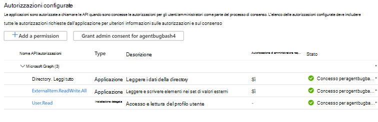
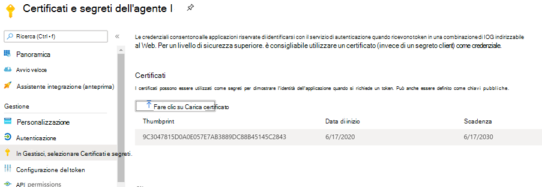

# <a name="graph-connector-agent"></a><span data-ttu-id="c33e4-103">Agente connettore grafico</span><span class="sxs-lookup"><span data-stu-id="c33e4-103">Graph connector agent</span></span>

<span data-ttu-id="c33e4-104">L'utilizzo di connettori Graph in uso richiede l'installazione del software *agente connettore Graph.*</span><span class="sxs-lookup"><span data-stu-id="c33e4-104">Using on-prem Graph connectors require you to install *Graph connector agent* software.</span></span> <span data-ttu-id="c33e4-105">Consente il trasferimento sicuro dei dati tra i dati locali e le API del connettore Graph.</span><span class="sxs-lookup"><span data-stu-id="c33e4-105">It allows for secure data transfer between on-premises data and the Graph connector APIs.</span></span> <span data-ttu-id="c33e4-106">In questo articolo viene illustrata l'installazione e la configurazione dell'agente.</span><span class="sxs-lookup"><span data-stu-id="c33e4-106">This article guides you through the installing and configuring the agent.</span></span>

## <a name="installation"></a><span data-ttu-id="c33e4-107">Installazione</span><span class="sxs-lookup"><span data-stu-id="c33e4-107">Installation</span></span>

<span data-ttu-id="c33e4-108">Scaricare la versione più recente dell'agente del connettore Graph [qui](https://aka.ms/gcadownload) e installare il software utilizzando l'installazione guidata.</span><span class="sxs-lookup"><span data-stu-id="c33e4-108">Download the latest version of Graph connector agent [here](https://aka.ms/gcadownload) and install the software using the installation wizard.</span></span> <span data-ttu-id="c33e4-109">Usando la configurazione consigliata del computer descritto di seguito, il software può gestire fino a tre connessioni.</span><span class="sxs-lookup"><span data-stu-id="c33e4-109">Using the recommended configuration of the machine described below, the software can handle up to three connections.</span></span> <span data-ttu-id="c33e4-110">Eventuali connessioni oltre tale limite potrebbero compromettere le prestazioni di tutte le connessioni nell'agente.</span><span class="sxs-lookup"><span data-stu-id="c33e4-110">Any connections beyond that might degrade the performance of all connections on the agent.</span></span>

<span data-ttu-id="c33e4-111">Configurazione consigliata:</span><span class="sxs-lookup"><span data-stu-id="c33e4-111">Recommended configuration:</span></span>

* <span data-ttu-id="c33e4-112">Windows 10, Windows Server 2016 R2 e successive</span><span class="sxs-lookup"><span data-stu-id="c33e4-112">Windows 10, Windows Server 2016 R2 and above</span></span>
* [<span data-ttu-id="c33e4-113">.NET Core Desktop Runtime 3.1 (x64)</span><span class="sxs-lookup"><span data-stu-id="c33e4-113">.NET Core Desktop Runtime 3.1 (x64)</span></span>](https://dotnet.microsoft.com/download/dotnet-core/3.1)
* <span data-ttu-id="c33e4-114">8 core, 3 GHz</span><span class="sxs-lookup"><span data-stu-id="c33e4-114">8 cores, 3 GHz</span></span>
* <span data-ttu-id="c33e4-115">16 GB di RAM, 2 GB di spazio su disco</span><span class="sxs-lookup"><span data-stu-id="c33e4-115">16 GB RAM, 2 GB Disk Space</span></span>
* <span data-ttu-id="c33e4-116">Accesso di rete all'origine dati e a Internet tramite 443</span><span class="sxs-lookup"><span data-stu-id="c33e4-116">Network access to data source and internet through 443</span></span>

<span data-ttu-id="c33e4-117">Dopo aver installato l'agente, se i server proxy o i firewall dell'organizzazione bloccano la comunicazione con domini sconosciuti, aggiungere quelli seguenti all'elenco Consenti.</span><span class="sxs-lookup"><span data-stu-id="c33e4-117">After you install the agent, if your organization's proxy servers or firewalls block communication to unknown domains, please add below ones to the allow list.</span></span>

1. <span data-ttu-id="c33e4-118">\*.servicebus.windows.net</span><span class="sxs-lookup"><span data-stu-id="c33e4-118">\*.servicebus.windows.net</span></span>
2. <span data-ttu-id="c33e4-119">\*.events.data.microsoft.com</span><span class="sxs-lookup"><span data-stu-id="c33e4-119">\*.events.data.microsoft.com</span></span>
3. https://login.microsoftonline.com
4. https://gcs.office.com
5. https://graph.microsoft.com/


## <a name="create-and-configure-an-app-for-the-agent"></a><span data-ttu-id="c33e4-120">Creare e configurare un'app per l'agente</span><span class="sxs-lookup"><span data-stu-id="c33e4-120">Create and configure an App for the agent</span></span>  

<span data-ttu-id="c33e4-121">Prima di tutto, accedere e tenere presente che il privilegio minimo necessario per l'account è l'amministratore della ricerca.</span><span class="sxs-lookup"><span data-stu-id="c33e4-121">First, sign in and note that the minimum required privilege on the account is search administrator.</span></span> <span data-ttu-id="c33e4-122">L'agente chiederà quindi di fornire i dettagli dell'autenticazione.</span><span class="sxs-lookup"><span data-stu-id="c33e4-122">The agent will then ask you to provide authentication details.</span></span> <span data-ttu-id="c33e4-123">Usa la procedura seguente per creare un'app e generare i dettagli di autenticazione necessari.</span><span class="sxs-lookup"><span data-stu-id="c33e4-123">Use the steps below to create an app and generate the required authentication details.</span></span>

### <a name="create-an-app"></a><span data-ttu-id="c33e4-124">Creare un'app</span><span class="sxs-lookup"><span data-stu-id="c33e4-124">Create an app</span></span>

1. <span data-ttu-id="c33e4-125">Passare al portale [di Azure e](https://portal.azure.com) accedere con le credenziali di amministratore per il tenant.</span><span class="sxs-lookup"><span data-stu-id="c33e4-125">Go to the [Azure portal](https://portal.azure.com) and sign in with admin credentials for the tenant.</span></span>
2. <span data-ttu-id="c33e4-126">Passare alle **registrazioni delle** app di Azure Active Directory  ->   dal riquadro di spostamento e selezionare **Nuova registrazione.**</span><span class="sxs-lookup"><span data-stu-id="c33e4-126">Navigate to **Azure Active Directory** -> **App registrations** from the navigation pane and select **New registration**.</span></span>
3. <span data-ttu-id="c33e4-127">Fornisci un nome per l'app e seleziona **Registra.**</span><span class="sxs-lookup"><span data-stu-id="c33e4-127">Provide a name for the app and select **Register**.</span></span>
4. <span data-ttu-id="c33e4-128">Prendere nota dell'ID applicazione (client).</span><span class="sxs-lookup"><span data-stu-id="c33e4-128">Make a note of the Application (client) ID.</span></span>
5. <span data-ttu-id="c33e4-129">Apri **le autorizzazioni API** dal riquadro di spostamento e seleziona Aggiungi **un'autorizzazione.**</span><span class="sxs-lookup"><span data-stu-id="c33e4-129">Open **API permissions** from the navigation pane and select **Add a permission**.</span></span>
6. <span data-ttu-id="c33e4-130">Selezionare **Microsoft Graph e** quindi Autorizzazioni **applicazione.**</span><span class="sxs-lookup"><span data-stu-id="c33e4-130">Select **Microsoft Graph** and then **Application permissions**.</span></span>
7. <span data-ttu-id="c33e4-131">Cercare "ExternalItem.ReadWrite.All" e "Directory.Read.All" nelle autorizzazioni e selezionare **Aggiungi autorizzazioni.**</span><span class="sxs-lookup"><span data-stu-id="c33e4-131">Search for "ExternalItem.ReadWrite.All" and "Directory.Read.All" from the permissions and select **Add permissions**.</span></span>
8. <span data-ttu-id="c33e4-132">Selezionare **Concedi il consenso dell'amministratore per [TenantName]** e confermare selezionando **Sì.**</span><span class="sxs-lookup"><span data-stu-id="c33e4-132">Select **Grant admin consent for [TenantName]** and confirm by selecting **Yes**.</span></span>
9. <span data-ttu-id="c33e4-133">Verificare che le autorizzazioni siano nello stato "concesso".</span><span class="sxs-lookup"><span data-stu-id="c33e4-133">Check that the permissions are in the "granted" state.</span></span>
     <span data-ttu-id="c33e4-134"></span><span class="sxs-lookup"><span data-stu-id="c33e4-134"></span></span>

### <a name="configure-authentication"></a><span data-ttu-id="c33e4-135">Configurare l'autenticazione</span><span class="sxs-lookup"><span data-stu-id="c33e4-135">Configure Authentication</span></span>

<span data-ttu-id="c33e4-136">I dettagli di autenticazione possono essere forniti utilizzando un segreto client o un certificato.</span><span class="sxs-lookup"><span data-stu-id="c33e4-136">Authentication details can be provided using a client secret or a certificate.</span></span> <span data-ttu-id="c33e4-137">Seguire i passaggi di propria scelta.</span><span class="sxs-lookup"><span data-stu-id="c33e4-137">Follow the steps of your choice.</span></span>

#### <a name="configuring-the-client-secret-for-authentication"></a><span data-ttu-id="c33e4-138">Configurazione del segreto client per l'autenticazione</span><span class="sxs-lookup"><span data-stu-id="c33e4-138">Configuring the client secret for authentication</span></span>

1. <span data-ttu-id="c33e4-139">Passare al portale [di Azure e](https://portal.azure.com) accedere con le credenziali di amministratore per il tenant.</span><span class="sxs-lookup"><span data-stu-id="c33e4-139">Go to the [Azure portal](https://portal.azure.com) and sign in with admin credentials for the tenant.</span></span>
2. <span data-ttu-id="c33e4-140">Apri **Registrazione app** dal riquadro di spostamento e passa all'app appropriata.</span><span class="sxs-lookup"><span data-stu-id="c33e4-140">Open **App Registration** from the navigation pane and go to the appropriate App.</span></span> <span data-ttu-id="c33e4-141">In **Gestisci** selezionare **Certificati e segreti.**</span><span class="sxs-lookup"><span data-stu-id="c33e4-141">Under **Manage**, select **Certificates and secrets**.</span></span>
3. <span data-ttu-id="c33e4-142">Selezionare **Nuovo segreto client** e selezionare un periodo di scadenza per il segreto.</span><span class="sxs-lookup"><span data-stu-id="c33e4-142">Select **New Client secret** and select an expiry period for the secret.</span></span> <span data-ttu-id="c33e4-143">Copia il segreto generato e salvalo perché non verrà visualizzato di nuovo.</span><span class="sxs-lookup"><span data-stu-id="c33e4-143">Copy the generated secret and save it because it won't be shown again.</span></span>
4. <span data-ttu-id="c33e4-144">Utilizzare questo segreto client insieme all'ID applicazione per configurare l'agente.</span><span class="sxs-lookup"><span data-stu-id="c33e4-144">Use this Client secret along with the Application ID to configure the agent.</span></span> <span data-ttu-id="c33e4-145">Non è possibile utilizzare spazi vuoti nel **campo Nome** dell'agente.</span><span class="sxs-lookup"><span data-stu-id="c33e4-145">You cannot use blank spaces in the **Name** field of the agent.</span></span> <span data-ttu-id="c33e4-146">I caratteri numerici alfa vengono accettati.</span><span class="sxs-lookup"><span data-stu-id="c33e4-146">Alpha numeric characters are accepted.</span></span>

#### <a name="using-a-certificate-for-authentication"></a><span data-ttu-id="c33e4-147">Utilizzo di un certificato per l'autenticazione</span><span class="sxs-lookup"><span data-stu-id="c33e4-147">Using a certificate for authentication</span></span>

<span data-ttu-id="c33e4-148">Esistono tre semplici passaggi per l'utilizzo dell'autenticazione basata su certificati:</span><span class="sxs-lookup"><span data-stu-id="c33e4-148">There are three simple steps for using certificate-based authentication:</span></span>

1. <span data-ttu-id="c33e4-149">Creare o ottenere un certificato</span><span class="sxs-lookup"><span data-stu-id="c33e4-149">Create or obtain a certificate</span></span>
1. <span data-ttu-id="c33e4-150">Caricare il certificato nel portale di Azure</span><span class="sxs-lookup"><span data-stu-id="c33e4-150">Upload the certificate to the Azure portal</span></span>
1. <span data-ttu-id="c33e4-151">Assegnare il certificato all'agente</span><span class="sxs-lookup"><span data-stu-id="c33e4-151">Assign the certificate to the agent</span></span>

##### <a name="step-1-get-a-certificate"></a><span data-ttu-id="c33e4-152">Passaggio 1: Ottenere un certificato</span><span class="sxs-lookup"><span data-stu-id="c33e4-152">Step 1: Get a certificate</span></span>

<span data-ttu-id="c33e4-153">Lo script seguente può essere utilizzato per generare un certificato autofirmato.</span><span class="sxs-lookup"><span data-stu-id="c33e4-153">The script below can be used to generate a self-signed certificate.</span></span> <span data-ttu-id="c33e4-154">L'organizzazione potrebbe non consentire certificati autofirmati.</span><span class="sxs-lookup"><span data-stu-id="c33e4-154">Your organization may not allow self-signed certificates.</span></span> <span data-ttu-id="c33e4-155">In tal caso, utilizzare queste informazioni per comprendere i requisiti e acquisire un certificato in conformità ai criteri dell'organizzazione.</span><span class="sxs-lookup"><span data-stu-id="c33e4-155">In that case, use this information to understand the requirements and acquire a certificate in accordance to your organization's policies.</span></span>

```Powershell
$dnsName = "<TenantDomain like agent.onmicrosoft.com>" # Your DNS name
$password = "<password>" # Certificate password
$folderPath = "D:\New folder\" # Where do you want the files to get saved to? The folder needs to exist.
$fileName = "agentcert" # What do you want to call the cert files? without the file extension
$yearsValid = 10 # Number of years until you need to renew the certificate
$certStoreLocation = "cert:\LocalMachine\My"
$expirationDate = (Get-Date).AddYears($yearsValid)
$certificate = New-SelfSignedCertificate -DnsName $dnsName -CertStoreLocation $certStoreLocation -NotAfter $expirationDate -KeyExportPolicy Exportable -KeySpec Signature
$certificatePath = $certStoreLocation + '\' + $certificate.Thumbprint
$filePath = $folderPath + '\' + $fileName
$securePassword = ConvertTo-SecureString -String $password -Force -AsPlainText
Export-Certificate -Cert $certificatePath -FilePath ($filePath + '.cer')
Export-PfxCertificate -Cert $certificatePath -FilePath ($filePath + '.pfx') -Password $securePassword
```

##### <a name="step-2-upload-the-certificate-in-the-azure-portal"></a><span data-ttu-id="c33e4-156">Passaggio 2: Caricare il certificato nel portale di Azure</span><span class="sxs-lookup"><span data-stu-id="c33e4-156">Step 2: Upload the certificate in the Azure portal</span></span>

1. <span data-ttu-id="c33e4-157">Aprire l'applicazione e passare alla sezione certificati e segreti dal riquadro sinistro</span><span class="sxs-lookup"><span data-stu-id="c33e4-157">Open the application and navigate to certificates and secrets section from left pane</span></span>
1. <span data-ttu-id="c33e4-158">Selezionare "Carica certificato" e caricare il file CER</span><span class="sxs-lookup"><span data-stu-id="c33e4-158">Select 'Upload certificate' and upload the .cer file</span></span>
1. <span data-ttu-id="c33e4-159">Apri **la registrazione dell'app** e **seleziona Certificati e** segreti nel riquadro di spostamento.</span><span class="sxs-lookup"><span data-stu-id="c33e4-159">Open **App registration** and select **Certificates and secrets** from the navigation pane.</span></span> <span data-ttu-id="c33e4-160">Copiare l'identificazione personale del certificato.</span><span class="sxs-lookup"><span data-stu-id="c33e4-160">Copy the certificate thumbprint.</span></span>



##### <a name="step-3-assign-the-certificate-to-the-agent"></a><span data-ttu-id="c33e4-162">Passaggio 3: Assegnare il certificato all'agente</span><span class="sxs-lookup"><span data-stu-id="c33e4-162">Step 3: Assign the certificate to the agent</span></span>

<span data-ttu-id="c33e4-163">Se hai usato lo script di esempio per generare un certificato, il file PFX è disponibile nel percorso identificato nello script.</span><span class="sxs-lookup"><span data-stu-id="c33e4-163">If you used the sample script to generate a certificate, the PFX file can be found in the location identified in the script.</span></span>

1. <span data-ttu-id="c33e4-164">Scaricare il file pfx del certificato nel computer agente.</span><span class="sxs-lookup"><span data-stu-id="c33e4-164">Download the certificate pfx file onto the Agent machine.</span></span>
1. <span data-ttu-id="c33e4-165">Fai doppio clic sul file pfx per avviare la finestra di dialogo di installazione del certificato.</span><span class="sxs-lookup"><span data-stu-id="c33e4-165">Double-click the pfx file to launch the certificate installation dialog.</span></span>
1. <span data-ttu-id="c33e4-166">Seleziona "Computer locale" per il percorso dell'archivio durante l'installazione del certificato.</span><span class="sxs-lookup"><span data-stu-id="c33e4-166">Select 'Local Machine' for store location while installing the certificate.</span></span>
1. <span data-ttu-id="c33e4-167">Dopo aver installato il certificato, apri "Gestisci certificati computer" dal menu Start</span><span class="sxs-lookup"><span data-stu-id="c33e4-167">After installing the certificate, open 'Manage computer certificates' through Start menu</span></span>
1. <span data-ttu-id="c33e4-168">Selezionare il certificato appena installato in "Personale" -> 'Certificati'</span><span class="sxs-lookup"><span data-stu-id="c33e4-168">Select the newly installed certificate under 'Personal' -> 'Certificates'</span></span>
1. <span data-ttu-id="c33e4-169">Fai clic con il pulsante destro del mouse sul certificato e seleziona "Tutte le attività" -> 'Gestisci chiavi private...'</span><span class="sxs-lookup"><span data-stu-id="c33e4-169">Right click on the cert and select 'All Tasks' -> 'Manage Private Keys…'</span></span> <span data-ttu-id="c33e4-170">Opzione</span><span class="sxs-lookup"><span data-stu-id="c33e4-170">Option</span></span>
1. <span data-ttu-id="c33e4-171">Nella finestra di dialogo delle autorizzazioni, selezionare l'opzione aggiungi.</span><span class="sxs-lookup"><span data-stu-id="c33e4-171">In the permissions dialog, select add option.</span></span> <span data-ttu-id="c33e4-172">Nella finestra di dialogo di selezione dell'utente, scrivi: "NT Service\GcaHostService" e fai clic su "OK".</span><span class="sxs-lookup"><span data-stu-id="c33e4-172">In the user selection dialog, write: 'NT Service\GcaHostService' and click 'OK'.</span></span> <span data-ttu-id="c33e4-173">Non fare clic sul pulsante "Controlla nomi".</span><span class="sxs-lookup"><span data-stu-id="c33e4-173">Don't click the 'Check Names' button.</span></span>
1. <span data-ttu-id="c33e4-174">Fare clic su Ok nella finestra di dialogo delle autorizzazioni.</span><span class="sxs-lookup"><span data-stu-id="c33e4-174">Click okay on the permissions dialog.</span></span> <span data-ttu-id="c33e4-175">Il computer agente è ora configurato per consentire agli agenti di generare token usando il certificato.</span><span class="sxs-lookup"><span data-stu-id="c33e4-175">The agent machine is now configured for agent to generate tokens using the certificate.</span></span>
