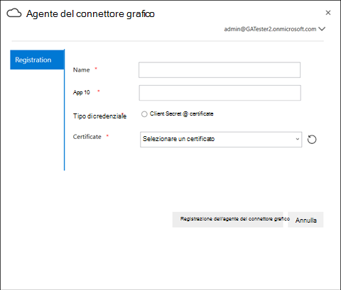

# Agente on-Prem

## Agente del connettore grafico

I connettori su grafico Prem richiedono l'installazione del software dell' *agente del connettore grafico* . Consente il trasferimento rapido e sicuro dei dati tra i dati locali e i servizi cloud. In questo articolo vengono illustrati i passaggi per l'installazione e la configurazione del software. Una volta configurata, sarà disponibile per la creazione di connessioni alle origini dati di su-Prem dall'interfaccia di [amministrazione di Microsoft 365](https://admin.microsoft.com).

## Installazione

Scaricare la versione più recente di agente del connettore grafico usando [questo collegamento](https://download.microsoft.com/download/d/d/e/dde18236-9c67-437d-a864-894a0a888ef2/AgentPackage.msi) e installare il software utilizzando l'installazione guidata. Con la configurazione consigliata della macchina descritta di seguito, il software può gestire facilmente fino a tre connessioni. Tutte le connessioni oltre che potrebbero peggiorare le prestazioni.

Configurazione consigliata:

* Windows 10, Windows Server 2012 R2 e successive
* 8 core, 3GHz
* 16GB di RAM, spazio su disco da 1 GB
* Accesso alla rete all'origine dati e a Internet tramite 443

## Creazione di app per l'agente  

Per creare connessioni, è necessario che l'istanza dell'agente venga alimentata con alcuni parametri critici. Questi parametri includono informazioni dettagliate sull'autenticazione necessarie per l'utilizzo di API di ingestione del grafico.  

Passaggi per la creazione di app per l'agente.

1. Accedere al [portale di Azure](https://portal.azure.com) e accedere con le credenziali di amministratore per il tenant.
2. Passare alle registrazioni delle app di **Azure Active Directory**  ->  **App registrations** dal riquadro di spostamento e selezionare **nuova registrazione**.
3. Specificare un nome per l'app e selezionare **registra**.
4. Prendere nota dell'ID applicazione (client).
5. Aprire le **autorizzazioni API** dal riquadro di spostamento e selezionare **Aggiungi un'autorizzazione**.
6. Selezionare **Microsoft Graph** e quindi **autorizzazioni** per le applicazioni.
7. Cercare "ExternalItem. ReadWrite. All" e "directory. Read. All" dalle autorizzazioni e selezionare **Aggiungi autorizzazioni**.
8. Selezionare **Concedi consenso amministratore per [TenantName]** e confermare selezionando **Sì**.
9. Verificare che le autorizzazioni siano nello stato concesso.
     

## Configurazione dell'agente del connettore grafico

Dopo aver creato l'applicazione per l'agente, è necessario configurare l'agente con i dettagli di autenticazione corretti.

È possibile fornire informazioni dettagliate sull'autenticazione in uno dei moduli seguenti.

### Configurazione del segreto client per l'autenticazione

1. Accedere al [portale di Azure](https://portal.azure.com) e accedere con le credenziali di amministratore per il tenant.
2. Aprire **registrazione app** dal riquadro di spostamento e passare all'app appropriata. In **Gestisci** selezionare **certificati e segreti**.
3. Selezionare **nuovo segreto client** e selezionare un periodo di scadenza per il segreto. Copiare il segreto generato e salvarlo perché non verrà visualizzato di nuovo.
4. Utilizzare questo segreto client insieme all'ID applicazione per configurare l'agente. Non utilizzare spazi vuoti nel campo **nome** dell'agente. Vengono accettati caratteri numerici alfanumerici.

## Utilizzo del certificato di identificazione personale per l'autenticazione

Se sono già stati configurati i dettagli dell'autenticazione seguendo [la configurazione del segreto client per l'autenticazione](#configuring-the-client-secret-for-authentication) , è possibile passare direttamente alla [Panoramica dell'installazione](configure-connector.md).

1. Aprire **registrazione app** e selezionare **certificati e segreti** nel riquadro di spostamento. Copiare l'identificazione personale del certificato.

2. Utilizzare il segreto client o l'identificazione personale per registrare l'agente del connettore grafico.

