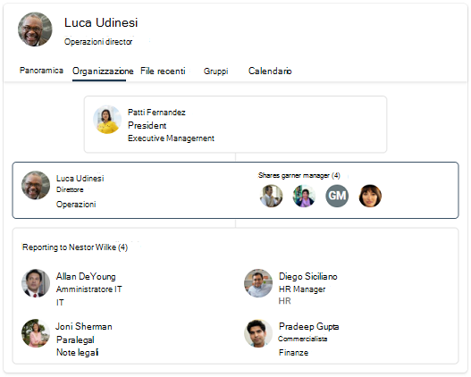

# Panoramica delle Microsoft Search in Bing

Microsoft Search in Bing riunisce le funzionalità di Microsoft Search e Bing web. Offre un'esperienza di ricerca familiare che consente agli utenti di trovare risultati pertinenti dall'organizzazione e dal Web. Per mantenere gli utenti e i dati privati e sicuri, gli utenti devono accedere al proprio account aziendale o dell'istituto di istruzione Bing prima di poter trovare risultati interni.

## Cosa vedono gli utenti

Quando gli utenti dell'organizzazione usano Microsoft Search in Bing, sono disponibili due posizioni in cui possono visualizzare i risultati dell'azienda o dell'istituto di istruzione:

- Pagina TUTTI i risultati: se è presente un risultato di lavoro o dell'istituto di istruzione pertinente, verrà visualizzato nella parte superiore della pagina dei risultati di ricerca, seguito dai risultati Web pubblici.
- Pagina dei risultati DI LAVORO o SCUOLA: in questa pagina vengono visualizzati solo i risultati dell'organizzazione. Non include mai risultati Web pubblici.

:::image type="content" alt-text="Tutte le pagine dei risultati di lavoro per Contoso e la pagina dei risultati dell'istituto di istruzione per la scuola media Contoso." source="media/msb-overview/all-work-school-serps.gif" lightbox="media/msb-overview/all-work-school-serps.gif":::

Gli utenti possono identificare facilmente i risultati aziendali o dell'istituto di istruzione cercando il logo, il nome o l'immagine del profilo dell'organizzazione.

## Guida introduttiva Microsoft Search in Bing

Microsoft Search in Bing è abilitato per impostazione predefinita per tutti gli utenti dell'organizzazione. Se un utente ha già eseguito l'accesso al proprio account aziendale o dell'istituto di istruzione in un altro servizio, ad esempio Outlook, Microsoft Teams o SharePoint, verrà automaticamente eseguito l'accesso allo stesso account quando passa Bing. Per altre informazioni, vedere [Sicurezza e privacy per Microsoft Search in Bing](security-for-search.md).

Se non si ha familiarità con Microsoft Search in Bing, è consigliabile consultare il Microsoft Search in Bing [Admin Essentials Guide](https://aka.ms/SearchAdminEssentials) per informazioni sulla configurazione e sulla distribuzione. Per aumentare la consapevolezza degli utenti Microsoft Search, il [kit](https://aka.ms/SearchAdoptionKit) di adozione include risorse di formazione e comunicazione.

## Esperienze di ricerca per il lavoro e l'istituto di istruzione

Microsoft Search in Bing offre esperienze di ricerca personalizzate in base alle esigenze degli utenti del lavoro e dell'istituto di istruzione. Nelle organizzazioni con piani di servizi aziendali, gli utenti riceveranno un'esperienza di ricerca progettata per il lavoro, inclusi organigrammi e Power BI risposte.

Gli utenti delle organizzazioni con piani di servizi didattici riceveranno un'esperienza progettata per la ricerca a scuola, incluse le risposte sulle classi e sulle assegnazioni future.

Se l'organizzazione dispone di piani di formazione e di servizi aziendali, è possibile selezionare un Microsoft Search in Bing per gli utenti, sia dell'istituto di istruzione che del lavoro. Per ulteriori informazioni, vedere [Select a school or work search experience.](/microsoftsearch/select-work-school-search-experience)

## Aggiungere Microsoft Search in Bing alla rete Intranet

Microsoft Search è progettato per semplificare l'accesso alle informazioni interne ovunque gli utenti cerchino. Se gli utenti dell'organizzazione utilizzano il sito Intranet per avviare una ricerca aziendale o dell'istituto di istruzione, è consigliabile aggiungere una casella di ricerca incorporata al sito.

Con uno script semplice, puoi aggiungere una casella di ricerca personalizzata e persino indirizzarla a un verticale personalizzato. Per ulteriori informazioni, vedere [Aggiungere una casella di ricerca al sito Intranet.](add-a-search-box-to-your-intranet-site.md)

## Impostare le impostazioni predefinite per semplificare la ricerca nel lavoro o nell'istituto di istruzione

Per aumentare l'adozione di Microsoft Search in Bing, valuta i modi per renderla una parte semplice della giornata dell'utente impostando le impostazioni predefinite.

**Browser predefinito:** quando si rende Microsoft Edge browser predefinito, gli utenti possono eseguire ricerche nell'organizzazione e ottenere suggerimenti di ricerca pertinenti, direttamente dalla barra degli indirizzi. La ricerca dalla barra degli indirizzi è un'informazione facile e veloce e non è necessario passare a Bing per avviare una ricerca. Per ulteriori informazioni, vedere [Set Microsoft Edge as the default browser](/deployedge/edge-default-browser).

**Motore di ricerca predefinito:** se la modifica del browser predefinito non è un'opzione, è possibile abilitare la ricerca di lavoro o dell'istituto di istruzione dalla barra degli indirizzi impostando Bing come motore di ricerca predefinito. Per informazioni dettagliate, vedere [Make Bing the default search engine](set-default-search-engine.md). Se l'organizzazione dispone di un piano di servizio di Microsoft 365 Apps for enterprise (in precedenza Office 365 ProPlus), è possibile impostare Bing come motore di ricerca predefinito per Google Chrome distribuendo il Microsoft Search nell'estensione Bing. Per ulteriori informazioni, vedere [Microsoft Search in Bing e Microsoft 365 Apps for enterprise](/deployoffice/microsoft-search-bing).

**Home page** predefinita: l'impostazione di Bing come home page predefinita dell'organizzazione non consentirà la ricerca di lavoro o dell'istituto di istruzione dalla barra degli indirizzi, ma offre un modo semplice per accedere a bing.com. Per ulteriori informazioni, vedere [Make Bing.com the default home page](set-default-homepage.md).

## Sicurezza e privacy

Microsoft Search in Bing misure di sicurezza e privacy avanzate per proteggere i dati dell'organizzazione e gli utenti. Per altre informazioni, vedi Sicurezza e privacy per Microsoft Search [in Bing](security-for-search.md) e Come Microsoft Search in Bing proteggere le [informazioni](https://support.microsoft.com/office/how-microsoft-search-in-bing-helps-keep-your-info-secure-cbce46ae-bb1f-4d0e-86f1-5984f4589113).

## Vedere anche

- [Panoramica di Microsoft Search](overview-microsoft-search.md)
- [Pianificare i contenuti](plan-your-content.md)
