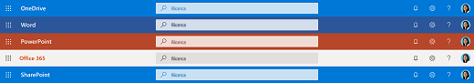
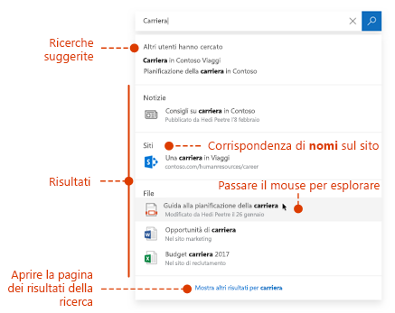
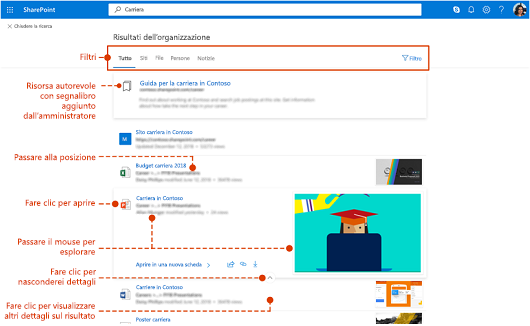

# Panoramica di Microsoft SearchOverview of Microsoft Search

Microsoft Search è la funzionalità di ricerca unificata inclusa nelle app di produttività di Microsoft 365 e nel più ampio ecosistema Microsoft.Microsoft Search is the unified search capability in the Microsoft 365 productivity apps and the broader Microsoft ecosystem. Col tempo Microsoft Search sarà disponibile in un numero sempre maggiore di app in Microsoft 365.Over time Microsoft Search will be available in more and more apps across Microsoft 365.

Microsoft Search consente agli utenti di trovare le risposte, le persone e i contenuti corretti per completare le attività direttamente nell'app.Microsoft Search helps users find the right answers, people, and content to complete their tasks in the app they’re already working in.

- Gli utenti visualizzano i risultati pertinenti nel **contesto** dell'app da cui eseguono la ricerca.Users get results that are relevant in the **context** of the app they search from. Ad esempio, quando eseguono una ricerca in Outlook, trovano messaggi di posta elettronica ma non siti di SharePoint.For example, when they search in Outlook, they find mails, not sites in SharePoint. Quando eseguono una ricerca in SharePoint, trovano file, pagine e siti.When they search in SharePoint, they find sites, pages, and files, not mails.
- Indipendentemente dall'app aperta, Microsoft Search è **personale**.Whichever app users are working in; Microsoft Search is **personal**.  Microsoft Search usa le informazioni dettagliate di Microsoft Graph per visualizzare i risultati pertinenti per ogni utente.Microsoft Search uses insights from the Microsoft Graph to show results that are relevant to each user. Ogni utente può visualizzare risultati diversi, anche se due utenti cercano le stesse parole.Each user might see different results, even if they search for the same words. Gli utenti visualizzano solo quello i contenuti a cui hanno già accesso dal momento che Microsoft Search non modifica le autorizzazioni.They only see results that they already have access to, Microsoft Search doesn’t change permissions.
- Gli utenti non devono ricordare dove si trovano le informazioni.Users don’t need to remember where the information is located. Ad esempio, se un utente sta lavorando in Word e vuole usare le informazioni di una presentazione condivisa da un collega da OneDrive,For example, a user is working in Word and wants to reuse information from a presentation that a colleague shared from their OneDrive. non deve più passare a OneDrive e cercare quella presentazione, ma può cercarla direttamente da Word.There’s no need to switch to OneDrive and search for that presentation, they can simply search from Word.  
- In Bing gli utenti ottengono risultati sia dal Web pubblico sia dall'interno dell'organizzazione.When in Bing, users get results from within their organization in addition to the public web results.

## Cosa vedono gli utentiWhat users see

In Bing, gli utenti usano la stessa casella di ricerca destinata alle ricerche Web.In Bing, users use the same search box as for web searches. Nelle app di Microsoft 365, la casella di Microsoft Search è sempre disponibile nella barra di intestazione.In the Microsoft 365 apps, users find the Microsoft Search box in the header bar. L'aspetto è simile al seguente:It looks like this in OneDrive for Business.

Quando gli utenti fanno clic nella casella di ricerca, vengono suggeriti i risultati in base alle attività precedenti eseguite in Office 365 e in base ai contenuti di tendenza nell'organizzazione.When users click in the search box, search suggests results based on their previous activity in Office 365 and based on content that’s trending in your organization. I file su cui hanno lavorato di recente, gli ultimi comandi usati e le persone con cui hanno collaborato sono esempi di attività prese in considerazione dalla ricerca.Files they were working on recently, commands they’ve used recently as well as people they collaborate with are examples of activity that search considers. Quando gli utenti iniziano a digitare nella casella di ricerca, i risultati suggeriti vengono aggiornati automaticamente.As users start typing in the search box, the suggested results update. Gli utenti possono aprire i risultati della ricerca direttamente dalla casella di ricerca.Users can open search results right from the search box. Ecco un esempio di ricerca in SharePoint.Here's an example of a search in SharePoint.

Se i suggerimenti nella casella di ricerca non corrispondono all'elemento cercato, premere **Invio** per aprire l'elenco completo dei risultati.If the suggestions in the search box aren’t what they’re looking for, clicking Enter opens the full list of results. È possibile usare i metadati, ad esempio l'autore e la data di modifica dell'elemento, la posizione degli elementi e l'anteprima per verificare se l'elemento trovato corrisponde a quello cercato.They can use metadata such as who last modified the item and when, where the items is located, as well as preview it to determine if it’s what they’re looking for.

## Vantaggi di Microsoft SearchFeatures of Microsoft Search

**Esecuzione di ricerche in Microsoft 365 da qualsiasi casella Microsoft Search**: gli utenti possono eseguire ricerche da qualsiasi casella Microsoft Search e tornare rapidamente alle proprie attività.**Search across Microsoft 365 from any Microsoft Search box** – Users can search from any Microsoft Search box and get quickly back to what they were doing. Microsoft Search riunisce in Office 365 i risultati di varie origini dati, tra cui SharePoint, OneDrive for Business ed Exchange.Microsoft Search brings together results from data sources in Office 365, including SharePoint, OneDrive for Business, and Exchange - as well as from the public web.

**Ricerca semplificata**: Microsoft Search suggerisce i risultati direttamente nella casella di ricerca in base alle attività precedenti degli utenti in Office 365.**Easy to search** - Microsoft Search suggests results based on users’ previous activity in Office 365, right in the search box.

**Ricerca di file condivisi**: Microsoft Search usa il riconoscimento avanzato delle query per semplificare la ricerca di file condivisi.**Find shared files** - Microsoft Search uses advanced query understanding to make finding shared files simple. Gli utenti possono quindi trovare facilmente i file a cui stanno collaborando.Users can easily find files they’re collaborating on.

**Visualizzazione di contenuto pertinente**: promuovere le informazioni e le risposte di cui gli utenti hanno bisogno per completare le attività, ad esempio criteri, vantaggi, risorse, strumenti e altro ancora.**Show relevant content** - Promote the information and answers your users need to complete tasks, for example policies, benefits, resources, tools, and more. È inoltre possibile scegliere destinatari specifici come i nuovi assunti o i lavoratori in remoto.You can also target specific groups, like new hires or remote workers.

**Evoluzione di Microsoft Search**: il set di tipi di contenuti che gli utenti possono cercare e l'intelligenza della casella di ricerca aumenteranno nel tempo.**Microsoft Search evolves** – The set of content types users can search for and the intelligence of the search box will grow over time.

**Amministrazione da tutte le app**: Microsoft Search è **attivo** per impostazione predefinita e qualsiasi operazione di amministrazione viene applicata a Microsoft Search in tutte le app.**Administer across all apps** - Microsoft Search is on by default and any administration you do applies to Microsoft Search in all the apps.

## App in cui è attualmente disponibile Microsoft SearchApps that currently have Microsoft Search

 Microsoft Search è attivato per impostazione predefinita per tutte le app Microsoft che lo supportano.Microsoft Search is turned on by default for all Microsoft apps that supports it, as a part of Microsoft 365. Basta eseguire l'accesso con un account aziendale o dell'istituto di istruzione.All a user needs to do is to sign-in with a work or school account and use a browser with Bing set as the default search provider.

Microsoft Search è attualmente disponibile nelle app seguenti:The following Office 365 apps currently offer Microsoft Search:
- SharePoint OnlineSharePoint Online
- OneDrive for BusinessOneDrive for Business
- Outlook sul webOutlook on the web
- App di Office in WindowsOffice apps on Windows

Microsoft Search è disponibile per gli utenti connessi anche in:In addition, users find Microsoft Search in:

- Home page di BingBing homepage
- Office.comOffice.com
- Pagine iniziali di Word, Excel e PowerPoint OnlineThe starting pages for Word, Excel, and PowerPoint Online

È anche possibile avviare una ricerca in Bing dalla barra degli indirizzi di Edge, se si usa Bing come motore di ricerca predefinito.Users can also initiate a search in Bing from the Edge address bar, if they are using Bing as their default search engine.

## RequisitiRequirements

È necessario avere uno degli abbonamenti seguenti a Office 365 o Microsoft 365:You must have one of the following Office 365 or Microsoft 365 subscriptions:

- Office 365 Business Essentials e Business PremiumOffice 365 Business Essentials and Business Premium
- Office 365 A1/A3/A5Office 365 A1/A3/A5
- Office 365 Education E1/E3Office 365 Education E1/E3
- Office 365 Enterprise E1/E3/E3 Developer/E5Office 365 Enterprise E1/E3/E3 developer/E5
- Office 365 F1Office 365 F1
- Microsoft 365 BusinessMicrosoft 365 Business
- Microsoft 365 A3/A5Microsoft 365 A3/A5
- Microsoft 365 F1/E3/E5Microsoft 365 F1/E3/E5

È necessario assegnare una di queste licenze sia agli utenti che agli amministratori della ricerca.Both users and search admins must be assigned on of these licenses. Possono usare Microsoft Search solo utenti con account attivi che abbiano eseguito l'**accesso** perché Microsoft Search richiede Azure Active DirectoryOnly users with active accounts can use Microsoft Search, and they must be **signed in**.

## Personalizzazione di Microsoft Search in base alle esigenze dell'organizzazioneTailoring Microsoft Search to your organization

Gli amministratori possono semplificare la ricerca per consentire agli utenti di ottenere risultati specifici dell'organizzazione durante la ricerca dalla pagina iniziale di SharePoint, da Office.com o da Bing.As an admin you can make it easy for your users to get good organization-specific results when they search from their SharePoint start page, Office.com, or Bing. A questo scopo, si possono definire le risposte visualizzate da Microsoft Search in risposta a determinate parole chiave usate nelle query.You do this by defining answers that Microsoft Search shows in response to certain keywords in queries. È possibile definire diversi tipi di risposte:There are several types of answer that you can define: 

**Mostrare contenuti utili**: consentire agli utenti di trovare strumenti e risorse utili all'interno dell'organizzazione aggiungendoli ai segnalibri.**Show useful content** - Help users find important tools and resources within your organization by bookmarking them. Così come è possibile creare un segnalibro in una pagina Web pubblica, è possibile creare un segnalibro per qualsiasi pagina Web interna che gli utenti possono cercare.Just as you can create a bookmark to a public webpage, you can create a bookmark for any internal webpage, which your users can search for. È anche possibile integrare una Power App nel segnalibro per consentire agli utenti di completare le attività direttamente dal segnalibro.You can also integrate a Power App in the bookmark so users can complete their task directly from the bookmark.

**Rispondere a domande comuni**: fornire le risposte migliori alle domande più frequenti nell’organizzazione.**Offer answers to common questions** – Give the best answer for your the most frequently asked questions. Quando gli utenti immettono una domanda frequente nella casella di ricerca, Microsoft Search mostra la risposta come risultato invece di fornire semplicemente un collegamento alla pagina Web.When users enter a common question in the search box, Microsoft Search shows the answer as a result instead of just providing a link to the web page.

**Mostrare posizioni utili**: visualizzare i risultati nella mappa e le informazioni sugli indirizzi per gli edifici, gli uffici e per altre aree di lavoro dell'organizzazione.**Show useful locations** - Show map results and address information for your organization's buildings, offices, and other workspaces on a map. Gli utenti possono usare le mappe per ottenere indicazioni stradali, vedere cosa c'è nelle vicinanze e altro ancora.Users can use the maps to get directions, see what's nearby, and more.

È possibile visualizzare le statistiche di utilizzo che mostrano in che modo gli utenti interagiscono con le risposte e se riescono a trovare quello che cercano.You can view usage statistics that show how users are engaging with your answers and whether users are finding what they were looking for. In base a questi dati, è quindi possibile ottimizzare le risposte esistenti o aggiungere nuove risposte.Based on this you can fine-tune answers or add new answers.

Per altre informazioni sull'uso di parole chiave e parole chiave riservate, vedere [Facilitare la ricerca del contenuto](make-content-easy-to-find.md).For more information about using keywords and reserved keywords, see [Make content easy to find](make-content-easy-to-find.md).

## Contenuto cercatoWhat content is searched?

Microsoft Search consente di cercare in contenuti archiviati dall'organizzazione in SharePoint Online, OneDrive for Business ed Exchange, inclusi l'elenco di indirizzi globale e i gruppi di Office 365.Microsoft Search searches in an the content that your organization has stored in SharePoint Online, OneDrive for Business, and Exchange, including the global address list and Office 365 groups. Microsoft Search non esegue la ricerca nei tenant né visualizza risultati presenti in contenuti condivisi dalle organizzazioni.Microsoft Search does not search across tenants or show results from content that's shared by organizations. Se l'organizzazione ha configurato un ambiente di SharePoint ibrido con la ricerca ibrida nel cloud, Microsoft Search restituisce risultati di ricerca dai contenuti di SharePoint in locale e online, inclusi tutti i contenuti esterni connessi all'ambiente di SharePoint Server.If your organization has set up a hybrid SharePoint environment using cloud hybrid search, Microsoft Search returns search results from both online and on-premises SharePoint content, including any external content you’ve connected to your SharePoint Server environment. [Altre informazioni sugli ambienti di ricerca ibridi](https://docs.microsoft.com/sharepoint/hybrid/learn-about-cloud-hybrid-search-for-sharepoint).[Learn more about hybrid search environments](https://docs.microsoft.com/sharepoint/hybrid/learn-about-cloud-hybrid-search-for-sharepoint).

Quando gli utenti cercano nella pagina iniziale di SharePoint o in Office.com, Microsoft Search esegue la ricerca in tutto il contenuto all'interno dell'organizzazione e mostra i risultati che l'utente è autorizzato a visualizzare.When users search from the SharePoint start page or Office.com, Microsoft Search searches across all the content in their organization and presents the results that the user has permission to see. Questa funzionalità è nota come **ambito di ricerca globale**.This is known as the global search scope.

Quando gli utenti cercano in Bing, ottengono i risultati più rilevanti da tutto il contenuto dell'organizzazione incorporato nell'elenco dei risultati dal **Web.**When users search from Bing, users get the most relevant results from all the content in their organization embedded in the list of results from the **web**. Se è necessario visualizzare **tutti** i risultati dell'organizzazione, l'ambito di ricerca globale è a portata di clic.If they need to see all organizational results, the global search scope is only a click away.

## Quali tipi di risultati possono essere trovati dagli utenti?What types of results can users find?
Gli utenti trovano i seguenti tipi di risultati quando eseguono una ricerca in:Users find the following types of results when they search from:

**SharePoint**: file, cartelle, persone nell'organizzazione, organigrammi, siti, pagine del sito, notizie, elenchi e voci di elenco.**SharePoint**: Files, folders, people in your organization, organization charts, sites, site pages, news, lists and list items. Se definiti, risposte alle domande comuni, segnalibri relativi a informazioni rilevanti, posizioni in una mappa e strumenti.If defined, answers to common questions, bookmarks that lead to authoritative information, map locations, and tools. [Informazioni sui tipi di file che è possibile trovare](https://docs.microsoft.com/SharePoint/technical-reference/default-crawled-file-name-extensions-and-parsed-file-types).Learn which types of files you can find.

**Pagine iniziali di Office.com, Word, Excel e PowerPoint Online**: app, file, cartelle, persone, organigrammi, siti di SharePoint, pagine del sito, elenchi e voci di elenco.**Office.com and Word, Excel, and PowerPoint Online start pages**: Apps, files, folders, people, organization charts, SharePoint sites, site pages, lists and list items. Se definiti, risposte alle domande comuni, segnalibri relativi a informazioni rilevanti, posizioni in una mappa e strumenti.If defined, answers to common questions, bookmarks that lead to authoritative information, map locations, and tools. Vengono trovati file dello stesso tipo di SharePoint.OneDrive: Files of the same type as in SharePoint can be found.

**Bing**: contenuti nel Web pubblico, file, gruppi di Office 365, persone, conversazioni di Yammer e Teams, organigrammi, siti di SharePoint.**Bing**: Content on the public web, files, Office 365 groups, people, Yammer and Teams conversations, organization charts, SharePoint sites. Se definiti, risposte alle domande comuni, segnalibri relativi a informazioni rilevanti, posizioni in una mappa e strumenti.If defined, answers to common questions, bookmarks that lead to authoritative information, map locations, and tools.  I risultati includono file di Word, Excel, PowerPoint, Visio, OneNote e PDF.Word, Excel, PowerPoint, OneNote, and PDF files can be found.

**Outlook**: messaggi di posta elettronica, allegati e persone nell'organizzazione.**Outlook**: Emails, attachments, and people in your organization.

**App di Office in Windows**: azioni nell'app, persone dell'organizzazione e nel Web, file, definizioni di parole, risultati della query all'interno del file o nella Guida, contenuti nel Web.**Office apps on Windows**: Actions in the app, people in your organization and on the public web, files, word explanations, matches for the query inside the file or in help content, content on the public web. I risultati includono file di Word, Excel, PowerPoint, Visio e OneNote.Word, Excel, PowerPoint, Visio, and OneNote files can be found.

**OneDrive**: vengono trovati file dello stesso tipo di SharePoint.**OneDrive**: Files of the same type as in SharePoint can be found.

## Come funziona Microsoft Search?How does Microsoft Search work?

Quando un utente esegue una ricerca, Microsoft Search elabora la query e analizza l'intento della ricerca da frasi più lunghe, usando l'intelligenza artificiale (AI) per apprendere le frasi superflue comuni che gli utenti aggiungono alle query e che non influiscono sull'intento della ricerca.When a user searches, Microsoft Search processes the query and parses search intent from larger phrases, using Artificial Intelligence (AI) to learn common superfluous phrases users add to their queries that don't impact their search intent. Ad esempio, quando un utente cerca "come cambiare la password", le parole meno importanti vengono estratte dalla query e viene attivata la ricerca in base a quelle più pertinenti, ad esempio "cambiare la password".For example, when a user searches for "tell me more about how to change my password please" we extract the less important words from the query and trigger based on the relevant ones like "change password".  

Microsoft Search non crea un nuovo indice, ma cerca negli indici esistenti dei contenuti di SharePoint Online, OneDrive for Business ed Exchange.Microsoft Search does not create a new index, it searches the existing indexes of SharePoint Online, OneDrive for Business, and Exchange content.

I risultati della ricerca che gli utenti sono **autorizzati** a vedere vengono visualizzati nella pagina dei risultati della ricerca.The search results that the user has permission to see are presented on the search results page. Microsoft Search usa algoritmi di classificazione intelligenti per ordinare i risultati in base alla pertinenza.Microsoft Search uses intelligent ranking algorithms to order results based on relevance.

## Microsoft Search in SharePointMicrosoft Search in SharePoint

Microsoft Search in SharePoint è l'esperienza di ricerca moderna disponibile in SharePoint Online.Microsoft Search is the modern search experience in SharePoint Online. In SharePoint Online è disponibile anche un'esperienza di ricerca classica.SharePoint Online also offers a classic search experience. Entrambe le esperienze sono attivate per impostazione predefinita e consentono di eseguire ricerche nello stesso contenuto.Both experiences are on by default and both search the same content. L'amministratore della ricerca non può attivare queste esperienze di ricerca in SharePoint.As a search administrator you can’t turn on either experience in SharePoint Online. Il tipo di esperienza di ricerca visualizzata dagli utenti varia in base alla posizione in cui effettuano la ricerca:Which search experience your users get depends on where they search from:

- La casella di Microsoft Search viene visualizzata nella pagina iniziale, nei siti hub, nei siti di comunicazione e nei siti dei team moderni di SharePoint.Users get the Microsoft Search box on the SharePoint start page, hub sites, communication sites, and modern team sites.
- La casella di ricerca classica viene invece visualizzata nei siti di pubblicazione, nei siti dei team classici e nel Centro ricerche.Users get the classic search box on publishing sites, classic team sites, and in the Search Center.

È possibile personalizzare l'esperienza di ricerca, ad esempio aggiungendo affinamenti personalizzati per la pagina dei risultati o visualizzando un determinato tipo di risultati in modo diverso.You can customize the classic search experience, for example by adding custom refiners to the search results page or displaying a certain type of result differently. Non è possibile personalizzare l'esperienza di Microsoft Search in questo modo.You can’t customize the Microsoft Search experience in SharePoint like that. Alcune delle personalizzazioni apportate alla ricerca classica potrebbero influire su Microsoft Search in SharePoint.Some of the customizations you make for classic search might impact Microsoft Search in SharePoint. Se l'organizzazione userà entrambe le esperienze di ricerca in SharePoint, [ottenere informazioni sulle differenze e su come evitare di influire su Microsoft Search in SharePoint](https://docs.microsoft.com/sharepoint/differences-classic-modern-search).If your organization will use both search experiences in SharePoint, [learn about the differences and how to avoid impacting Microsoft Search in SharePoint](https://docs.microsoft.com/sharepoint/differences-classic-modern-search).

## Microsoft Search in BingMicrosoft Search in Bing

Dal momento che le ricerche aziendali possono essere riservate, Microsoft Search usa una serie di misure di protezione per la gestione di tali ricerche da parte dei risultati Web pubblici di Bing.Because work-related searches may be sensitive, Microsoft Search has implemented a set of trust measures for how these are handled by the public web results part of Bing.

Le richieste di Microsoft Search vengono effettuate tramite HTTPS.Microsoft Search requests are made over HTTPS. Questa caratteristica garantisce una connessione crittografata end-to-end per una sicurezza avanzata.Microsoft Search always ensures requests are made over HTTPS. This safeguard ensures the connection is encrypted end-to-end for enhanced security. Inoltre, tutti i log di ricerca correlati al traffico di Microsoft Search vengono resi anonimi e archiviati separatamente dal traffico pubblico, non di Microsoft Search.Logging - All search logs pertaining to Microsoft Search traffic are de-identified and stored separately from public, non-Microsoft Search traffic.

Indipendentemente dal fatto che una query utente contenga uno o più risultati correlati al lavoro nella risposta risultante, vengono adottate le misure seguenti:Regardless of whether a user query contains one or more work results in the returned response, the following measures are taken:

**Registrazione**: tutti i log di ricerca appartenenti al traffico di Microsoft Search vengono privati degli elementi identificativi e mantenuti per 18 mesi.**Logging** – All search logs pertaining to Microsoft Search traffic are de-identified and retained for 18 months. Le query archiviate in questi log di sistema verranno usate solo per modellare e eseguire il training di funzionalità pubbliche, come i suggerimenti automatici o le ricerche correlate per i risultati di siti Web pubblici, quando vengono soddisfatte le soglie di frequenza e i set di restrizioni, in modo da essere certi che queste query siano comuni e non specifiche di una determinata organizzazione.Queries stored in these system logs will only be used to model and train public features such as autosuggest or related searches for public web results when a set of restrictions and frequency thresholds are met, which gives us confidence that these queries are common and not specific to a particular organization. La query deve apparire un numero significativo di volte nella correlazione dei dati di utenti non di Microsoft Search e non deve attivare esclusivamente risultati della ricerca aziendali.The query must appear a significant amount of times in corelating data from non-Microsoft Search users, and the query must not trigger exclusively enterprise search results. Le query che non soddisfano questi requisiti verranno archiviate separatamente dal traffico pubblico non di Microsoft Search.Queries that do not meet these requirements will be stored separately from public, non-Microsoft Search traffic. L'accesso limitato viene gestito usando vari meccanismi di sicurezza, inclusi i gruppi di sicurezza e altri livelli del sistema di progettazione.Restricted access is managed via various secure mechanisms, including security groups and other layers within the engineering system.

**Cronologia di ricerca**: quando l'utente accede con un account aziendale o dell'istituto di istruzione, la cronologia di ricerca non sarà disponibile in altri computer o dispositivi.**Search history** - When signed in with a work or school account, a user's search history won't be available on other computers or devices.

**Pubblicità**: le query di ricerca di contenuti nell'organizzazione non vengono mai condivise né suggerite agli inserzionisti.**Advertising** - Enterprise search queries are never shared with or suggested to advertisers.
Le inserzioni non vengono mai personalizzate in base all'identità professionale o all'azienda di un utente.Ads are never targeted to a user based on their work identity or organization.

## Vedere ancheSee also

[Configurare Microsoft SearchSet up Microsoft Search](setup-microsoft-search.md)

[Facilitare la ricerca del contenutoMake content easy to find](make-content-easy-to-find.md)
