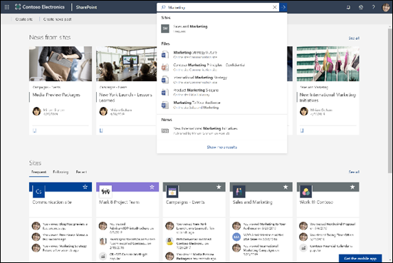

# Panoramica di Microsoft Search

Microsoft Search consente di trovare gli elementi necessari per completare le operazioni in uso. Sia che si cerchino persone, file, organigrammi, siti o risposte a domande comuni, è possibile utilizzare Microsoft Search durante la giornata lavorativa per ottenere risposte.

Microsoft Search consente agli utenti di trovare le risposte, le persone e il contenuto giusto per completare le proprie attività nell'app in cui stanno già lavorando.

- Gli utenti visualizzano i risultati pertinenti nel **contesto** dell'app da cui eseguono la ricerca. Ad esempio, quando ricercano in [Microsoft Outlook](https://www.microsoft.com/outlook), trovano i messaggi di posta elettronica [e](http://sharepoint.com/) non SharePoint siti. Quando eseguono una ricerca in SharePoint, trovano file, pagine e siti.
- Indipendentemente dall'app aperta, Microsoft Search è **personale**. Microsoft Search vengono utilizzate informazioni dettagliate da [Microsoft Graph](https://developer.microsoft.com/graph/) per mostrare risultati rilevanti per ogni utente. Ogni utente può visualizzare risultati diversi, anche se due utenti cercano le stesse parole. Visualizzano solo i risultati a cui hanno già accesso, Microsoft Search non modifica le autorizzazioni.
- Gli utenti non devono ricordare dove si trovano le informazioni. Ad esempio, un utente sta lavorando in [Microsoft Word](https://products.office.com/word) e desidera riutilizzare le informazioni di una presentazione condivisa da un collega dal proprio [OneDrive](https://onedrive.live.com/about/). Non è necessario passare a un'OneDrive e cercare la presentazione, ma possono semplicemente eseguire ricerche da Word.
- In [Bing](https://bing.com) gli utenti ottengono risultati sia dal Web pubblico sia dall'interno dell'organizzazione.

## Cosa vedono gli utenti

In [Bing](https://bing.com), gli utenti utilizzano la stessa casella di ricerca delle ricerche Web. Nelle app Office, gli utenti trovano la Microsoft Search nella barra di intestazione. Avrà l'aspetto seguente:

Quando gli utenti fa clic **nella** casella Di ricerca, la ricerca suggerisce i risultati in base all'attività precedente in Office 365 e in base al contenuto di tendenza nell'organizzazione. I file a cui hanno lavorato di recente, i comandi usati di recente e le persone con cui collaborano sono esempi di attività che la ricerca considera. Quando gli utenti iniziano a digitare nella **casella Di** ricerca, i risultati suggeriti vengono aggiornati. Gli utenti possono aprire i risultati della ricerca direttamente dalla **casella di** ricerca. Ecco un esempio di ricerca in [SharePoint](http://sharepoint.com/).

Se i suggerimenti nella casella di ricerca non sono quelli cercati dagli utenti, **invio** apre l'elenco completo dei risultati. Possono usare metadati come chi ha modificato l'elemento per l'ultima volta e quando, dove si trova l'elemento, nonché visualizzarne l'anteprima per determinare se è quello che stanno cercando.

## Vantaggi di Microsoft Search

**Esecuzione di ricerche in Microsoft 365 da qualsiasi casella Microsoft Search**: gli utenti possono eseguire ricerche da qualsiasi casella Microsoft Search e tornare rapidamente alle proprie attività. Microsoft Search riunisce i risultati delle origini dati in Office 365, tra cui [SharePoint,](http://sharepoint.com/) [Microsoft OneDrive for Business](https://onedrive.live.com/about/business/)e [Microsoft Exchange Server](https://products.office.com/exchange/microsoft-exchange-server).

**Facile da cercare:** Microsoft Search risultati in base all'attività precedente degli utenti in Office 365, direttamente nella **casella Di** ricerca.

**Ricerca di file condivisi**: Microsoft Search usa il riconoscimento avanzato delle query per semplificare la ricerca di file condivisi. Gli utenti possono quindi trovare facilmente i file a cui stanno collaborando.

**Visualizzazione di contenuto pertinente**: promuovere le informazioni e le risposte di cui gli utenti hanno bisogno per completare le attività, ad esempio criteri, vantaggi, risorse, strumenti e altro ancora. È inoltre possibile scegliere come destinazione gruppi specifici, ad esempio nuovi assunti, lavoratori remoti o aree geografiche diverse.

**Amministrazione da tutte le app**: Microsoft Search è **attivo** per impostazione predefinita e qualsiasi operazione di amministrazione viene applicata a Microsoft Search in tutte le app.

## Personalizzazione di Microsoft Search in base alle esigenze dell'organizzazione

Gli amministratori possono creare un'esperienza Microsoft Search per gli utenti.

**Mostra contenuto utile: le** risposte forniscono risultati rapidi e autorevoli alle query di ricerca basate su parole chiave. [Pianificare il contenuto](plan-your-content.md).

**Aggiungere contenuto esterno:** i connettori Graph Microsoft consentono di portare il contenuto esterno nell'indice. Utilizzare i connettori per migliorare l'esperienza di ricerca con dati e file dall'esterno Microsoft 365. [Panoramica dei connettori Graph Microsoft](connectors-overview.md)

**Personalizzare l'esperienza utente:** è possibile personalizzare l'esperienza utente tramite l'uso di verticali e altre configurazioni. [Personalizzare la Microsoft Search pagina](customize-search-page.md)

## Contenuto in cui viene ricercato

Microsoft Search mostra il contenuto archiviato dall'organizzazione in Microsoft 365 o indicizzato tramite connettori. Microsoft Search non esegue ricerche tra tenant o mostra i risultati del contenuto condiviso da altre organizzazioni. Se l'organizzazione ha configurato un ambiente SharePoint ibrido utilizzando la ricerca ibrida cloud, Microsoft Search restituisce i risultati della ricerca sia dal contenuto SharePoint online che da quello locale, inclusi eventuali contenuti esterni connessi all'ambiente SharePoint Server. [Altre informazioni sugli ambienti di ricerca ibridi](/sharepoint/hybrid/learn-about-cloud-hybrid-search-for-sharepoint).

Gli utenti otterrà gli stessi risultati della ricerca ottenuti da altre posizioni e otterrà anche risultati da Internet.

## Funzionamento Microsoft Search

Quando un utente esegue una ricerca, Microsoft Search elabora la query e analizza l'intento della ricerca da frasi più lunghe, usando l'intelligenza artificiale (AI) per apprendere le frasi superflue comuni che gli utenti aggiungono alle query e che non influiscono sull'intento della ricerca. Ad esempio, quando un utente cerca "come cambiare la password", le parole meno importanti vengono estratte dalla query e viene attivata la ricerca in base a quelle più pertinenti, ad esempio "cambiare la password".  
I risultati della ricerca che gli utenti sono **autorizzati** a vedere vengono visualizzati nella pagina dei risultati della ricerca. Microsoft Search usa algoritmi di classificazione intelligenti per ordinare i risultati in base alla pertinenza.

## Come Microsoft Search in Bing i dati aziendali

[Sicurezza e privacy per Microsoft Search in Bing](security-for-search.md)

## Vedere anche

[Configurare Microsoft Search](setup-microsoft-search.md)