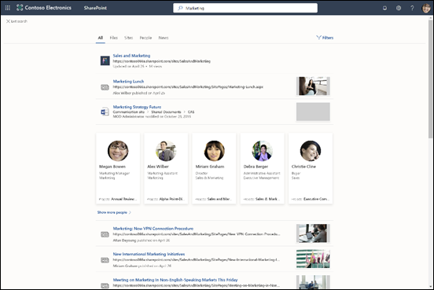

# Panoramica di Microsoft SearchOverview of Microsoft Search

Microsoft Search aiuta a trovare le informazioni necessarie per completare il lavoro.Microsoft Search helps you find what you need to complete what you’re working on. Se si sta cercando persone, file, organigrammi, siti o risposte a domande comuni, è possibile utilizzare Microsoft Search per tutta la giornata lavorativa per ottenere risposte.Whether you're searching for people, files, org charts, sites, or answers to common questions, you can use Microsoft Search throughout your workday to get answers.

Microsoft Search consente agli utenti di trovare le risposte, le persone e i contenuti corretti per completare le attività direttamente nell'app.Microsoft Search helps users find the right answers, people, and content to complete their tasks in the app they’re already working in.

- Gli utenti visualizzano i risultati pertinenti nel **contesto** dell'app da cui eseguono la ricerca.Users get results that are relevant in the **context** of the app they search from. Ad esempio, quando si esegue una ricerca in [Microsoft Outlook](https://www.microsoft.com/outlook), vengono trovati messaggi di posta elettronica e non siti di [SharePoint](http://sharepoint.com/) .For example, when they search in [Microsoft Outlook](https://www.microsoft.com/outlook), they find emails, and not [SharePoint](http://sharepoint.com/) sites. Quando eseguono una ricerca in SharePoint, trovano file, pagine e siti.When they search in SharePoint, they find sites, pages, and files.
- Indipendentemente dall'app aperta, Microsoft Search è **personale**.Whichever app users are working in; Microsoft Search is **personal**. Microsoft Search utilizza informazioni approfondite da [Microsoft Graph](https://developer.microsoft.com/graph/) per visualizzare i risultati rilevanti per ogni utente.Microsoft Search uses insights from the [Microsoft Graph](https://developer.microsoft.com/graph/) to show results that are relevant to each user. Ogni utente può visualizzare risultati diversi, anche se due utenti cercano le stesse parole.Each user might see different results, even if they search for the same words. Gli utenti visualizzano solo quello i contenuti a cui hanno già accesso dal momento che Microsoft Search non modifica le autorizzazioni.They only see results that they already have access to, Microsoft Search doesn’t change permissions.
- Gli utenti non devono ricordare dove si trovano le informazioni.Users don’t need to remember where the information is located. Ad esempio, un utente lavora in [Microsoft Word](https://products.office.com/word) e desidera riutilizzare le informazioni di una presentazione che un collega ha condiviso dal proprio [OneDrive](https://onedrive.live.com/about/).For example, a user is working in [Microsoft Word](https://products.office.com/word) and wants to reuse information from a presentation that a colleague shared from their [OneDrive](https://onedrive.live.com/about/). non deve più passare a OneDrive e cercare quella presentazione, ma può cercarla direttamente da Word.There’s no need to switch to OneDrive and search for that presentation, they can simply search from Word.
- In [Bing](https://bing.com) gli utenti ottengono risultati sia dal Web pubblico sia dall'interno dell'organizzazione.When in [Bing](https://bing.com), users get results from within their organization in addition to the public web results.

## Cosa vedono gli utentiWhat users see

In [Bing](https://bing.com)gli utenti utilizzano la stessa casella di ricerca per le ricerche Web.In [Bing](https://bing.com), users use the same search box as for web searches. Nelle app di Office, gli utenti trovano la casella di ricerca di Microsoft nella barra di intestazione.In the Office apps, users find the Microsoft Search box in the header bar. L'aspetto è simile al seguente:It looks like this:

Quando gli utenti fanno clic nella casella di **ricerca** , vengono suggeriti i risultati in base alle attività precedenti di Office 365 e basati sul contenuto che è in trend nell'organizzazione.When users click in the **Search** box, search suggests results based on their previous activity in Office 365 and based on content that’s trending in your organization. I file su cui hanno lavorato di recente, gli ultimi comandi usati e le persone con cui hanno collaborato sono esempi di attività prese in considerazione dalla ricerca.Files they were working on recently, commands they’ve used recently as well as people they collaborate with are examples of activity that search considers. Quando gli utenti iniziano a digitare nella casella di **ricerca** , l'aggiornamento dei risultati suggeriti.As users start typing in the **Search** box, the suggested results update. Gli utenti possono aprire i risultati della ricerca direttamente dalla casella di **ricerca** .Users can open search results right from the **Search** box. Di seguito è riportato un esempio di ricerca in [SharePoint](http://sharepoint.com/).Here's an example of a search in [SharePoint](http://sharepoint.com/).

Se i suggerimenti nella casella di ricerca non sono ciò che gli utenti stanno cercando, **Enter** apre l'elenco completo dei risultati.If the suggestions in the search box aren’t what users are looking for, **Enter** opens the full list of results. È possibile usare i metadati, ad esempio l'autore e la data di modifica dell'elemento, la posizione degli elementi e l'anteprima per verificare se l'elemento trovato corrisponde a quello cercato.They can use metadata such as who last modified the item and when, where the items is located, as well as preview it to determine if it’s what they’re looking for.

## Vantaggi di Microsoft SearchBenefits of Microsoft Search

**Esecuzione di ricerche in Microsoft 365 da qualsiasi casella Microsoft Search**: gli utenti possono eseguire ricerche da qualsiasi casella Microsoft Search e tornare rapidamente alle proprie attività.**Search across Microsoft 365 from any Microsoft Search box** – Users can search from any Microsoft Search box and get quickly back to what they were doing. Microsoft Search riunisce i risultati delle origini dati in Office 365, tra cui [SharePoint](http://sharepoint.com/), [Microsoft OneDrive for business](https://onedrive.live.com/about/business/)e [Microsoft Exchange Server](https://products.office.com/exchange/microsoft-exchange-server).Microsoft Search brings together results from data sources in Office 365, including [SharePoint](http://sharepoint.com/), [Microsoft OneDrive for Business](https://onedrive.live.com/about/business/), and [Microsoft Exchange Server](https://products.office.com/exchange/microsoft-exchange-server).

**Facile da cercare** : la ricerca di Microsoft suggerisce i risultati in base alle attività precedenti degli utenti in Office 365, direttamente nella casella di **ricerca** .**Easy to search** – Microsoft Search suggests results based on users’ previous activity in Office 365, right in the **Search** box.

**Ricerca di file condivisi**: Microsoft Search usa il riconoscimento avanzato delle query per semplificare la ricerca di file condivisi.**Find shared files** – Microsoft Search uses advanced query understanding to make finding shared files simple. Gli utenti possono quindi trovare facilmente i file a cui stanno collaborando.Users can easily find files they’re collaborating on.

**Visualizzazione di contenuto pertinente**: promuovere le informazioni e le risposte di cui gli utenti hanno bisogno per completare le attività, ad esempio criteri, vantaggi, risorse, strumenti e altro ancora.**Show relevant content** – Promote the information and answers your users need to complete tasks, for example policies, benefits, resources, tools, and more. È inoltre possibile assegnare a gruppi specifici, come nuovi assunti, operatori remoti o diverse aree geografiche.You can also target specific groups, like new hires, remote workers, or different geographies.

**Amministrazione da tutte le app**: Microsoft Search è **attivo** per impostazione predefinita e qualsiasi operazione di amministrazione viene applicata a Microsoft Search in tutte le app.**Administer across all apps** – Microsoft Search is **on** by default and any administration you do applies to Microsoft Search in all the apps.

## Personalizzazione di Microsoft Search in base alle esigenze dell'organizzazioneTailoring Microsoft Search to your organization

Come amministratore, è possibile creare un'incredibile esperienza di ricerca di Microsoft per gli utenti.As an administrator you can create an amazing Microsoft Search experience for your users. 

**Mostra contenuto utile** : le risposte forniscono risultati veloci e autorevoli alle query di ricerca in base alle parole chiave.**Show useful content** – Answers provide fast, authoritative results to search queries based on keywords. [Rendere il contenuto facile da trovare](make-content-easy-to-find.md).[Make content easy to find](make-content-easy-to-find.md).

**Aggiungi contenuto esterno** : i connettori Microsoft Graph consentono di portare contenuto esterno nell'indice.**Add external content** – Microsoft Graph Connectors allow you to bring external content into the index. Utilizzare i connettori per arricchire l'esperienza di ricerca con dati e file provenienti dall'esterno di Microsoft 365.Use connectors to enrich the search experience with data and files from outside of Microsoft 365. [Panoramica dei connettori di Microsoft GraphOverview of Microsoft Graph connectors](connectors-overview.md)

**Personalizzare l'esperienza utente** : è possibile personalizzare l'esperienza utente tramite l'utilizzo di verticali e altre configurazioni.**Customize the user experience** – You can customize the user experience through the use of verticals and other configurations. [Personalizzare la pagina di ricerca di MicrosoftCustomize the Microsoft Search page](customize-search-page.md)

## Contenuto cercatoWhat content is searched?

Microsoft Search Visualizza il contenuto archiviato dall'organizzazione in Microsoft 365 o indicizzato tramite i connettori.Microsoft Search shows the content that your organization has stored in Microsoft 365 or indexed through connectors. Microsoft Search non esegue la ricerca tra i tenant o Mostra i risultati del contenuto condiviso da altre organizzazioni.Microsoft Search does not search across tenants or show results from content that's shared by other organizations. Se l'organizzazione ha configurato un ambiente di SharePoint ibrido con la ricerca ibrida nel cloud, Microsoft Search restituisce risultati di ricerca dai contenuti di SharePoint in locale e online, inclusi tutti i contenuti esterni connessi all'ambiente di SharePoint Server.If your organization has set up a hybrid SharePoint environment using cloud hybrid search, Microsoft Search returns search results from both online and on-premises SharePoint content, including any external content you’ve connected to your SharePoint Server environment. [Altre informazioni sugli ambienti di ricerca ibridi](https://docs.microsoft.com/sharepoint/hybrid/learn-about-cloud-hybrid-search-for-sharepoint).[Learn more about hybrid search environments](https://docs.microsoft.com/sharepoint/hybrid/learn-about-cloud-hybrid-search-for-sharepoint).

Gli utenti riceveranno gli stessi risultati della ricerca ottenuti da altre posizioni e riceveranno anche i risultati da Internet.Users will get the same search results they get from other locations and will also get results from the internet.

## Come funziona Microsoft Search?How does Microsoft Search work?

Quando un utente esegue una ricerca, Microsoft Search elabora la query e analizza l'intento della ricerca da frasi più lunghe, usando l'intelligenza artificiale (AI) per apprendere le frasi superflue comuni che gli utenti aggiungono alle query e che non influiscono sull'intento della ricerca.When a user searches, Microsoft Search processes the query and parses search intent from larger phrases, using Artificial Intelligence (AI) to learn common superfluous phrases users add to their queries that don't impact their search intent. Ad esempio, quando un utente cerca "come cambiare la password", le parole meno importanti vengono estratte dalla query e viene attivata la ricerca in base a quelle più pertinenti, ad esempio "cambiare la password".For example, when a user searches for "how to change my password" we extract the less important words from the query and trigger based on the relevant ones like "change password".  
I risultati della ricerca che gli utenti sono **autorizzati** a vedere vengono visualizzati nella pagina dei risultati della ricerca.The search results that the user has **permission** to see are presented on the search results page. Microsoft Search usa algoritmi di classificazione intelligenti per ordinare i risultati in base alla pertinenza.Microsoft Search uses intelligent ranking algorithms to order results based on relevance.

## In che modo Microsoft Search in Bing aiuta a proteggere i dati aziendali?How does Microsoft Search in Bing help protect my company data?

[Protezione e privacy per Microsoft Search in BingSecurity and Privacy for Microsoft Search in Bing](security-for-search.md)

## Vedere ancheSee also

[Configurare Microsoft SearchSet up Microsoft Search](setup-microsoft-search.md)

[Facilitare la ricerca del contenutoMake content easy to find](make-content-easy-to-find.md)
