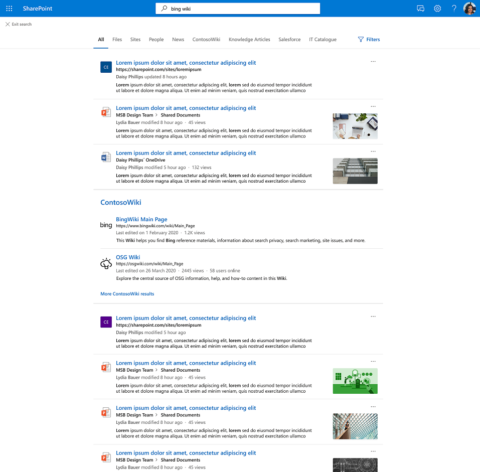

# Graph dei risultati dei connettori

## Panoramica del cluster di risultati Graph connettori di rete  

Con i cluster di risultati dei connettori di Graph, le aziende possono cercare contenuto da origini dati di terze parti nella visualizzazione predefinita, la scheda **Tutti,** in SharePoint, Office.com e Microsoft Search in Bing.

I cluster di risultati consentono agli utenti di individuare tutto il contenuto di terze parti in un'unica posizione. I risultati visualizzati in un cluster di risultati sono raggruppati in base alla configurazione verticale di ricerca.

## Modalità di selezione e visualizzazione dei risultati del connettore

I risultati dei connettori forniti nel cluster di risultati derivano da singoli verticali di ricerca con contenuto del connettore. Ogni verticale di ricerca fornisce un set di risultati pertinenti che diventa un cluster di risultati candidato. I risultati pertinenti vengono scelti in base alla proprietà "title" e alla proprietà "content" di ogni elemento. La proprietà content è contrassegnata *come isContent=true* nello schema.

Per garantire l'individuazione del contenuto dai verticali di ricerca, ti consigliamo di fornire titoli significativi per gli elementi. Ciò influisce positivamente sull'arbitraggio dei candidati del cluster di risultati e sulla probabilità che il contenuto sia visualizzato in un cluster di risultati. Ad esempio, evita l'uso di ID come valori per la proprietà "title" a meno che gli utenti non utilizzino gli ID per cercare il contenuto.

La frequenza di visualizzazione di un cluster di risultati varia in base a fattori quali il numero di verticali di ricerca da configurare e il tipo di contenuto. Interagendo o ignorando un cluster di risultati, gli utenti forniranno implicitamente suggerimenti che ne modificano l'attivazione nel tempo.

L'esperienza dei risultati della ricerca per gli elementi dei connettori mostrati nel cluster di risultati [utilizza](./customize-search-page.md#create-your-own-result-type) i tipi di risultati definiti dall'utente. Se non è configurato alcun tipo di risultato, viene [utilizzato un layout generato](./customize-search-page.md#default-search-result-layout) dal sistema.

È consigliabile utilizzare la proprietà "title" come titolo del risultato della ricerca e la proprietà "content" come descrizione della ricerca. In questo modo sarà possibile offrire agli utenti la migliore esperienza possibile attivando in modo accurato il cluster di risultati e i risultati più pertinenti nel cluster.

I cluster di risultati vengono visualizzati al centro della pagina nel verticale Tutti. Ad esempio, di seguito viene visualizzato un cluster di risultati da un verticale "MediaWiki".

## Impostazioni predefinite dei cluster di risultati
  
L'esperienza del cluster di risultati è attivata per impostazione predefinita.  

Se si desidera disabilitarlo, eseguire la procedura seguente per disattivare l'esperienza a livello di organizzazione:

1. Nella finestra [interfaccia di amministrazione di Microsoft 365](https://admin.microsoft.com), andare a [**Verticali**](https://admin.microsoft.com/Adminportal/Home#/MicrosoftSearch/verticals).
1. Selezionare il **verticale Tutti,** quindi abilitare **Nascondi i risultati del connettore.**

Seguire questa procedura per disattivare l'esperienza a SharePoint sito:

1. Passare a **Impostazioni** nel sito SharePoint locale
2. Vai a **Informazioni sito** Visualizza tutte le impostazioni > **del sito.**
3. Passare alla sezione Microsoft Search e quindi selezionare Configura Microsoft Search **per questa raccolta siti.**
4. Nel riquadro di spostamento passare a **Esperienza personalizzata,** quindi selezionare **Verticali.**
5. Selezionare il **verticale Tutti,** quindi abilitare **Nascondi i risultati del connettore.**
