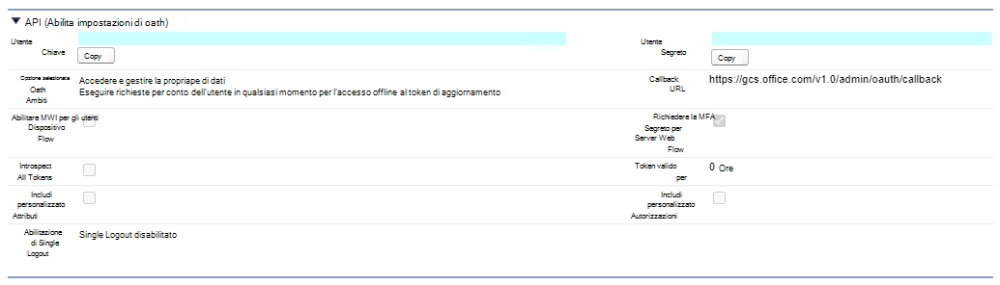

# Connettore Salesforce (anteprima)Salesforce connector (preview)

Con il connettore di Salesforce Graph, l'organizzazione può indicizzare i contatti, le opportunità, i lead e gli oggetti account nell'istanza di Salesforce.With the Salesforce Graph connector, your organization can index Contacts, Opportunities, Leads and Accounts objects in your Salesforce instance. Dopo aver configurato il connettore e indicizzare il contenuto da Salesforce, gli utenti finali possono cercare tali elementi da qualsiasi client di ricerca di Microsoft.After you configure the connector and index content from Salesforce, end users can search for those items from any Microsoft Search client.

Questo articolo è per gli amministratori di [Microsoft 365](https://www.microsoft.com/microsoft-365) o per tutti coloro che configurano, eseguono e monitorano un connettore Salesforce.This article is for [Microsoft 365](https://www.microsoft.com/microsoft-365) administrators or anyone who configures, runs, and monitors a Salesforce connector. In questo articolo viene illustrato come configurare le funzionalità di connettore e connettore, le limitazioni e le tecniche di risoluzione dei problemi.It explains how to configure your connector and connector capabilities, limitations, and troubleshooting techniques.

>[!IMPORTANT]
>Il connettore del grafico Salesforce attualmente supporta Summer '19 o versione successiva.The Salesforce Graph connector currently supports Summer '19 or later.

## Impostazioni di connessioneConnection settings

Per connettersi all'istanza di Salesforce, è necessario l'URL dell'istanza di Salesforce, l'ID client e il segreto client per l'autenticazione OAuth.To connect to your Salesforce instance, you need your Salesforce instance URL, the Client ID, and Client Secret for OAuth authentication. Nei passaggi seguenti viene illustrato come l'amministratore di Salesforce può ottenere queste informazioni dall'account Salesforce:The following steps explain how you or your Salesforce administrator can get this information from your Salesforce account:

- Accedere all'istanza di Salesforce e passare a installazioneLog in to your Salesforce instance and go to Setup

- Accedere a Apps-> App Manager.Navigate to Apps -> App Manager.

- Seleziona **nuova app connessa**.Select **New connected app**.

- Completare la sezione API come indicato di seguito:Complete the API section as follows:

    - Selezionare la casella di controllo per **abilitare le impostazioni OAuth**.Select the checkbox for **Enable Oauth Settings**.

    - Specificare l'URL di callback come: [https://gcs.office.com/v1.0/admin/oauth/callback](https://gcs.office.com/v1.0/admin/oauth/callback)Specify the Callback URL as: [https://gcs.office.com/v1.0/admin/oauth/callback](https://gcs.office.com/v1.0/admin/oauth/callback)

    - Selezionare gli ambiti OAuth necessari.Select these required OAuth scopes. 

        - Accedere e gestire i dati (API)Access and manage your data (api) 

        - Eseguire richieste per conto dell'utente in qualsiasi momento (refresh_token, offline_access)Perform requests on your behalf at any time (refresh_token, offline_access) 

    - Selezionare la casella di controllo **Richiedi segreto per il flusso del server Web**.Select the checkbox for **Require secret for web server flow**.

    - Salvare l'app.Save the app.
    
      

- Copiare la chiave consumer e il segreto del consumer.Copy the consumer key and the consumer secret. Queste verranno utilizzate come ID client e segreto client quando si configurano le impostazioni di connessione per il connettore grafico nel portale di amministrazione di Microsoft 365.These will be used as the Client ID and the Client Secret when you configure the Connection Settings for your Graph Connector in the Microsoft 365 admin portal.

  
- Prima di chiudere l'istanza di Salesforce, attenersi alla procedura seguente per verificare che i token di aggiornamento non scadano:Before closing your Salesforce instance, perform the following steps to ensure that refresh tokens do not expire:
    - Andare a Apps-> App ManagerGo to Apps -> App Manager
    - Individuare l'app appena creata e selezionare l'elenco a discesa a destra.Find the app you just created and select the drop down on the right. Selezionare **Gestisci**Select **Manage**
    - Selezionare **modifica criteri**Select **edit policies**
    - Per i criteri token di aggiornamento, selezionare **Aggiorna token è valido finché non è stato revocato** .For refresh token policy, select **Refresh token is valid until revoked**

  

È ora possibile utilizzare l'interfaccia di [amministrazione di M365](https://admin.microsoft.com/) per completare il resto del processo di installazione per il connettore grafico.You can now use the [M365 Admin Center](https://admin.microsoft.com/) to complete the rest of the setup process for your Graph connector.  

Configurare le impostazioni di connessione per il connettore grafico come indicato di seguito:Configure the Connection settings for your Graph connector as follows:

- Per l'URL dell'istanza, utilizzare https://[Domain]. My. salesforce. com, dove Domain sarebbe il dominio Salesforce per la propria organizzazione.For the Instance URL, use https://[domain].my.salesforce.com where domain would be the Salesforce domain for your organization. 
- Immettere l'ID client e il segreto client ottenuti dall'istanza di Salesforce e selezionare Accedi.Enter the Client ID and Client Secret you obtained from your Salesforce instance and select Sign in.
- Se è la prima volta che si cerca di accedere con queste impostazioni, viene visualizzato un pop up che richiede l'accesso a Salesforce con il nome utente e la password di amministratore.If this is the first time you have attempted to Sign in with these settings, you will get a pop up asking you to login to Salesforce with your admin username and password. Nella schermata seguente viene visualizzato il popup.The screenshot below shows the popup. Immettere le credenziali e selezionare Accedi.Enter your credentials and select Log in.

  

  >[!NOTE]
  >Se il pop-up non viene visualizzato, potrebbe essere bloccato nel browser, quindi è necessario consentire popup e reindirizzamenti.If the pop up does not appear, it might be getting blocked in your browser, so you must allow pop-ups and redirects.

  >[!NOTE]
  >Se nell'organizzazione viene utilizzato il servizio Single Sign-on (SSO), è possibile selezionare **Usa dominio personalizzato** nell'angolo inferiore destro dell'interfaccia di accesso.If your organization uses single sign-on (SSO), you can select **Use Custom Domain** in the bottom, right-hand corner of the login interface. Immettere il dominio e quindi fare clic su **continua**.Enter the domain and then select **Continue**. Passerà alla pagina di accesso specifica dell'organizzazione in cui si avrà la possibilità di accedere con SSO.It will go to your organization specific login page where you will have an option to login with SSO.

- Verificare che la connessione abbia avuto esito positivo tramite la ricerca di un banner verde che dica "connessione completata" come mostrato nella schermata seguente.Check that the connection was successful by searching for a green banner that says "Connection successful" as show in the screenshot below.

  

## Gestire le autorizzazioni di ricercaManage search permissions
Sarà necessario scegliere gli utenti che vedranno i risultati della ricerca da questa origine dati.You will need to choose which users will see search results from this data source. Se si consente solo a determinati utenti di Azure Active Directory (Azure AD) o non Azure ad di visualizzare i risultati della ricerca, sarà necessario eseguire il mapping delle identità.If you allow only certain Azure Active Directory (Azure AD) or Non-Azure AD users to see the search results, you will then need to map the identities.

### Selezionare le autorizzazioniSelect Permissions
È possibile scegliere di gestire gli elenchi di controllo di accesso (ACL, Access Control List) dall'istanza di Salesforce oppure consentire a tutti gli utenti dell'organizzazione di visualizzare i risultati della ricerca dall'origine dati.You can choose to ingest Access Control Lists (ACLs) from your Salesforce instance, or you can allow everyone in your organization to see search results from this data source. Gli elenchi ACL possono includere le identità di Azure Active Directory (AAD) (gli utenti federati da Azure AD a Salesforce), le identità non Azure AD (utenti di Salesforce nativi con identità corrispondenti in Azure AD) o entrambe.ACLs can include Azure Active Directory (AAD) identities (users who are federated from Azure AD to Salesforce), non-Azure AD identities (native Salesforce users who have corresponding identities in Azure AD), or both.

### Mapping delle identità non AADMap non-AAD identities 
Se si è scelto di ingerire un elenco di controllo di accesso dall'istanza di Salesforce e "non AAD" selezionato per il tipo di identità, vedere [Map Your non-Azure ad](map-non-aad.md) identitys per istruzioni sul mapping delle identità.If you chose to ingest an ACL from your Salesforce instance and selected "non-AAD" for the identity type see [Map your non-Azure AD Identities](map-non-aad.md) for instructions on mapping the identities.

### Mapping delle identità di AADMap AAD identities
Se si è scelto di ingerire un elenco di controllo di accesso dall'istanza di Salesforce e "AAD" selezionato per il tipo di identità, vedere [mappare le identità di Azure ad](map-aad.md) per istruzioni sul mapping delle identità.If you chose to ingest an ACL from your Salesforce instance and selected "AAD" for the identity type see [Map your Azure AD Identities](map-aad.md) for instructions on mapping the identities. Per informazioni su come configurare l'accesso SSO di Azure AD per Salesforce, vedere questa [esercitazione](https://docs.microsoft.com/en-us/azure/active-directory/saas-apps/salesforce-tutorial).To learn how to set up Azure AD SSO for Salesforce, see this [tutorial](https://docs.microsoft.com/en-us/azure/active-directory/saas-apps/salesforce-tutorial).

## Assegnare etichette delle proprietàAssign property labels 
È possibile assegnare una proprietà di origine a ogni etichetta scegliendo da un menu di opzioni.You can assign a source property to each label by choosing from a menu of options. Anche se questo passaggio non è obbligatorio, l'utilizzo di alcune etichette di proprietà migliorerà la pertinenza della ricerca e assicurerà risultati di ricerca più accurati per gli utenti finali.While this step is not mandatory, having some property labels will improve the search relevance and ensure more accurate search results for end users. Per impostazione predefinita, alcune delle etichette come "title", "URL", "CreatedBy" e "LastModifiedBy" sono già state assegnate proprietà di origine.By default, some of the Labels like "Title," "URL," "CreatedBy," and  "LastModifiedBy" have already been assigned source properties.

## Gestione dello schemaManage Schema
È possibile selezionare le proprietà di origine che devono essere indicizzate in modo che possano essere visualizzate nei risultati della ricerca.You can select what source properties should be indexed so that they can show up in search results. Per impostazione predefinita, la connessione guidata consente di selezionare uno schema di ricerca basato su un insieme di proprietà di origine.The connection wizard by default selects a search schema based on a set of source properties. È possibile modificarlo selezionando le caselle di controllo per ogni proprietà e attributo nella pagina schema di ricerca.You can modify it by selecting the check boxes for each property and attribute in the search schema page. Gli attributi dello schema di ricerca includono ricerca, query, recupero e affinamento.Search schema attributes include Search, Query, Retrieve and Refine. Affina consente di definire le proprietà che possono essere utilizzate in un secondo momento come affinamenti o filtri personalizzati nell'esperienza di ricerca.Refine allows you to define the properties which can be later used as custom refiners or filters in the search experience.  

## Impostare la pianificazione di aggiornamentoSet the refresh schedule

Il connettore Salesforce supporta solo le pianificazioni di aggiornamento per le ricerche per indicizzazione complete attualmente.The Salesforce connector only supports refresh schedules for full crawls currently.

>[!IMPORTANT]
>Una ricerca per indicizzazione completa trova gli oggetti eliminati e gli utenti precedentemente sincronizzati con l'indice di ricerca di Microsoft.A full crawl finds deleted objects and users that were previously synced to the Microsoft Search index.

La pianificazione consigliata è una settimana per una ricerca per indicizzazione completa.The recommended schedule is one week for a full crawl.

## LimitazioniLimitations

- Il connettore grafico attualmente non supporta la condivisione e la condivisione basate sul territorio e l'utilizzo di gruppi personali da Salesforce.The Graph connector does not currently support Apex based , territory-based sharing and sharing using personal groups from Salesforce.
- Nell'API di Salesforce è presente un bug noto che il connettore grafico utilizza in cui le impostazioni predefinite per i lead non sono attualmente rispettate.There is a known bug in the Salesforce API that the Graph connector uses where the private org wide defaults for leads is not honored currently.  
- Se per un profilo è impostato un campo di sicurezza a livello di campo (FLS), il connettore grafico non inventerà tale campo per i profili di Salesforce org. Gli utenti non potranno quindi eseguire ricerche nei valori per tali campi e non verranno visualizzati nei risultati.If a field has field level security (FLS) set for a profile, the Graph connector will not ingest that field for any profiles in that Salesforce org. Users will thus not be able to search on values for those fields, nor will it  show up in the results.  
- Nella schermata Gestisci schema questi nomi di proprietà comuni standard sono elencati una volta e la selezione eseguita per renderli disponibili per query, ricercabili e recuperabili si applica a tutti o nessuno.In the Manage Schema screen these common standard property names are listed once and the selection done to make them queryable, searchable and retrievable apply to all or none.
    - NomeName
    - URLUrl 
    - DescrizioneDescription
    - FaxFax
    - PhonePhone
    - MobilePhoneMobilePhone
    - Posta elettronicaEmail
    - TipoType
    - TitoloTitle
    - AccountIdAccountId
    - AccountNameAccountName
    - AccountUrlAccountUrl
    - AccountOwnerAccountOwner
    - AccountOwnerUrlAccountOwnerUrl
    - ProprietarioOwner
    - OwnerUrlOwnerUrl
    - CreatedByCreatedBy 
    - CreatedByUrlCreatedByUrl 
    - LastModifiedByLastModifiedBy 
    - LastModifiedByUrlLastModifiedByUrl 
    - LastModifiedDateLastModifiedDate
    - ObjectNameObjectName 
