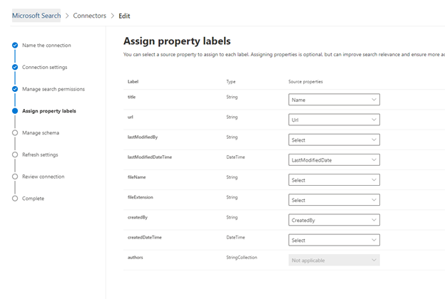

# Connettore Salesforce

Con il connettore di Salesforce Graph, l'organizzazione può indicizzare i contatti, le opportunità, i lead e gli oggetti account nell'istanza di Salesforce. Dopo aver configurato il connettore e indicizzare il contenuto da Salesforce, gli utenti finali possono cercare gli elementi da qualsiasi client di ricerca di Microsoft

Questo articolo è per gli amministratori di [Microsoft 365](https://www.microsoft.com/microsoft-365) o per tutti coloro che configurano, eseguono e monitorano un connettore Salesforce. In questo articolo viene illustrato come configurare le funzionalità di connettore e connettore, le limitazioni e le tecniche di risoluzione dei problemi.

>[!IMPORTANT]
>Il connettore di Salesforce Graph supporta attualmente le versioni Summer '20, Spring '20, Winter '20 e Summer '19.

## Impostazioni di connessione

Per connettersi all'istanza di Salesforce, è necessario l'URL dell'istanza di Salesforce, l'ID client e il segreto client per l'autenticazione OAuth. Nei passaggi seguenti viene illustrato come l'amministratore di Salesforce può ottenere queste informazioni dall'account Salesforce:

- Accedere all'istanza di Salesforce e passare a installazione

- Accedere a Apps-> App Manager.

- Seleziona **nuova app connessa**.

- Completare la sezione API come indicato di seguito:

    - Selezionare la casella di controllo per **abilitare le impostazioni OAuth**.

    - Specificare l'URL di callback come: [https://gcs.office.com/v1.0/admin/oauth/callback](https://gcs.office.com/v1.0/admin/oauth/callback)

    - Selezionare gli ambiti OAuth necessari. 

        - Accedere e gestire i dati (API) 

        - Eseguire richieste per conto dell'utente in qualsiasi momento (refresh_token, offline_access) 

    - Selezionare la casella di controllo **Richiedi segreto per il flusso del server Web**.

    - Salvare l'app.
    
      

- Copiare la chiave consumer e il segreto del consumer. Queste verranno utilizzate come ID client e segreto client quando si configurano le impostazioni di connessione per il connettore grafico nel portale di amministrazione di Microsoft 365.

  
- Prima di chiudere l'istanza di Salesforce, attenersi alla procedura seguente per verificare che i token di aggiornamento non scadano: 
    - Andare a Apps-> App Manager
    - Individuare l'app appena creata e selezionare l'elenco a discesa a destra. Selezionare **Gestisci**
    - Selezionare **modifica criteri**
    - Per i criteri token di aggiornamento, selezionare **Aggiorna token è valido finché non è stato revocato** .

  

È ora possibile utilizzare l'interfaccia di [amministrazione di M365](https://admin.microsoft.com/) per completare il resto del processo di installazione per il connettore grafico.  

Configurare le impostazioni di connessione per il connettore grafico come indicato di seguito:

- Per l'URL dell'istanza, utilizzare https://[Domain]. My. salesforce. com, dove Domain sarebbe il dominio Salesforce per la propria organizzazione. 
- Immettere l'ID client e il segreto client ottenuti dall'istanza di Salesforce e selezionare Accedi.
- Se è la prima volta che si cerca di accedere con queste impostazioni, viene visualizzato un pop up che richiede l'accesso a Salesforce con il nome utente e la password di amministratore. Nella schermata seguente viene visualizzato il popup. Immettere le credenziali e selezionare Accedi.

  

  >[!NOTE]
  >Se il pop-up non viene visualizzato, potrebbe essere bloccato nel browser, quindi è necessario consentire popup e reindirizzamenti.

  >[!NOTE]
  >Se nell'organizzazione viene utilizzato il servizio Single Sign-on (SSO), è possibile selezionare **Usa dominio personalizzato** nell'angolo inferiore destro dell'interfaccia di accesso. Immettere il dominio e quindi fare clic su **continua**. Passerà alla pagina di accesso specifica dell'organizzazione in cui si avrà la possibilità di accedere con SSO.

- Verificare che la connessione abbia avuto esito positivo tramite la ricerca di un banner verde che dica "connessione completata" come mostrato nella schermata seguente.

  

## Gestire le autorizzazioni di ricerca
Sarà necessario scegliere gli utenti che vedranno i risultati della ricerca da questa origine dati. Se si consente solo a determinati utenti di Azure Active Directory (AAD) o non AAD di visualizzare i risultati della ricerca, sarà necessario eseguire il mapping delle identità.

### Selezionare le autorizzazioni
È possibile scegliere di gestire gli elenchi di controllo di accesso (ACL, Access Control List) dall'istanza di Salesforce oppure consentire a tutti gli utenti dell'organizzazione di visualizzare i risultati della ricerca dall'origine dati. Gli elenchi ACL possono includere le identità di Azure Active Directory (AAD), le identità non AAD o entrambe.

### Mapping delle identità non AAD 
Se si è scelto di ingerire un elenco di controllo di accesso dall'istanza di Salesforce e "non AAD" selezionato per il tipo di identità, vedere [Map Your non-Azure ad ](map-non-aad.md) identitys per istruzioni sul mapping delle identità.

### Mapping delle identità di AAD
Se si è scelto di ingerire un elenco di controllo di accesso dall'istanza di Salesforce e "AAD" selezionato per il tipo di identità, vedere [mappare le identità di Azure ad](map-aad.md) per istruzioni sul mapping delle identità.

## Assegnare etichette delle proprietà 
È possibile assegnare una proprietà di origine a ogni etichetta scegliendo da un menu di opzioni. Anche se questo passaggio non è obbligatorio, l'utilizzo di alcune etichette di proprietà migliorerà la pertinenza della ricerca e assicurerà risultati di ricerca più accurati per gli utenti finali. Per impostazione predefinita, alcune delle etichette come "title", "URL" e "LastModifiedBy" sono già state assegnate proprietà di origine.

## Gestione dello schema
È possibile selezionare le proprietà di origine che devono essere indicizzate in modo che possano essere visualizzate nei risultati della ricerca. Per impostazione predefinita, la connessione guidata consente di selezionare uno schema di ricerca basato su un insieme di proprietà di origine. È possibile modificarlo selezionando le caselle di controllo per ogni proprietà e attributo nella pagina schema di ricerca. Gli attributi dello schema di ricerca includono ricerca, query, recupero e affinamento. Affina consente di definire le proprietà che possono essere utilizzate in un secondo momento come affinamenti o filtri personalizzati nell'esperienza di ricerca.  

## Impostare la pianificazione di aggiornamento

Il connettore Salesforce supporta solo le pianificazioni di aggiornamento per le ricerche per indicizzazione complete attualmente.

>[!IMPORTANT]
>Una ricerca per indicizzazione completa trova gli oggetti eliminati e gli utenti precedentemente sincronizzati con l'indice di ricerca di Microsoft.

La pianificazione consigliata è una settimana per una ricerca per indicizzazione completa.

## Limitazioni

- Il connettore grafico attualmente non supporta la condivisione e la condivisione basate sul territorio e l'utilizzo di gruppi personali da Salesforce.
- Nell'API di Salesforce è presente un bug noto che il connettore grafico utilizza in cui le impostazioni predefinite per i lead non sono attualmente rispettate.  
- Se per un profilo è impostato un campo di sicurezza a livello di campo (FLS), il connettore grafico non inventerà tale campo per i profili di Salesforce org. Gli utenti non potranno quindi eseguire ricerche nei valori per tali campi e non verranno visualizzati nei risultati.  
- Gli eventuali FLS configurati verranno rispettati durante le sincronizzazioni complete del connettore.
- Nella schermata Gestisci schema questi nomi di proprietà comuni standard sono elencati una volta e la selezione eseguita per renderli disponibili per query, ricercabili e recuperabili si applica a tutti o nessuno.
    - Nome
    - URL 
    - Descrizione
    - Fax
    - Telefono
    - MobilePhone
    - Posta elettronica
    - Tipo
    - Titolo
    - AccountId
    - AccountName
    - AccountUrl
    - AccountOwner
    - AccountOwnerUrl
    - Proprietario
    - OwnerUrl
    - CreatedBy 
    - CreatedByUrl 
    - LastModifiedBy 
    - LastModifiedByUrl 
    - LastModifiedDate
    - ObjectName 
