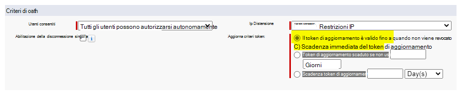

<!---Previous ms.author: rusamai --->

# Connettore Graph Salesforce (anteprima)Salesforce Graph connector (preview)

Il connettore di Graph Salesforce consente all'organizzazione di indicizzare gli oggetti Contatti, Opportunità, Lead e Account nell'istanza di Salesforce.The Salesforce Graph connector, allows your organization to index Contacts, Opportunities, Leads, and Accounts objects in your Salesforce instance. Dopo aver configurato il connettore e il contenuto dell'indice da Salesforce, gli utenti finali possono cercare tali elementi da qualsiasi client Microsoft Search client.After you configure the connector and index content from Salesforce, end users can search for those items from any Microsoft Search client.

> [!NOTE]
> Leggere [**l'articolo Setup for your Graph connector**](configure-connector.md) to understand the general Graph connectors setup instructions.Read the [**Setup for your Graph connector**](configure-connector.md) article to understand the general Graph connectors setup instructions.

Questo articolo è per chiunque configura, esegue e monitora un connettore Graph Salesforce.This article is for anyone who configures, runs, and monitors a Salesforce Graph connector. Integra il processo di configurazione generale e mostra le istruzioni che si applicano solo al connettore di Graph Salesforce.It supplements the general setup process, and shows instructions that apply only for the Salesforce Graph connector. In questo articolo sono inoltre incluse informazioni [sulle limitazioni](#limitations).This article also includes information about [Limitations](#limitations).

>[!IMPORTANT]
>Il connettore di Graph Salesforce attualmente supporta Estate '19 o versione successiva.The Salesforce Graph connector currently supports Summer '19 or later.

## Prima di iniziareBefore you get started

Per connettersi all'istanza di Salesforce, è necessario l'URL dell'istanza di Salesforce, l'ID client e il segreto client per l'autenticazione OAuth.To connect to your Salesforce instance, you need your Salesforce instance URL, the Client ID, and Client Secret for OAuth authentication. I passaggi seguenti illustrano come l'utente o l'amministratore di Salesforce può ottenere queste informazioni dall'account Salesforce:The following steps explain how you or your Salesforce administrator can get this information from your Salesforce account:

- Accedere all'istanza di Salesforce e passare a InstallazioneLog in to your Salesforce instance and go to Setup

- Passa a App -> App Manager.Navigate to Apps -> App Manager.

- Seleziona **Nuova app connessa.**Select **New connected app**.

- Completare la sezione API come segue:Complete the API section as follows:

    - Selezionare la casella di controllo **Abilita Oauth Impostazioni**.Select the checkbox for **Enable Oauth Settings**.

    - Specificare l'URL di richiamata come: [https://gcs.office.com/v1.0/admin/oauth/callback](https://gcs.office.com/v1.0/admin/oauth/callback)Specify the Callback URL as: [https://gcs.office.com/v1.0/admin/oauth/callback](https://gcs.office.com/v1.0/admin/oauth/callback)

    - Selezionare questi ambiti OAuth necessari.Select these required OAuth scopes.

        - Accedere e gestire i dati (api)Access and manage your data (api)

        - Eseguire richieste per conto dell'utente in qualsiasi momento (refresh_token, offline_access)Perform requests on your behalf at any time (refresh_token, offline_access)

    - Selezionare la casella di controllo **Richiedi segreto per il flusso del server Web.**Select the checkbox for **Require secret for web server flow**.

    - Salva l'app.Save the app.
    
      > [!div class="mx-imgBorder"]
      > 

- Copiare la chiave consumer e il segreto consumer.Copy the consumer key and the consumer secret. Queste informazioni verranno utilizzate come ID client e segreto client quando si configura il Impostazioni di connessione per il connettore di Graph nel portale di amministrazione di Microsoft 365.This information will be used as the Client ID and the Client Secret when you configure the Connection Settings for your Graph Connector in the Microsoft 365 admin portal.

  > [!div class="mx-imgBorder"]
  > Consumer Key is at top of left column and Consumer Secret is at top of right column.](media/salesforce-connector/clientsecret.png)
  
- Prima di chiudere l'istanza di Salesforce, segui questi passaggi per assicurarti che i token di aggiornamento non scadono:Before closing your Salesforce instance, follow these steps to ensure that refresh tokens don't expire:
    - Passare a App -> App ManagerGo to Apps -> App Manager
    - Trova l'app creata e seleziona l'elenco a discesa a destra.Find the app you created and select the drop-down on the right. Selezionare **Gestisci**Select **Manage**
    - Selezionare **Modifica criteri**Select **edit policies**
    - Per i criteri di token di aggiornamento, selezionare **Il token di aggiornamento è valido fino a quando non viene revocato**For refresh token policy, select **Refresh token is valid until revoked**

  > [!div class="mx-imgBorder"]
  > 

È ora possibile utilizzare Amministrazione Microsoft 365 [Center](https://admin.microsoft.com/) per completare il resto del processo di configurazione per il connettore Graph connettore.You can now use the [Microsoft 365 Admin Center](https://admin.microsoft.com/) to complete the rest of the setup process for your Graph connector.

## Passaggio 1: Aggiungere un connettore Graph nella interfaccia di amministrazione di Microsoft 365Step 1: Add a Graph connector in the Microsoft 365 admin center

Seguire le istruzioni generali [per l'installazione](./configure-connector.md).Follow the general [setup instructions](./configure-connector.md).
<!---If the above phrase does not apply, delete it and insert specific details for your data source that are different from general setup instructions.-->

## Passaggio 2: assegnare un nome alla connessioneStep 2: Name the connection

Seguire le istruzioni generali [per l'installazione](./configure-connector.md).Follow the general [setup instructions](./configure-connector.md).
<!---If the above phrase does not apply, delete it and insert specific details for your data source that are different from general setup instructions.-->

## Passaggio 3: Configurare le impostazioni di connessioneStep 3: Configure the connection settings

Per l'URL dell'istanza, usa https://[dominio].my.salesforce.com dove dominio sarebbe il dominio Salesforce per l'organizzazione.For the Instance URL, use https://[domain].my.salesforce.com where domain would be the Salesforce domain for your organization.

Immetti l'ID client e il segreto client ottenuti dall'istanza di Salesforce e seleziona Accedi.Enter the Client ID and Client Secret you obtained from your Salesforce instance and select Sign in.

La prima volta che si tenta di accedere con queste impostazioni, verrà visualizzato un popup che richiede di accedere a Salesforce con il nome utente e la password dell'amministratore.The first time you've attempted to sign in with these settings, you'll get a pop-up asking you to log in to Salesforce with your admin username and password. Lo screenshot seguente mostra il popup.The screenshot below shows the popup. Immetti le credenziali e seleziona "Accedi".Enter your credentials and select "Log In".

  

  >[!NOTE]
  >Se il popup non viene visualizzato, potrebbe essere bloccato nel browser, quindi devi consentire i popup e i reindirizzamenti.If the pop up does not appear, it might be getting blocked in your browser, so you must allow pop-ups and redirects.

Verifica che la connessione sia stata eseguita correttamente cercando un banner verde che indica "Connessione riuscita" come illustrato nella schermata seguente.Check that the connection was successful by searching for a green banner that says "Connection successful" as show in the screenshot below.

  > [!div class="mx-imgBorder"]
  > The green banner that says "Connection successful" is located under the field for your Salesforce Instance URL](media/salesforce-connector/sf5.png)

## Passaggio 4: Gestire le autorizzazioni di ricercaStep 4: Manage search permissions

Dovrai scegliere quali utenti potranno visualizzare i risultati della ricerca da questa origine dati.You'll need to choose which users will see search results from this data source. Se si consente solo a determinati utenti di Azure Active Directory (Azure AD) o non di Azure AD di visualizzare i risultati della ricerca, assicurarsi di mappare le identità.If you allow only certain Azure Active Directory (Azure AD) or Non-Azure AD users to see the search results, make sure you map the identities.

### Passaggio 4.a: Selezionare le autorizzazioniStep 4.a: Select permissions

Puoi scegliere di inserire elenchi di controllo di accesso (ACL) dall'istanza di Salesforce o consentire a tutti gli utenti dell'organizzazione di visualizzare i risultati della ricerca da questa origine dati.You can choose to ingest Access Control Lists (ACLs) from your Salesforce instance, or allow everyone in your organization to see search results from this data source. Gli elenchi di controllo di accesso possono includere identità di Azure Active Directory (AAD) (utenti federati da Azure AD a Salesforce), identità non azure AD (utenti salesforce nativi che hanno identità corrispondenti in Azure AD) o entrambi.ACLs can include Azure Active Directory (AAD) identities (users who are federated from Azure AD to Salesforce), non-Azure AD identities (native Salesforce users who have corresponding identities in Azure AD), or both.

>[!NOTE]
>Se usi un provider di identità di terze parti come ID ping o secureAuth, devi selezionare "non-AAD" come tipo di identità.If you use a third-party Identity Provider like Ping ID or secureAuth, you should select "non-AAD" as the identity type.

> [!div class="mx-imgBorder"]
> 

Se si è scelto di inserire un ACL dall'istanza di Salesforce e si è selezionato "non-AAD" per il tipo di identità, vedere Eseguire il mapping delle identità [non di Azure AD](map-non-aad.md) per istruzioni sul mapping delle identità.If you chose to ingest an ACL from your Salesforce instance and selected "non-AAD" for the identity type, see [Map your non-Azure AD Identities](map-non-aad.md) for instructions on mapping the identities.

### Passaggio 4.b: Mappare le identità AADStep 4.b: Map AAD identities

Se si è scelto di inserire un ACL dall'istanza di Salesforce e si è selezionato "AAD" per il tipo di identità, vedere Eseguire il mapping delle identità di [Azure AD](map-aad.md) per istruzioni sul mapping delle identità.If you chose to ingest an ACL from your Salesforce instance and selected "AAD" for the identity type, see [Map your Azure AD Identities](map-aad.md) for instructions on mapping the identities. Per informazioni su come configurare Azure AD SSO per Salesforce, vedere questa [esercitazione.](/azure/active-directory/saas-apps/salesforce-tutorial)To learn how to set up Azure AD SSO for Salesforce, see this [tutorial](/azure/active-directory/saas-apps/salesforce-tutorial).

### Applicare il mapping degli utenti per sincronizzare le identità di Salesforce con le identità di Azure ADApply user mapping to sync your Salesforce identities to Azure AD identities

In questo video è possibile visualizzare il processo di autenticazione nell'istanza di Salesforce, sincronizzare le identità non di Azure Active Directory con le identità di Azure Active Directory e applicare le appropriate limitazione per motivi di sicurezza agli elementi di Salesforce.In this video you can see the process to authenticate to your Salesforce instance, sync your non-Azure Active Directory identities to your Azure Active Directory identities, and apply the proper security trimmings to your Salesforce items.

> [!VIDEO https://www.youtube-nocookie.com/embed/SZYiFxZMKcM]

## Passaggio 5: Assegnare etichette di proprietàStep 5: Assign property labels

È possibile assegnare una proprietà di origine a ogni etichetta scegliendo da un menu di opzioni.You can assign a source property to each label by choosing from a menu of options. Anche se questo passaggio non è obbligatorio, la presenza di alcune etichette di proprietà migliorerà la pertinenza della ricerca e garantirà risultati di ricerca migliori per gli utenti finali.While this step is not mandatory, having some property labels will improve the search relevance and ensure better search results for end users. Per impostazione predefinita, ad alcune etichette come "Title", "URL", "CreatedBy" e "LastModifiedBy" sono già state assegnate proprietà di origine.By default, some of the Labels like "Title," "URL," "CreatedBy," and  "LastModifiedBy" have already been assigned source properties.

## Passaggio 6: Gestire lo schemaStep 6: Manage schema

È possibile selezionare le proprietà di origine da indicizzare in modo che siano visualizzate nei risultati della ricerca.You can select what source properties should be indexed so that they show up in search results. Per impostazione predefinita, la connessione guidata seleziona uno schema di ricerca basato su un set di proprietà di origine.The connection wizard by default selects a search schema based on a set of source properties. È possibile modificarlo selezionando le caselle di controllo per ogni proprietà e attributo nella pagina dello schema di ricerca.You can modify it by selecting the check boxes for each property and attribute in the search schema page. Gli attributi dello schema di ricerca includono Search, Query, Retrieve e Refine.Search schema attributes include Search, Query, Retrieve, and Refine.
Affinamento consente di definire le proprietà che possono essere successivamente utilizzate come criteri di affinamento ricerca personalizzati o filtri nell'esperienza di ricerca.Refine allows you to define the properties that can be later used as custom refiners or filters in the search experience.  

> [!div class="mx-imgBorder"]
> The options are Query, Search, Retrieve, and Refine](media/salesforce-connector/sf9.png)

## Passaggio 7: Impostare la pianificazione dell'aggiornamentoStep 7: Set the refresh schedule

Il connettore Salesforce supporta solo le pianificazioni di aggiornamento per le ricerche per indicizzazione complete attualmente.The Salesforce connector only supports refresh schedules for full crawls currently.

>[!IMPORTANT]
>Una ricerca per indicizzazione completa consente di trovare gli oggetti eliminati e gli utenti precedentemente sincronizzati con l'Microsoft Search indice.A full crawl finds deleted objects and users that were previously synced to the Microsoft Search index.

La pianificazione consigliata è di una settimana per una ricerca per indicizzazione completa.The recommended schedule is one week for a full crawl.

## Passaggio 8: verificare la connessioneStep 8: Review connection

Seguire le istruzioni generali [per l'installazione](./configure-connector.md).Follow the general [setup instructions](./configure-connector.md).
<!---If the above phrase does not apply, delete it and insert specific details for your data source that are different from general setup instructions.-->

<!---## Troubleshooting-->
<!---Insert troubleshooting recommendations for this data source-->

## LimitazioniLimitations

- Il Graph non supporta attualmente la condivisione e la condivisione basate su apex in base al territorio tramite i gruppi personali di Salesforce.The Graph connector doesn't currently support Apex based, territory-based sharing and sharing using personal groups from Salesforce.
- Esiste un bug noto nell'API Salesforce utilizzata dal connettore di Graph, in cui le impostazioni predefinite private a livello di organizzazione per i lead non sono attualmente rispettate.There's a known bug in the Salesforce API the Graph connector uses, where the private org-wide defaults for leads aren't honored currently.  
- Se per un profilo è impostata la sicurezza a livello di campo (FLS, Field Level Security), il connettore di Graph non ingestirà tale campo per i profili nell'organizzazione Salesforce. Di conseguenza, gli utenti non saranno in grado di cercare valori per tali campi e non verranno visualizzati nei risultati.If a field has field level security (FLS) set for a profile, the Graph connector won't ingest that field for any profiles in that Salesforce org. As a result, users won't be able to search on values for those fields, nor will it show up in the results.  
- Nella schermata Gestisci schema questi nomi di proprietà standard comuni sono elencati una sola volta, le opzioni sono **Query,** **Cerca,** **Recupera** e Affina e si applicano a tutti o a nessuno.In the Manage Schema screen these common standard property names are listed once, the options are **Query**, **Search**, **Retrieve**, and **Refine**, and apply to all or none.
    - NomeName
    - URLUrl
    - DescrizioneDescription
    - FaxFax
    - TelefonoPhone
    - MobilePhoneMobilePhone
    - Posta elettronicaEmail
    - TipoType
    - TitoloTitle
    - AccountIdAccountId
    - AccountNameAccountName
    - AccountUrlAccountUrl
    - AccountOwnerAccountOwner
    - AccountOwnerUrlAccountOwnerUrl
    - ProprietarioOwner
    - OwnerUrlOwnerUrl
    - CreatedByCreatedBy
    - CreatedByUrlCreatedByUrl
    - LastModifiedByLastModifiedBy
    - LastModifiedByUrlLastModifiedByUrl
    - LastModifiedDateLastModifiedDate
    - ObjectNameObjectName
