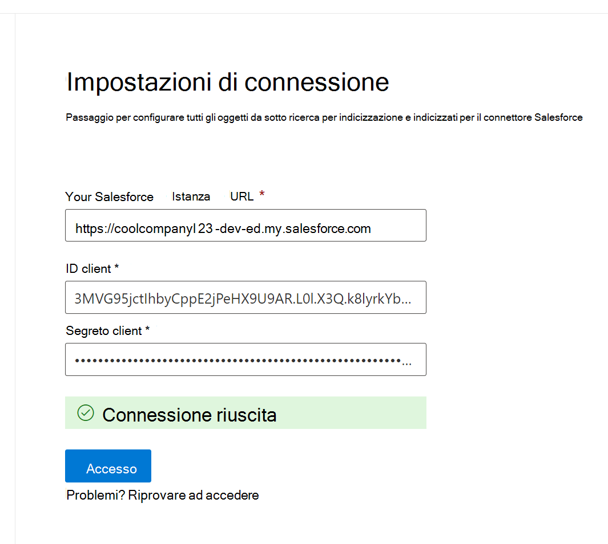

<!---Previous ms.author: rusamai --->

# Connettore di Graph Salesforce

Il connettore di Graph Salesforce consente all'organizzazione di indicizzare gli oggetti Contatti, Opportunità, Lead, Casi e Account nell'istanza di Salesforce. Dopo aver configurato il connettore e il contenuto dell'indice da Salesforce, gli utenti finali possono cercare tali elementi da qualsiasi client Microsoft Search client.

> [!NOTE]
> Leggere [**l'articolo Setup for your Graph connector**](configure-connector.md) to understand the general Graph connectors setup instructions.

Questo articolo è per chiunque configura, esegue e monitora un connettore Graph Salesforce. Integra il processo di configurazione generale e mostra le istruzioni che si applicano solo al connettore di Graph Salesforce. In questo articolo sono inoltre incluse informazioni [sulle limitazioni](#limitations).

>[!IMPORTANT]
>Il connettore di Graph Salesforce attualmente supporta Estate '19 o versione successiva.

## Prima di iniziare

Per connettersi all'istanza di Salesforce, è necessario l'URL dell'istanza di Salesforce, l'ID client e il segreto client per l'autenticazione OAuth. I passaggi seguenti illustrano come l'utente o l'amministratore di Salesforce può ottenere queste informazioni dall'account Salesforce:

- Accedere all'istanza di Salesforce e passare a Installazione

- Passa a App -> App Manager.

- Seleziona **Nuova app connessa.**

- Completare la sezione API come segue:

    - Selezionare la casella di controllo **Abilita Oauth Impostazioni**.

    - Specificare l'URL di richiamata come: [https://gcs.office.com/v1.0/admin/oauth/callback](https://gcs.office.com/v1.0/admin/oauth/callback)

    - Selezionare questi ambiti OAuth necessari.

        - Accedere e gestire i dati (api)

        - Eseguire richieste per conto dell'utente in qualsiasi momento (refresh_token, offline_access)

    - Selezionare la casella di controllo **Richiedi segreto per il flusso del server Web.**

    - Salva l'app.
    
      > [!div class="mx-imgBorder"]
      > 

- Copiare la chiave consumer e il segreto consumer. Queste informazioni verranno utilizzate come ID client e segreto client quando si configura il Impostazioni di connessione per il connettore di Graph nel portale di amministrazione di Microsoft 365.

  > [!div class="mx-imgBorder"]
  > 
  
- Prima di chiudere l'istanza di Salesforce, segui questi passaggi per assicurarti che i token di aggiornamento non scadono:
    - Passare a App -> App Manager
    - Trova l'app creata e seleziona l'elenco a discesa a destra. Selezionare **Gestisci**
    - Selezionare **Modifica criteri**
    - Per i criteri di token di aggiornamento, selezionare **Il token di aggiornamento è valido fino a quando non viene revocato**

  > [!div class="mx-imgBorder"]
  > 

È ora possibile utilizzare Amministrazione Microsoft 365 [Center](https://admin.microsoft.com/) per completare il resto del processo di configurazione per il connettore Graph connettore.

## Passaggio 1: Aggiungere un connettore Graph nella interfaccia di amministrazione di Microsoft 365

Seguire le istruzioni generali [per l'installazione](./configure-connector.md).
<!---If the above phrase does not apply, delete it and insert specific details for your data source that are different from general setup instructions.-->

## Passaggio 2: assegnare un nome alla connessione

Seguire le istruzioni generali [per l'installazione](./configure-connector.md).
<!---If the above phrase does not apply, delete it and insert specific details for your data source that are different from general setup instructions.-->

## Passaggio 3: Configurare le impostazioni di connessione

Per l'URL dell'istanza, usa https://[dominio].my.salesforce.com dove dominio sarebbe il dominio Salesforce per l'organizzazione.

Immetti l'ID client e il segreto client ottenuti dall'istanza di Salesforce e seleziona Accedi.

La prima volta che si tenta di accedere con queste impostazioni, verrà visualizzato un popup che richiede di accedere a Salesforce con il nome utente e la password dell'amministratore. Lo screenshot seguente mostra il popup. Immetti le credenziali e seleziona "Accedi".

  

  >[!NOTE]
  >Se il popup non viene visualizzato, potrebbe essere bloccato nel browser, quindi devi consentire i popup e i reindirizzamenti.

Verifica che la connessione sia stata eseguita correttamente cercando un banner verde che indica "Connessione riuscita" come illustrato nella schermata seguente.

  > [!div class="mx-imgBorder"]
  > 

## Passaggio 4: Selezionare le proprietà

Selezionare gli oggetti Salesforce che si desidera che il connettore eserviti la ricerca per indicizzazione e che includa nei risultati della ricerca. Se l'opzione Contatto è selezionata, verrà selezionato automaticamente anche Account.

>[!NOTE]
>Se per un profilo è impostata la sicurezza a livello di campo (FLS, Field Level Security), il connettore non ingestirà tale campo per i profili nell'organizzazione Salesforce. Di conseguenza, gli utenti non saranno in grado di cercare valori per tali campi e non verranno visualizzati nei risultati.

## Passaggio 5: Gestire le autorizzazioni di ricerca

Dovrai scegliere quali utenti potranno visualizzare i risultati della ricerca da questa origine dati. Se si consente solo a determinati utenti di Azure Active Directory (Azure AD) o non di Azure AD di visualizzare i risultati della ricerca, assicurarsi di mappare le identità.

### Passaggio 5.a: Selezionare le autorizzazioni

Puoi scegliere di inserire elenchi di controllo di accesso (ACL) dall'istanza di Salesforce o consentire a tutti gli utenti dell'organizzazione di visualizzare i risultati della ricerca da questa origine dati. Gli elenchi di controllo di accesso possono includere identità di Azure Active Directory (AAD) (utenti federati da Azure AD a Salesforce), identità non azure AD (utenti salesforce nativi che hanno identità corrispondenti in Azure AD) o entrambi.

>[!NOTE]
>Se usi un provider di identità di terze parti come ID ping o secureAuth, devi selezionare "non-AAD" come tipo di identità.

> [!div class="mx-imgBorder"]
> 

Se si è scelto di inserire un ACL dall'istanza di Salesforce e si è selezionato "non-AAD" per il tipo di identità, vedere Eseguire il mapping delle identità [non di Azure AD](map-non-aad.md) per istruzioni sul mapping delle identità.

### Passaggio 5.b: Mappare le identità AAD

Se si è scelto di inserire un ACL dall'istanza di Salesforce e si è selezionato "AAD" per il tipo di identità, vedere Eseguire il mapping delle identità di [Azure AD](map-aad.md) per istruzioni sul mapping delle identità. Per informazioni su come configurare Azure AD SSO per Salesforce, vedere questa [esercitazione.](/azure/active-directory/saas-apps/salesforce-tutorial)

### Applicare il mapping degli utenti per sincronizzare le identità di Salesforce con le identità di Azure AD

In questo video è possibile visualizzare il processo di autenticazione nell'istanza di Salesforce, sincronizzare le identità non di Azure Active Directory con le identità di Azure Active Directory e applicare le appropriate limitazione per motivi di sicurezza agli elementi di Salesforce.

> [!VIDEO https://www.youtube-nocookie.com/embed/SZYiFxZMKcM]

## Passaggio 6: Assegnare etichette di proprietà

È possibile assegnare una proprietà di origine a ogni etichetta scegliendo da un menu di opzioni. Anche se questo passaggio non è obbligatorio, la presenza di alcune etichette di proprietà migliorerà la pertinenza della ricerca e garantirà risultati di ricerca migliori per gli utenti finali. Per impostazione predefinita, ad alcune etichette come "Title", "URL", "CreatedBy" e "LastModifiedBy" sono già state assegnate proprietà di origine.

## Passaggio 7: Gestire lo schema

È possibile selezionare le proprietà di origine da indicizzare in modo che siano visualizzate nei risultati della ricerca. Per impostazione predefinita, la connessione guidata seleziona uno schema di ricerca basato su un set di proprietà di origine. È possibile modificarlo selezionando le caselle di controllo per ogni proprietà e attributo nella pagina dello schema di ricerca. Gli attributi dello schema di ricerca includono Search, Query, Retrieve e Refine.
Affinamento consente di definire le proprietà che possono essere successivamente utilizzate come criteri di affinamento ricerca personalizzati o filtri nell'esperienza di ricerca.  

> [!div class="mx-imgBorder"]
> 

## Passaggio 8: Impostare la pianificazione dell'aggiornamento

Il connettore Salesforce supporta solo le pianificazioni di aggiornamento per le ricerche per indicizzazione complete attualmente.

>[!IMPORTANT]
>Una ricerca per indicizzazione completa consente di trovare gli oggetti eliminati e gli utenti precedentemente sincronizzati con l'Microsoft Search indice.

La pianificazione consigliata è di una settimana per una ricerca per indicizzazione completa.

## Passaggio 9: esaminare la connessione

Seguire le istruzioni generali [per l'installazione](./configure-connector.md).

>[!TIP]
>**Tipo di risultato predefinito**
>* Il connettore Salesforce registra automaticamente un [tipo di risultato](./customize-search-page.md#step-2-create-the-result-types) dopo la pubblicazione del connettore. Il tipo di risultato utilizza un layout dei [risultati](./customize-results-layout.md) generato dinamicamente in base ai campi selezionati nel passaggio 3.
>* È possibile gestire il tipo di risultati passando a [**Tipi di risultati**](https://admin.microsoft.com/Adminportal/Home#/MicrosoftSearch/resulttypes) nella interfaccia di amministrazione di Microsoft 365 .  Il tipo di risultato predefinito verrà denominato `ConnectionId` "Default". Ad esempio, se l'ID di connessione è , il layout dei risultati `Salesforce` sarà denominato: "SalesforceDefault"
>* È inoltre possibile scegliere di creare un tipo di risultato personalizzato, se necessario.
<!---If the above phrase does not apply, delete it and insert specific details for your data source that are different from general setup instructions.-->

<!---## Troubleshooting-->
<!---Insert troubleshooting recommendations for this data source-->

## Limitazioni

- Il Graph non supporta attualmente la condivisione e la condivisione basate su apex in base al territorio tramite i gruppi personali di Salesforce.
- Esiste un bug noto nell'API Salesforce utilizzata dal connettore di Graph, in cui le impostazioni predefinite private a livello di organizzazione per i lead non sono attualmente rispettate.  
- Se per un profilo è impostata la sicurezza a livello di campo (FLS, Field Level Security), il connettore di Graph non ingestirà tale campo per i profili nell'organizzazione Salesforce. Di conseguenza, gli utenti non saranno in grado di cercare valori per tali campi e non verranno visualizzati nei risultati.  
- Nella schermata Gestisci schema questi nomi di proprietà standard comuni sono elencati una sola volta, le opzioni sono **Query,** **Cerca,** **Recupera** e Affina e si applicano a tutti o a nessuno.
    - Nome
    - URL
    - Descrizione
    - Fax
    - Telefono
    - MobilePhone
    - Posta elettronica
    - Tipo
    - Titolo
    - AccountId
    - AccountName
    - AccountUrl
    - AccountOwner
    - AccountOwnerUrl
    - Proprietario
    - OwnerUrl
    - CreatedBy
    - CreatedByUrl
    - LastModifiedBy
    - LastModifiedByUrl
    - LastModifiedDate
    - ObjectName
