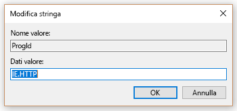
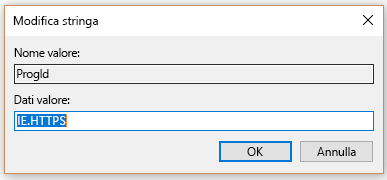

# Impostare Microsoft Edge come browser predefinitoMake Microsoft Edge the default browser
  
Per offrire agli utenti l'esperienza migliore con la ricerca Microsoft, è possibile impostare Microsoft Edge come browser predefinito.To give your users the best experience with Microsoft Search, you can make Microsoft Edge the default browser. Questa opzione consentirà di impostare Microsoft Edge come browser predefinito solo per gli utenti dell'organizzazione, mentre i singoli utenti potranno comunque selezionare un browser diverso.This will only set Microsoft Edge as the default browser for users in your org, individual users can still select a different browser.
  
  
## Windows 8 e versioni successiveWindows 8 and later

Queste istruzioni spiegano come impostare Microsoft Edge o Internet Explorer come browser predefinito per computer che eseguono Windows 8 o versioni successive.These instructions show you how to make Microsoft Edge or Internet Explorer as the default browser for computers running Windows 8 or later. Gli utenti potranno modificare il browser dopo aver impostato questi criteri.Users will be able to change the browser after this policy is set.
  
### PASSAGGIO 1: Creare il file delle associazioni predefiniteSTEP 1: Create the default associations file
Creare il file delle associazioni predefinite nella cartella SYSVOL del controller di dominio.Create the default associations file in the SYSVOL folder of the domain controller.

1. Aprire una console di amministrazione di PowerShell.Open an administrative PowerShell console.
1. `New-Item -Path "\\$env:USERDOMAIN\SYSVOL\$env:USERDNSDOMAIN" -Type Directory -Name "Settings"`
1. `$SettingsPath="\\$env:USERDOMAIN\SYSVOL\$env:USERDNSDOMAIN\Settings"`
1. `Start-Process Dism.exe -PassThru "/Online /Export-DefaultAppAssociations:$SettingsPath\AppAssoc.xml"`
    
  
### PASSAGGIO 2:STEP 2. Aggiungere o modificare il file delle associazione predefiniteAdd or edit the default associations file

1. `Notepad "$SettingsPath\AppAssoc.xml"`
1. Modificare le voci seguenti (con estensione htm, html, http, https) e rimuovere altre voci se non sono necessarie.Edit the following entries (.htm, .html, http, https), and remove other entries if they're not needed.
  - **Microsoft Edge****Microsoft Edge**
    - `<Association Identifier=".htm" ProgId="AppX4hxtad77fbk3jkkeerkrm0ze94wjf3s9" ApplicationName="Microsoft Edge" />`
              
    - `<Association Identifier=".html" ProgId="AppX4hxtad77fbk3jkkeerkrm0ze94wjf3s9" ApplicationName="Microsoft Edge" />`
    - `<Association Identifier="http" ProgId="AppXq0fevzme2pys62n3e0fbqa7peapykr8v" ApplicationName="Microsoft Edge" />`
    
  - **Internet Explorer****Internet Explorer**
    
    - `<Association Identifier=".htm" ProgId="htmlfile" ApplicationName="Internet Explorer" />`        
    - `<Association Identifier=".html" ProgId="htmlfile" ApplicationName="Internet Explorer" />`
    - `<Association Identifier="http" ProgId="IE.HTTP" ApplicationName="Internet Explorer" />`
    - `<Association Identifier="https" ProgId="IE.HTTPS" ApplicationName="Internet Explorer" />`

### Passaggio 3:Step 3. Modificare i Criteri di gruppoEdit the Group Policy

1. Aprire **Console Gestione Criteri di gruppo** (gpmc.msc) e passare alla modifica di un criterio esistente o crearne uno nuovo.Open **Group Policy Management Console** (gpmc.msc) and switch to editing any existing policy or creating a new one.
1. Passare a **Configurazione computer\Modelli amministrativi\Componenti di Windows\Esplora file**.Navigate to **Computer Configuration\Administrative Templates\Windows Components\File Explorer**.
1. Fare doppio clic su **Imposta file di configurazione delle associazioni predefinite**, impostarlo su **Abilitato** e immettere il percorso del file AppAssoc.xml (ad esempio %USERDOMAIN%\SYSVOL\%USERDNSDOMAIN%\Settings\AppAssoc.xml). Applicare l'oggetto Criteri di gruppo risultante collegandolo al dominio appropriato.Double-click **Set a default associations configuration file**, set it to **Enabled**, and enter the path to AppAssoc.xml (for example %USERDOMAIN%\SYSVOL\%USERDNSDOMAIN%\Settings\AppAssoc.xml) Enforce the resultant GPO by linking it to the appropriate domain.

  
## Windows 7Windows 7

1. Configurare il computer locale che verrà usato per impostare l'oggetto Criteri di gruppo.Configure the local machine that will be used to set the GPO.
    
1. Aprire **Pannello di controllo\Programmi\Programmi predefiniti\Imposta programmi predefiniti** e impostare Internet Explorer come predefinito.Open **Control Panel\Programs\Default Programs\Set Default Programs** and set Internet Explorer as the default. 
    
2. Aprire Console Gestione criteri di gruppo (gpmc.msc) e passare alla modifica di un criterio esistente o crearne uno nuovo.Open Group Policy Management Console (gpmc.msc) and switch to editing any existing policy or creating a new one.
    
1. Passare a **\<Computer/Utente\> Configurazione\Criteri\Preferenze\Impostazioni di Windows**.Navigate to **\<Computer/User\> Configuration\Policies\Preferences\Windows Settings**.
    
2. Fare clic con il pulsante destro del mouse su **Registro\Nuovo** e selezionare **Creazione guidata Registro di sistema**.Right-click on **Registry\New** and select **Registry Wizard**.
    
3. Nella finestra Visualizzatore Registro di sistema selezionare **Computer locale** e fare clic su **Avanti**.From the Registry Browser window, select **Local Computer** and click **Next**.
    
4. Passare a **HKEY_CURRENT_USER\Software\Microsoft\Windows\Shell\Associations\UrlAssociations\https** e selezionare il valore ProgId. Assicurarsi che il valore sia simile al seguente:Navigate to **HKEY_CURRENT_USER\Software\Microsoft\Windows\Shell\Associations\UrlAssociations\https** and select the ProgId value. Make sure the value looks like the one below: 
    
    
  
5. Passare a **HKEY_CURRENT_USER\Software\Microsoft\Windows\Shell\Associations\UrlAssociations\https** e selezionare il valore ProgId. Assicurarsi che il valore sia simile al seguente:Navigate to **HKEY_CURRENT_USER\Software\Microsoft\Windows\Shell\Associations\UrlAssociations\https** and select the ProgId value. Make sure that the value looks like the one below: 
    
    
  
3. Applicare l'oggetto Criteri di gruppo risultante collegandolo al dominio appropriato.Enforce the resultant GPO by linking it to the appropriate domain.
    
