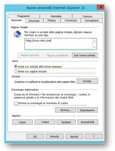

# Impostare Bing.com come home page predefinita

Questo articolo spiega come impostare Bing.com come home page predefinita per i browser Microsoft Edge, Google Chrome e Internet Explorer. 
  
 
## Microsoft Edge in Windows 10 versione 1511 o successiva

Gli utenti non potranno modificare la home page dopo aver impostato questo criterio. 

1. Aprire la Console Gestione criteri di gruppo (gpmc.msc) e passare alla modifica di un criterio esistente o crearne uno nuovo. 
1. Passare a **Modelli amministrativi\Componenti di Windows\Microsoft Edge**.    
1. Fare doppio clic su **Configura pagine iniziali**, impostarlo su **Abilitato** e immettere `https://www.bing.com/business`
1.  Applicare l'oggetto Criteri di gruppo risultante collegandolo al dominio appropriato.

  
## Google Chrome in Windows XP SP2 o versioni successive

L'articolo del supporto di Windows sulla gestione dei file ADMX e i file ADMX più recenti per le diverse versioni di Windows sono disponibili nel sito del [Supporto tecnico Microsoft](https://support.microsoft.com/help/3087759/how-to-create-and-manage-the-central-store-for-group-policy-administra).

È necessario anche il file di criteri Google più recente, disponibile nella [Guida di Google Chrome Enterprise](https://support.google.com/chrome/a/answer/187202).
  
Se le impostazioni descritte in questa sezione non sono disponibili all'interno di GPMC, scaricare il file ADMX appropriato e copiarlo nell'[archivio centrale](/previous-versions/windows/it-pro/windows-vista/cc748955%28v%3dws.10%29). L'archivio centrale nel controller è una cartella conforme alla convenzione di denominazione seguente:
  
 **%systemroot%\sysvol\\<dominio\>\policies\PolicyDefinitions**
  
Ogni dominio gestito dal controller deve ottenere una cartella separata. Per copiare il file ADMX dal prompt dei comandi, usare il comando seguente:
  
 `Copy <path_to_ADMX.ADMX> %systemroot%\sysvol\<domain>\policies\PolicyDefinitions`
  
1. Aprire la Console Gestione criteri di gruppo (gpmc.msc) e passare alla modifica di un criterio esistente o crearne uno nuovo.
1. Verificare che le cartelle seguenti vengono visualizzate nella sezione **Modelli amministrativi** di *Configurazione utente/computer*: Google Chrome e Google Chrome - Impostazioni predefinite (gli utenti possono eseguire l'override).
   - Le impostazioni della prima sezione sono fisse e gli amministratori locali non possono modificarle.
   - Le impostazioni dell'ultima sezione dei criteri possono essere modificate dagli utenti nelle impostazioni del browser. È necessario decidere se gli utenti possono eseguire l'override dell'impostazione predefinita. Nella procedura seguente modificare l'impostazione nella cartella corrispondente ai criteri e alle esigenze dell'organizzazione. Nella procedura seguente si usa Google Chrome - Impostazioni predefinite come valore predefinito.

1. Passare a **&lt;Configurazione computer/utente&gt;\Modelli amministrativi\Google Chrome - Impostazioni predefinite\Home page**. 
1. Fare doppio clic su **Usa la pagina Nuova scheda come Pagina iniziale** e impostarlo su **Abilitato**. 
1. Passare a **&lt;Configurazione computer/utente&gt;\Modelli amministrativi\Google Chrome - Impostazioni predefinite\Pagina Nuova scheda**. 
1. Fare doppio clic su **Configura l'URL della pagina iniziale**, impostarlo su **Abilitato** e immettere `https://www.bing.com/business?form=BFBSPR` 
1. Applicare l'oggetto Criteri di gruppo risultante collegandolo al dominio appropriato.

## Internet Explorer 5.0 o versioni successive
Gli utenti possono comunque modificare la home page dopo aver impostato questo criterio. 

1. Aprire la Console Gestione criteri di gruppo (gpmc.msc) e passare alla modifica di un criterio esistente o crearne uno nuovo.
    
2. Passare a **Configurazione utente\Preferenze\Impostazioni del Pannello di controllo\Impostazioni Internet**.
    
3. Fare clic con il pulsante destro del mouse su **Impostazioni Internet** e selezionare **Internet Explorer 10**.
    
    > [!NOTE]
    > È necessario selezionare l'opzione Internet Explorer 10 per applicare le impostazioni di Internet Explorer 11 perché le stesse impostazioni valgono anche per Internet Explorer 11. 
  
4. Le impostazioni sottolineate in rosso non vengono configurate nel computer di destinazione, mentre quelle sottolineate in verde vengono configurate. Per modificare il tipo di sottolineatura, usare i tasti funzione seguenti:
    
    F5 - Abilita tutte le impostazioni nella scheda corrente
    
    F6 - Abilita l'impostazione attualmente selezionata
    
    F7 - Disabilita l'impostazione attualmente selezionata
    
    F8 - Disabilita tutte le impostazioni nella scheda corrente
    
5. Premere **F8** per disabilitare tutte le impostazioni prima di configurare qualsiasi valore. La schermata sarà simile a quella seguente: 
    
    
  
6. Premere **F6** nell'impostazione della home page e immettere `https://www.bing.com/business?form=BFBSPR`
    
7. Applicare l'oggetto Criteri di gruppo risultante collegandolo al dominio appropriato.