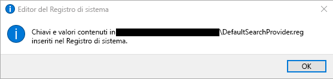
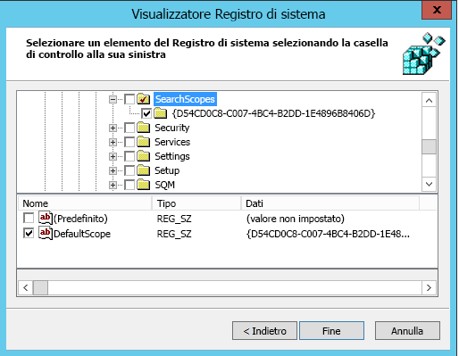

# Impostare Bing come motore di ricerca predefinito
  
Questo articolo spiega come impostare Bing come motore di ricerca predefinito per Microsoft Edge, Google Chrome e Internet Explorer. 
  
## Microsoft Edge in Windows 10 versione 1703 o successiva

Anche se si imposta Bing come motore di ricerca predefinito, Microsoft Edge consente agli utenti di modificare le impostazioni per usare un altro motore di ricerca.
  
Per i file ADMX più recenti per varie versioni di Windows, vedere [Come creare e gestire l'archivio centrale per i modelli amministrativi di Criteri di gruppo in Windows](https://support.microsoft.com/help/3087759/how-to-create-and-manage-the-central-store-for-group-policy-administra).
  
Se non è possibile trovare l'impostazione descritta in questa sezione all'interno di Console Gestione Criteri di gruppo, scaricare l'ADMX appropriato e copiarlo nell'archivio centrale. Per altre informazioni, vedi [Modifica Domain-Based oggetti Criteri di gruppo tramite file ADMX.](https://docs.microsoft.com/previous-versions/windows/it-pro/windows-vista/cc748955%28v%3dws.10%29) L'archivio centrale nel controller è una cartella con la convenzione di denominazione **seguente: %systemroot%\sysvol<\\ dominio \> \policies\PolicyDefinitions**
  
Ogni dominio gestito dal controller deve ottenere una cartella separata. Per copiare il file ADMX dal prompt dei comandi, usare il comando seguente:
  
 `Copy <path_to_ADMX.ADMX> %systemroot%\sysvol\<domain>\policies\PolicyDefinitions`
  
1. Aprire la Console Gestione criteri di gruppo (gpmc.msc) e passare alla modifica di un criterio esistente o crearne uno nuovo.
2. Passare a **&lt;Computer/User Configuration&gt;\Administrative Templates\Windows Components\Microsoft Edge**.
3. Fare doppio clic su **Imposta motore di ricerca predefinito**, impostare su **Abilitato** e immettere `https://www.bing.com/sa/osd/bfb.xml`
4. Applicare l'oggetto Criteri di gruppo risultante collegandolo al dominio appropriato.

## Google Chrome in Windows 10 versione 1507 o successiva

Gli utenti non potranno modificare il motore di ricerca predefinito dopo aver impostato il criterio.
  
Chrome include un proprio set di impostazioni di Criteri di gruppo che può essere scaricato sotto forma di file ADMX dalla Guida [di Google Chrome Enterprise.](https://support.google.com/chrome/a/answer/187202)
  
Copiare il file modello in un archivio centrale per i file ADMX nel controller di dominio. Per altre informazioni, vedi [Modifica Domain-Based oggetti Criteri di gruppo tramite file ADMX.](https://docs.microsoft.com/previous-versions/windows/it-pro/windows-vista/cc748955%28v%3dws.10%29) L'archivio centrale nel controller è una cartella con la convenzione di denominazione **seguente: %systemroot%\sysvol<\\ dominio \> \policies\PolicyDefinitions**
  
Ogni dominio gestito dal controller deve ottenere una cartella separata. Per copiare il file ADMX dal prompt dei comandi, usare il comando seguente:
  
 `Copy <path_to_Chrome.ADMX> %systemroot%\sysvol\<domain>\policies\PolicyDefinitions`
  
1. Aprire la Console Gestione criteri di gruppo (gpmc.msc) e passare alla modifica di un criterio esistente o crearne uno nuovo.
2. Verificare che le cartelle seguenti vengono visualizzate nella sezione Modelli amministrativi di Configurazione utente/computer: Google Chrome e Google Chrome - Impostazioni predefinite.

    - Le impostazioni della prima sezione sono fisse e gli amministratori non possono modificarle nel browser.
    - Le impostazioni della seconda sezione di criteri possono essere modificate dagli utenti nelle impostazioni del browser.

3. Passare a **\<Computer/User\> Configurazione\Modelli amministrativi\Google Chrome\Provider di ricerca predefinito**
4. Fare doppio clic su **Enable the default search provider** (Abilita il motore di ricerca predefinito) e impostarlo su **Abilitato**.
5. Fare doppio clic sull'**icona del motore di ricerca predefinito**, impostarla su **Abilitato** e immettere `https://www.bing.com/sa/simg/bb.ico`
6. Fare doppio clic sull'**URL immediato del motore di ricerca predefinito** e immettere `https://www.bing.com/business/search?q={searchTerms}&amp;form=BFBSPR`
7. Fare doppio clic sul **nome del motore di ricerca predefinito**, impostarlo su Abilitato e immettere "Microsoft Search in Bing"
8. Fare doppio clic sull'**URL del servizio di ricerca del motore predefinito**, impostarlo su **Abilitato** e immettere `https://www.bing.com/business/search?q={searchTerms}&amp;form=BFBSPR`
9. Applicare l'oggetto Criteri di gruppo risultante collegandolo al dominio appropriato.

## Internet Explorer 11 o versioni successive

Gli utenti potranno modificare il provider di ricerca dopo aver impostato il criterio.
  
### Passaggio 1: Configurare il computer locale che verrà utilizzato per impostare l'oggetto Criteri di gruppo

Incollare il testo seguente in un file reg(\*.reg).
  
Editor del Registro di sistema di Windows, versione 5.00
  
<pre>[HKEY_CURRENT_USER\Software\Microsoft\Internet Explorer\SearchScopes]
"DefaultScope"="{D54CD0C8-C007-4BC4-B2DD-1E4896B8406D}"
[HKEY_CURRENT_USER\Software\Microsoft\Internet Explorer\SearchScopes\{D54CD0C8-C007-4BC4-B2DD-1E4896B8406D}]
"Codepage"=dword:0000fde9
"DisplayName"="Microsoft Search in Bing"
"OSDFileURL"="https://www.bing.com/sa/osd/bfb.xml"
"FaviconURL"="https://www.bing.com/sa/simg/bb.ico"
"URL"="https://www.bing.com/business/search?q={searchTerms}&amp;form=BFBSPR"</pre>
  
Fare doppio clic sul file creato e seguire la procedura per importare il file. Dopo la corretta importazione, dovrebbe essere visualizzato il seguente messaggio:
  

  
### Passaggio 2: Aprire la Console Gestione criteri di gruppo (gpmc.msc) e passare alla modifica di un criterio esistente o crearne uno nuovo

1. Passare a **Configurazione utente\Criteri\Preferenze\Impostazioni Windows**.
2. Fare clic con il pulsante destro del mouse su **Registro\Nuovo** e selezionare **Creazione guidata Registro di sistema**. Dalla finestra Visualizzatore Registro di sistema, selezionare **Computer locale** e fare clic su **Avanti**.
3. Passare a **HKEY_CURRENT_USER\SOFTWARE\Microsoft\Internet Explorer\SearchScopes**.
4. Da questa chiave, assicurarsi di selezionare DefaultScope.

    
5. Selezionare tutte le sottochiavi che contengono il GUID di Microsoft Search in Bing e ogni valore della chiave, ad eccezione dei percorsi per i profili utente. Scorrere verso il basso per selezionare altri elementi.
6. Fare clic su Fine per completare la configurazione.

### Passaggio 3: Impostare le Preferenze utente per eliminare un avviso che l'utente può ricevere quando viene applicata la ricerca di DefaultScope.

Questo avviso viene inviato per impostazione predefinita e avverte gli utenti che un programma sta provando a modificare le impostazioni.
  
1. Nello stesso oggetto Criteri di gruppo, fare clic con il pulsante destro del mouse su **Registro\Nuovo** e selezionare **Creazione guidata Registro di sistema**.
2. Passare a **HKEY_CURRENT_USER\SOFTWARE\Microsoft\Internet Explorer\User Preferences**.
3. Selezionare la chiave **Preferenza utente**.
4. Fare clic su **Fine**.
5. Fare clic sull'oggetto appena creato. Nel riquadro a destra, fare doppio clic sull'oggetto User Preferences, cambiare l'**azione** in **Delete and Save** (Elimina e salva).
6. Applicare l'oggetto Criteri di gruppo risultante collegandolo al dominio appropriato.
