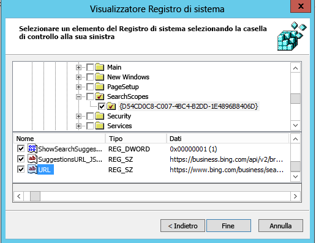

# Motore di ricerca set predefinitoSet default search engine

Configurazione il browser predefinito, motore di ricerca predefinito e home page predefinita consente agli utenti individuare funzionalità Microsoft Search, incoraggiare altri dati di utilizzo e offrire un'esperienza più uniforme.Configuring the default browser, default search engine, and default homepage will help your users discover Microsoft Search capabilities, encourage more usage, and provide a smoother experience.
  
Per impostare il motore di ricerca predefinito per l'organizzazione, attenersi alla procedura seguente.To set the default search engine for your organization, follow the steps below.
  
## Internet ExplorerInternet Explorer

### Internet Explorer 11Internet Explorer 11

Gli utenti saranno in grado di modificare il provider di ricerca dopo che questo criterio è impostato.Users will be able to change the search provider after this policy is set.
  
#### 1. configurare il computer locale che verrà utilizzato per impostare l'oggetto Criteri di gruppo1. Configure the local machine that will be used to set the GPO

Incollare il testo seguente in un registro di sistema (\*con estensione reg) file.Paste the following text into a reg(\*.reg) file.
  
Windows Registry Editor Version 5.00Windows Registry Editor Version 5.00
  
<pre>[HKEY_CURRENT_USER\Software\Microsoft\Internet Explorer\SearchScopes]
"DefaultScope"="{D54CD0C8-C007-4BC4-B2DD-1E4896B8406D}"
[HKEY_CURRENT_USER\Software\Microsoft\Internet Explorer\SearchScopes\{D54CD0C8-C007-4BC4-B2DD-1E4896B8406D}]
"Codepage"=dword:0000fde9
"DisplayName"="Microsoft Search in Bing"
"OSDFileURL"="https://www.bing.com/sa/osd/bfb.xml"
"FaviconURL"="https://www.bing.com/sa/simg/bb.ico"
"SuggestionsURL_JSON"="https://business.ing.com/api/v2/browser/suggest?q={searchTerms}&amp;form=BFBSPA"
"ShowSearchSuggestions"=dword:00000001
"URL"="https://www.bing.com/business/search?q={searchTerms}&amp;form=BFBSPR"</pre>
  
Fare doppio clic sul file creato ed eseguire la procedura per importare il file. Eseguire correttamente l'importazione deve risultare nella finestra di dialogo seguente:Double-click the file created and follow the steps to import the file. A successful import should result in the following dialog:
  

  
#### 2. aprire la Console Gestione criteri di gruppo (GPMC) e passare alla modifica di un criterio esistente o crearne uno nuovo2. Open the Group Policy Management Console (gpmc.msc) and switch to editing an existing policy or creating a new one

1. Passare a **impostazioni utente Configuration\Policies\Preferences\Windows**.Navigate to **User Configuration\Policies\Preferences\Windows Settings**.
    
2. Pulsante destro del mouse su **Registry\New** e selezionare **Creazione guidata del Registro di sistema**. Dalla finestra del Browser del Registro di sistema, selezionare **Computer locale** e fare clic su **Avanti**.Right-click on **Registry\New** and select **Registry Wizard**. From the Registry Browser window, select **Local Computer** and click **Next**.
    
3. Passare a **HKEY_CURRENT_USER\SOFTWARE\Microsoft\Internet Explorer\SearchScopes**.Navigate to **HKEY_CURRENT_USER\SOFTWARE\Microsoft\Internet Explorer\SearchScopes**.
    
4. Da questa chiave, assicurarsi di selezionare DefaultScope.From this key, make sure to select DefaultScope.
    
    
  
5. Verificare tutte le chiavi sub contenente il GUID di Microsoft Search Bing e ogni valore nella chiave, ad eccezione di qualsiasi percorso ai profili utente. Scorrere verso il basso per selezionare altri elementi.Check all sub keys containing the GUID for Microsoft Search in Bing and every value under the key except any path to user profiles. Scroll down to select other items.
    
    
  
6. Fare clic su Fine per completare questa configurazione.Click Finish to complete this configuration.
    
#### 3. configurare le preferenze dell'utente per semplificare l'eliminazione di un messaggio di avviso che all'utente che venga visualizzato quando viene applicato DefaultScope ricerca3. Set up User Preferences to help eliminate a warning the user may get when DefaultScope search is enforced

È per impostazione predefinita un avviso che informa gli utenti di un programma tenta di modificare le relative impostazioni.This warning is by design and alerts users of a program trying to modify their settings.
  
1. Nell'oggetto Criteri di gruppo stesso, fare clic con il pulsante destro su **Registry\New** e selezionare **Creazione guidata del Registro di sistema**.Within the same GPO, right click on **Registry\New** and select **Registry Wizard**.
    
2. Passare a **HKEY_CURRENT_USER\SOFTWARE\Microsoft\Internet Explorer\User preferenze**.Navigate to **HKEY_CURRENT_USER\SOFTWARE\Microsoft\Internet Explorer\User Preferences**.
    
3. Selezionare la chiave **Delle preferenze utente** .Select the **User Preference** key.
    
4. Fare clic su **Fine**.Click **Finish**.
    
5. Fare clic sull'oggetto appena creato. Nel riquadro di destra fare doppio clic sull'oggetto preferenze utente, modificare l' **azione** **Elimina**e salvare.Click on the newly created object. On the right-side pane double click on the User Preferences object, change the **Action** to **Delete and Save**.
    
Applicare criteri risultante tramite il collegamento al dominio appropriato.Enforce the resultant GPO by linking it to the appropriate domain.
  
## Microsoft EdgeMicrosoft Edge

### Windows 10 1703 o versioni successiveWindows 10, Version 1703 or later

Gli utenti saranno in grado di modificare il provider di ricerca dopo che questo criterio è impostato.Users will be able to change the search provider after this policy is set.
  
Per i file ADMX più recenti per diverse versioni di Windows, vedere [come creare e gestire l'archivio centrale per i modelli amministrativi di criteri di gruppo in Windows](https://support.microsoft.com/en-us/help/3087759/how-to-create-and-manage-the-central-store-for-group-policy-administra).For the latest ADMX files for various versions of Windows, see [How to create and manage the Central Store for Group Policy Administrative Templates in Windows](https://support.microsoft.com/en-us/help/3087759/how-to-create-and-manage-the-central-store-for-group-policy-administra).
  
Se l'impostazione descritta in questa sezione non viene trovato all'interno di GPMC, scaricare ADMX appropriato e copiarli nell'archivio centrale. Per ulteriori informazioni, vedere [File ADMX utilizzando oggetti Criteri di gruppo di modifica](https://docs.microsoft.com/en-us/previous-versions/windows/it-pro/windows-vista/cc748955%28v%3dws.10%29). Archivio centrale sul controller è una cartella con la convenzione di denominazione seguente:If the setting described in this section cannot be found inside of GPMC, download the appropriate ADMX and copy them to the central store. For more information, see [Editing Domain-Based GPOs Using ADMX Files](https://docs.microsoft.com/en-us/previous-versions/windows/it-pro/windows-vista/cc748955%28v%3dws.10%29). Central store on the controller is a folder with the following naming convention:
  
 **%systemroot%\sysvol\\<domain\>\policies\PolicyDefinitions****%systemroot%\sysvol\\<domain\>\policies\PolicyDefinitions**
  
Ogni dominio che gestisce il controller di utilizzare una cartella separata. Può utilizzare il comando seguente per copiare il file ADMX al prompt dei comandi:Each domain that your controller handles should get a separate folder. The following command can be used to copy the ADMX file from the command prompt:
  
 `Copy <path_to_ADMX.ADMX> %systemroot%\sysvol\<domain>\policies\PolicyDefinitions`
  
1. Aprire la Console Gestione criteri di gruppo (GPMC) e passare alla modifica di un criterio esistente o crearne uno nuovo.Open the Group Policy Management Console (gpmc.msc) and switch to editing an existing policy or creating a new one.
    
2. Passare a \*\* &lt;configurazione Computer/utente&gt;\Administrative Templates\Windows Components\Microsoft Edge\*\*.Navigate to **&lt;Computer/User Configuration&gt;\Administrative Templates\Windows Components\Microsoft Edge**.
    
1. Fare doppio clic su **Imposta motore di ricerca predefinito**, impostato su **attivato**e immettere`https://www.bing.com/sa/osd/bfb.xml`Double-click **Set default search engine**, set to **Enabled**, and enter `https://www.bing.com/sa/osd/bfb.xml`
    
3. Applicare criteri risultante tramite il collegamento al dominio appropriato.Enforce the resultant GPO by linking it to the appropriate domain.
    
## Google ChromeGoogle Chrome

### Windows XP SP2 o versione successivaWindows XP SP2 or later

Gli utenti saranno in grado di modificare il provider di ricerca dopo che questo criterio è impostato.Users won't be able to change the search provider after this policy is set.
  
Chrome dotato di un proprio set di criteri di gruppo che possono essere scaricati nel formato di file ADMX da [Google Chrome Enterprise Guida](https://support.google.com/chrome/a/answer/187202). Se del sistema operativo Windows Vista/Server 2008 o versione successiva vengono utilizzati per la gestione dell'oggetto Criteri di gruppo per il dominio, il file ADMX fornito in questo pacchetto si occupa di impostazioni di Chrome in Windows XP SP2 o versione successiva.Chrome comes with its own set of group policy settings which can be downloaded in the form of an ADMX file from [Google Chrome Enterprise Help](https://support.google.com/chrome/a/answer/187202). If operating systems Windows Vista/Server 2008 or later are used to manage GPO's for the domain, the ADMX file provided in this package takes care of Chrome settings on Windows XP SP2 or later.
  
Copiare il file di modello in un archivio centrale dei file ADMX sui controller di dominio. Per ulteriori informazioni, vedere [File ADMX utilizzando oggetti Criteri di gruppo di modifica](https://docs.microsoft.com/en-us/previous-versions/windows/it-pro/windows-vista/cc748955%28v%3dws.10%29). Archivio centrale sul controller è una cartella con la convenzione di denominazione seguente:Copy the template file to a central store for ADMX files on the domain controller. For more information, see [Editing Domain-Based GPOs Using ADMX Files](https://docs.microsoft.com/en-us/previous-versions/windows/it-pro/windows-vista/cc748955%28v%3dws.10%29). Central store on the controller is a folder with the following naming convention:
  
 **%systemroot%\sysvol\\<domain\>\policies\PolicyDefinitions****%systemroot%\sysvol\\<domain\>\policies\PolicyDefinitions**
  
Ogni dominio che gestisce il controller di utilizzare una cartella separata. Può utilizzare il comando seguente per copiare il file ADMX al prompt dei comandi:Each domain that your controller handles should get a separate folder. The following command can be used to copy the ADMX file from the command prompt:
  
 `Copy <path_to_Chrome.ADMX> %systemroot%\sysvol\<domain>\policies\PolicyDefinitions`
  
1. Aprire la Console Gestione criteri di gruppo (GPMC) e passare alla modifica di un criterio esistente o crearne uno nuovo.Open the Group Policy Management Console (gpmc.msc) and switch to editing any existing policy or creating a new one.
    
2. Verificare che le cartelle seguenti vengono visualizzati nella sezione Modelli amministrativi di entrambe configurazione utente/Computer: Google Chrome e Google Chrome - impostazioni predefinite.Make sure the following folders appear in the Administrative Templates section of both User/Computer Configuration: Google Chrome and Google Chrome - Default Settings.
    
  - Le impostazioni della prima sezione risolti e administrators locale non è possibile modificarli nel browser.The settings of the first section are fixed and local administrators won't be able to change them in the browser.
    
  - Le impostazioni di quest'ultima sezione dei criteri possono essere modificate da utenti nelle impostazioni del browser.The settings of the latter section of policies can be changed by users in the browser settings.
    
3. Passare a \*\* \<Computer/utente\> Configurazione utente\Modelli Templates\Google Chrome\Default provider di ricerca\*\*Navigate to **\<Computer/User\> Configuration\Administrative Templates\Google Chrome\Default search provider**
    
4. Fare doppio clic su **Abilita il provider di ricerca predefinito**e impostarla su **attivato**.Double-click **Enable the default search provider**, and set it to **Enabled**.
    
5. Fare doppio clic **sull'icona di ricerca del provider predefinito**, impostato su **attivato**e immettere`https://www.bing.com/sa/simg/bb.ico`Double-click **Default search provider icon**, set it to **Enabled**, and enter `https://www.bing.com/sa/simg/bb.ico`
    
6. Fare doppio clic su **URL immediato del provider di ricerca predefinito**e immettere`https://www.bing.com/business/search?q={searchTerms}&amp;form=BFBSPR`Double-click **Default search provider instant URL**, and enter `https://www.bing.com/business/search?q={searchTerms}&amp;form=BFBSPR`
    
7. Fare doppio clic sul **nome del provider di ricerca predefinito**, impostato su attivato e immettere 'Microsoft Search in Bing'Double-click **Default search provider name**, set it to Enabled, and enter 'Microsoft Search in Bing'
    
8. Fare doppio clic su **URL di ricerca del provider di ricerca predefinito**, impostato su **attivato**e immettere`https://www.bing.com/business/search?q={searchTerms}&amp;form=BFBSPR`Double-click **Default search provider search URL**, set it to **Enabled**, and enter `https://www.bing.com/business/search?q={searchTerms}&amp;form=BFBSPR`
    
9. Fare doppio clic su **provider di ricerca predefinito suggerire URL**, impostato su **attivato**e immettere`https://business.bing.com/api/v2/browser/suggest?q={searchTerms}&amp;form=BFBSPA`Double-click **Default search provider suggest URL**, set it to **Enabled**, and enter `https://business.bing.com/api/v2/browser/suggest?q={searchTerms}&amp;form=BFBSPA`
    
10. Applicare criteri risultante tramite il collegamento al dominio appropriato.Enforce the resultant GPO by linking it to the appropriate domain.
    
L'impostazione motore di ricerca predefinito verrà aggiunto la funzionalità di suggerimenti di ricerca Microsoft Search nella barra degli indirizzi del browser. Attualmente, supporta solo i segnalibri. Gli utenti vedranno i suggerimenti due segnalibro principali sopra suggerimenti web pubblici durante la digitazione nella barra degli indirizzi.Setting the default search engine will add the Microsoft Search search suggestions feature in the browser address bar. Currently, this supports bookmarks only. Users will see the top two bookmark suggestions above public web suggestions as they type in the address bar.