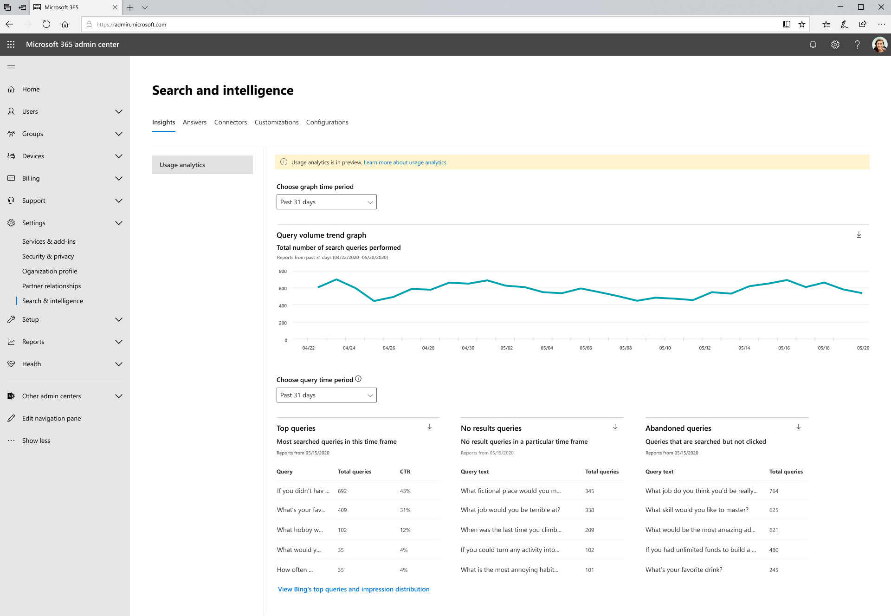

# Rapporti sull'utilizzo della ricerca Microsoft

I report sull'utilizzo della ricerca consentono di acquisire maggiori informazioni su come funziona la ricerca nell'organizzazione. Le intuizioni generate da questi rapporti vi aiuteranno [a rendere i contenuti facilmente reperibili](https://docs.microsoft.com/microsoftsearch/make-content-easy-to-find) e ad agire in modo da rendere la ricerca un'esperienza più utile e piacevole per gli utenti.

> [!IMPORTANT]
> I report sull'utilizzo di Microsoft Search sono attualmente in anteprima.

I [report sull'utilizzo della ricerca Microsoft](https://admin.microsoft.com/Adminportal/Home?#/MicrosoftSearch/insights) includono grafici e tabelle generati dalle ricerche eseguite dalle caselle di ricerca di SharePoint Home e Office.com. È possibile visualizzare i dati degli ultimi 31 giorni, giornalieri o mensili dell'anno precedente. Questi rapporti sono solo in uscita, quindi richiederà tempo per accumulare i dati cronologici.

In una versione precedente di questa pagina sono stati inclusi i dati delle ricerche eseguite per Microsoft Search in Bing su Bing.com. Questi dati verranno integrati tra breve, ma per il momento, è ancora possibile visualizzare tali rapporti facendo clic sul collegamento nella parte inferiore della pagina per **visualizzare le query principali di Bing e la distribuzione di impressioni**.

## Panoramica dei report di ricerca

|**Report**|**Descrizione**|
|:-----|:-----|
|Volume di query|Questo report mostra il numero di query di ricerca eseguite. Utilizzare questo report per identificare le tendenze del volume delle query di ricerca e determinare i periodi di attività di ricerca di livello elevato e basso.|
|Principali query|Questo report mostra le query di ricerca maggiormente eseguite. Utilizzare questo report per comprendere quali tipi di informazioni stanno cercando gli utenti.|
|Query abbandonate|Questo rapporto consente di visualizzare le query di ricerca più comuni che ricevono un clic basso. Utilizzarlo per identificare le query di ricerca che potrebbero risultare insoddisfacenti per gli utenti e per migliorare le possibilità di individuazione del contenuto. È quindi possibile determinare se la creazione di una risposta, ad esempio un segnalibro, o l'ingestione di un nuovo contenuto tramite un connettore grafico è l'azione corretta.|
|Nessuna query sui risultati|Questo report mostra le query di ricerca frequenti che non hanno restituito alcun risultato. Utilizzarlo per identificare le query di ricerca che potrebbero risultare insoddisfacenti per gli utenti e per migliorare le possibilità di individuazione del contenuto. È quindi possibile determinare se la creazione di una risposta, ad esempio un segnalibro, o l'ingestione di un nuovo contenuto tramite un connettore grafico è l'azione corretta.|

## Visualizzazione di report

Quando si passa alla pagina report di utilizzo, tutti i rapporti sono disponibili per la visualizzazione. È possibile utilizzare il filtro data per selezionare un giorno o un mese specifico da visualizzare.

Il download di un report consentirà di visualizzare i report da un intervallo di tempo più ampio. Fare clic sulla freccia per il download e selezionare **ultimi 31 giorni** o **ultimi 12 mesi**. Il report viene scaricato come foglio di calcolo di Excel. Se è stata selezionata l'opzione ultimi 31 giorni, il foglio di calcolo avrà la scheda individuale per ogni giorno. Negli ultimi 12 mesi il download avrà una tabulazione per ogni mese.

Per visualizzare le query principali di Bing e i report di distribuzione delle impressioni, fare clic sul collegamento nella pagina.

## Domande frequenti

**Quando si selezionano i 31 giorni scorsi o gli ultimi 12 mesi, perché è necessario scegliere rispettivamente un giorno specifico o un mese specifico.**

La visualizzazione calendario oggi nei report di utilizzo della ricerca di Microsoft è un processo in due passaggi. per prima cosa selezionare l'intervallo di date dall'elenco a discesa (ultimi 31 giorni o ultimi 12 mesi) e quindi selezionare il giorno o il mese di inizio.

Le tabelle di query in alto, abbandonate e non riuscite mostrano i risultati del giorno o del mese scelto.

**Quando verranno visualizzati dati aggregati per ultimi 7 giorni, ultimi 30 giorni e così via, come I report delle query principali di Bing?**

Stiamo considerando questo tipo di aggregazione e la semplificazione del filtro dell'intervallo di dati per le versioni future di questi rapporti.

**Perché non è possibile visualizzare una ripartizione dei rapporti sull'utilizzo da parte di app diverse (origini)?**

Attualmente, il filtro per origine non è disponibile. I rapporti combinano le ricerche da SharePoint Home e Office.com. La versione successiva includerà il filtro di origine in modo che sia possibile visualizzare le metriche specifiche per ogni applicazione.

**Quale altro filtro per i report sull'utilizzo è in arrivo?**

Stiamo lavorando su filtri aggiuntivi che consentiranno di ottenere un senso dell'utilizzo della ricerca a un livello più granulare dell'organizzazione. Ad esempio, sarà possibile visualizzare il volume di query per una specifica area geografica o reparto.

**Perché Microsoft Search è in Bing Reports in una pagina separata?**

L'ammodernamento della ricerca nelle applicazioni di Office 365 a Microsoft Search ha richiesto di aderire a sistemi precedentemente disparati, tra cui la generazione di report. Questo richiede tempo e si è ritenuto più importante far uscire queste relazioni ora in attesa fino a quando non è stato possibile completare l'integrazione dei dati di Bing. Dopo aver completato l'integrazione, i dati provenienti da tutti gli endpoint di ricerca verranno inclusi negli stessi rapporti.
